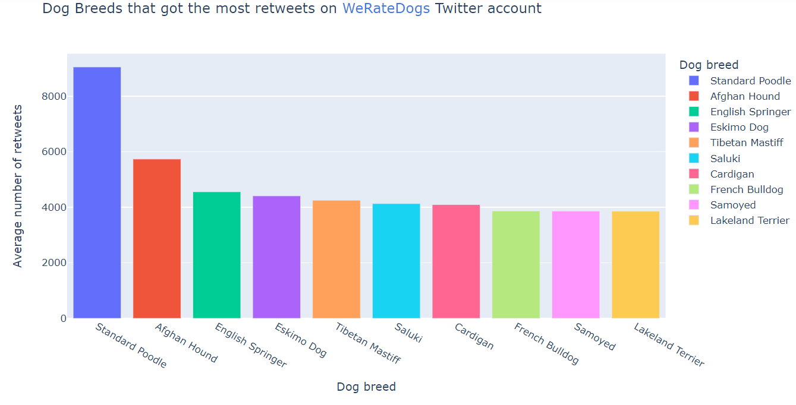
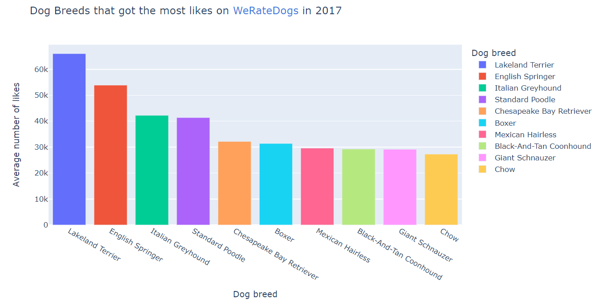

#  Project: Wrangling WeRateDogs' Enhanced Twitter Archive 🐶
- [ Project: Wrangling WeRateDogs' Enhanced Twitter Archive 🐶](#--uda-logo--img-udacitypng--project--wrangling-weratedogs--enhanced-twitter-archive---)
  * [Description](#description)
    + [Hypotheses and Pre-EDA remarks](#hypotheses-and-pre-eda-remarks)
    + [Modules used in this notebook:](#modules-used-in-this-notebook-)
  * [Data Wrangling](#data-wrangling)
    + [Gather](#gather)
      - [**`twitter-archive-enhanced` table**](#---twitter-archive-enhanced--table--)
      - [**`image-predictions` table**](#---image-predictions--table--)
      - [**Obtaining additional tweet data from `Twitter API` using Python's `Tweepy`** module](#--obtaining-additional-tweet-data-from--twitter-api--using-python-s--tweepy----module)
    + [Assess](#assess)
      - [**`df_tw_arch`**](#---df-tw-arch---)
        * [Visual Assessment](#visual-assessment)
        * [Programmatic Assessment](#programmatic-assessment)
      - [**`df_tw_data`**](#---df-tw-data---)
        * [Visual Assessment](#visual-assessment-1)
        * [Programmatic Assessment](#programmatic-assessment-1)
      - [**`df_image_pred`**](#---df-image-pred---)
        * [Visual Assessment](#visual-assessment-2)
        * [Programmatic Assessment](#programmatic-assessment-2)
    + [Clean](#clean)
      - [`df_tw_arch`](#-df-tw-arch-)
        * [Define](#define)
        * [Code](#code)
        * [Test](#test)
        * [Define](#define-1)
        * [Code](#code-1)
        * [Test](#test-1)
        * [Define](#define-2)
        * [Code](#code-2)
        * [Test](#test-2)
        * [Define](#define-3)
        * [Code](#code-3)
        * [Test](#test-3)
        * [Define](#define-4)
        * [Code](#code-4)
        * [Test](#test-4)
        * [Define](#define-5)
        * [Code](#code-5)
        * [Test](#test-5)
      - [**`df_tw_data` dataset**](#---df-tw-data--dataset--)
        * [Define](#define-6)
        * [Define](#define-7)
        * [Code](#code-6)
        * [Test](#test-6)
      - [`df_copy_img`](#-df-copy-img-)
        * [Define](#define-8)
        * [Code](#code-7)
        * [Test](#test-7)
        * [Define](#define-9)
        * [Code](#code-8)
        * [Test](#test-8)
        * [Define](#define-10)
        * [Code](#code-9)
        * [Test](#test-9)
        * [Define](#define-11)
        * [Code](#code-10)
        * [Test](#test-10)
      - [`df_copy_master`](#-df-copy-master-)
        * [Define](#define-12)
        * [Code](#code-11)
        * [Test](#test-11)
        * [Define](#define-13)
        * [Code](#code-12)
        * [Test](#test-12)
        * [Define](#define-14)
        * [Code](#code-13)
        * [Test](#test-13)
        * [Define](#define-15)
        * [Code](#code-14)
        * [Test](#test-14)
  * [Exploratory Data Analysis](#exploratory-data-analysis)
    + [Q1: Which dog breeds have been awarded the highest ratings?](#q1--which-dog-breeds-have-been-awarded-the-highest-ratings-)
      - [Ratings](#ratings)
    + [Q2: Which dog breeds have attracted the most engagement on WRD over the time period in question (2016-2017)?](#q2--which-dog-breeds-have-attracted-the-most-engagement-on-wrd-over-the-time-period-in-question--2016-2017--)
      - [Retweets](#retweets)
      - [Favorites](#favorites)
        * [Metrics aggregated over the years](#metrics-aggregated-over-the-years)
      - [2017 Metrics](#2017-metrics)
      - [2017 WRD ratings](#2017-wrd-ratings)
      - [2017 Retweets](#2017-retweets)
      - [2017 Favorites](#2017-favorites)
      - [2016 Metrics](#2016-metrics)
      - [2016 Ratings](#2016-ratings)
      - [2016 Retweets](#2016-retweets)
      - [2016 Favorites](#2016-favorites)
    + [Q3: What are the most used words on WRD?](#q3--what-are-the-most-used-words-on-wrd-)
    + [Q4: Generally, what's the sentiment given off by WRD? Is it positive, neutral or negative? Is it subjective (personal and opinionated) or objective (factual)?](#q4--generally--what-s-the-sentiment-given-off-by-wrd--is-it-positive--neutral-or-negative--is-it-subjective--personal-and-opinionated--or-objective--factual--)
  * [Limitations](#limitations)
  * [References](#references)

<small><i><a href='http://ecotrust-canada.github.io/markdown-toc/'>Table of contents generated with markdown-toc</a></i></small>

## Description
><hr>
> <a href='www.twitter.com/dog_rates'>WeRateDogs</a> (later referred to as <b>WRD</b> in this document) is a Twitter account, created by Matt Nelson, that rates people's dogs with a humorous comment about the dog. These ratings almost always have a denominator of 10. The numerators, though? Almost always greater than 10. 11/10, 12/10, 13/10, etc. Why? Because <a href="https://knowyourmeme.com/memes/theyre-good-dogs-brent">"they're good dogs Brent"</a>. WRD has over 9 million followers and has received international media coverage.
>
> Here are a few snippet's of WRD's Twitter account 👇🏾 
>
>  WRD's profile            |  WRD's tweet structure
>:-------------------------:|:-------------------------:
>   |  
> 
> This project focuses on actualizing and accentuating the three data wrangling techniques on the WRD Twitter archive as part of Udacity's Data Analysis curriculum. WRD downloaded their Twitter archive and sent it to Udacity via email exclusively for use in this project. The archive contains basic tweet data (tweet ID, timestamp, text, etc.) for all 5000+ of their tweets as they stood on August 1, 2017. Two other datasets that will be used in this study include a `tsv file` provided by Udacity that includes results obtained from running images of the in WRD's tweets through a <a href="https://www.ibm.com/cloud/learn/neural-networks">neural network</a> and additional tweet data that I will have to scrape using the  <a href="https://developer.twitter.com/en/docs/twitter-api">`Twitter API`</a>.

### Hypotheses and Pre-EDA remarks
><hr>
> Based on the data that I will be acquiring, I figured I would have to deduce any actionable insights from the `ratings`, number of engagements in the form of `retweets` 🔁 and, `favorite`❤️, the `predicted_dog_breed` derived from Udacity's neural network test, `timestamps` to ascertain changes over a period of time and `text` from the the tweets for a sentiment analysis study on WRD.
>
> After a meticulous hypotheses construction process, I decided to pull on my Inspector Gadget coat on and investigate the following questions:
> 1. Which dog breeds obtained the highest ratings on average? 
> 1. Which dog breeds have attracted the most engagement on WRD over the time period in question (2016-2017)? 
> 1. What are the most used words on WRD? (I will print out a cool [wordcloud](https://www.google.com/search?q=wordcloud) for this)
> 1. Generally, what's the sentiment given off by WRD? Is it positive, neutral or negative? Is it subjective (personal and opinionated) or objective (factual)?

### Modules used in this notebook:
><hr>
>
> I've used Python and many of it's rich features to come up with my solutions. The following are the dependencies required to run this application:
>* `Pandas`
>* `Numpy`
>* `Tweepy`
>* `Requests`
>* `Plotly`
>* `TextBlob`
>* `WordCloud`
>* `Python-dotenv`
>* `re`
>* `_json`
>* `os`
>* `unittest`
>
> You can install them using `requirements.txt` file or `environment.yml` file in the `dependencies`. Run either one of these at the root of your project depending on your environment manager:
> * Pip: `pip install -r dependencies/requirements.txt`
> * Anaconda: `conda env create -f dependencies/environment.yml `


```python
# import required modules
import requests
import tweepy as twpy
from dotenv import load_dotenv
from textblob import TextBlob
from wordcloud import WordCloud
import _json
import unittest

import pandas as pd
import numpy as np
import os
import re

#ensure all Plotly plots render while offline
from plotly.offline import iplot, init_notebook_mode
init_notebook_mode(connected=True)
import plotly.graph_objects as go
import plotly.express as px
```


<script type="text/javascript">
window.PlotlyConfig = {MathJaxConfig: 'local'};
if (window.MathJax) {MathJax.Hub.Config({SVG: {font: "STIX-Web"}});}
if (typeof require !== 'undefined') {
require.undef("plotly");
requirejs.config({
    paths: {
        'plotly': ['https://cdn.plot.ly/plotly-2.9.0.min']
    }
});
require(['plotly'], function(Plotly) {
    window._Plotly = Plotly;
});
}
</script>


## Data Wrangling
> I will acquire, appraise and floss all my datasets to the best fit for this study using the various installed modules. Each process will make use of custom functions to attempt cut on clunky and repetitive code. 

### Gather
><hr>
>
>This project involves obtaining three separate datasets from various sources. I will be using different methods to obtain each dataset as specified below.
> This custom function built from Pandas' `read_csv()` method will be used to read various datasets. The `header` and `names` parameters will override each other depending on which of the two is set to `None` by default or passed as an arg.


```python
#custom function to read data into Pandas DataFrame
def open_set(csv, sep=',', header=0, names=[]):
    df = pd.read_csv(csv, low_memory=False, sep=sep, names=names, header=header)
    
    return df
```

#### **`twitter-archive-enhanced` table**
><hr>
>
> WRD's Twitter archive data was provided by Udacity and **downloaded manually through the Chrome browser.** I will import the data locally from my storage in the `data` folder using `open_set()`.


```python
df_tw_arch = open_set('data/twitter-archive-enhanced.csv', header=0, names=None)
df_tw_arch.head()
```


<div>
<style scoped>
    .dataframe tbody tr th:only-of-type {
        vertical-align: middle;
    }

    .dataframe tbody tr th {
        vertical-align: top;
    }

    .dataframe thead th {
        text-align: right;
    }
</style>
<table border="1" class="dataframe">
  <thead>
    <tr style="text-align: right;">
      <th></th>
      <th>tweet_id</th>
      <th>in_reply_to_status_id</th>
      <th>in_reply_to_user_id</th>
      <th>timestamp</th>
      <th>source</th>
      <th>text</th>
      <th>retweeted_status_id</th>
      <th>retweeted_status_user_id</th>
      <th>retweeted_status_timestamp</th>
      <th>expanded_urls</th>
      <th>rating_numerator</th>
      <th>rating_denominator</th>
      <th>name</th>
      <th>doggo</th>
      <th>floofer</th>
      <th>pupper</th>
      <th>puppo</th>
    </tr>
  </thead>
  <tbody>
    <tr>
      <th>0</th>
      <td>892420643555336193</td>
      <td>NaN</td>
      <td>NaN</td>
      <td>2017-08-01 16:23:56 +0000</td>
      <td>&lt;a href="http://twitter.com/download/iphone" r...</td>
      <td>This is Phineas. He's a mystical boy. Only eve...</td>
      <td>NaN</td>
      <td>NaN</td>
      <td>NaN</td>
      <td>https://twitter.com/dog_rates/status/892420643...</td>
      <td>13</td>
      <td>10</td>
      <td>Phineas</td>
      <td>None</td>
      <td>None</td>
      <td>None</td>
      <td>None</td>
    </tr>
    <tr>
      <th>1</th>
      <td>892177421306343426</td>
      <td>NaN</td>
      <td>NaN</td>
      <td>2017-08-01 00:17:27 +0000</td>
      <td>&lt;a href="http://twitter.com/download/iphone" r...</td>
      <td>This is Tilly. She's just checking pup on you....</td>
      <td>NaN</td>
      <td>NaN</td>
      <td>NaN</td>
      <td>https://twitter.com/dog_rates/status/892177421...</td>
      <td>13</td>
      <td>10</td>
      <td>Tilly</td>
      <td>None</td>
      <td>None</td>
      <td>None</td>
      <td>None</td>
    </tr>
    <tr>
      <th>2</th>
      <td>891815181378084864</td>
      <td>NaN</td>
      <td>NaN</td>
      <td>2017-07-31 00:18:03 +0000</td>
      <td>&lt;a href="http://twitter.com/download/iphone" r...</td>
      <td>This is Archie. He is a rare Norwegian Pouncin...</td>
      <td>NaN</td>
      <td>NaN</td>
      <td>NaN</td>
      <td>https://twitter.com/dog_rates/status/891815181...</td>
      <td>12</td>
      <td>10</td>
      <td>Archie</td>
      <td>None</td>
      <td>None</td>
      <td>None</td>
      <td>None</td>
    </tr>
    <tr>
      <th>3</th>
      <td>891689557279858688</td>
      <td>NaN</td>
      <td>NaN</td>
      <td>2017-07-30 15:58:51 +0000</td>
      <td>&lt;a href="http://twitter.com/download/iphone" r...</td>
      <td>This is Darla. She commenced a snooze mid meal...</td>
      <td>NaN</td>
      <td>NaN</td>
      <td>NaN</td>
      <td>https://twitter.com/dog_rates/status/891689557...</td>
      <td>13</td>
      <td>10</td>
      <td>Darla</td>
      <td>None</td>
      <td>None</td>
      <td>None</td>
      <td>None</td>
    </tr>
    <tr>
      <th>4</th>
      <td>891327558926688256</td>
      <td>NaN</td>
      <td>NaN</td>
      <td>2017-07-29 16:00:24 +0000</td>
      <td>&lt;a href="http://twitter.com/download/iphone" r...</td>
      <td>This is Franklin. He would like you to stop ca...</td>
      <td>NaN</td>
      <td>NaN</td>
      <td>NaN</td>
      <td>https://twitter.com/dog_rates/status/891327558...</td>
      <td>12</td>
      <td>10</td>
      <td>Franklin</td>
      <td>None</td>
      <td>None</td>
      <td>None</td>
      <td>None</td>
    </tr>
  </tbody>
</table>
</div>


> The WRD Twitter archive data has been saved into the `df_tw_arch` dataframe 🙂
><hr>

#### **`image-predictions` table**
>
>The `image_predictions.tsv` file is present in each tweet, according to a neural network. It is hosted on Udacity's servers and will be **downloaded programmatically using the Requests library**. 

```python
r = requests.get(url)

try:
    f = open('data/image-predictions.tsv', 'wb')
    f.write(r.content)
    
finally:
    f.close()
```

> * `tsv` stands for tab-separated-values so it would make sense to specify tabs (`\t`) as the separator in Pandas' the `open_set()` function.


```python
df_image_pred = open_set('data/image-predictions.tsv', sep='\t', names=None, header=0)
df_image_pred.head()
```


<div>
<style scoped>
    .dataframe tbody tr th:only-of-type {
        vertical-align: middle;
    }

    .dataframe tbody tr th {
        vertical-align: top;
    }

    .dataframe thead th {
        text-align: right;
    }
</style>
<table border="1" class="dataframe">
  <thead>
    <tr style="text-align: right;">
      <th></th>
      <th>tweet_id</th>
      <th>jpg_url</th>
      <th>img_num</th>
      <th>p1</th>
      <th>p1_conf</th>
      <th>p1_dog</th>
      <th>p2</th>
      <th>p2_conf</th>
      <th>p2_dog</th>
      <th>p3</th>
      <th>p3_conf</th>
      <th>p3_dog</th>
    </tr>
  </thead>
  <tbody>
    <tr>
      <th>0</th>
      <td>666020888022790149</td>
      <td>https://pbs.twimg.com/media/CT4udn0WwAA0aMy.jpg</td>
      <td>1</td>
      <td>Welsh_springer_spaniel</td>
      <td>0.465074</td>
      <td>True</td>
      <td>collie</td>
      <td>0.156665</td>
      <td>True</td>
      <td>Shetland_sheepdog</td>
      <td>0.061428</td>
      <td>True</td>
    </tr>
    <tr>
      <th>1</th>
      <td>666029285002620928</td>
      <td>https://pbs.twimg.com/media/CT42GRgUYAA5iDo.jpg</td>
      <td>1</td>
      <td>redbone</td>
      <td>0.506826</td>
      <td>True</td>
      <td>miniature_pinscher</td>
      <td>0.074192</td>
      <td>True</td>
      <td>Rhodesian_ridgeback</td>
      <td>0.072010</td>
      <td>True</td>
    </tr>
    <tr>
      <th>2</th>
      <td>666033412701032449</td>
      <td>https://pbs.twimg.com/media/CT4521TWwAEvMyu.jpg</td>
      <td>1</td>
      <td>German_shepherd</td>
      <td>0.596461</td>
      <td>True</td>
      <td>malinois</td>
      <td>0.138584</td>
      <td>True</td>
      <td>bloodhound</td>
      <td>0.116197</td>
      <td>True</td>
    </tr>
    <tr>
      <th>3</th>
      <td>666044226329800704</td>
      <td>https://pbs.twimg.com/media/CT5Dr8HUEAA-lEu.jpg</td>
      <td>1</td>
      <td>Rhodesian_ridgeback</td>
      <td>0.408143</td>
      <td>True</td>
      <td>redbone</td>
      <td>0.360687</td>
      <td>True</td>
      <td>miniature_pinscher</td>
      <td>0.222752</td>
      <td>True</td>
    </tr>
    <tr>
      <th>4</th>
      <td>666049248165822465</td>
      <td>https://pbs.twimg.com/media/CT5IQmsXIAAKY4A.jpg</td>
      <td>1</td>
      <td>miniature_pinscher</td>
      <td>0.560311</td>
      <td>True</td>
      <td>Rottweiler</td>
      <td>0.243682</td>
      <td>True</td>
      <td>Doberman</td>
      <td>0.154629</td>
      <td>True</td>
    </tr>
  </tbody>
</table>
</div>


> The neural network data has been saved into the `df_image_pred` dataframe 🙂
><hr>

#### **Obtaining additional tweet data from `Twitter API` using Python's `Tweepy`** module
>
>* For our final dataset, we will be using the `Twitter API` and Python's `Tweepy` library to query Twitter for each tweet's **retweet_count**, **favorite_count**, **geo data** and **language data**. These attributes will later be used to generate insights.
>
>* **<span style="color:#add8e6">Note that you need either a combination of your consumer_key, consumer_secret, access_key and access_key secret or a bearer_token to query data through the Twitter API.**</span>
>
>* I put to use Python's `dotenv` and `os` libraries to cache my `bearer_token` from a secret file and load its value using the `load_dotenv()` and `os.getenv()` methods respectively.


```python
# Cache the file into the environment
load_dotenv('.env')
```

>* I opted for a custom function to obtain tweet data through Tweepy's [**_get_status()_**](http://docs.tweepy.org/en/v3.5.0/api.html) method. The `tweet_id` from  the `df_tw_arch` dataset will be converted to a list and passed into the function. Each tweet's JSON data that I require for this project will be parsed into a new file (`tweet_json.txt`) and appended one after the other.


```python
# custom to extract tweet data
def get_tweets(ids):
    
    # Authorization to bearer_token
    auth = twpy.OAuth2BearerHandler(os.getenv('BEARER_TOKEN'))
    
    # Calling api
    api = twpy.API(auth, wait_on_rate_limit = True)
    
    # Empty Array
    del_tweets = []
    
    # Start a code timer for the loop
    for tw_id in ids: 
        try:
            tw_status = api.get_status(tw_id, tweet_mode='extended')._json
            try:
                f = open('data/tweet_json.txt', 'a+', encoding='utf-8')
                f.write(f"{tw_status['id']},{tw_status['retweet_count']},{tw_status['favorite_count']},{tw_status['geo']},{tw_status['lang']}\n")
            finally:
                f.close()
            rt_count = tw_status['retweet_count']
            fv_count = tw_status['favorite_count']
                        
            print(f'This tweet -> {tw_id} has {rt_count} retweets and {fv_count} likes')
        except Exception as e:
            print(f'This tweet -> {tw_id} has been deleted')
            del_tweets.append({'tweet_id': tw_id})
    
    
    
    # Print out the deleted tweet_ids
    return (f'These are the deleted tweet_ids:\n{del_tweets}')
```

> * Capture all the data in the `tweet_id` column of `df_tw_arch` into a list


```python
tw_ids = list(df_tw_arch.tweet_id)

#obtain all the tweet data we require
get_tweets(tw_ids)
```

> * As expected, a number of tweets in the archive have long since been deleted and will be utterly useless for our any insights that require the data I pulled from the api. I will have to find away to "balance out" these missing values.
>
> * Here's how the `tweet_json.txt` file has been saved. Each value is separated using commas so this will make it easy to read with the `open_set()` function.
> <p align="center"></p>
>
> * We will then read the data from `tweet_json.txt` using my `open_set()` function and specify the column tags using the `names` parameter.


```python
# read data from the text file into a dataframe
df_tw_data = open_set('data/tweet_json.txt', names=['tweet_id', 'retweet_count', 'favorite_count', 'geo_data', 'lang_data'], header=None)
```

> * To later assess the data obtained from the Twitter api visually using Excel/Sheets, I will export it to a csv file using Pandas' `to_csv()` function


```python
df_tw_data.to_csv('data/tw_data.csv',index=False)
df_tw_data
```

<div>
<style scoped>
    .dataframe tbody tr th:only-of-type {
        vertical-align: middle;
    }

    .dataframe tbody tr th {
        vertical-align: top;
    }

    .dataframe thead th {
        text-align: right;
    }
</style>
<table border="1" class="dataframe">
  <thead>
    <tr style="text-align: right;">
      <th></th>
      <th>tweet_id</th>
      <th>retweet_count</th>
      <th>favorite_count</th>
      <th>geo_data</th>
      <th>lang_data</th>
    </tr>
  </thead>
  <tbody>
    <tr>
      <th>0</th>
      <td>892420643555336193</td>
      <td>7007</td>
      <td>33809</td>
      <td>None</td>
      <td>en</td>
    </tr>
    <tr>
      <th>1</th>
      <td>892177421306343426</td>
      <td>5301</td>
      <td>29329</td>
      <td>None</td>
      <td>en</td>
    </tr>
    <tr>
      <th>2</th>
      <td>891815181378084864</td>
      <td>3480</td>
      <td>22048</td>
      <td>None</td>
      <td>en</td>
    </tr>
    <tr>
      <th>3</th>
      <td>891689557279858688</td>
      <td>7226</td>
      <td>36938</td>
      <td>None</td>
      <td>en</td>
    </tr>
    <tr>
      <th>4</th>
      <td>891327558926688256</td>
      <td>7759</td>
      <td>35310</td>
      <td>None</td>
      <td>en</td>
    </tr>
    <tr>
      <th>...</th>
      <td>...</td>
      <td>...</td>
      <td>...</td>
      <td>...</td>
      <td>...</td>
    </tr>
    <tr>
      <th>2320</th>
      <td>666049248165822465</td>
      <td>37</td>
      <td>89</td>
      <td>None</td>
      <td>en</td>
    </tr>
    <tr>
      <th>2321</th>
      <td>666044226329800704</td>
      <td>115</td>
      <td>247</td>
      <td>None</td>
      <td>en</td>
    </tr>
    <tr>
      <th>2322</th>
      <td>666033412701032449</td>
      <td>36</td>
      <td>100</td>
      <td>None</td>
      <td>en</td>
    </tr>
    <tr>
      <th>2323</th>
      <td>666029285002620928</td>
      <td>39</td>
      <td>112</td>
      <td>None</td>
      <td>en</td>
    </tr>
    <tr>
      <th>2324</th>
      <td>666020888022790149</td>
      <td>422</td>
      <td>2293</td>
      <td>None</td>
      <td>en</td>
    </tr>
  </tbody>
</table>
<p>2325 rows × 5 columns</p>
</div>


> I successfully got the data obtained from Twitter api into a dataframe 🙂 
><hr>

### Assess 
><hr>
>
> * I will use a spreadsheet program for my visual assessment (Google Sheets, MS Excel etc) and employ Pandas' and Numpy libraries for my programmatic assessment. I will be focusing on quality and tidiness checks. These will include missing, duplicate, incorrect, corrupted and messy data records.
>
> * Inferences and mental checks will be made following each assessment procedure. 

#### **`df_tw_arch`**
<hr>

##### Visual Assessment

>* Here is an screenshot of the Twitter archive opened in Excel
>
>||
>|:--:|
>|<b> The Twitter Archive Dataset</b>|

> * There are a few columns with glaringly empty fields: `in_reply_to_status`, `in_reply_to_user_id`, `retweeted_status_user_id`, `retweeted_status_timestamp` **(Quality Issue)**
> * At a glance, `rating_denominator` seems to have only one unique value and hence no insights can be obtained from that column. I will investigate this further. **(Quality issue)**
>* The four columns describing the "stage" the dog is in should be transposed into one column. **(Tidiness issue)**

##### Programmatic Assessment
<hr>


```python
df_tw_arch.head()
```


<div>
<style scoped>
    .dataframe tbody tr th:only-of-type {
        vertical-align: middle;
    }

    .dataframe tbody tr th {
        vertical-align: top;
    }

    .dataframe thead th {
        text-align: right;
    }
</style>
<table border="1" class="dataframe">
  <thead>
    <tr style="text-align: right;">
      <th></th>
      <th>tweet_id</th>
      <th>in_reply_to_status_id</th>
      <th>in_reply_to_user_id</th>
      <th>timestamp</th>
      <th>source</th>
      <th>text</th>
      <th>retweeted_status_id</th>
      <th>retweeted_status_user_id</th>
      <th>retweeted_status_timestamp</th>
      <th>expanded_urls</th>
      <th>rating_numerator</th>
      <th>rating_denominator</th>
      <th>name</th>
      <th>doggo</th>
      <th>floofer</th>
      <th>pupper</th>
      <th>puppo</th>
    </tr>
  </thead>
  <tbody>
    <tr>
      <th>0</th>
      <td>892420643555336193</td>
      <td>NaN</td>
      <td>NaN</td>
      <td>2017-08-01 16:23:56 +0000</td>
      <td>&lt;a href="http://twitter.com/download/iphone" r...</td>
      <td>This is Phineas. He's a mystical boy. Only eve...</td>
      <td>NaN</td>
      <td>NaN</td>
      <td>NaN</td>
      <td>https://twitter.com/dog_rates/status/892420643...</td>
      <td>13</td>
      <td>10</td>
      <td>Phineas</td>
      <td>None</td>
      <td>None</td>
      <td>None</td>
      <td>None</td>
    </tr>
    <tr>
      <th>1</th>
      <td>892177421306343426</td>
      <td>NaN</td>
      <td>NaN</td>
      <td>2017-08-01 00:17:27 +0000</td>
      <td>&lt;a href="http://twitter.com/download/iphone" r...</td>
      <td>This is Tilly. She's just checking pup on you....</td>
      <td>NaN</td>
      <td>NaN</td>
      <td>NaN</td>
      <td>https://twitter.com/dog_rates/status/892177421...</td>
      <td>13</td>
      <td>10</td>
      <td>Tilly</td>
      <td>None</td>
      <td>None</td>
      <td>None</td>
      <td>None</td>
    </tr>
    <tr>
      <th>2</th>
      <td>891815181378084864</td>
      <td>NaN</td>
      <td>NaN</td>
      <td>2017-07-31 00:18:03 +0000</td>
      <td>&lt;a href="http://twitter.com/download/iphone" r...</td>
      <td>This is Archie. He is a rare Norwegian Pouncin...</td>
      <td>NaN</td>
      <td>NaN</td>
      <td>NaN</td>
      <td>https://twitter.com/dog_rates/status/891815181...</td>
      <td>12</td>
      <td>10</td>
      <td>Archie</td>
      <td>None</td>
      <td>None</td>
      <td>None</td>
      <td>None</td>
    </tr>
    <tr>
      <th>3</th>
      <td>891689557279858688</td>
      <td>NaN</td>
      <td>NaN</td>
      <td>2017-07-30 15:58:51 +0000</td>
      <td>&lt;a href="http://twitter.com/download/iphone" r...</td>
      <td>This is Darla. She commenced a snooze mid meal...</td>
      <td>NaN</td>
      <td>NaN</td>
      <td>NaN</td>
      <td>https://twitter.com/dog_rates/status/891689557...</td>
      <td>13</td>
      <td>10</td>
      <td>Darla</td>
      <td>None</td>
      <td>None</td>
      <td>None</td>
      <td>None</td>
    </tr>
    <tr>
      <th>4</th>
      <td>891327558926688256</td>
      <td>NaN</td>
      <td>NaN</td>
      <td>2017-07-29 16:00:24 +0000</td>
      <td>&lt;a href="http://twitter.com/download/iphone" r...</td>
      <td>This is Franklin. He would like you to stop ca...</td>
      <td>NaN</td>
      <td>NaN</td>
      <td>NaN</td>
      <td>https://twitter.com/dog_rates/status/891327558...</td>
      <td>12</td>
      <td>10</td>
      <td>Franklin</td>
      <td>None</td>
      <td>None</td>
      <td>None</td>
      <td>None</td>
    </tr>
  </tbody>
</table>
</div>


 > * The `expanded_url` column is not required for this study as it just the full hyperlink to WRD's tweets. **(Tidiness issue)**
 > * The `source` column should be a string of the source from which the data was obtained and not a hyperlink i.e. Twitter, Vine, Tweetdeck **(Tidiness)**


```python
for col in df_tw_arch.columns:
    print(f'The "{col}" column has {df_tw_arch[col].nunique()} unique values')
```

    The "tweet_id" column has 2356 unique values
    The "in_reply_to_status_id" column has 77 unique values
    The "in_reply_to_user_id" column has 31 unique values
    The "timestamp" column has 2356 unique values
    The "source" column has 4 unique values
    The "text" column has 2356 unique values
    The "retweeted_status_id" column has 181 unique values
    The "retweeted_status_user_id" column has 25 unique values
    The "retweeted_status_timestamp" column has 181 unique values
    The "expanded_urls" column has 2218 unique values
    The "rating_numerator" column has 40 unique values
    The "rating_denominator" column has 18 unique values
    The "name" column has 957 unique values
    The "doggo" column has 2 unique values
    The "floofer" column has 2 unique values
    The "pupper" column has 2 unique values
    The "puppo" column has 2 unique values
    

> * I want to assess the `source`, `doggo`, `floofer`, `pupper` and `puppo` columns due to the few number of unique values and how best to represent them.


```python
df_tw_arch.source.unique()
```


    array(['<a href="http://twitter.com/download/iphone" rel="nofollow">Twitter for iPhone</a>',
           '<a href="http://twitter.com" rel="nofollow">Twitter Web Client</a>',
           '<a href="http://vine.co" rel="nofollow">Vine - Make a Scene</a>',
           '<a href="https://about.twitter.com/products/tweetdeck" rel="nofollow">TweetDeck</a>'],
          dtype=object)


>* I could shift these values into less clunky data as it is at the moment and turn it into values like Twitter for Web Client, Vine, Tweetdeck etc. **(Tidiness Issue)**


```python
df_tw_arch[['doggo', 'floofer', 'pupper', 'puppo']].sample(10)
```


<div>
<style scoped>
    .dataframe tbody tr th:only-of-type {
        vertical-align: middle;
    }

    .dataframe tbody tr th {
        vertical-align: top;
    }

    .dataframe thead th {
        text-align: right;
    }
</style>
<table border="1" class="dataframe">
  <thead>
    <tr style="text-align: right;">
      <th></th>
      <th>doggo</th>
      <th>floofer</th>
      <th>pupper</th>
      <th>puppo</th>
    </tr>
  </thead>
  <tbody>
    <tr>
      <th>1661</th>
      <td>None</td>
      <td>None</td>
      <td>None</td>
      <td>None</td>
    </tr>
    <tr>
      <th>446</th>
      <td>doggo</td>
      <td>None</td>
      <td>None</td>
      <td>None</td>
    </tr>
    <tr>
      <th>54</th>
      <td>None</td>
      <td>None</td>
      <td>None</td>
      <td>None</td>
    </tr>
    <tr>
      <th>360</th>
      <td>None</td>
      <td>None</td>
      <td>None</td>
      <td>None</td>
    </tr>
    <tr>
      <th>370</th>
      <td>None</td>
      <td>None</td>
      <td>None</td>
      <td>None</td>
    </tr>
    <tr>
      <th>1236</th>
      <td>None</td>
      <td>None</td>
      <td>None</td>
      <td>None</td>
    </tr>
    <tr>
      <th>804</th>
      <td>None</td>
      <td>None</td>
      <td>None</td>
      <td>None</td>
    </tr>
    <tr>
      <th>1942</th>
      <td>None</td>
      <td>None</td>
      <td>None</td>
      <td>None</td>
    </tr>
    <tr>
      <th>2159</th>
      <td>None</td>
      <td>None</td>
      <td>None</td>
      <td>None</td>
    </tr>
    <tr>
      <th>1608</th>
      <td>None</td>
      <td>None</td>
      <td>pupper</td>
      <td>None</td>
    </tr>
  </tbody>
</table>
</div>


>* I could change this data into one transposed column e.g. `dog_stage` that describes the dogs' stages without having it sparsed out into 4 separate columns `


```python
df_tw_arch.describe()
```


<div>
<style scoped>
    .dataframe tbody tr th:only-of-type {
        vertical-align: middle;
    }

    .dataframe tbody tr th {
        vertical-align: top;
    }

    .dataframe thead th {
        text-align: right;
    }
</style>
<table border="1" class="dataframe">
  <thead>
    <tr style="text-align: right;">
      <th></th>
      <th>tweet_id</th>
      <th>in_reply_to_status_id</th>
      <th>in_reply_to_user_id</th>
      <th>retweeted_status_id</th>
      <th>retweeted_status_user_id</th>
      <th>rating_numerator</th>
      <th>rating_denominator</th>
    </tr>
  </thead>
  <tbody>
    <tr>
      <th>count</th>
      <td>2.356000e+03</td>
      <td>7.800000e+01</td>
      <td>7.800000e+01</td>
      <td>1.810000e+02</td>
      <td>1.810000e+02</td>
      <td>2356.000000</td>
      <td>2356.000000</td>
    </tr>
    <tr>
      <th>mean</th>
      <td>7.427716e+17</td>
      <td>7.455079e+17</td>
      <td>2.014171e+16</td>
      <td>7.720400e+17</td>
      <td>1.241698e+16</td>
      <td>13.126486</td>
      <td>10.455433</td>
    </tr>
    <tr>
      <th>std</th>
      <td>6.856705e+16</td>
      <td>7.582492e+16</td>
      <td>1.252797e+17</td>
      <td>6.236928e+16</td>
      <td>9.599254e+16</td>
      <td>45.876648</td>
      <td>6.745237</td>
    </tr>
    <tr>
      <th>min</th>
      <td>6.660209e+17</td>
      <td>6.658147e+17</td>
      <td>1.185634e+07</td>
      <td>6.661041e+17</td>
      <td>7.832140e+05</td>
      <td>0.000000</td>
      <td>0.000000</td>
    </tr>
    <tr>
      <th>25%</th>
      <td>6.783989e+17</td>
      <td>6.757419e+17</td>
      <td>3.086374e+08</td>
      <td>7.186315e+17</td>
      <td>4.196984e+09</td>
      <td>10.000000</td>
      <td>10.000000</td>
    </tr>
    <tr>
      <th>50%</th>
      <td>7.196279e+17</td>
      <td>7.038708e+17</td>
      <td>4.196984e+09</td>
      <td>7.804657e+17</td>
      <td>4.196984e+09</td>
      <td>11.000000</td>
      <td>10.000000</td>
    </tr>
    <tr>
      <th>75%</th>
      <td>7.993373e+17</td>
      <td>8.257804e+17</td>
      <td>4.196984e+09</td>
      <td>8.203146e+17</td>
      <td>4.196984e+09</td>
      <td>12.000000</td>
      <td>10.000000</td>
    </tr>
    <tr>
      <th>max</th>
      <td>8.924206e+17</td>
      <td>8.862664e+17</td>
      <td>8.405479e+17</td>
      <td>8.874740e+17</td>
      <td>7.874618e+17</td>
      <td>1776.000000</td>
      <td>170.000000</td>
    </tr>
  </tbody>
</table>
</div>


> * Based on WRD's rating convention, the mean of `rating_denominator` should not exceed 10. **(Quality Issue)**


```python
df_tw_arch.rating_numerator.unique()
```


    array([  13,   12,   14,    5,   17,   11,   10,  420,  666,    6,   15,
            182,  960,    0,   75,    7,   84,    9,   24,    8,    1,   27,
              3,    4,  165, 1776,  204,   50,   99,   80,   45,   60,   44,
            143,  121,   20,   26,    2,  144,   88], dtype=int64)


> * There are few ratings that are well out the scope described by WRD's rating system i.e 420, 666, 182, 960, 165, 1776, 204, 143, 121 etc **(Quality issue)**


```python
df_tw_arch.rating_denominator.unique()
```


    array([ 10,   0,  15,  70,   7,  11, 150, 170,  20,  50,  90,  80,  40,
           130, 110,  16, 120,   2], dtype=int64)


> * There are few rating_denominators that are well out the scope described by WRD's rating system i.e 150, 130, 110, 120, 70, 0, 50 etc **(Quality issue)**


```python
rs = []
i=0
while i < 2355:
    result = df_tw_arch.rating_numerator[i] > 99
    if result:
        rs.append(i)
    i += 1

df_tw_arch.iloc[rs]
```


<div>
<style scoped>
    .dataframe tbody tr th:only-of-type {
        vertical-align: middle;
    }

    .dataframe tbody tr th {
        vertical-align: top;
    }

    .dataframe thead th {
        text-align: right;
    }
</style>
<table border="1" class="dataframe">
  <thead>
    <tr style="text-align: right;">
      <th></th>
      <th>tweet_id</th>
      <th>in_reply_to_status_id</th>
      <th>in_reply_to_user_id</th>
      <th>timestamp</th>
      <th>source</th>
      <th>text</th>
      <th>retweeted_status_id</th>
      <th>retweeted_status_user_id</th>
      <th>retweeted_status_timestamp</th>
      <th>expanded_urls</th>
      <th>rating_numerator</th>
      <th>rating_denominator</th>
      <th>name</th>
      <th>doggo</th>
      <th>floofer</th>
      <th>pupper</th>
      <th>puppo</th>
    </tr>
  </thead>
  <tbody>
    <tr>
      <th>188</th>
      <td>855862651834028034</td>
      <td>8.558616e+17</td>
      <td>1.943518e+08</td>
      <td>2017-04-22 19:15:32 +0000</td>
      <td>&lt;a href="http://twitter.com/download/iphone" r...</td>
      <td>@dhmontgomery We also gave snoop dogg a 420/10...</td>
      <td>NaN</td>
      <td>NaN</td>
      <td>NaN</td>
      <td>NaN</td>
      <td>420</td>
      <td>10</td>
      <td>None</td>
      <td>None</td>
      <td>None</td>
      <td>None</td>
      <td>None</td>
    </tr>
    <tr>
      <th>189</th>
      <td>855860136149123072</td>
      <td>8.558585e+17</td>
      <td>1.361572e+07</td>
      <td>2017-04-22 19:05:32 +0000</td>
      <td>&lt;a href="http://twitter.com/download/iphone" r...</td>
      <td>@s8n You tried very hard to portray this good ...</td>
      <td>NaN</td>
      <td>NaN</td>
      <td>NaN</td>
      <td>NaN</td>
      <td>666</td>
      <td>10</td>
      <td>None</td>
      <td>None</td>
      <td>None</td>
      <td>None</td>
      <td>None</td>
    </tr>
    <tr>
      <th>290</th>
      <td>838150277551247360</td>
      <td>8.381455e+17</td>
      <td>2.195506e+07</td>
      <td>2017-03-04 22:12:52 +0000</td>
      <td>&lt;a href="http://twitter.com/download/iphone" r...</td>
      <td>@markhoppus 182/10</td>
      <td>NaN</td>
      <td>NaN</td>
      <td>NaN</td>
      <td>NaN</td>
      <td>182</td>
      <td>10</td>
      <td>None</td>
      <td>None</td>
      <td>None</td>
      <td>None</td>
      <td>None</td>
    </tr>
    <tr>
      <th>313</th>
      <td>835246439529840640</td>
      <td>8.352460e+17</td>
      <td>2.625958e+07</td>
      <td>2017-02-24 21:54:03 +0000</td>
      <td>&lt;a href="http://twitter.com/download/iphone" r...</td>
      <td>@jonnysun @Lin_Manuel ok jomny I know you're e...</td>
      <td>NaN</td>
      <td>NaN</td>
      <td>NaN</td>
      <td>NaN</td>
      <td>960</td>
      <td>0</td>
      <td>None</td>
      <td>None</td>
      <td>None</td>
      <td>None</td>
      <td>None</td>
    </tr>
    <tr>
      <th>902</th>
      <td>758467244762497024</td>
      <td>NaN</td>
      <td>NaN</td>
      <td>2016-07-28 01:00:57 +0000</td>
      <td>&lt;a href="http://twitter.com/download/iphone" r...</td>
      <td>Why does this never happen at my front door......</td>
      <td>NaN</td>
      <td>NaN</td>
      <td>NaN</td>
      <td>https://twitter.com/dog_rates/status/758467244...</td>
      <td>165</td>
      <td>150</td>
      <td>None</td>
      <td>None</td>
      <td>None</td>
      <td>None</td>
      <td>None</td>
    </tr>
    <tr>
      <th>979</th>
      <td>749981277374128128</td>
      <td>NaN</td>
      <td>NaN</td>
      <td>2016-07-04 15:00:45 +0000</td>
      <td>&lt;a href="https://about.twitter.com/products/tw...</td>
      <td>This is Atticus. He's quite simply America af....</td>
      <td>NaN</td>
      <td>NaN</td>
      <td>NaN</td>
      <td>https://twitter.com/dog_rates/status/749981277...</td>
      <td>1776</td>
      <td>10</td>
      <td>Atticus</td>
      <td>None</td>
      <td>None</td>
      <td>None</td>
      <td>None</td>
    </tr>
    <tr>
      <th>1120</th>
      <td>731156023742988288</td>
      <td>NaN</td>
      <td>NaN</td>
      <td>2016-05-13 16:15:54 +0000</td>
      <td>&lt;a href="http://twitter.com/download/iphone" r...</td>
      <td>Say hello to this unbelievably well behaved sq...</td>
      <td>NaN</td>
      <td>NaN</td>
      <td>NaN</td>
      <td>https://twitter.com/dog_rates/status/731156023...</td>
      <td>204</td>
      <td>170</td>
      <td>this</td>
      <td>None</td>
      <td>None</td>
      <td>None</td>
      <td>None</td>
    </tr>
    <tr>
      <th>1634</th>
      <td>684225744407494656</td>
      <td>6.842229e+17</td>
      <td>4.196984e+09</td>
      <td>2016-01-05 04:11:44 +0000</td>
      <td>&lt;a href="http://twitter.com/download/iphone" r...</td>
      <td>Two sneaky puppers were not initially seen, mo...</td>
      <td>NaN</td>
      <td>NaN</td>
      <td>NaN</td>
      <td>https://twitter.com/dog_rates/status/684225744...</td>
      <td>143</td>
      <td>130</td>
      <td>None</td>
      <td>None</td>
      <td>None</td>
      <td>None</td>
      <td>None</td>
    </tr>
    <tr>
      <th>1635</th>
      <td>684222868335505415</td>
      <td>NaN</td>
      <td>NaN</td>
      <td>2016-01-05 04:00:18 +0000</td>
      <td>&lt;a href="http://twitter.com/download/iphone" r...</td>
      <td>Someone help the girl is being mugged. Several...</td>
      <td>NaN</td>
      <td>NaN</td>
      <td>NaN</td>
      <td>https://twitter.com/dog_rates/status/684222868...</td>
      <td>121</td>
      <td>110</td>
      <td>None</td>
      <td>None</td>
      <td>None</td>
      <td>None</td>
      <td>None</td>
    </tr>
    <tr>
      <th>1779</th>
      <td>677716515794329600</td>
      <td>NaN</td>
      <td>NaN</td>
      <td>2015-12-18 05:06:23 +0000</td>
      <td>&lt;a href="http://twitter.com/download/iphone" r...</td>
      <td>IT'S PUPPERGEDDON. Total of 144/120 ...I think...</td>
      <td>NaN</td>
      <td>NaN</td>
      <td>NaN</td>
      <td>https://twitter.com/dog_rates/status/677716515...</td>
      <td>144</td>
      <td>120</td>
      <td>None</td>
      <td>None</td>
      <td>None</td>
      <td>None</td>
      <td>None</td>
    </tr>
    <tr>
      <th>2074</th>
      <td>670842764863651840</td>
      <td>NaN</td>
      <td>NaN</td>
      <td>2015-11-29 05:52:33 +0000</td>
      <td>&lt;a href="http://twitter.com/download/iphone" r...</td>
      <td>After so many requests... here you go.\n\nGood...</td>
      <td>NaN</td>
      <td>NaN</td>
      <td>NaN</td>
      <td>https://twitter.com/dog_rates/status/670842764...</td>
      <td>420</td>
      <td>10</td>
      <td>None</td>
      <td>None</td>
      <td>None</td>
      <td>None</td>
      <td>None</td>
    </tr>
  </tbody>
</table>
</div>


```python
i = 0
rs = []
while i < 2355:
    result = df_tw_arch.rating_denominator[i] != 10
    if result:
        rs.append(i)
    i += 1

df_tw_arch.iloc[rs]
```


<div>
<style scoped>
    .dataframe tbody tr th:only-of-type {
        vertical-align: middle;
    }

    .dataframe tbody tr th {
        vertical-align: top;
    }

    .dataframe thead th {
        text-align: right;
    }
</style>
<table border="1" class="dataframe">
  <thead>
    <tr style="text-align: right;">
      <th></th>
      <th>tweet_id</th>
      <th>in_reply_to_status_id</th>
      <th>in_reply_to_user_id</th>
      <th>timestamp</th>
      <th>source</th>
      <th>text</th>
      <th>retweeted_status_id</th>
      <th>retweeted_status_user_id</th>
      <th>retweeted_status_timestamp</th>
      <th>expanded_urls</th>
      <th>rating_numerator</th>
      <th>rating_denominator</th>
      <th>name</th>
      <th>doggo</th>
      <th>floofer</th>
      <th>pupper</th>
      <th>puppo</th>
    </tr>
  </thead>
  <tbody>
    <tr>
      <th>313</th>
      <td>835246439529840640</td>
      <td>8.352460e+17</td>
      <td>2.625958e+07</td>
      <td>2017-02-24 21:54:03 +0000</td>
      <td>&lt;a href="http://twitter.com/download/iphone" r...</td>
      <td>@jonnysun @Lin_Manuel ok jomny I know you're e...</td>
      <td>NaN</td>
      <td>NaN</td>
      <td>NaN</td>
      <td>NaN</td>
      <td>960</td>
      <td>0</td>
      <td>None</td>
      <td>None</td>
      <td>None</td>
      <td>None</td>
      <td>None</td>
    </tr>
    <tr>
      <th>342</th>
      <td>832088576586297345</td>
      <td>8.320875e+17</td>
      <td>3.058208e+07</td>
      <td>2017-02-16 04:45:50 +0000</td>
      <td>&lt;a href="http://twitter.com/download/iphone" r...</td>
      <td>@docmisterio account started on 11/15/15</td>
      <td>NaN</td>
      <td>NaN</td>
      <td>NaN</td>
      <td>NaN</td>
      <td>11</td>
      <td>15</td>
      <td>None</td>
      <td>None</td>
      <td>None</td>
      <td>None</td>
      <td>None</td>
    </tr>
    <tr>
      <th>433</th>
      <td>820690176645140481</td>
      <td>NaN</td>
      <td>NaN</td>
      <td>2017-01-15 17:52:40 +0000</td>
      <td>&lt;a href="http://twitter.com/download/iphone" r...</td>
      <td>The floofs have been released I repeat the flo...</td>
      <td>NaN</td>
      <td>NaN</td>
      <td>NaN</td>
      <td>https://twitter.com/dog_rates/status/820690176...</td>
      <td>84</td>
      <td>70</td>
      <td>None</td>
      <td>None</td>
      <td>None</td>
      <td>None</td>
      <td>None</td>
    </tr>
    <tr>
      <th>516</th>
      <td>810984652412424192</td>
      <td>NaN</td>
      <td>NaN</td>
      <td>2016-12-19 23:06:23 +0000</td>
      <td>&lt;a href="http://twitter.com/download/iphone" r...</td>
      <td>Meet Sam. She smiles 24/7 &amp;amp; secretly aspir...</td>
      <td>NaN</td>
      <td>NaN</td>
      <td>NaN</td>
      <td>https://www.gofundme.com/sams-smile,https://tw...</td>
      <td>24</td>
      <td>7</td>
      <td>Sam</td>
      <td>None</td>
      <td>None</td>
      <td>None</td>
      <td>None</td>
    </tr>
    <tr>
      <th>784</th>
      <td>775096608509886464</td>
      <td>NaN</td>
      <td>NaN</td>
      <td>2016-09-11 22:20:06 +0000</td>
      <td>&lt;a href="http://twitter.com/download/iphone" r...</td>
      <td>RT @dog_rates: After so many requests, this is...</td>
      <td>7.403732e+17</td>
      <td>4.196984e+09</td>
      <td>2016-06-08 02:41:38 +0000</td>
      <td>https://twitter.com/dog_rates/status/740373189...</td>
      <td>9</td>
      <td>11</td>
      <td>None</td>
      <td>None</td>
      <td>None</td>
      <td>None</td>
      <td>None</td>
    </tr>
    <tr>
      <th>902</th>
      <td>758467244762497024</td>
      <td>NaN</td>
      <td>NaN</td>
      <td>2016-07-28 01:00:57 +0000</td>
      <td>&lt;a href="http://twitter.com/download/iphone" r...</td>
      <td>Why does this never happen at my front door......</td>
      <td>NaN</td>
      <td>NaN</td>
      <td>NaN</td>
      <td>https://twitter.com/dog_rates/status/758467244...</td>
      <td>165</td>
      <td>150</td>
      <td>None</td>
      <td>None</td>
      <td>None</td>
      <td>None</td>
      <td>None</td>
    </tr>
    <tr>
      <th>1068</th>
      <td>740373189193256964</td>
      <td>NaN</td>
      <td>NaN</td>
      <td>2016-06-08 02:41:38 +0000</td>
      <td>&lt;a href="http://twitter.com/download/iphone" r...</td>
      <td>After so many requests, this is Bretagne. She ...</td>
      <td>NaN</td>
      <td>NaN</td>
      <td>NaN</td>
      <td>https://twitter.com/dog_rates/status/740373189...</td>
      <td>9</td>
      <td>11</td>
      <td>None</td>
      <td>None</td>
      <td>None</td>
      <td>None</td>
      <td>None</td>
    </tr>
    <tr>
      <th>1120</th>
      <td>731156023742988288</td>
      <td>NaN</td>
      <td>NaN</td>
      <td>2016-05-13 16:15:54 +0000</td>
      <td>&lt;a href="http://twitter.com/download/iphone" r...</td>
      <td>Say hello to this unbelievably well behaved sq...</td>
      <td>NaN</td>
      <td>NaN</td>
      <td>NaN</td>
      <td>https://twitter.com/dog_rates/status/731156023...</td>
      <td>204</td>
      <td>170</td>
      <td>this</td>
      <td>None</td>
      <td>None</td>
      <td>None</td>
      <td>None</td>
    </tr>
    <tr>
      <th>1165</th>
      <td>722974582966214656</td>
      <td>NaN</td>
      <td>NaN</td>
      <td>2016-04-21 02:25:47 +0000</td>
      <td>&lt;a href="http://twitter.com/download/iphone" r...</td>
      <td>Happy 4/20 from the squad! 13/10 for all https...</td>
      <td>NaN</td>
      <td>NaN</td>
      <td>NaN</td>
      <td>https://twitter.com/dog_rates/status/722974582...</td>
      <td>4</td>
      <td>20</td>
      <td>None</td>
      <td>None</td>
      <td>None</td>
      <td>None</td>
      <td>None</td>
    </tr>
    <tr>
      <th>1202</th>
      <td>716439118184652801</td>
      <td>NaN</td>
      <td>NaN</td>
      <td>2016-04-03 01:36:11 +0000</td>
      <td>&lt;a href="http://twitter.com/download/iphone" r...</td>
      <td>This is Bluebert. He just saw that both #Final...</td>
      <td>NaN</td>
      <td>NaN</td>
      <td>NaN</td>
      <td>https://twitter.com/dog_rates/status/716439118...</td>
      <td>50</td>
      <td>50</td>
      <td>Bluebert</td>
      <td>None</td>
      <td>None</td>
      <td>None</td>
      <td>None</td>
    </tr>
    <tr>
      <th>1228</th>
      <td>713900603437621249</td>
      <td>NaN</td>
      <td>NaN</td>
      <td>2016-03-27 01:29:02 +0000</td>
      <td>&lt;a href="http://twitter.com/download/iphone" r...</td>
      <td>Happy Saturday here's 9 puppers on a bench. 99...</td>
      <td>NaN</td>
      <td>NaN</td>
      <td>NaN</td>
      <td>https://twitter.com/dog_rates/status/713900603...</td>
      <td>99</td>
      <td>90</td>
      <td>None</td>
      <td>None</td>
      <td>None</td>
      <td>None</td>
      <td>None</td>
    </tr>
    <tr>
      <th>1254</th>
      <td>710658690886586372</td>
      <td>NaN</td>
      <td>NaN</td>
      <td>2016-03-18 02:46:49 +0000</td>
      <td>&lt;a href="http://twitter.com/download/iphone" r...</td>
      <td>Here's a brigade of puppers. All look very pre...</td>
      <td>NaN</td>
      <td>NaN</td>
      <td>NaN</td>
      <td>https://twitter.com/dog_rates/status/710658690...</td>
      <td>80</td>
      <td>80</td>
      <td>None</td>
      <td>None</td>
      <td>None</td>
      <td>None</td>
      <td>None</td>
    </tr>
    <tr>
      <th>1274</th>
      <td>709198395643068416</td>
      <td>NaN</td>
      <td>NaN</td>
      <td>2016-03-14 02:04:08 +0000</td>
      <td>&lt;a href="http://twitter.com/download/iphone" r...</td>
      <td>From left to right:\nCletus, Jerome, Alejandro...</td>
      <td>NaN</td>
      <td>NaN</td>
      <td>NaN</td>
      <td>https://twitter.com/dog_rates/status/709198395...</td>
      <td>45</td>
      <td>50</td>
      <td>None</td>
      <td>None</td>
      <td>None</td>
      <td>None</td>
      <td>None</td>
    </tr>
    <tr>
      <th>1351</th>
      <td>704054845121142784</td>
      <td>NaN</td>
      <td>NaN</td>
      <td>2016-02-28 21:25:30 +0000</td>
      <td>&lt;a href="http://twitter.com/download/iphone" r...</td>
      <td>Here is a whole flock of puppers.  60/50 I'll ...</td>
      <td>NaN</td>
      <td>NaN</td>
      <td>NaN</td>
      <td>https://twitter.com/dog_rates/status/704054845...</td>
      <td>60</td>
      <td>50</td>
      <td>a</td>
      <td>None</td>
      <td>None</td>
      <td>None</td>
      <td>None</td>
    </tr>
    <tr>
      <th>1433</th>
      <td>697463031882764288</td>
      <td>NaN</td>
      <td>NaN</td>
      <td>2016-02-10 16:51:59 +0000</td>
      <td>&lt;a href="http://twitter.com/download/iphone" r...</td>
      <td>Happy Wednesday here's a bucket of pups. 44/40...</td>
      <td>NaN</td>
      <td>NaN</td>
      <td>NaN</td>
      <td>https://twitter.com/dog_rates/status/697463031...</td>
      <td>44</td>
      <td>40</td>
      <td>None</td>
      <td>None</td>
      <td>None</td>
      <td>None</td>
      <td>None</td>
    </tr>
    <tr>
      <th>1598</th>
      <td>686035780142297088</td>
      <td>6.860340e+17</td>
      <td>4.196984e+09</td>
      <td>2016-01-10 04:04:10 +0000</td>
      <td>&lt;a href="http://twitter.com/download/iphone" r...</td>
      <td>Yes I do realize a rating of 4/20 would've bee...</td>
      <td>NaN</td>
      <td>NaN</td>
      <td>NaN</td>
      <td>NaN</td>
      <td>4</td>
      <td>20</td>
      <td>None</td>
      <td>None</td>
      <td>None</td>
      <td>None</td>
      <td>None</td>
    </tr>
    <tr>
      <th>1634</th>
      <td>684225744407494656</td>
      <td>6.842229e+17</td>
      <td>4.196984e+09</td>
      <td>2016-01-05 04:11:44 +0000</td>
      <td>&lt;a href="http://twitter.com/download/iphone" r...</td>
      <td>Two sneaky puppers were not initially seen, mo...</td>
      <td>NaN</td>
      <td>NaN</td>
      <td>NaN</td>
      <td>https://twitter.com/dog_rates/status/684225744...</td>
      <td>143</td>
      <td>130</td>
      <td>None</td>
      <td>None</td>
      <td>None</td>
      <td>None</td>
      <td>None</td>
    </tr>
    <tr>
      <th>1635</th>
      <td>684222868335505415</td>
      <td>NaN</td>
      <td>NaN</td>
      <td>2016-01-05 04:00:18 +0000</td>
      <td>&lt;a href="http://twitter.com/download/iphone" r...</td>
      <td>Someone help the girl is being mugged. Several...</td>
      <td>NaN</td>
      <td>NaN</td>
      <td>NaN</td>
      <td>https://twitter.com/dog_rates/status/684222868...</td>
      <td>121</td>
      <td>110</td>
      <td>None</td>
      <td>None</td>
      <td>None</td>
      <td>None</td>
      <td>None</td>
    </tr>
    <tr>
      <th>1662</th>
      <td>682962037429899265</td>
      <td>NaN</td>
      <td>NaN</td>
      <td>2016-01-01 16:30:13 +0000</td>
      <td>&lt;a href="http://twitter.com/download/iphone" r...</td>
      <td>This is Darrel. He just robbed a 7/11 and is i...</td>
      <td>NaN</td>
      <td>NaN</td>
      <td>NaN</td>
      <td>https://twitter.com/dog_rates/status/682962037...</td>
      <td>7</td>
      <td>11</td>
      <td>Darrel</td>
      <td>None</td>
      <td>None</td>
      <td>None</td>
      <td>None</td>
    </tr>
    <tr>
      <th>1663</th>
      <td>682808988178739200</td>
      <td>6.827884e+17</td>
      <td>4.196984e+09</td>
      <td>2016-01-01 06:22:03 +0000</td>
      <td>&lt;a href="http://twitter.com/download/iphone" r...</td>
      <td>I'm aware that I could've said 20/16, but here...</td>
      <td>NaN</td>
      <td>NaN</td>
      <td>NaN</td>
      <td>NaN</td>
      <td>20</td>
      <td>16</td>
      <td>None</td>
      <td>None</td>
      <td>None</td>
      <td>None</td>
      <td>None</td>
    </tr>
    <tr>
      <th>1779</th>
      <td>677716515794329600</td>
      <td>NaN</td>
      <td>NaN</td>
      <td>2015-12-18 05:06:23 +0000</td>
      <td>&lt;a href="http://twitter.com/download/iphone" r...</td>
      <td>IT'S PUPPERGEDDON. Total of 144/120 ...I think...</td>
      <td>NaN</td>
      <td>NaN</td>
      <td>NaN</td>
      <td>https://twitter.com/dog_rates/status/677716515...</td>
      <td>144</td>
      <td>120</td>
      <td>None</td>
      <td>None</td>
      <td>None</td>
      <td>None</td>
      <td>None</td>
    </tr>
    <tr>
      <th>1843</th>
      <td>675853064436391936</td>
      <td>NaN</td>
      <td>NaN</td>
      <td>2015-12-13 01:41:41 +0000</td>
      <td>&lt;a href="http://twitter.com/download/iphone" r...</td>
      <td>Here we have an entire platoon of puppers. Tot...</td>
      <td>NaN</td>
      <td>NaN</td>
      <td>NaN</td>
      <td>https://twitter.com/dog_rates/status/675853064...</td>
      <td>88</td>
      <td>80</td>
      <td>None</td>
      <td>None</td>
      <td>None</td>
      <td>None</td>
      <td>None</td>
    </tr>
    <tr>
      <th>2335</th>
      <td>666287406224695296</td>
      <td>NaN</td>
      <td>NaN</td>
      <td>2015-11-16 16:11:11 +0000</td>
      <td>&lt;a href="http://twitter.com/download/iphone" r...</td>
      <td>This is an Albanian 3 1/2 legged  Episcopalian...</td>
      <td>NaN</td>
      <td>NaN</td>
      <td>NaN</td>
      <td>https://twitter.com/dog_rates/status/666287406...</td>
      <td>1</td>
      <td>2</td>
      <td>an</td>
      <td>None</td>
      <td>None</td>
      <td>None</td>
      <td>None</td>
    </tr>
  </tbody>
</table>
</div>


> * The records above have been affected by entry issues in the `rating_numerator` and `rating_denominator` columns. **(Quality issue)**


```python
df_tw_arch.info()
```

    <class 'pandas.core.frame.DataFrame'>
    RangeIndex: 2356 entries, 0 to 2355
    Data columns (total 17 columns):
     #   Column                      Non-Null Count  Dtype  
    ---  ------                      --------------  -----  
     0   tweet_id                    2356 non-null   int64  
     1   in_reply_to_status_id       78 non-null     float64
     2   in_reply_to_user_id         78 non-null     float64
     3   timestamp                   2356 non-null   object 
     4   source                      2356 non-null   object 
     5   text                        2356 non-null   object 
     6   retweeted_status_id         181 non-null    float64
     7   retweeted_status_user_id    181 non-null    float64
     8   retweeted_status_timestamp  181 non-null    object 
     9   expanded_urls               2297 non-null   object 
     10  rating_numerator            2356 non-null   int64  
     11  rating_denominator          2356 non-null   int64  
     12  name                        2356 non-null   object 
     13  doggo                       2356 non-null   object 
     14  floofer                     2356 non-null   object 
     15  pupper                      2356 non-null   object 
     16  puppo                       2356 non-null   object 
    dtypes: float64(4), int64(3), object(10)
    memory usage: 313.0+ KB
    

> * The `timestamp` column's datatype should be altered to datetime **(Quality issue)**


```python
df_tw_arch.isnull().sum()
```


    tweet_id                         0
    in_reply_to_status_id         2278
    in_reply_to_user_id           2278
    timestamp                        0
    source                           0
    text                             0
    retweeted_status_id           2175
    retweeted_status_user_id      2175
    retweeted_status_timestamp    2175
    expanded_urls                   59
    rating_numerator                 0
    rating_denominator               0
    name                             0
    doggo                            0
    floofer                          0
    pupper                           0
    puppo                            0
    dtype: int64


> * As expected from the visual assessment made, the `in_reply_to_status_id`, `in_reply_to_user_id`, `retweeted_status_id`, `retweeted_status_id`, `retweeted_status_user_id` and `retweeted_status_timestamp` have a lot of null entries **(Quality issue)**


```python
df_tw_arch.name.value_counts()
```


    None          745
    a              55
    Charlie        12
    Cooper         11
    Lucy           11
                 ... 
    Dex             1
    Ace             1
    Tayzie          1
    Grizzie         1
    Christoper      1
    Name: name, Length: 957, dtype: int64


>* A number of dog names were not entered making it difficult to analyze whether a dog's name has any influence over WRD's given rating **(Quality Issue)**


```python
df_tw_arch.tweet_id.value_counts()
```


    892420643555336193    1
    687102708889812993    1
    687826841265172480    1
    687818504314159109    1
    687807801670897665    1
                         ..
    775085132600442880    1
    774757898236878852    1
    774639387460112384    1
    774314403806253056    1
    666020888022790149    1
    Name: tweet_id, Length: 2356, dtype: int64


> * There are no duplicated tweets in this dataset 🙂
><hr>

#### **`df_tw_data`**
<hr>

##### Visual Assessment

>* Here is an screenshot of the Twitter API data opened in Excel
>
>||
>|:--:|
>|<b> The Twitter API Dataset</b>|

> * The `geo_data` column seem to have just one unique entries. Generating any meaningful insights will seemingly prove futile from this column. **(Quality Issue)**

> ##### Programmatic Assessment
<hr>


```python
df_tw_data.head()
```


<div>
<style scoped>
    .dataframe tbody tr th:only-of-type {
        vertical-align: middle;
    }

    .dataframe tbody tr th {
        vertical-align: top;
    }

    .dataframe thead th {
        text-align: right;
    }
</style>
<table border="1" class="dataframe">
  <thead>
    <tr style="text-align: right;">
      <th></th>
      <th>tweet_id</th>
      <th>retweet_count</th>
      <th>favorite_count</th>
      <th>geo_data</th>
      <th>lang_data</th>
    </tr>
  </thead>
  <tbody>
    <tr>
      <th>0</th>
      <td>892420643555336193</td>
      <td>7007</td>
      <td>33809</td>
      <td>None</td>
      <td>en</td>
    </tr>
    <tr>
      <th>1</th>
      <td>892177421306343426</td>
      <td>5301</td>
      <td>29329</td>
      <td>None</td>
      <td>en</td>
    </tr>
    <tr>
      <th>2</th>
      <td>891815181378084864</td>
      <td>3480</td>
      <td>22048</td>
      <td>None</td>
      <td>en</td>
    </tr>
    <tr>
      <th>3</th>
      <td>891689557279858688</td>
      <td>7226</td>
      <td>36938</td>
      <td>None</td>
      <td>en</td>
    </tr>
    <tr>
      <th>4</th>
      <td>891327558926688256</td>
      <td>7759</td>
      <td>35310</td>
      <td>None</td>
      <td>en</td>
    </tr>
  </tbody>
</table>
</div>


```python
df_tw_data.tail()
```


<div>
<style scoped>
    .dataframe tbody tr th:only-of-type {
        vertical-align: middle;
    }

    .dataframe tbody tr th {
        vertical-align: top;
    }

    .dataframe thead th {
        text-align: right;
    }
</style>
<table border="1" class="dataframe">
  <thead>
    <tr style="text-align: right;">
      <th></th>
      <th>tweet_id</th>
      <th>retweet_count</th>
      <th>favorite_count</th>
      <th>geo_data</th>
      <th>lang_data</th>
    </tr>
  </thead>
  <tbody>
    <tr>
      <th>2320</th>
      <td>666049248165822465</td>
      <td>37</td>
      <td>89</td>
      <td>None</td>
      <td>en</td>
    </tr>
    <tr>
      <th>2321</th>
      <td>666044226329800704</td>
      <td>115</td>
      <td>247</td>
      <td>None</td>
      <td>en</td>
    </tr>
    <tr>
      <th>2322</th>
      <td>666033412701032449</td>
      <td>36</td>
      <td>100</td>
      <td>None</td>
      <td>en</td>
    </tr>
    <tr>
      <th>2323</th>
      <td>666029285002620928</td>
      <td>39</td>
      <td>112</td>
      <td>None</td>
      <td>en</td>
    </tr>
    <tr>
      <th>2324</th>
      <td>666020888022790149</td>
      <td>422</td>
      <td>2293</td>
      <td>None</td>
      <td>en</td>
    </tr>
  </tbody>
</table>
</div>


> * The main issue is this dataset SHOULD be concatenated into the main twitter archive `df_tw_arch` dataset to gauge how much interaction each dog's WRD tweet. **(Tidiness issue)**  


```python
df_tw_data.info()
```

    <class 'pandas.core.frame.DataFrame'>
    RangeIndex: 2325 entries, 0 to 2324
    Data columns (total 5 columns):
     #   Column          Non-Null Count  Dtype 
    ---  ------          --------------  ----- 
     0   tweet_id        2325 non-null   int64 
     1   retweet_count   2325 non-null   int64 
     2   favorite_count  2325 non-null   int64 
     3   geo_data        2325 non-null   object
     4   lang_data       2325 non-null   object
    dtypes: int64(3), object(2)
    memory usage: 90.9+ KB
    

> * There are no issues with data types and no null entries in the dataset.


```python
df_tw_data.duplicated().sum()
```


    0


> * There are no duplicated reords in this dataset 🙂


```python
df_tw_data.describe()
```


<div>
<style scoped>
    .dataframe tbody tr th:only-of-type {
        vertical-align: middle;
    }

    .dataframe tbody tr th {
        vertical-align: top;
    }

    .dataframe thead th {
        text-align: right;
    }
</style>
<table border="1" class="dataframe">
  <thead>
    <tr style="text-align: right;">
      <th></th>
      <th>tweet_id</th>
      <th>retweet_count</th>
      <th>favorite_count</th>
    </tr>
  </thead>
  <tbody>
    <tr>
      <th>count</th>
      <td>2.325000e+03</td>
      <td>2325.000000</td>
      <td>2325.000000</td>
    </tr>
    <tr>
      <th>mean</th>
      <td>7.418507e+17</td>
      <td>2472.653333</td>
      <td>7059.151398</td>
    </tr>
    <tr>
      <th>std</th>
      <td>6.820886e+16</td>
      <td>4185.745500</td>
      <td>10964.826955</td>
    </tr>
    <tr>
      <th>min</th>
      <td>6.660209e+17</td>
      <td>1.000000</td>
      <td>0.000000</td>
    </tr>
    <tr>
      <th>25%</th>
      <td>6.782786e+17</td>
      <td>496.000000</td>
      <td>1229.000000</td>
    </tr>
    <tr>
      <th>50%</th>
      <td>7.182346e+17</td>
      <td>1151.000000</td>
      <td>3052.000000</td>
    </tr>
    <tr>
      <th>75%</th>
      <td>7.986654e+17</td>
      <td>2861.000000</td>
      <td>8614.000000</td>
    </tr>
    <tr>
      <th>max</th>
      <td>8.924206e+17</td>
      <td>70726.000000</td>
      <td>144861.000000</td>
    </tr>
  </tbody>
</table>
</div>


> * There seems to be a huge disparity in the `favorite_count` column. The range between the min and the first quartile is absurdly large. **(Quality)**


```python
df_tw_data.nunique()
```


    tweet_id          2325
    retweet_count     1659
    favorite_count    1973
    geo_data             1
    lang_data            9
    dtype: int64


```python
df_tw_data.lang_data.unique()
```


    array(['en', 'und', 'in', 'eu', 'es', 'nl', 'tl', 'ro', 'et'],
          dtype=object)


> The `lang_data` column describes languages supported by Twitter for websites widgets and buttons contained in this dataset. It is a basic pointer as to which language the user is most likely a speaker of. Twitter for Websites will extract the most appropriate language from its position in the DOM tree, if no language is provided in the widget markup. 
>
>
>  The languages encoded in this dataset include:                                   
>  * English `en` <br>
>  * Spanish `es` <br>
>  * Romanian `ro` <br>
>  * Dutch `nl` <br>
>  * Indonesian `in` <br>
>  * Tagalog `tl` <br>
>  * Estonian `et`<br>
>  * Basque `eu`<br>
>  * `und` i.e. `Undefined` is used for cases where a language code was not provided <br>
> For more info, read <a href="https://developer.twitter.com/en/docs/twitter-for-websites/supported-languages">Supported languages and browsers on Twitter's Developer Platform.</a>
<hr>

#### **`df_image_pred`**
<hr>

##### Visual Assessment


>* Here is an screenshot of the image predictions dataset opened in Excel
>
>||
>|:--:|
>|<b>The Image Predictions Dataset</b>|

> * Some rows have no `True` prediction values and innacurate dog_breed predictions in their `p1`, `p2` and `p3` columns so therefore will be rendered useless in any EDA involving dog species as a factor. **(Quality issue)**
>
> * Predictions should be represented as a percentage rather than a float with multiple decimal numbers for improved legibility but this is a minor issue. **(Quality issue)**
>
> * The `p1_conf` should be the only prediction value retained since it is the closest to 1 (it is the most trustworthy "dog identifier") in the dataset. **(Tidiness issue)** 
>
> * `img_num` column is unnecessary since we have links to the images. **(Tidiness issue)**  

##### Programmatic Assessment
<hr>


```python
df_image_pred.head()
```


<div>
<style scoped>
    .dataframe tbody tr th:only-of-type {
        vertical-align: middle;
    }

    .dataframe tbody tr th {
        vertical-align: top;
    }

    .dataframe thead th {
        text-align: right;
    }
</style>
<table border="1" class="dataframe">
  <thead>
    <tr style="text-align: right;">
      <th></th>
      <th>tweet_id</th>
      <th>jpg_url</th>
      <th>img_num</th>
      <th>p1</th>
      <th>p1_conf</th>
      <th>p1_dog</th>
      <th>p2</th>
      <th>p2_conf</th>
      <th>p2_dog</th>
      <th>p3</th>
      <th>p3_conf</th>
      <th>p3_dog</th>
    </tr>
  </thead>
  <tbody>
    <tr>
      <th>0</th>
      <td>666020888022790149</td>
      <td>https://pbs.twimg.com/media/CT4udn0WwAA0aMy.jpg</td>
      <td>1</td>
      <td>Welsh_springer_spaniel</td>
      <td>0.465074</td>
      <td>True</td>
      <td>collie</td>
      <td>0.156665</td>
      <td>True</td>
      <td>Shetland_sheepdog</td>
      <td>0.061428</td>
      <td>True</td>
    </tr>
    <tr>
      <th>1</th>
      <td>666029285002620928</td>
      <td>https://pbs.twimg.com/media/CT42GRgUYAA5iDo.jpg</td>
      <td>1</td>
      <td>redbone</td>
      <td>0.506826</td>
      <td>True</td>
      <td>miniature_pinscher</td>
      <td>0.074192</td>
      <td>True</td>
      <td>Rhodesian_ridgeback</td>
      <td>0.072010</td>
      <td>True</td>
    </tr>
    <tr>
      <th>2</th>
      <td>666033412701032449</td>
      <td>https://pbs.twimg.com/media/CT4521TWwAEvMyu.jpg</td>
      <td>1</td>
      <td>German_shepherd</td>
      <td>0.596461</td>
      <td>True</td>
      <td>malinois</td>
      <td>0.138584</td>
      <td>True</td>
      <td>bloodhound</td>
      <td>0.116197</td>
      <td>True</td>
    </tr>
    <tr>
      <th>3</th>
      <td>666044226329800704</td>
      <td>https://pbs.twimg.com/media/CT5Dr8HUEAA-lEu.jpg</td>
      <td>1</td>
      <td>Rhodesian_ridgeback</td>
      <td>0.408143</td>
      <td>True</td>
      <td>redbone</td>
      <td>0.360687</td>
      <td>True</td>
      <td>miniature_pinscher</td>
      <td>0.222752</td>
      <td>True</td>
    </tr>
    <tr>
      <th>4</th>
      <td>666049248165822465</td>
      <td>https://pbs.twimg.com/media/CT5IQmsXIAAKY4A.jpg</td>
      <td>1</td>
      <td>miniature_pinscher</td>
      <td>0.560311</td>
      <td>True</td>
      <td>Rottweiler</td>
      <td>0.243682</td>
      <td>True</td>
      <td>Doberman</td>
      <td>0.154629</td>
      <td>True</td>
    </tr>
  </tbody>
</table>
</div>


```python
df_image_pred.tail()
```


<div>
<style scoped>
    .dataframe tbody tr th:only-of-type {
        vertical-align: middle;
    }

    .dataframe tbody tr th {
        vertical-align: top;
    }

    .dataframe thead th {
        text-align: right;
    }
</style>
<table border="1" class="dataframe">
  <thead>
    <tr style="text-align: right;">
      <th></th>
      <th>tweet_id</th>
      <th>jpg_url</th>
      <th>img_num</th>
      <th>p1</th>
      <th>p1_conf</th>
      <th>p1_dog</th>
      <th>p2</th>
      <th>p2_conf</th>
      <th>p2_dog</th>
      <th>p3</th>
      <th>p3_conf</th>
      <th>p3_dog</th>
    </tr>
  </thead>
  <tbody>
    <tr>
      <th>2070</th>
      <td>891327558926688256</td>
      <td>https://pbs.twimg.com/media/DF6hr6BUMAAzZgT.jpg</td>
      <td>2</td>
      <td>basset</td>
      <td>0.555712</td>
      <td>True</td>
      <td>English_springer</td>
      <td>0.225770</td>
      <td>True</td>
      <td>German_short-haired_pointer</td>
      <td>0.175219</td>
      <td>True</td>
    </tr>
    <tr>
      <th>2071</th>
      <td>891689557279858688</td>
      <td>https://pbs.twimg.com/media/DF_q7IAWsAEuuN8.jpg</td>
      <td>1</td>
      <td>paper_towel</td>
      <td>0.170278</td>
      <td>False</td>
      <td>Labrador_retriever</td>
      <td>0.168086</td>
      <td>True</td>
      <td>spatula</td>
      <td>0.040836</td>
      <td>False</td>
    </tr>
    <tr>
      <th>2072</th>
      <td>891815181378084864</td>
      <td>https://pbs.twimg.com/media/DGBdLU1WsAANxJ9.jpg</td>
      <td>1</td>
      <td>Chihuahua</td>
      <td>0.716012</td>
      <td>True</td>
      <td>malamute</td>
      <td>0.078253</td>
      <td>True</td>
      <td>kelpie</td>
      <td>0.031379</td>
      <td>True</td>
    </tr>
    <tr>
      <th>2073</th>
      <td>892177421306343426</td>
      <td>https://pbs.twimg.com/media/DGGmoV4XsAAUL6n.jpg</td>
      <td>1</td>
      <td>Chihuahua</td>
      <td>0.323581</td>
      <td>True</td>
      <td>Pekinese</td>
      <td>0.090647</td>
      <td>True</td>
      <td>papillon</td>
      <td>0.068957</td>
      <td>True</td>
    </tr>
    <tr>
      <th>2074</th>
      <td>892420643555336193</td>
      <td>https://pbs.twimg.com/media/DGKD1-bXoAAIAUK.jpg</td>
      <td>1</td>
      <td>orange</td>
      <td>0.097049</td>
      <td>False</td>
      <td>bagel</td>
      <td>0.085851</td>
      <td>False</td>
      <td>banana</td>
      <td>0.076110</td>
      <td>False</td>
    </tr>
  </tbody>
</table>
</div>


```python
df_image_pred.info()
```

    <class 'pandas.core.frame.DataFrame'>
    RangeIndex: 2075 entries, 0 to 2074
    Data columns (total 12 columns):
     #   Column    Non-Null Count  Dtype  
    ---  ------    --------------  -----  
     0   tweet_id  2075 non-null   int64  
     1   jpg_url   2075 non-null   object 
     2   img_num   2075 non-null   int64  
     3   p1        2075 non-null   object 
     4   p1_conf   2075 non-null   float64
     5   p1_dog    2075 non-null   bool   
     6   p2        2075 non-null   object 
     7   p2_conf   2075 non-null   float64
     8   p2_dog    2075 non-null   bool   
     9   p3        2075 non-null   object 
     10  p3_conf   2075 non-null   float64
     11  p3_dog    2075 non-null   bool   
    dtypes: bool(3), float64(3), int64(2), object(4)
    memory usage: 152.1+ KB
    

>* There no null values in this dataset 🙂


```python
df_image_pred.describe()
```


<div>
<style scoped>
    .dataframe tbody tr th:only-of-type {
        vertical-align: middle;
    }

    .dataframe tbody tr th {
        vertical-align: top;
    }

    .dataframe thead th {
        text-align: right;
    }
</style>
<table border="1" class="dataframe">
  <thead>
    <tr style="text-align: right;">
      <th></th>
      <th>tweet_id</th>
      <th>img_num</th>
      <th>p1_conf</th>
      <th>p2_conf</th>
      <th>p3_conf</th>
    </tr>
  </thead>
  <tbody>
    <tr>
      <th>count</th>
      <td>2.075000e+03</td>
      <td>2075.000000</td>
      <td>2075.000000</td>
      <td>2.075000e+03</td>
      <td>2.075000e+03</td>
    </tr>
    <tr>
      <th>mean</th>
      <td>7.384514e+17</td>
      <td>1.203855</td>
      <td>0.594548</td>
      <td>1.345886e-01</td>
      <td>6.032417e-02</td>
    </tr>
    <tr>
      <th>std</th>
      <td>6.785203e+16</td>
      <td>0.561875</td>
      <td>0.271174</td>
      <td>1.006657e-01</td>
      <td>5.090593e-02</td>
    </tr>
    <tr>
      <th>min</th>
      <td>6.660209e+17</td>
      <td>1.000000</td>
      <td>0.044333</td>
      <td>1.011300e-08</td>
      <td>1.740170e-10</td>
    </tr>
    <tr>
      <th>25%</th>
      <td>6.764835e+17</td>
      <td>1.000000</td>
      <td>0.364412</td>
      <td>5.388625e-02</td>
      <td>1.622240e-02</td>
    </tr>
    <tr>
      <th>50%</th>
      <td>7.119988e+17</td>
      <td>1.000000</td>
      <td>0.588230</td>
      <td>1.181810e-01</td>
      <td>4.944380e-02</td>
    </tr>
    <tr>
      <th>75%</th>
      <td>7.932034e+17</td>
      <td>1.000000</td>
      <td>0.843855</td>
      <td>1.955655e-01</td>
      <td>9.180755e-02</td>
    </tr>
    <tr>
      <th>max</th>
      <td>8.924206e+17</td>
      <td>4.000000</td>
      <td>1.000000</td>
      <td>4.880140e-01</td>
      <td>2.734190e-01</td>
    </tr>
  </tbody>
</table>
</div>


> * The mean values for the `conf` scores align with our visual assessment regarding which one of the columns to retain based on it's closeness to a `TRUE` prediction i.e. p1_conf.


```python
df_image_pred.nunique()
```


    tweet_id    2075
    jpg_url     2009
    img_num        4
    p1           378
    p1_conf     2006
    p1_dog         2
    p2           405
    p2_conf     2004
    p2_dog         2
    p3           408
    p3_conf     2006
    p3_dog         2
    dtype: int64


```python
df_image_pred.p1.value_counts()
```


    golden_retriever      150
    Labrador_retriever    100
    Pembroke               89
    Chihuahua              83
    pug                    57
                         ... 
    pillow                  1
    carousel                1
    bald_eagle              1
    lorikeet                1
    orange                  1
    Name: p1, Length: 378, dtype: int64


> * A number of predictions are not dog species. These will have to be filtered out of the dataset to ensure we have only records that are dog species. **(Quality Issue)**
<hr>

### Clean
> * I will make a copy of each dataset and clean them separately going through every issue and tackling them with code, and testing to see if my solutions crafted the datasets into the form tha I require.
<hr>


```python
#Make copies of the original dataframes 
df_copy_arch = df_tw_arch.copy()
df_copy_data = df_tw_data.copy()
df_copy_img = df_image_pred.copy()
```

#### `df_tw_arch`
<hr>

##### Define

> **(Tidiness issue)**: Some of the fields in the table bring about repetitiveness and provide no insights at all. I chose to drop these fields due to the following reasons:
>* `in_reply_to_status_id`, `in_reply_to_user_id`,`retweeted_status_id`, `retweeted_status_user_id`,`retweeted_status_timestamp` -> These fields can be aggregated as pointers to WRD's original tweets. They cause an juxtaposition of duplicated variables in the dataset and should be dropped.
>
>* `floofer` -> Based on the definition of the various [dog stages]() a floofer is basically any dog. We're _already dealing_ with a dataset about dogs so there really isn't any insight we could pull from this description as a column on it's own.
>
> Pandas' `drop()`method will be effective for this operation.

##### Code


```python
#Set inplace=True to save your changes
df_copy_arch.drop(columns=['in_reply_to_status_id', 'in_reply_to_user_id','retweeted_status_id', 'retweeted_status_user_id','retweeted_status_timestamp', 'expanded_urls','floofer'], inplace=True)
```

##### Test
> I will conduct assertion tests to confirm none of the dropped columns are in the dataframe


```python
assert 'in_reply_to_status_id' not in df_copy_arch.columns
assert 'in_reply_to_user_id' not in df_copy_arch.columns
assert 'retweeted_status_id' not in df_copy_arch.columns
assert 'retweeted_status_user_id' not in df_copy_arch.columns
assert 'retweeted_status_timestamp' not in df_copy_arch.columns
assert 'expanded_urls' not in df_copy_arch.columns
```

>* We have obtained a better looking dataset without the unnecessary fields 🙂

##### Define

> **(Quality issue): The three columns describing the "stage" the dog is in should be transposed into one column.**
>
> * I will use reshape the order of my copy dataframe's columns to match the exact progression of the dog stages from youngest (pupper) to oldest (dogoo).
>
> * I will then concatenate the strings of each dog stage column with a hyphen into a new column while converting them to lower case for better readabilty.
>
> * I will drop the old dog stage columns and retain our new column named `dog_stage`
>
> * Any values that have none in each of the three positions indicates the dog is not of that stage yet i.e if the concatenated string is `none-none-doggo`, the dog belongs to the `doggo` stage, if it's `none-none-none`, then they don't belong to any of the three stages. I will use a custom function to with Pandas' `mask()` method to replace thse values based on certain conditions.

##### Code


```python
#Get only the necessary fields
df_copy_arch = df_copy_arch[['tweet_id', 'timestamp', 'source', 'text', 'rating_numerator', 'rating_denominator','name','pupper', 'puppo', 'doggo']]
```


```python
df_copy_arch.head()
```


<div>
<style scoped>
    .dataframe tbody tr th:only-of-type {
        vertical-align: middle;
    }

    .dataframe tbody tr th {
        vertical-align: top;
    }

    .dataframe thead th {
        text-align: right;
    }
</style>
<table border="1" class="dataframe">
  <thead>
    <tr style="text-align: right;">
      <th></th>
      <th>tweet_id</th>
      <th>timestamp</th>
      <th>source</th>
      <th>text</th>
      <th>rating_numerator</th>
      <th>rating_denominator</th>
      <th>name</th>
      <th>pupper</th>
      <th>puppo</th>
      <th>doggo</th>
    </tr>
  </thead>
  <tbody>
    <tr>
      <th>0</th>
      <td>892420643555336193</td>
      <td>2017-08-01 16:23:56 +0000</td>
      <td>&lt;a href="http://twitter.com/download/iphone" r...</td>
      <td>This is Phineas. He's a mystical boy. Only eve...</td>
      <td>13</td>
      <td>10</td>
      <td>Phineas</td>
      <td>None</td>
      <td>None</td>
      <td>None</td>
    </tr>
    <tr>
      <th>1</th>
      <td>892177421306343426</td>
      <td>2017-08-01 00:17:27 +0000</td>
      <td>&lt;a href="http://twitter.com/download/iphone" r...</td>
      <td>This is Tilly. She's just checking pup on you....</td>
      <td>13</td>
      <td>10</td>
      <td>Tilly</td>
      <td>None</td>
      <td>None</td>
      <td>None</td>
    </tr>
    <tr>
      <th>2</th>
      <td>891815181378084864</td>
      <td>2017-07-31 00:18:03 +0000</td>
      <td>&lt;a href="http://twitter.com/download/iphone" r...</td>
      <td>This is Archie. He is a rare Norwegian Pouncin...</td>
      <td>12</td>
      <td>10</td>
      <td>Archie</td>
      <td>None</td>
      <td>None</td>
      <td>None</td>
    </tr>
    <tr>
      <th>3</th>
      <td>891689557279858688</td>
      <td>2017-07-30 15:58:51 +0000</td>
      <td>&lt;a href="http://twitter.com/download/iphone" r...</td>
      <td>This is Darla. She commenced a snooze mid meal...</td>
      <td>13</td>
      <td>10</td>
      <td>Darla</td>
      <td>None</td>
      <td>None</td>
      <td>None</td>
    </tr>
    <tr>
      <th>4</th>
      <td>891327558926688256</td>
      <td>2017-07-29 16:00:24 +0000</td>
      <td>&lt;a href="http://twitter.com/download/iphone" r...</td>
      <td>This is Franklin. He would like you to stop ca...</td>
      <td>12</td>
      <td>10</td>
      <td>Franklin</td>
      <td>None</td>
      <td>None</td>
      <td>None</td>
    </tr>
  </tbody>
</table>
</div>


```python
#concatenate all the strings in these columns and convert them to lower case
df_copy_arch['dog_stage'] = pd.DataFrame(df_copy_arch.loc[:,['pupper', 'puppo', 'doggo']].apply(lambda x: '-'.join(x.values.astype(str)).lower(), axis=1))
```


```python
#drop the unrequired columns
df_copy_arch.drop(columns=['pupper', 'puppo', 'doggo'], inplace=True)
```


```python
df_copy_arch.dog_stage.value_counts()
```


    none-none-none       1985
    pupper-none-none      245
    none-none-doggo        84
    none-puppo-none        29
    pupper-none-doggo      12
    none-puppo-doggo        1
    Name: dog_stage, dtype: int64


> * Of the categorized dog stages, `puppers` are the most.
> * The fewest categorized dog stages are `puppo-doggo`.


```python
def getdogStage(x):
    
    x.dog_stage.mask(x.dog_stage == "none-none-none", "none", inplace=True)
    x.dog_stage.mask(x.dog_stage == "pupper-none-none", "pupper", inplace=True)
    x.dog_stage.mask(x.dog_stage == "none-none-doggo", "doggo", inplace=True)
    x.dog_stage.mask(x.dog_stage == "none-puppo-none", "puppo", inplace=True)
    x.dog_stage.mask(x.dog_stage == "pupper-none-doggo", "pupper-doggo", inplace=True)
    x.dog_stage.mask(x.dog_stage == "none-puppo-doggo", "puppo-doggo", inplace=True)
    
    return x
```


```python
getdogStage(df_copy_arch)
```


<div>
<style scoped>
    .dataframe tbody tr th:only-of-type {
        vertical-align: middle;
    }

    .dataframe tbody tr th {
        vertical-align: top;
    }

    .dataframe thead th {
        text-align: right;
    }
</style>
<table border="1" class="dataframe">
  <thead>
    <tr style="text-align: right;">
      <th></th>
      <th>tweet_id</th>
      <th>timestamp</th>
      <th>source</th>
      <th>text</th>
      <th>rating_numerator</th>
      <th>rating_denominator</th>
      <th>name</th>
      <th>dog_stage</th>
    </tr>
  </thead>
  <tbody>
    <tr>
      <th>0</th>
      <td>892420643555336193</td>
      <td>2017-08-01 16:23:56 +0000</td>
      <td>&lt;a href="http://twitter.com/download/iphone" r...</td>
      <td>This is Phineas. He's a mystical boy. Only eve...</td>
      <td>13</td>
      <td>10</td>
      <td>Phineas</td>
      <td>none</td>
    </tr>
    <tr>
      <th>1</th>
      <td>892177421306343426</td>
      <td>2017-08-01 00:17:27 +0000</td>
      <td>&lt;a href="http://twitter.com/download/iphone" r...</td>
      <td>This is Tilly. She's just checking pup on you....</td>
      <td>13</td>
      <td>10</td>
      <td>Tilly</td>
      <td>none</td>
    </tr>
    <tr>
      <th>2</th>
      <td>891815181378084864</td>
      <td>2017-07-31 00:18:03 +0000</td>
      <td>&lt;a href="http://twitter.com/download/iphone" r...</td>
      <td>This is Archie. He is a rare Norwegian Pouncin...</td>
      <td>12</td>
      <td>10</td>
      <td>Archie</td>
      <td>none</td>
    </tr>
    <tr>
      <th>3</th>
      <td>891689557279858688</td>
      <td>2017-07-30 15:58:51 +0000</td>
      <td>&lt;a href="http://twitter.com/download/iphone" r...</td>
      <td>This is Darla. She commenced a snooze mid meal...</td>
      <td>13</td>
      <td>10</td>
      <td>Darla</td>
      <td>none</td>
    </tr>
    <tr>
      <th>4</th>
      <td>891327558926688256</td>
      <td>2017-07-29 16:00:24 +0000</td>
      <td>&lt;a href="http://twitter.com/download/iphone" r...</td>
      <td>This is Franklin. He would like you to stop ca...</td>
      <td>12</td>
      <td>10</td>
      <td>Franklin</td>
      <td>none</td>
    </tr>
    <tr>
      <th>...</th>
      <td>...</td>
      <td>...</td>
      <td>...</td>
      <td>...</td>
      <td>...</td>
      <td>...</td>
      <td>...</td>
      <td>...</td>
    </tr>
    <tr>
      <th>2351</th>
      <td>666049248165822465</td>
      <td>2015-11-16 00:24:50 +0000</td>
      <td>&lt;a href="http://twitter.com/download/iphone" r...</td>
      <td>Here we have a 1949 1st generation vulpix. Enj...</td>
      <td>5</td>
      <td>10</td>
      <td>None</td>
      <td>none</td>
    </tr>
    <tr>
      <th>2352</th>
      <td>666044226329800704</td>
      <td>2015-11-16 00:04:52 +0000</td>
      <td>&lt;a href="http://twitter.com/download/iphone" r...</td>
      <td>This is a purebred Piers Morgan. Loves to Netf...</td>
      <td>6</td>
      <td>10</td>
      <td>a</td>
      <td>none</td>
    </tr>
    <tr>
      <th>2353</th>
      <td>666033412701032449</td>
      <td>2015-11-15 23:21:54 +0000</td>
      <td>&lt;a href="http://twitter.com/download/iphone" r...</td>
      <td>Here is a very happy pup. Big fan of well-main...</td>
      <td>9</td>
      <td>10</td>
      <td>a</td>
      <td>none</td>
    </tr>
    <tr>
      <th>2354</th>
      <td>666029285002620928</td>
      <td>2015-11-15 23:05:30 +0000</td>
      <td>&lt;a href="http://twitter.com/download/iphone" r...</td>
      <td>This is a western brown Mitsubishi terrier. Up...</td>
      <td>7</td>
      <td>10</td>
      <td>a</td>
      <td>none</td>
    </tr>
    <tr>
      <th>2355</th>
      <td>666020888022790149</td>
      <td>2015-11-15 22:32:08 +0000</td>
      <td>&lt;a href="http://twitter.com/download/iphone" r...</td>
      <td>Here we have a Japanese Irish Setter. Lost eye...</td>
      <td>8</td>
      <td>10</td>
      <td>None</td>
      <td>none</td>
    </tr>
  </tbody>
</table>
<p>2356 rows × 8 columns</p>
</div>


##### Test
> I will conduct assertion tests to confirm none of the dropped columns are in the dataframe


```python
assert 'puppo' not in df_copy_arch.columns
assert 'pupper' not in df_copy_arch.columns
assert 'floofer' not in df_copy_arch.columns
assert 'doggo' not in df_copy_arch.columns
```

>* Our new naming system has worked to perfection and properly categorized each dog to it's actual stage 🥂🐶. The only limitation here is understanding what a dog in the `pupper-doggo` stage would mean. 

##### Define

>**(Quality Issue): Representation of the data in the `source` column**
>
> * I will use a similar masking technique to replace values in the `source` column on specific conditions.
> 
> * I will mask and replace the long hyperlinks only to retain:- `Twitter Web Client`, `Vine`, `Twitter for iPhone` and `Tweetdeck`

##### Code


```python
df_copy_arch.source.value_counts()
```


    <a href="http://twitter.com/download/iphone" rel="nofollow">Twitter for iPhone</a>     2221
    <a href="http://vine.co" rel="nofollow">Vine - Make a Scene</a>                          91
    <a href="http://twitter.com" rel="nofollow">Twitter Web Client</a>                       33
    <a href="https://about.twitter.com/products/tweetdeck" rel="nofollow">TweetDeck</a>      11
    Name: source, dtype: int64


>* Here are the values in the `source` column currently.


```python
def getSource(x):
    
    x.source.mask(x.source == '<a href="http://twitter.com/download/iphone" rel="nofollow">Twitter for iPhone</a>', 'Twitter for iPhone', inplace=True)
    x.source.mask(x.source == '<a href="http://vine.co" rel="nofollow">Vine - Make a Scene</a>" rel="nofollow">Twitter for iPhone</a>', 'Vine', inplace=True)
    x.source.mask(x.source == '<a href="http://twitter.com" rel="nofollow">Twitter Web Client</a>', 'Twitter Web Client', inplace=True)
    x.source.mask(x.source == '<a href="https://about.twitter.com/products/tweetdeck" rel="nofollow">TweetDeck</a>', 'Tweetdeck', inplace=True)

    return x
```


```python
getSource(df_copy_arch)
```


<div>
<style scoped>
    .dataframe tbody tr th:only-of-type {
        vertical-align: middle;
    }

    .dataframe tbody tr th {
        vertical-align: top;
    }

    .dataframe thead th {
        text-align: right;
    }
</style>
<table border="1" class="dataframe">
  <thead>
    <tr style="text-align: right;">
      <th></th>
      <th>tweet_id</th>
      <th>timestamp</th>
      <th>source</th>
      <th>text</th>
      <th>rating_numerator</th>
      <th>rating_denominator</th>
      <th>name</th>
      <th>dog_stage</th>
    </tr>
  </thead>
  <tbody>
    <tr>
      <th>0</th>
      <td>892420643555336193</td>
      <td>2017-08-01 16:23:56 +0000</td>
      <td>Twitter for iPhone</td>
      <td>This is Phineas. He's a mystical boy. Only eve...</td>
      <td>13</td>
      <td>10</td>
      <td>Phineas</td>
      <td>none</td>
    </tr>
    <tr>
      <th>1</th>
      <td>892177421306343426</td>
      <td>2017-08-01 00:17:27 +0000</td>
      <td>Twitter for iPhone</td>
      <td>This is Tilly. She's just checking pup on you....</td>
      <td>13</td>
      <td>10</td>
      <td>Tilly</td>
      <td>none</td>
    </tr>
    <tr>
      <th>2</th>
      <td>891815181378084864</td>
      <td>2017-07-31 00:18:03 +0000</td>
      <td>Twitter for iPhone</td>
      <td>This is Archie. He is a rare Norwegian Pouncin...</td>
      <td>12</td>
      <td>10</td>
      <td>Archie</td>
      <td>none</td>
    </tr>
    <tr>
      <th>3</th>
      <td>891689557279858688</td>
      <td>2017-07-30 15:58:51 +0000</td>
      <td>Twitter for iPhone</td>
      <td>This is Darla. She commenced a snooze mid meal...</td>
      <td>13</td>
      <td>10</td>
      <td>Darla</td>
      <td>none</td>
    </tr>
    <tr>
      <th>4</th>
      <td>891327558926688256</td>
      <td>2017-07-29 16:00:24 +0000</td>
      <td>Twitter for iPhone</td>
      <td>This is Franklin. He would like you to stop ca...</td>
      <td>12</td>
      <td>10</td>
      <td>Franklin</td>
      <td>none</td>
    </tr>
    <tr>
      <th>...</th>
      <td>...</td>
      <td>...</td>
      <td>...</td>
      <td>...</td>
      <td>...</td>
      <td>...</td>
      <td>...</td>
      <td>...</td>
    </tr>
    <tr>
      <th>2351</th>
      <td>666049248165822465</td>
      <td>2015-11-16 00:24:50 +0000</td>
      <td>Twitter for iPhone</td>
      <td>Here we have a 1949 1st generation vulpix. Enj...</td>
      <td>5</td>
      <td>10</td>
      <td>None</td>
      <td>none</td>
    </tr>
    <tr>
      <th>2352</th>
      <td>666044226329800704</td>
      <td>2015-11-16 00:04:52 +0000</td>
      <td>Twitter for iPhone</td>
      <td>This is a purebred Piers Morgan. Loves to Netf...</td>
      <td>6</td>
      <td>10</td>
      <td>a</td>
      <td>none</td>
    </tr>
    <tr>
      <th>2353</th>
      <td>666033412701032449</td>
      <td>2015-11-15 23:21:54 +0000</td>
      <td>Twitter for iPhone</td>
      <td>Here is a very happy pup. Big fan of well-main...</td>
      <td>9</td>
      <td>10</td>
      <td>a</td>
      <td>none</td>
    </tr>
    <tr>
      <th>2354</th>
      <td>666029285002620928</td>
      <td>2015-11-15 23:05:30 +0000</td>
      <td>Twitter for iPhone</td>
      <td>This is a western brown Mitsubishi terrier. Up...</td>
      <td>7</td>
      <td>10</td>
      <td>a</td>
      <td>none</td>
    </tr>
    <tr>
      <th>2355</th>
      <td>666020888022790149</td>
      <td>2015-11-15 22:32:08 +0000</td>
      <td>Twitter for iPhone</td>
      <td>Here we have a Japanese Irish Setter. Lost eye...</td>
      <td>8</td>
      <td>10</td>
      <td>None</td>
      <td>none</td>
    </tr>
  </tbody>
</table>
<p>2356 rows × 8 columns</p>
</div>


##### Test
> I will conduct assertion tests to confirm none of masked values columns are still in the `source` column


```python
assert '<a href="http://twitter.com/download/iphone" rel="nofollow">Twitter for iPhone</a>' not in df_copy_arch.source
assert '<a href="http://vine.co" rel="nofollow">Vine - Make a Scene</a>" rel="nofollow">Twitter for iPhone</a>' not in df_copy_arch.source
assert  '<a href="http://twitter.com" rel="nofollow">Twitter Web Client</a>' not in df_copy_arch.source
assert '<a href="https://about.twitter.com/products/tweetdeck" rel="nofollow">TweetDeck</a>' not in df_copy_arch.source
```

>* Voila 🐶 another masking function has worked to completely replace our clunky text into something more represetnative of the source from which the tweets were obtained.  

##### Define

> **(Quality issue): the `timestamp` column has an incorrect datatype**
> * I will be using Pandas' `to_datetime()` method to convert the datatype from `string object` to a `datetime object`
>
> * I will have to slice the string to obtain only the correct datetime format needed for the `timestamp` column before converting the data type i.e `%Y %M %D HH:MM:SS`

##### Code


```python
#check the current format of the timestamps
df_copy_arch.timestamp
```


    0       2017-08-01 16:23:56 +0000
    1       2017-08-01 00:17:27 +0000
    2       2017-07-31 00:18:03 +0000
    3       2017-07-30 15:58:51 +0000
    4       2017-07-29 16:00:24 +0000
                      ...            
    2351    2015-11-16 00:24:50 +0000
    2352    2015-11-16 00:04:52 +0000
    2353    2015-11-15 23:21:54 +0000
    2354    2015-11-15 23:05:30 +0000
    2355    2015-11-15 22:32:08 +0000
    Name: timestamp, Length: 2356, dtype: object


```python
#testing on how to slice the string
df_copy_arch.timestamp.str[:-6]
```


    0       2017-08-01 16:23:56
    1       2017-08-01 00:17:27
    2       2017-07-31 00:18:03
    3       2017-07-30 15:58:51
    4       2017-07-29 16:00:24
                   ...         
    2351    2015-11-16 00:24:50
    2352    2015-11-16 00:04:52
    2353    2015-11-15 23:21:54
    2354    2015-11-15 23:05:30
    2355    2015-11-15 22:32:08
    Name: timestamp, Length: 2356, dtype: object


```python
df_copy_arch.timestamp = df_copy_arch.timestamp.str[:-6]
```

>* 👆🏾 This line replaces all the timestamps with their slice strings


```python
df_copy_arch.timestamp = pd.to_datetime(df_copy_arch.timestamp, yearfirst=True, infer_datetime_format=True)
```

>* I now convert them using `to_datetime()` with the `yearfirst` parameter set to `True` and for the rest of the timestamps to infer their formats fromt he first successfully converted `timestamp`

##### Test
> I will use Pandas' `is_datetime64_ns_dtype` assertion test to confirm none of the dropped columns are in the dataframe


```python
assert pd.api.types.is_datetime64_ns_dtype(df_copy_arch.timestamp)
```

>* As seen, I've managed successfully convert the `timestamp` datatype while maintaining the integrity of my dataframe 🗓️

##### Define

> **(Quality issue): `rating_denominator` and `rating_numerator`**
> * I wil have to get rid of the `rating_denominator` since by WRD's standards, it's ALWAYS 10. The innacurate values don't matter.
> 
> * As for the `rating_numerator`, the I have decided that the anomalies are numbers that are neither single nor double-digit numbers and will have to cut ratings that break this rule. I will employ Python's `re.findall()` function to replace these values using a loop. 

##### Code


```python
df_copy_arch.rating_numerator.value_counts()
```


    12      558
    11      464
    10      461
    13      351
    9       158
    8       102
    7        55
    14       54
    5        37
    6        32
    3        19
    4        17
    2         9
    1         9
    75        2
    15        2
    420       2
    0         2
    80        1
    144       1
    17        1
    26        1
    20        1
    121       1
    143       1
    44        1
    60        1
    45        1
    50        1
    99        1
    204       1
    1776      1
    165       1
    666       1
    27        1
    182       1
    24        1
    960       1
    84        1
    88        1
    Name: rating_numerator, dtype: int64


>* As seen, there are a number of weird ratings in the `rating_numerator` column


```python
#For loop to replace the values
for i in range(0, len(df_copy_arch)):
    
    # Save the matched digit using a regex expression on th rating_numerator column in this variable rating
    rating = int(re.findall(r'\d+', df_copy_arch.rating_numerator[i].astype(str)[0:2])[0])
    
    # Replace the value of the current rating_numerator with the regex matched rating value
    df_copy_arch.rating_numerator[i] = rating
```

    C:\Users\tevinaduma\AppData\Local\Temp\ipykernel_17696\1015878513.py:8: SettingWithCopyWarning:
    
    
    A value is trying to be set on a copy of a slice from a DataFrame
    
    See the caveats in the documentation: https://pandas.pydata.org/pandas-docs/stable/user_guide/indexing.html#returning-a-view-versus-a-copy
    
    

##### Test
> I will use the `unittest` module's `assertRegex` method to confirm the values in the rating_numerator` are either one or at most 2


```python
t = unittest.TestCase()
for i in range(0, len(df_copy_arch)):
    t.assertRegex(df_copy_arch.rating_numerator[i].astype(str), r'\d{1,2}')
```

>* As seen I've successfully replaced all the values with the matched number patterns. There are only single or double digit ratings 🔢🥂

##### Define

>**(Tidiness issue): The structure of our current dataframe is a skewed**
> * I want to reshape the dataframe since it's all about dogs and have their names, ratings and stages come before any other metrics about the tweets. 


##### Code


```python
df_copy_arch.head()
```


<div>
<style scoped>
    .dataframe tbody tr th:only-of-type {
        vertical-align: middle;
    }

    .dataframe tbody tr th {
        vertical-align: top;
    }

    .dataframe thead th {
        text-align: right;
    }
</style>
<table border="1" class="dataframe">
  <thead>
    <tr style="text-align: right;">
      <th></th>
      <th>tweet_id</th>
      <th>timestamp</th>
      <th>source</th>
      <th>text</th>
      <th>rating_numerator</th>
      <th>rating_denominator</th>
      <th>name</th>
      <th>dog_stage</th>
    </tr>
  </thead>
  <tbody>
    <tr>
      <th>0</th>
      <td>892420643555336193</td>
      <td>2017-08-01 16:23:56</td>
      <td>Twitter for iPhone</td>
      <td>This is Phineas. He's a mystical boy. Only eve...</td>
      <td>13</td>
      <td>10</td>
      <td>Phineas</td>
      <td>none</td>
    </tr>
    <tr>
      <th>1</th>
      <td>892177421306343426</td>
      <td>2017-08-01 00:17:27</td>
      <td>Twitter for iPhone</td>
      <td>This is Tilly. She's just checking pup on you....</td>
      <td>13</td>
      <td>10</td>
      <td>Tilly</td>
      <td>none</td>
    </tr>
    <tr>
      <th>2</th>
      <td>891815181378084864</td>
      <td>2017-07-31 00:18:03</td>
      <td>Twitter for iPhone</td>
      <td>This is Archie. He is a rare Norwegian Pouncin...</td>
      <td>12</td>
      <td>10</td>
      <td>Archie</td>
      <td>none</td>
    </tr>
    <tr>
      <th>3</th>
      <td>891689557279858688</td>
      <td>2017-07-30 15:58:51</td>
      <td>Twitter for iPhone</td>
      <td>This is Darla. She commenced a snooze mid meal...</td>
      <td>13</td>
      <td>10</td>
      <td>Darla</td>
      <td>none</td>
    </tr>
    <tr>
      <th>4</th>
      <td>891327558926688256</td>
      <td>2017-07-29 16:00:24</td>
      <td>Twitter for iPhone</td>
      <td>This is Franklin. He would like you to stop ca...</td>
      <td>12</td>
      <td>10</td>
      <td>Franklin</td>
      <td>none</td>
    </tr>
  </tbody>
</table>
</div>


```python
#I'm calling the pd.DataFrame() method to get rid of the copy vs view warning
df_copy_arch = pd.DataFrame(df_copy_arch[['tweet_id', 'name', 'dog_stage', 'rating_numerator', 'text', 'source', 'timestamp']])
```

##### Test
> I use Pandas' `testing.assert_frame_equal` method to assert both dataframes are of the same size


```python
pd.testing.assert_frame_equal(df_copy_arch, pd.DataFrame(df_copy_arch[['tweet_id', 'name', 'dog_stage', 'rating_numerator', 'text', 'source', 'timestamp']]))
```

>* No error has been thrown, I've successfully cleaned the entire Twitter archive dataset 🙂🐶

<hr>


```python
#for i in range(0, len(df_copy_arch)): 
# df_copy_arch.text[i] = df_copy_arch.text[i].rsplit(' ',1)[0]
```

<hr>

#### **`df_tw_data` dataset**
<hr>

##### Define

> **(Quality Issue): The `geo_data` colum has no unique values and will not provide any actionable insights**
> * I intend to drop this column using Pandas' `drop()` method and turning on the `inplace` parameter.

##### Define

> **(Tidiness Issue): This dataset can should be concatenated into the Twitter archive dataset since it can't stand on it's own leg as an observational unit without Twitter archive columns that describe the type of dog and ratings which are core to this study.**
> * I will use pd.merge() and join both datasets on the `tweet_id` since it's the unique identifier for both sets. 
>
> * The only drawback is certain fields might end up having a number of null values as they do have the same magnitude of records. This is where the join method of `outer` comes in to only append the data to those records that match in both datasets.

##### Code


```python
# Merge both datasets to form a new master dataset
df_copy_master = pd.merge(df_copy_arch, df_copy_data, how='outer', on='tweet_id')
```

##### Test
> I use Pandas' `testing.assert_frame_equal` method to assert both dataframes are of the same size


```python
pd.testing.assert_frame_equal(df_copy_master, pd.merge(df_copy_arch, df_copy_data, how='outer', on='tweet_id'))
```

> * We've successfully merged the clean Twitter API dataset into the Twitter archive dataset 🙂🥂
>
> * As expected, there were a few fields with null values. I will attempt to clean these by filling them with mean values. 

<hr>

#### `df_copy_img`
<hr>

##### Define

> **(Tidiness Issue): Dropping unnecessary columns**
> * There are a number of fields that I will not be using this dataset as explained in the Assess stage. They provide inaccurate data derived from the neural network. I will employ the `drop(columns={}, inplace=True)` technique that I have used before 
>
> * The `'jpg_url', 'img_num','p1_conf'` fields also lack any actionable insights and will be dropped since we only need the actual predicted dog type that matches `True` based on the `p1` and `p1_dog field`

##### Code


```python
#Print out the columns in our dataframe
df_copy_img.columns
```


    Index(['tweet_id', 'jpg_url', 'img_num', 'p1', 'p1_conf', 'p1_dog', 'p2',
           'p2_conf', 'p2_dog', 'p3', 'p3_conf', 'p3_dog'],
          dtype='object')


```python
#drop the unrequired columns
df_copy_img.drop(columns=['jpg_url', 'img_num','p1_conf', 'p2','p2_conf', 'p2_dog', 'p3', 'p3_conf', 'p3_dog'], inplace=True)
```

##### Test
> I assert that the dropped columns are not in the dataframe


```python
assert 'p3_dog' not in df_copy_img
assert 'jpg_url' not in df_copy_img
assert 'img_num' not in df_copy_img
assert 'p1_conf' not in df_copy_img
assert 'p2' not in df_copy_img
assert 'p2_conf' not in df_copy_img
assert 'p2_dog' not in df_copy_img
assert 'p3' not in df_copy_img
assert 'p3_conf' not in df_copy_img
```

> * I have managed to get rid of all the unnecessary columns 🙂
<hr>

##### Define

> **(Quality Issue): There are a number of predictions that the neural network made that weren't dog breeds. We only require records that are actually dog breeds and not results that came up like "spatula", "turtle" 😤 etc**
> * I will slice the dataframe to obtain records whose `p1_dog` attribute is `True` and convert that copy into a dataframe.

##### Code


```python
df_copy_img = pd.DataFrame(df_copy_img[df_copy_img.p1_dog == True])
```

##### Test
> I assert that no False values are present in the new dataset.


```python
assert df_copy_img.p1_dog.unique() == True
```

> * The invalid records have been filtered out and we only have species that are actually dogs.

##### Define

> **(Tidiness Issue): Need to get rid of the `p1_dog` column**
> * Now that we have sorted our dataset to have only dog breeds we can get rid of this column that only contains. The dataset would look much cleaner without this column. 

##### Code


```python
df_copy_img.drop(columns='p1_dog', inplace=True)
```

##### Test
> I assert the dropped columns are not in the dataframe


```python
assert 'p1_dog' not in df_copy_img.columns
```

> * I have succesfully gotten rid ofthis column 🙂

##### Define

>**(Tidiness Issue): This dataset can should be concatenated into the Twitter archive dataset since it can't stand on it's own leg as an observational unit without Twitter archive columns that describe the stage of the dog and ratings which are core to this study.**

> * I will use pd.merge() and join both datasets on the `tweet_id` since it's the unique identifier for both sets. 
>
> * The only drawback is certain fields might end up having a number of null values as they do have the same magnitude of records. This is where the join method of `outer` comes in to only append the data to those records that match in both datasets.

##### Code


```python
#Merge the dataframe into the Twitter archive dataset copy 
df_copy_master_beta = df_copy_master.copy()
df_copy_master_beta = pd.merge(df_copy_master ,df_copy_img, how='outer', on='tweet_id')
```

##### Test
> I use Pandas' `testing.assert_frame_equal` method to assert both dataframes are of the same size


```python
pd.testing.assert_frame_equal(df_copy_master_beta, pd.merge(df_copy_master ,df_copy_img, how='outer', on='tweet_id'))
```


```python
df_copy_master = df_copy_master_beta.copy()
```

> * Finaly we have a master dataset of all three datasets merged into one 🙂👌🏾🙌🏾
>
> * The only fix left to take care of is the column name for the dog breeds, I would like to rename it and reformat the values in that particular column

#### `df_copy_master` 

##### Define

> **(Quality Issue): Rename the `p1 column` to something more descriptive**
> * I want to use `pd.rename()` to rename the column with a more descriptive name like dog_breed

##### Code


```python
#Set inplace=True to return the dataframe with the changes saved
df_copy_master.rename(columns={'p1': 'dog_breed'}, inplace=True)
```

##### Test


```python
df_copy_master
```


<div>
<style scoped>
    .dataframe tbody tr th:only-of-type {
        vertical-align: middle;
    }

    .dataframe tbody tr th {
        vertical-align: top;
    }

    .dataframe thead th {
        text-align: right;
    }
</style>
<table border="1" class="dataframe">
  <thead>
    <tr style="text-align: right;">
      <th></th>
      <th>tweet_id</th>
      <th>name</th>
      <th>dog_stage</th>
      <th>rating_numerator</th>
      <th>text</th>
      <th>source</th>
      <th>timestamp</th>
      <th>retweet_count</th>
      <th>favorite_count</th>
      <th>geo_data</th>
      <th>lang_data</th>
      <th>dog_breed</th>
    </tr>
  </thead>
  <tbody>
    <tr>
      <th>0</th>
      <td>892420643555336193</td>
      <td>Phineas</td>
      <td>none</td>
      <td>13</td>
      <td>This is Phineas. He's a mystical boy. Only eve...</td>
      <td>Twitter for iPhone</td>
      <td>2017-08-01 16:23:56</td>
      <td>7007.0</td>
      <td>33809.0</td>
      <td>None</td>
      <td>en</td>
      <td>NaN</td>
    </tr>
    <tr>
      <th>1</th>
      <td>892177421306343426</td>
      <td>Tilly</td>
      <td>none</td>
      <td>13</td>
      <td>This is Tilly. She's just checking pup on you....</td>
      <td>Twitter for iPhone</td>
      <td>2017-08-01 00:17:27</td>
      <td>5301.0</td>
      <td>29329.0</td>
      <td>None</td>
      <td>en</td>
      <td>Chihuahua</td>
    </tr>
    <tr>
      <th>2</th>
      <td>891815181378084864</td>
      <td>Archie</td>
      <td>none</td>
      <td>12</td>
      <td>This is Archie. He is a rare Norwegian Pouncin...</td>
      <td>Twitter for iPhone</td>
      <td>2017-07-31 00:18:03</td>
      <td>3480.0</td>
      <td>22048.0</td>
      <td>None</td>
      <td>en</td>
      <td>Chihuahua</td>
    </tr>
    <tr>
      <th>3</th>
      <td>891689557279858688</td>
      <td>Darla</td>
      <td>none</td>
      <td>13</td>
      <td>This is Darla. She commenced a snooze mid meal...</td>
      <td>Twitter for iPhone</td>
      <td>2017-07-30 15:58:51</td>
      <td>7226.0</td>
      <td>36938.0</td>
      <td>None</td>
      <td>en</td>
      <td>NaN</td>
    </tr>
    <tr>
      <th>4</th>
      <td>891327558926688256</td>
      <td>Franklin</td>
      <td>none</td>
      <td>12</td>
      <td>This is Franklin. He would like you to stop ca...</td>
      <td>Twitter for iPhone</td>
      <td>2017-07-29 16:00:24</td>
      <td>7759.0</td>
      <td>35310.0</td>
      <td>None</td>
      <td>en</td>
      <td>basset</td>
    </tr>
    <tr>
      <th>...</th>
      <td>...</td>
      <td>...</td>
      <td>...</td>
      <td>...</td>
      <td>...</td>
      <td>...</td>
      <td>...</td>
      <td>...</td>
      <td>...</td>
      <td>...</td>
      <td>...</td>
      <td>...</td>
    </tr>
    <tr>
      <th>2351</th>
      <td>666049248165822465</td>
      <td>None</td>
      <td>none</td>
      <td>5</td>
      <td>Here we have a 1949 1st generation vulpix. Enj...</td>
      <td>Twitter for iPhone</td>
      <td>2015-11-16 00:24:50</td>
      <td>37.0</td>
      <td>89.0</td>
      <td>None</td>
      <td>en</td>
      <td>miniature_pinscher</td>
    </tr>
    <tr>
      <th>2352</th>
      <td>666044226329800704</td>
      <td>a</td>
      <td>none</td>
      <td>6</td>
      <td>This is a purebred Piers Morgan. Loves to Netf...</td>
      <td>Twitter for iPhone</td>
      <td>2015-11-16 00:04:52</td>
      <td>115.0</td>
      <td>247.0</td>
      <td>None</td>
      <td>en</td>
      <td>Rhodesian_ridgeback</td>
    </tr>
    <tr>
      <th>2353</th>
      <td>666033412701032449</td>
      <td>a</td>
      <td>none</td>
      <td>9</td>
      <td>Here is a very happy pup. Big fan of well-main...</td>
      <td>Twitter for iPhone</td>
      <td>2015-11-15 23:21:54</td>
      <td>36.0</td>
      <td>100.0</td>
      <td>None</td>
      <td>en</td>
      <td>German_shepherd</td>
    </tr>
    <tr>
      <th>2354</th>
      <td>666029285002620928</td>
      <td>a</td>
      <td>none</td>
      <td>7</td>
      <td>This is a western brown Mitsubishi terrier. Up...</td>
      <td>Twitter for iPhone</td>
      <td>2015-11-15 23:05:30</td>
      <td>39.0</td>
      <td>112.0</td>
      <td>None</td>
      <td>en</td>
      <td>redbone</td>
    </tr>
    <tr>
      <th>2355</th>
      <td>666020888022790149</td>
      <td>None</td>
      <td>none</td>
      <td>8</td>
      <td>Here we have a Japanese Irish Setter. Lost eye...</td>
      <td>Twitter for iPhone</td>
      <td>2015-11-15 22:32:08</td>
      <td>422.0</td>
      <td>2293.0</td>
      <td>None</td>
      <td>en</td>
      <td>Welsh_springer_spaniel</td>
    </tr>
  </tbody>
</table>
<p>2356 rows × 12 columns</p>
</div>


```python
assert 'dog_breed' in df_copy_master.columns
assert 'p1' not in df_copy_master.columns
```

> * I've managed to successfully rename the column! 🙂

##### Define

> **(Quality Issue): Format the string values in the dog_breed column to look a bit neater**
> * I will use Python's standard `str` manipulation methods to replace underscores in the column with blank spaces and convert the whole string to a title case
> * I will use a custom function for this along with Pandas' `apply` method for this


```python
df_copy_master.dog_breed.head(10)
```


    0                         NaN
    1                   Chihuahua
    2                   Chihuahua
    3                         NaN
    4                      basset
    5    Chesapeake_Bay_retriever
    6                 Appenzeller
    7                  Pomeranian
    8               Irish_terrier
    9                    Pembroke
    Name: dog_breed, dtype: object


##### Code


```python
# custom string format function
def formatString(text):
    if not pd.isna(text):
        text = text.replace('_',' ')
        text = text.title()
    return text
```


```python
df_copy_master.dog_breed = df_copy_master.dog_breed.apply(formatString)
```

##### Test
> I run a check to confirm that all the values in the `dog_breed` column do not have any underscores and have picked up the new formattung techniques applied to them.


```python
assert df_copy_master.dog_breed.astype(str).all() != df_copy_master.dog_breed.astype(str).str.contains('_').all()
```


```python
assert df_copy_master.dog_breed.astype(str).all() == df_copy_master.dog_breed.astype(str).str.replace('_',' ').all()
```


```python
assert df_copy_master.dog_breed.astype(str).all() == df_copy_master.dog_breed.astype(str).str.title().all()
```

> * It seems like the master dataset's `dog_breed` column looks fresh now 🥂🙂

##### Define

>**(Quality Issue)**: Dealing with the missing values in the `retweet_count` and `favorite_count`
>* Some of the tweets in this archive were retweets made by WRD and retweets by the same count never have the same amount of retweets and likes as the original tweet hence why Twitter's API pulled them with 0 likes but maintained their retweet_count values. Here's an example of one such tweet in the dataset:
>
> <p align="center"></p>
>
> Weird, right? 
> * I have no workaround for this at the moment so I will fill these values with the mean of the `favorite_count` column.
> * I will employ Pandas's `mean()` and `fillna()` methods for this process. 

##### Code


```python
df_copy_master[df_copy_master.retweet_count == 0]
```


<div>
<style scoped>
    .dataframe tbody tr th:only-of-type {
        vertical-align: middle;
    }

    .dataframe tbody tr th {
        vertical-align: top;
    }

    .dataframe thead th {
        text-align: right;
    }
</style>
<table border="1" class="dataframe">
  <thead>
    <tr style="text-align: right;">
      <th></th>
      <th>tweet_id</th>
      <th>name</th>
      <th>dog_stage</th>
      <th>rating_numerator</th>
      <th>text</th>
      <th>source</th>
      <th>timestamp</th>
      <th>retweet_count</th>
      <th>favorite_count</th>
      <th>geo_data</th>
      <th>lang_data</th>
      <th>dog_breed</th>
    </tr>
  </thead>
  <tbody>
  </tbody>
</table>
</div>


> * As hypothesized, there are no tweets with 0 retweets in this dataframe.


```python
df_copy_master[df_copy_master.favorite_count == 0]
```


<div>
<style scoped>
    .dataframe tbody tr th:only-of-type {
        vertical-align: middle;
    }

    .dataframe tbody tr th {
        vertical-align: top;
    }

    .dataframe thead th {
        text-align: right;
    }
</style>
<table border="1" class="dataframe">
  <thead>
    <tr style="text-align: right;">
      <th></th>
      <th>tweet_id</th>
      <th>name</th>
      <th>dog_stage</th>
      <th>rating_numerator</th>
      <th>text</th>
      <th>source</th>
      <th>timestamp</th>
      <th>retweet_count</th>
      <th>favorite_count</th>
      <th>geo_data</th>
      <th>lang_data</th>
      <th>dog_breed</th>
    </tr>
  </thead>
  <tbody>
    <tr>
      <th>32</th>
      <td>886054160059072513</td>
      <td>None</td>
      <td>none</td>
      <td>12</td>
      <td>RT @Athletics: 12/10 #BATP https://t.co/WxwJmv...</td>
      <td>Twitter for iPhone</td>
      <td>2017-07-15 02:45:48</td>
      <td>93.0</td>
      <td>0.0</td>
      <td>None</td>
      <td>und</td>
      <td>NaN</td>
    </tr>
    <tr>
      <th>36</th>
      <td>885311592912609280</td>
      <td>Lilly</td>
      <td>none</td>
      <td>13</td>
      <td>RT @dog_rates: This is Lilly. She just paralle...</td>
      <td>Twitter for iPhone</td>
      <td>2017-07-13 01:35:06</td>
      <td>15435.0</td>
      <td>0.0</td>
      <td>None</td>
      <td>en</td>
      <td>Labrador Retriever</td>
    </tr>
    <tr>
      <th>68</th>
      <td>879130579576475649</td>
      <td>Emmy</td>
      <td>none</td>
      <td>14</td>
      <td>RT @dog_rates: This is Emmy. She was adopted t...</td>
      <td>Twitter for iPhone</td>
      <td>2017-06-26 00:13:58</td>
      <td>5739.0</td>
      <td>0.0</td>
      <td>None</td>
      <td>en</td>
      <td>NaN</td>
    </tr>
    <tr>
      <th>73</th>
      <td>878404777348136964</td>
      <td>Shadow</td>
      <td>none</td>
      <td>13</td>
      <td>RT @dog_rates: Meet Shadow. In an attempt to r...</td>
      <td>Twitter for iPhone</td>
      <td>2017-06-24 00:09:53</td>
      <td>1077.0</td>
      <td>0.0</td>
      <td>None</td>
      <td>en</td>
      <td>NaN</td>
    </tr>
    <tr>
      <th>74</th>
      <td>878316110768087041</td>
      <td>Terrance</td>
      <td>none</td>
      <td>11</td>
      <td>RT @dog_rates: Meet Terrance. He's being yelle...</td>
      <td>Twitter for iPhone</td>
      <td>2017-06-23 18:17:33</td>
      <td>5526.0</td>
      <td>0.0</td>
      <td>None</td>
      <td>en</td>
      <td>NaN</td>
    </tr>
    <tr>
      <th>...</th>
      <td>...</td>
      <td>...</td>
      <td>...</td>
      <td>...</td>
      <td>...</td>
      <td>...</td>
      <td>...</td>
      <td>...</td>
      <td>...</td>
      <td>...</td>
      <td>...</td>
      <td>...</td>
    </tr>
    <tr>
      <th>1023</th>
      <td>746521445350707200</td>
      <td>Shaggy</td>
      <td>none</td>
      <td>10</td>
      <td>RT @dog_rates: This is Shaggy. He knows exactl...</td>
      <td>Twitter for iPhone</td>
      <td>2016-06-25 01:52:36</td>
      <td>901.0</td>
      <td>0.0</td>
      <td>None</td>
      <td>en</td>
      <td>NaN</td>
    </tr>
    <tr>
      <th>1043</th>
      <td>743835915802583040</td>
      <td>None</td>
      <td>none</td>
      <td>10</td>
      <td>RT @dog_rates: Extremely intelligent dog here....</td>
      <td>Twitter for iPhone</td>
      <td>2016-06-17 16:01:16</td>
      <td>1874.0</td>
      <td>0.0</td>
      <td>None</td>
      <td>en</td>
      <td>NaN</td>
    </tr>
    <tr>
      <th>1242</th>
      <td>711998809858043904</td>
      <td>None</td>
      <td>none</td>
      <td>12</td>
      <td>RT @twitter: @dog_rates Awesome Tweet! 12/10. ...</td>
      <td>Twitter for iPhone</td>
      <td>2016-03-21 19:31:59</td>
      <td>122.0</td>
      <td>0.0</td>
      <td>None</td>
      <td>en</td>
      <td>NaN</td>
    </tr>
    <tr>
      <th>2259</th>
      <td>667550904950915073</td>
      <td>None</td>
      <td>none</td>
      <td>12</td>
      <td>RT @dogratingrating: Exceptional talent. Origi...</td>
      <td>Twitter Web Client</td>
      <td>2015-11-20 03:51:52</td>
      <td>29.0</td>
      <td>0.0</td>
      <td>None</td>
      <td>en</td>
      <td>NaN</td>
    </tr>
    <tr>
      <th>2260</th>
      <td>667550882905632768</td>
      <td>None</td>
      <td>none</td>
      <td>5</td>
      <td>RT @dogratingrating: Unoriginal idea. Blatant ...</td>
      <td>Twitter Web Client</td>
      <td>2015-11-20 03:51:47</td>
      <td>26.0</td>
      <td>0.0</td>
      <td>None</td>
      <td>ro</td>
      <td>NaN</td>
    </tr>
  </tbody>
</table>
<p>160 rows × 12 columns</p>
</div>


```python
#Here's the mean for the retweet_count
mean_rtw = df_copy_master.retweet_count.mean()
#Here's the mean for the favorite_count
mean_ftw = df_copy_master.favorite_count.mean()
```


```python
display(mean_rtw, mean_ftw)
```


    2472.653333333333


    7059.151397849462


> * These are the values I will use to replace the null values


```python
#replace all missing values with the mean
df_copy_master.retweet_count.fillna(mean_rtw, inplace=True)
df_copy_master.favorite_count.fillna(mean_ftw, inplace=True)
```

##### Test
> I run assertion checks using `unnitests's` `assertIsNotNone` to confirm there are no null values in the `favorite_count` column.


```python
t = unittest.TestCase()
t.assertIsNotNone(df_copy_master.favorite_count)
```

> * Success! There aren't any null values in the favorite_count column

##### Define

> **(Quality Issue): Text needs heavy cleaning for sentiment analysis**
> * The text obtained from the Twitter archive data is structured like a tweet. There are a few hashtags, usernames, numbers and hyperlinks that I would like to remove from the `text` column in order to get as accurate numbers as I can for the polarity, subjectivity and moreso importantly, generating the wordcloud. 
>
> *  I will apply a custom regex function to clean my text data and store the texts in a separate variable that will be later used to generate the wordcloud. 

##### Code


```python
df_copy_master.head()
```


<div>
<style scoped>
    .dataframe tbody tr th:only-of-type {
        vertical-align: middle;
    }

    .dataframe tbody tr th {
        vertical-align: top;
    }

    .dataframe thead th {
        text-align: right;
    }
</style>
<table border="1" class="dataframe">
  <thead>
    <tr style="text-align: right;">
      <th></th>
      <th>tweet_id</th>
      <th>name</th>
      <th>dog_stage</th>
      <th>rating_numerator</th>
      <th>text</th>
      <th>source</th>
      <th>timestamp</th>
      <th>retweet_count</th>
      <th>favorite_count</th>
      <th>geo_data</th>
      <th>lang_data</th>
      <th>dog_breed</th>
    </tr>
  </thead>
  <tbody>
    <tr>
      <th>0</th>
      <td>892420643555336193</td>
      <td>Phineas</td>
      <td>none</td>
      <td>13</td>
      <td>This is Phineas. He's a mystical boy. Only eve...</td>
      <td>Twitter for iPhone</td>
      <td>2017-08-01 16:23:56</td>
      <td>7007.0</td>
      <td>33809.0</td>
      <td>None</td>
      <td>en</td>
      <td>NaN</td>
    </tr>
    <tr>
      <th>1</th>
      <td>892177421306343426</td>
      <td>Tilly</td>
      <td>none</td>
      <td>13</td>
      <td>This is Tilly. She's just checking pup on you....</td>
      <td>Twitter for iPhone</td>
      <td>2017-08-01 00:17:27</td>
      <td>5301.0</td>
      <td>29329.0</td>
      <td>None</td>
      <td>en</td>
      <td>Chihuahua</td>
    </tr>
    <tr>
      <th>2</th>
      <td>891815181378084864</td>
      <td>Archie</td>
      <td>none</td>
      <td>12</td>
      <td>This is Archie. He is a rare Norwegian Pouncin...</td>
      <td>Twitter for iPhone</td>
      <td>2017-07-31 00:18:03</td>
      <td>3480.0</td>
      <td>22048.0</td>
      <td>None</td>
      <td>en</td>
      <td>Chihuahua</td>
    </tr>
    <tr>
      <th>3</th>
      <td>891689557279858688</td>
      <td>Darla</td>
      <td>none</td>
      <td>13</td>
      <td>This is Darla. She commenced a snooze mid meal...</td>
      <td>Twitter for iPhone</td>
      <td>2017-07-30 15:58:51</td>
      <td>7226.0</td>
      <td>36938.0</td>
      <td>None</td>
      <td>en</td>
      <td>NaN</td>
    </tr>
    <tr>
      <th>4</th>
      <td>891327558926688256</td>
      <td>Franklin</td>
      <td>none</td>
      <td>12</td>
      <td>This is Franklin. He would like you to stop ca...</td>
      <td>Twitter for iPhone</td>
      <td>2017-07-29 16:00:24</td>
      <td>7759.0</td>
      <td>35310.0</td>
      <td>None</td>
      <td>en</td>
      <td>Basset</td>
    </tr>
  </tbody>
</table>
</div>


```python
def cleanTweet(text):
    
    # gets rid of all usernames
    text = re.sub(r'@[A-Za-z0-9]+', '', text)
    
    # get rid of all hashtags
    text = re.sub(r'#', '', text)
    
    # get rid of all retweet tags
    text = re.sub(r'RT[\s]+','', text)

    # get rid of all https and https links
    text = re.sub(r'https?:\/?\/?\S+', '', text)
    
    # get rid of all https:t. links
    text = re.sub(r'https:t.[\S]+', '', text)

    #get rid of all numbers that were used for the rating
    text = re.sub(r'[0-9]{4}', '', text)
    text = re.sub(r'\d{1,2}/\d{1,3}', '', text)

    #get rid of _rates handle in the text
    text = re.sub(r'_rates', '', text)

    # remove all the tags  to Instagram accounts in the texts
    text = re.sub(r'\(IG:\s\S+\)', '', text)

    return text
```

>* And now 🥁, for the magic, passing the text into the regex funtion


```python
df_copy_arch.text = df_copy_arch.text.apply(cleanTweet) 
```


```python
allWords = ' '.join([txt for txt in df_copy_arch.text])
print(allWords)
```

    This is Phineas. He's a mystical boy. Only ever appears in the hole of a donut.   This is Tilly. She's just checking pup on you. Hopes you're doing ok. If not, she's available for pats, snugs, boops, the whole bit.   This is Archie. He is a rare Norwegian Pouncing Corgo. Lives in the tall grass. You never know when one may strike.   This is Darla. She commenced a snooze mid meal.  happens to the best of us  This is Franklin. He would like you to stop calling him "cute." He is a very fierce shark and should be respected as such.  BarkWeek  Here we have a majestic great white breaching off South Africa's coast. Absolutely h*ckin breathtaking.   BarkWeek  Meet Jax. He enjoys ice cream so much he gets nervous around it.  help Jax enjoy more things by clicking below
    
      When you watch your owner call another dog a good boy but then they turn back to you and say you're a great boy.   This is Zoey. She doesn't want to be one of the scary sharks. Just wants to be a snuggly pettable boatpet.  BarkWeek  This is Cassie. She is a college pup. Studying international doggo communication and stick theory.  so elegant much sophisticate  This is Koda. He is a South Australian deckshark. Deceptively deadly. Frighteningly majestic.  would risk a petting BarkWeek  This is Bruno. He is a service shark. Only gets out of the water to assist you.  terrifyingly good boy  Here's a puppo that seems to be on the fence about something haha no but seriously someone help her.   This is Ted. He does his best. Sometimes that's not enough. But it's ok.  would assist  This is Stuart. He's sporting his favorite fanny pack. Secretly filled with bones only.  puppared puppo BarkWeek  This is Oliver. You're witnessing one of his many brutal attacks. Seems to be playing with his victim.  fr*ckin frightening BarkWeek  This is Jim. He found a fren. Taught him how to sit like the good boys.  for both  This is Zeke. He has a new stick. Very proud of it. Would like you to throw it for him without taking it.  would do my best  This is Ralphus. He's powering up. Attempting maximum borkdrive.  inspirational af  : This is Canela. She attempted some fancy porch pics. They were unsuccessful.  someone help her  This is Gerald. He was just told he didn't get the job he interviewed for. A h*ckin injustice.  didn't want the job anyway  This is Jeffrey. He has a monopoly on the pool noodles. Currently running a 'boop for two' midweek sale.  h*ckin strategic  I've yet to rate a Venezuelan Hover Wiener. This is such an honor.  paw-inspiring af   This is Canela. She attempted some fancy porch pics. They were unsuccessful.  someone help her  You may not have known you needed to see this today.  please enjoy   This... is a Jubilant Antarctic House Bear. We only rate dogs. Please only send dogs. Thank you...  would suffocate in floof  This is Maya. She's very shy. Rarely leaves her cup.  would find her an environment to thrive in  This is Mingus. He's a wonderful father to his smol pup. Confirmed , but he needs your help
    
      This is Derek. He's late for a dog meeting.  pet...al to the metal  This is Roscoe. Another pupper fallen victim to spontaneous tongue ejections. Get the BlepiPen immediate.  deep breaths Roscoe    omg hello tanner you are a scary good boy  would pet with extreme caution This is Waffles. His doggles are pupside down. Unsure how to fix.  someone assist Waffles  :  BATP  Viewer discretion advised. This is Jimbo. He will rip ur finger right h*ckin off. Other dog clearly an accessory.  pls pet with caution  This is Maisey. She fell asleep mid-excavation. Happens to the best of us.  would pat noggin approvingly  I have a new hero and his name is Howard.   : This is Lilly. She just parallel barked. Kindly requests a reward now.  would pet so well  Here we have a corgi undercover as a malamute. Pawbably doing important investigative work. Zero control over tongue happenings.   This is Earl. He found a hat. Nervous about what you think of it.  it's delightful, Earl  This is Lola. It's her first time outside. Must test the earth and taste the atmosphere.  you're doing great Lola  This is Kevin. He's just so happy.  what is your secret Kevin  I present to you, Pup in Hat. Pup in Hat is great for all occasions. Extremely versatile. Compact as h*ck.    OMG HE DIDN'T MEAN TO HE WAS JUST TRYING A LITTLE BARKOUR HE'S SUPER SORRY  WOULD FORGIVE IMMEDIATE  Meet Yogi. He doesn't have any important dog meetings today he just enjoys looking his best at all times.  for dangerously dapper doggo  This is Noah. He can't believe someone made this mess. Got the vacuum out for you though. Offered to help clean pup.  super good boy  This is Bella. She hopes her smile made you smile. If not, she is also offering you her favorite monkey. 13.  Meet Grizzwald. He may be the floofiest floofer I ever did see. Lost eyes saving a schoolbus from a volcano erpuption.  heroic as h*ck  Please only send dogs. We don't rate mechanics, no matter how h*ckin good. Thank you...  would sneak a pat  This is Rusty. He wasn't ready for the first pic. Clearly puppared for the second.  confirmed great boy  This is Gus. He's quite the cheeky pupper. Already perfected the disinterested wink.  would let steal my girl  This is Stanley. He has his first swim lesson today. Doggle straps adjusted. Ready to go.  Phelps is nervous   This is Alfy. You're witnessing his first watermelon experience. I think it was a success.  happy 4th Alfy 🇺🇸  This is Koko. Her owner, inspired by Barney, recently built a cart for her to use during walks if she got tired.  rest easy Koko  This is Rey. He's a Benebop Cumberfloof.  dangerously pettable  This is Gary. He couldn't miss this puppertunity for a selfie. Flawless focusing skills.  would boop intensely   These are good dogs but  is an emotional impulse rating. More like s Here is a pupper approaching maximum borkdrive. Zooming at never before seen speeds.  paw-inspiring af 
      Meet Elliot. He's a Canadian Forrest Pup. Unusual number of antlers for a dog. Sneaky tongue slip to celebrate Canada150.  would pet  This is Louis. He's crossing. It's a big deal.  h*ckin breathtaking  Ugh not again. We only rate dogs. Please don't send in well-dressed  floppy-tongued street penguins. Dogs only please. Thank you...   This is Bella. She had her first beach experience this morning. Complete success.  would perform a sandy boop  Meet Jesse. He's a Fetty Woof. His tongue ejects without warning. A true bleptomaniac.  would snug well  Please don't send in photos without dogs in them. We're not . Insubordinate and churlish. Pretty good porch tho   This is Romeo. He would like to do an entrance. Requesting your immediate assistance.     confirmed This is Bailey. He thinks you should measure ear length for signs of growth instead.   This is Duddles. He did an attempt.  someone help him (vid by Georgia Felici)  This is Jack AKA Stephen Furry. You're not scoring on him. Unless he slips down the slide.  would happily get blocked by  : This is Emmy. She was adopted today. Massive round of pupplause for Emmy and her new family.  for all involved  This is Steven. He has trouble relating to other dogs. Quite shy. Neck longer than average. Tropical probably.  would still pet  This is Beau. That is Beau's balloon. He takes it everywhere.  would protect at all costs  This is Snoopy. He's a proud PrideMonthPuppo. Impeccable handwriting for not having thumbs.  would love back PrideMonth  Martha is stunning how h*ckin dare you.   : Meet Shadow. In an attempt to reach maximum zooming borkdrive, he tore his ACL. Still  tho. Help him out below
    
     : Meet Terrance. He's being yelled at because he stapled the wrong stuff together.  hang in there Terrance  Meet Shadow. In an attempt to reach maximum zooming borkdrive, he tore his ACL. Still  tho. Help him out below
    
      This is Emmy. She was adopted today. Massive round of pupplause for Emmy and her new family.  for all involved  This is Aja. She was just told she's a good dog. Suspicions confirmed.  would tell again  :  the boyfriend and his soaking wet pupper h*cking love his new hat   This is Penny. She's both pupset and fired pup. Not pleased w your barbaric attempts at cleanliness.  would enjoy more shampoo options  Meet Dante. At first he wasn't a fan of his new raincoat, then he saw his reflection. H*ckin handsome.  for water resistant good boy  This is Nelly. He graduated with his dogtorate today. Wants to know if you're proud of him.  would give congratulatory boop  This is Ginger. She's having a ruff Monday. Too many pupper things going on. H*ckin exhausting.  would snug passionately  I can say with the pupmost confidence that the doggos who assisted with this search are heroic as h*ck.  for all  This is Benedict. He wants to thank you for this delightful urban walk. Hopes you know he loves you.  super duper good boy  Meet Venti, a seemingly caffeinated puppoccino. She was just informed the weekend would include walks, pats and scritches.  much excite  This is Goose. He's a womanizer. Cheeky as h*ck, but also deep. Tongue slip game on another level.  will steal your girl  Meet Nugget and Hank. Nugget took Hank's bone. Hank is wondering if you would please return it to him. Both  would not intervene  You'll get your package when that precious man is done appreciating the pups.  for everyone  Guys please stop sending pictures without any dogs in th- oh never mind hello excuse me sir.  stealthy as h*ck  Meet Cash. He hath acquired a stick. A very good stick tbh.  would pat head approvingly  : This is Coco. At first I thought she was a cloud but clouds don't bork with such passion.  would hug softly  This is Jed. He may be the fanciest pupper in the game right now. Knows it too.  would sign modeling contract  I can't believe this keeps happening. This, is a birb taking a bath. We only rate dogs. Please only send dogs. Thank you...   This is Sebastian. He can't see all the colors of the rainbow, but he can see that this flag makes his human happy.  PrideMonth puppo  : This is Walter. He won't start hydrotherapy without his favorite floatie.  keep it pup Walter  We usually don't rate Deck-bound Saskatoon Black Bears, but this one is h*ckin flawless. Sneaky tongue slip too.  would hug firmly  : This is Sierra. She's one precious pupper. Absolute . Been in and out of ICU her whole life. Help Sierra below
    
     This is Sierra. She's one precious pupper. Absolute . Been in and out of ICU her whole life. Help Sierra below
    
      Here's a very large dog. He has a date later. Politely asked this water person to check if his breath is bad.  good to go doggo  Here are my favorite dogsatpollingstations 
    Most voted for a more consistent walking schedule and to increase daily pats tenfold. All   : Penelope here is doing me quite a divertir. Well done, ! Loving the pupdate. , je jouerais de nouveau. htt… This is Monkey. She's supporting owners everywhere with her fancy PrideMonth bandana.  love is love is love...  We. Only. Rate. Dogs. Do not send in other things like this fluffy floor shark clearly ready to attack. Get it together guys...   This is Harry. His ears are activated one at a time. Incredibly rare to witness in person. Very special moment here.  blessed as h*ck  This is Kody. He's a baller. Wishes he was a little bit taller. Double dribbles often. Still  would happily get dunked on  Say hello to Lassie. She's celebrating PrideMonth by being a splendid mix of astute and adorable. Proudly supupporting her owner.   This is Rover. As part of pupper protocol he had to at least attempt to eat the plant. Confirmed not tasty. Needs peanut butter.   This is Napolean. He's a Raggedy East Nicaraguan Zoom Zoom. Runs on one leg. Built for deception. No eyes. Good with kids.  great doggo  : This is Dawn. She's just checking pup on you. Making sure you're doing okay.  she's here if you need her  Never doubt a doggo   This is Boomer. He's doing an advanced water takeoff. The opposite of Sully. Ears for control, mlem for style.  simply breathtaking  Real funny guys. Sending in a pic without a dog in it. Hilarious. We'll rate the rug tho because it's giving off a very good vibe.     &gt; is reserved for dogs This is Cody. He zoomed too aggressively and tore his ACL. Happens to the best of us. Still 
    
    Help Cody here:   This is Zoey. She really likes the planet. Would hate to see willful ignorance and the denial of fairly elemental science destroy it.   This is Rumble, but he's not ready to. Would rather fall asleep in his bath bucket.  would attempt a boop without waking  Meet Clifford. He's quite large. Also red. Good w kids. Somehow never steps on them. Massive poops very inconvenient. Still  would ride  : We only rate dogs. This is quite clearly a smol broken polar bear. We'd appreciate if you only send dogs. Thank you... … This is Dewey (pronounced "covfefe"). He's having a good walk. Arguably the best walk.  would snug softly  Meet Stanley. He likes road trips. Will shift for you. One ear more effective than other.  we don't leave until you buckle pup Stanley  This is Scout. He just graduated. Officially a doggo now. Have fun with taxes and losing sight of your ambitions.  would throw cap for  This is Gizmo. His favorite thing is standing pupright like a hooman. Sneaky tongue slip status achieved.  would boop well  This is Walter. He won't start hydrotherapy without his favorite floatie.  keep it pup Walter  : Say hello to Cooper. His expression is the same wet or dry. Absolute  but Coop desperately requests your help
    
     Here's a h*ckin peaceful boy. Unbothered by the comings and goings.  please reveal your wise ways  Say hello to Cooper. His expression is the same wet or dry. Absolute  but Coop desperately requests your help
    
      Unbelievable. We only rate dogs. Please don't send in non-canines like the "I" from Pixar's opening credits. Thank you...   Meet Harold.  He's h*ckin cooperative.  good work Harold  This is Shikha. She just watched you drop a skittle on the ground and still eat it. Could not be less impressed.  superior puppo  : these  hats are  bean approved  Oh my this spooked me up. We only rate dogs, not happy ghosts. Please send dogs only. It's a very simple premise. Thank you...   : This is Jamesy. He gives a kiss to every other pupper he sees on his walk.  such passion, much tender  He was providing for his family  how dare you  This is Lili. She can't believe you betrayed her with bath time. Never looking you in the eye again.  would puppologize profusely  This is Jamesy. He gives a kiss to every other pupper he sees on his walk.  such passion, much tender  This is Coco. At first I thought she was a cloud but clouds don't bork with such passion.  would hug softly  : Here's a pupper before and after being asked "who's a good girl?" Unsure as h*ck.  hint hint it's you  Meet Boomer. He's just checking pup on you. Hopes you had a good day. If not, he hopes he made it better.  extremely good boy  This is Sammy. Her tongue ejects without warning sometimes. It's a serious condition. Needs a hefty dose from a BlepiPen.   This is Nelly. He really hopes you like his Hawaiian shirt. He already tore the tags off.  h*ck of a puppurchase  We only rate dogs. Please don't send in Jesus. We're trying to remain professional and legitimate. Thank you...   This is Meatball. He doing what's known in the industry as a mid-strut mlem. H*ckin fancy boy.  I'd do anything for Meatball  This is Paisley. She ate a flower just to prove she could. Savage af.  would pet so well  This is Albus. He's quite impressive at hide and seek. Knows he's been found this time.  usually elusive as h*ck  This is Neptune. He's a backpup vocalist for the Dixie Chicks.  (vid by )  : Say hello to Quinn. She's quite the goofball. Not even a year old. Confirmed  but she really needs your help 
    
     This is Belle. She's never been more pupset. Encountered the worst imaginable type of zone.  would do anything to cheer pup  _Septic_Eye I'd need a few more pics to polish a full analysis, but based on the good boy content above I'm leaning towards  Ladies and gentlemen... I found Pipsy. He may have changed his name to Pablo, but he never changed his love for the sea. Pupgraded to   Say hello to Quinn. She's quite the goofball. Not even a year old. Confirmed  but she really needs your help 
    
      This is Zooey. She's the world's biggest fan of illiterate delivery people.  not your fault they don't listen, Zooey  This is Dave. He passed the h*ck out. It's barely the afternoon on a Thursday, Dave. Get it together. Still  would boop mid-snooze  This is Jersey. He likes to watch movies, but only if you watch with him. Enjoys horror films like The Bababork and H*ckraiser.   We only rate dogs. Please don't send perfectly toasted marshmallows attempting to drive. Thank you...   : "Good afternoon class today we're going to learn what makes a good boy so good"   This is Hobbes. He's never seen bubbles before.  deep breaths buddy  HI. MY. NAME. IS. BOOMER. AND. I. WANT. TO. SAY. IT'S. H*CKIN. RIDICULOUS. THAT. DOGS. CAN'T VOTE. ABSOLUTE. CODSWALLUP. THANK. YOU.   This is Burt. He thinks your thesis statement is comically underdeveloped.  intellectual af  : Meet Lorenzo. He's an avid nifty hat wearer and absolute , but he needs your help to beat cancer. Link below
    
     : h*ckin adorable promposal.    Meet Lorenzo. He's an avid nifty hat wearer and absolute , but he needs your help to beat cancer. Link below
    
      This is Carl. He likes to dance. Doesn't care what you think about it.  h*ckin confident pup  This is Jordy. He likes to go on adventures and watch the small scaly underwater dogs with fins pass him by.  peaceful as h*ck  Here we have perhaps the wisest dog of all. Above average with light sabers. Immortal as h*ck.  dog, or dog not, there is no try  : Ohboyohboyohboyohboyohboyohboyohboyohboyohboyohboyohboyohboyohboyohboyohboy.  for all (by happytailsresort)  Meet Milky. She has no idea what happened. Just as pupset as you. Perhaps a sheep exploded. Even offered to help clean.  very good girl  Meet Trooper. He picks pup recyclables that have blown out of bins in the neighborhood and puts them back.  environmentally savvy af  Sorry for the lack of posts today. I came home from school and had to spend quality time with my puppo. Her name is Zoey and she's   We only rate dogs. This is quite clearly a smol broken polar bear. We'd appreciate if you only send dogs. Thank you...   Here we have an exotic dog. Good at ukulele. Fashionable af. Has two more arms if needed. Is blue. Knows what 'ohana means.  would pet  : Meet Winston. He knows he's a little too big for the swing, but he doesn't care. Kindly requests a push.  would happily… I have stumbled puppon a doggo painting party. They're looking to be the next Pupcasso or Puppollock. All  would put it on the fridge  This is Sophie. She just arrived. Used pawority shipping. Speedy as h*ck delivery.  would carefully assemble  This is Wyatt. He had an interview earlier today. Was just told he didn't get the job. A h*ckin injustice. Still  keep your chin pup  This is Rosie. She was just informed of the walk that's about to happen. Knows there are many a stick along the way.  such excite  Meet Thor. He doesn't have finals because he's a dog but is pupset you have finals. Just wants to play.  would abandon education for  Instead of the usual nightly dog rate, I'm sharing this story with you. Meeko is  and would like your help 
    
      This is Oscar and Oliver. Oliver shrunk Oscar. Oscar isn't pleased about it. Quite pupset tbh. Oliver doesn't seem to mind. Both   _IRL pixelated af  : First time wearing my  hat on a flight and I get DOUBLE OPEN ROWS. Really makes you think.   This is Zeke. He performs group cheeky wink tutorials. Pawfect execution here.  would wink back  : This is Luna. It's her first time outside and a bee stung her nose. Completely h*ckin uncalled for.  where's the bee I… This is Callie. She'll be your navigator today. Takes her job very seriously. Will shift for you. One ear always in the pupholder.   THIS IS CHARLIE, MARK. HE DID JUST WANT TO SAY HI AFTER ALL. PUPGRADED TO A . WOULD BE AN HONOR TO FLY WITH  _Marbles:  Thanks for rating my cermets  wow I'm so proud I watered them so much  _Marbles Kardashians wouldn't be famous if as a society we didn't place enormous value on what they do. The dogs are very deserving of their  This is Cermet, Paesh, and Morple. They are absolute h*ckin superstars. Watered every day so they can grow.  for all   We also gave snoop dogg a 4 but I think that predated your research  You tried very hard to portray this good boy as not so good, but you have ultimately failed. His goodness shines through. 6 HE'S LIKE "WAIT A MINUTE I'M AN ANIMAL THIS IS AMAZING HI HUMAN I LOVE YOU AS WELL"   Here's a puppo participating in the ScienceMarch. Cleverly disguising her own doggo agenda.  would keep the planet habitable for  I HEARD HE TIED HIS OWN BOWTIE MARK AND HE JUST WANTS TO SAY HI AND MAYBE A NOGGIN PAT SHOW SOME RESPECT   Guys, we only rate dogs. This is quite clearly a bulbasaur. Please only send dogs. Thank you...  human used pet, it's super effective  : Meet George. He looks slightly deflated but overall quite powerful. Not sure how that human restrained him.  would snug… _: oh my... what's that... beautiful scarf around your neck...  a h*ckin good dog in a h*ckin good game … This is Marlee. She fetched a flower and immediately requested that it be placed behind her ear.  elegant af  This is Arya. She can barely contain her excitement for more peanut butter. Also patriotic af.   This is Einstein. He's having a really good day. Hopes you are too. H*ckin nifty tongue.  would snug intensely  Sometimes you guys remind me just how impactful a pupper can be. Cooper will be remembered as a good boy by so many.  rest easy friend  At first I thought this was a shy doggo, but it's actually a Rare Canadian Floofer Owl. Amateurs would confuse the two.  only send dogs  Say hello to Alice. I'm told she enjoys car rides and smells good.  would give her everything she could ever want  A photographer took pictures before and after he told his bunny he's a good boy. Here are the results.   This is Rumpole. He'll be your Uber driver this evening. Won't start driving until you buckle pup.  h*ckin safe good boy  : I usually only share these on Friday's, but this is Blue. He's a very smoochable pooch who needs your help. 
    
     Meet Benny. He likes being adorable and making fun of you while you're on the trampoline.  let's help him out
    
      This is Aspen. She's never tasted a stick so succulent. On the verge of tears. A face of pure appreciation.   This is Jarod. He likes having his belly brushed. Tongue ejects when you hit the right spot.  downright h*ckin adorable  This is Wiggles. She would like you to spot her. Probably won't need your help but just in case.  powerful as h*ck  Meet General. He wasn't content with the quality of his room. Requested to pupgrade, but was ignored.  look who just lost a customer  This is Sailor. He has collected the best dirt in the area. As any good boy would. Under the impression you know what to do next.   : This is Astrid. She's a guide doggo in training.  would follow anywhere  _coe98: Thanks  completed my laptop.  would buy again  Oh jeez u did me quite the spook little fella. We normally don't rate triceratops but this one seems suspiciously good.  would pet well  This is Iggy. He was a rescue dog killed in the Stockholm attack. His memorial started with a collar and four bones. It's grown a bit.   Meet Snoop. His number one passion is sticking his head out of car windows, so he purchased some doggles. Stylish af.  happy travels  This is Kyle. He made a joke about your shoes, then stuck his tongue out at you. Uncalled for. Step the h*ck up Kyle.  would forgive  This is Leo. He's a personal triathlon coach. Currently overseeing this athlete's push-pups. H*ckin brutal.  would do all he asks of me   MARK THAT DOG HAS SEEN AND EXPERIENCED MANY THINGS. PROBABLY LOST OTHER EAR DOING SOMETHING HEROIC.  HUG THE DOG HOPPUS This is Riley. He's making new friends. Jubilant as h*ck for the fun times ahead.  for all pups pictured  Say hello to Boomer. He's a sandy pupper. Having a h*ckin blast.  would pet passionately  Seriously guys? Again? We only rate dogs. Please stop submitting other things like this super good hammerhead shark. Thank you...   : This is Gidget. She's a spy pupper. Stealthy as h*ck. Must've slipped pup and got caught.  would forgive then pet https… This is Noosh. He noticed you were in the shower and thought you could use some company.  h*ckin loyal  At first I thought this was a dog because of the sign, but it is clearly Wilson from Home Improvement. Please only send in dogs...   This is Kevin. Kevin doesn't give a single h*ck. Will sit in the fountain if he wants to.  churlish af  Please stop sending in animals other than dogs. We only rate dogs. Not Furry Ecuadorian Sea Turtles. Thank you...   Meet Odin. He's supposed to be giving directions but he'd rather look at u like that. Should probably buckle pup.  distracting as h*ck  Jerry just apuppologized to me. He said there was no ill-intent to the slippage. I overreacted I admit. Pupgraded to an  would pet This is Jerry. He's doing a distinguished tongue slip. Slightly patronizing tbh. You think you're better than us, Jerry?  hold me back  : This is Charlie. He fell asleep on a heating vent. Would puppreciate your assistance.  someone help Charlie  _vacek_: I love my new mug easy    This is Georgie. He's very shy. Only puppears when called. Aggressively average at fetch. Unique front paws. Looks slippery.  would pet  This is Rontu. He is described as a pal, cuddle bug, protector and constant shadow. , but he needs your help
    
      . PUPDATE: Cannon has a heart on his nose. Pupgraded to a  This is Cannon. He just heard something behind him. Fr*ckin frightened af.  don't look back just run  This is Furzey. He's doing an elevated sandy zoom. Adjusts ears to steer.  would pet mid flight  Meet Daisy. She's been pup for adoption for months now but hasn't gotten any applications.  let's change that
    
      Unbelievable... We. Only. Rate. Dogs. Please stop sending in other things like this Blossoming Flop Kangaroo. Thank you...   This is Tuck. As you can see, he's rather h*ckin rare. Taken seriously until his legs are seen. Tail stuck in a permanent zoom.   This is Barney. He's an elder doggo. Hitches a ride when he gets tired. Waves goodbye before he leaves.  please come back soon  THIS WAS NOT HIS FAULT HE HAD NO IDEA.  STILL A VERY GOOD DOG  This is Vixen. He really likes bananas. Steals them when he thinks nobody's watching.  opportunistic af  SHE DID AN ICY ZOOM AND KNEW WHEN TO PUT ON THE BRAKES  CANCEL THE GAME THIS IS ALL WE NEED  Meet Jarvis. The snow pupsets him. Officially ready for summer.  would perform a chilly boop  We usually don't rate polar bears but this one seems extra good. Majestic as h*ck.  would hug for a while  C'mon guys. Please only send in dogs. We only rate dogs, not Exceptional-Tongued Peruvian Floor Bears. Thank you...   : Here's a heartwarming scene of a single father raising his two pups. Downright awe-inspiring af.  for everyone  Say hello to Mimosa. She's an emotional support doggo who helps her owner with PTSD. , but she needs your help
    
      This is Pickles. She's a silly pupper. Thinks she's a dish.  would dry  : This is Bungalo. She uses that face to get what she wants. It works unbelievably well.  would never say no to  PUPDATE: I'm proud to announce that Toby is 236 days sober. Pupgraded to a . We're all very proud of you, Toby  This is Brady. He's a recovering alcoholic. Demonstrating incredible restraint here.  don't give pup, don't give in, Brady  This is Luna. It's her first time outside and a bee stung her nose. Completely h*ckin uncalled for.  where's the bee I just wanna talk  This is Charlie. He wants to know if you have a moment to talk about washing machine insurance policies.  would hear him out  This is Margo. She just dug pup a massive hole. Can't wait for you to see it. H*ckin proud of herself.  would forgive then pet  HE WAS DOING A SNOOZE NO SHAME IN A SNOOZE   Say hello to Sadie and Daisy. They do all their shopping together. Can never agree on what to get. Like an old married pupple. Both   This is Hank. He's been outside for 3 minutes and already made a friend. Way to go Hank.  for both  This is Tycho. She just had new wheels installed. About to do a zoom. 0-60 in 2.4 seconds.  inspirational as h*ck  : This is Stephan. He just wants to help.  such a good boy  This is Charlie. He's wishing you a very fun and safe St. Pawtrick's Day.  festive af  Meet Indie. She's not a fan of baths but she's definitely a fan of hide &amp; seek.  click the link to help Indie
    
      This is Winnie. She lost her body saving a children's hospital from an avalanche.  what a h*ckin hero  Meet George. He looks slightly deflated but overall quite powerful. Not sure how that human restrained him.  would snug with permission  This is Bentley. It's his first time going to the beach. I think he's a fan.  would build sand castles with  : This is Ken. His cheeks are magic.    This is Penny. She's a dragon slayer. Feared by most, if not all, dragons. Showing off her latest victim here.  would pet with caution  Here we have some incredible doggos for K9VeteransDay. All brave as h*ck. Salute your dog in solidarity.  for all  We don't rate penguins, but if we did, this one would get   This is Max. There's no way in h*ck you're taking his pacifier. Binky promises it's not happening.  very good stubborn boy  This is Dawn. She's just checking pup on you. Making sure you're doing okay.  she's here if you need her  : Say hello to Maddie and Gunner. They are considerably pupset about bath time. Both  but Gunner needs your help
    
     : This is Pipsy. He is a fluffball. Enjoys traveling the sea &amp; getting tangled in leash.  I would kill for Pipsy  _kelvin_0 &gt; is reserved for puppos sorry Kevin I didn't even have to intervene. Took him 4 minutes to realize his error.  for Kevin  Say hello to Maddie and Gunner. They are considerably pupset about bath time. Both  but Gunner needs your help
    
      You have been visited by the magical sugar jar puggo. He has granted you three boops.  would use immediately  This is Monty. He makes instantly regrettable decisions. Couldn't help himself. It looked like a ghost lollipop.  mistake happen  Meet Sojourner. His nose is a Fibonacci Spiral. Legendary af.  we must protect him at all costs  Meet Winston. He knows he's a little too big for the swing, but he doesn't care. Kindly requests a push.  would happily oblige  : THE DRINK IS DR. PUPPER  good pun ___nelson   This is Odie. He's big.  would attempt to ride  SHE MISPLACED HER HOOMAN  MISTAKES HAPPEN  This is Arlo. He's officially the king of snowy tongue slips.  would comfort during inevitable brain freeze  : I collected all the good dogs!!   GoodDogs  : This is Riley. His owner put a donut pillow around him and he loves it so much he won't let anyone take it off.   This is Walter. His owner has been watching all the Iditarod coverage and is convinced Walter can be a sled dog.  Walter isn't so sure  This is Stanley. Somehow he heard you tell him he's a good boy from all the way up there.  I love you Stanley  : Meet Sunny. He can take down a polar bear in one fell swoop. Fr*cken deadly af.  would pet with caution   1  _Pace_ we are still looking for the first  This is Daisy. She's puppears to be rare as all h*ck. Only seven like her currently domesticated.  pettable af  Here's a pupper before and after being asked "who's a good girl?" Unsure as h*ck.  hint hint it's you  This is Waffles. He's a ship captain in real life and in . Must've gotten to the max level (wink)  would sail with  This is Vincent. He's suave as h*ck. Will be your copilot this evening. Claims he doesn't need to look at the directions.   This is Lucy. She has a portrait of herself on her ear. Excellent for identification pupposes.  innovative af  This is Clark. He passed pupper training today. Round of appaws for Clark.   :  h*ckin good hats. will wear daily   This is Mookie. He really enjoys shopping but not from such high altitudes. Doin him quite the concern.  someone lower him  This is Meera. She just heard about taxes and how much a doghouse in a nice area costs. Not pupared to be a  doggo anymore.   Say hello to Oliver. He's pretty exotic. Fairly pupset as well. Too many midterms coming pup.  would pet with extreme caution  :  Slightly disturbed by the outright profanity, but confident doggos were involved. , would tailgate aga… : This is Buddy. He ran into a glass door once. Now he's h*ckin skeptical.  empowering af (vid by Brittany Gaunt)  This is Ava. She just blasted off. Streamline af. Aerodynamic as h*ck. One small step for pupper, one giant leap for pupkind.   This is Lucy. She spent all morning overseeing the shoveling of the driveway. H*ckin hard work.  very good girl Lucy  Atlas is back and this time he's prettier than the sunset. Seems to be aware of it too.  would give modeling contract  : This is Rory. He's got an interview in a few minutes. Looking spiffy af. Nervous as h*ck tho.  would hire  This is Eli. He works backstage at Bone Jovi concerts. Heavy duty earmuffs for puptection. H*ckin safe boy.   : Meet Lola. Her hobbies include being precious af and using her foot as a toothbrush.  Lola requests your help
    
     : So this just changed my life.  please enjoy   Meet Ash. He's a Benebop Cumberplop. Quite rare. Fairly portable. Lil sandy tho. Clearly knows something you don't.  would hug softly  Meet Lola. Her hobbies include being precious af and using her foot as a toothbrush.  Lola requests your help
    
       _Manuel ok jomny I know you're excited but 9 isn't a valid rating,  is tho We only rate dogs. Please don't send in any non-canines like this Floppy Tongued House Panda. Thank you...  would still pet  When you're so blinded by your systematic plagiarism that you forget what day it is.   This is Tucker. He decided it was time to part ways with his favorite ball. We captured the emotional farewell on camera.   This is Tobi. She is properly fetching her shot. H*ckin nifty af bandana.  would send fully armed battalion to remind her of my love  Here's a doggo fully pupared for a shower. H*ckin exquisite balance. Sneaky tongue slip too.   : This is Leo. He was a skater pup. She said see ya later pup. He wasn't good enough for her.  you're good enough for me… Meet Chester (bottom) &amp; Harold (top). They are different dogs not only in appearance, but in personality as well. Both  symbiotic af  This is Wilson. He's aware that he has something on his face. Waiting for you to get it for him.   This is Sunshine. She doesn't believe in personal space. Eyes pretty far apart for a dog. Has horns (whoa).  would pet with wonder  DOGGO ON THE LOOSE I REPEAT DOGGO ON THE LOOSE   This is Lipton. He's a West Romanian Snuggle Pup. Only a few left of his kind.  would boop  This is Bentley. Hairbrushes are his favorite thing in the h*ckin world.  impawsible to say no to  Meet Charlie. She asked u to change the channel to Animal Planet at least 6 times. Now taking matters into her own paws.  assertive af  : This is Gabby. Now requests to be referred to as a guide dog, thanks to  and .  in my book.… This is Bronte. She's fairly h*ckin aerodynamic. Also patiently waiting for mom to make her a main character.  would be an honor to pet  This is Poppy. She just arrived.  would snug passionately  This is Gidget. She's a spy pupper. Stealthy as h*ck. Must've slipped pup and got caught.  would forgive then pet  This is Rhino. He arrived at a shelter with an elaborate doggo manual for his new family, written by someone who will always love him.   :  h*cking excited about my new shirt!   This is Willow. She's the official strawberry taste tester. Palate delicate af. Currently noting the subtle piquancy of this one.   Prosperous good boy  socioeconomic af  There's going to be a dog terminal at JFK Airport. This is not a drill.   
     This is Orion. He just got back from the dentist. Cavity free af.  would give extra pats  This is Eevee. She wants to see how you're doing. Just checkin pup on you. She hopes you're doing okay.  extremely good girl  This is Charlie. He fell asleep on a heating vent. Would puppreciate your assistance.  someone help Charlie  Say hello to Smiley. He's a blind therapy doggo having a h*ckin blast high steppin around in the snow.  would follow anywhere  : This is Logan, the Chow who lived. He solemnly swears he's up to lots of good. H*ckin magical af 9.  : This is Moreton. He's the Good Boy Who Lived.  magical as h*ck   account started on /15 : This is Klein. These pics were taken a month apart. He knows he's a stud now.  total heartthrob  This is Miguel. He was the only remaining doggo at the adoption center after the weekend. Let's change that. 
    
      This is Emanuel. He's a h*ckin rare doggo. Dwells in a semi-urban environment. Round features make him extra collectible.  would so pet   can confirm  Meet Kuyu. He was trapped in a well for 10 days. Rescued yesterday using a device designed by a local robotics team.  for all involved  This is Daisy. She has a heart on her butt.  topical af  I usually only share these on Friday's, but this is Blue. He's a very smoochable pooch who needs your help. 
    
      This is Dutch. He dressed up as his favorite emoji for Valentine's Day. I've got heart eyes for his heart eyes.   This is Pete. He has no eyes. Needs a guide doggo. Also appears to be considerably fluffy af.  would hug softly  I couldn't make it to the WKCDogShow BUT I have people there on the ground relaying me the finest pupper pics possible.  for all  This is Scooter and his son Montoya.  Scooter is a wonderful father. He takes very good care of Montoya. Both  would pet at same time  This is Tucker. He's feeling h*ckin festive and his owners don't have the heart to tell him Christmas is over.   Say hello to Reggie. He hates puns.  lighten pup Reggie  This is Lilly. She just parallel barked. Kindly requests a reward now.  would pet so well  : This is Kyro. He's a Stratocumulus Flop. Tongue ejects at random. Serious h*ckin condition. Still  would pet passionate… Meet Samson. He's absolute fluffy perfection. Easily , but he needs your help. Click the link to find out more
    
      : This is Loki. He smiles like Elvis. Ain't nothin but a hound doggo.   This is Mia. She already knows she's a good dog. You don't have to tell her.  would probably tell her anyway  This is Leo. He was a skater pup. She said see ya later pup. He wasn't good enough for her.  you're good enough for me Leo  Here's a stressed doggo. Had a long day. Many things on her mind. The hat communicates these feelings exquisitely.   This is Astrid. She's a guide doggo in training.  would follow anywhere  This is Malcolm. He goes from sneaky tongue slip to flirt wink city in a matter of seconds.  would hug softly  This is Dexter. He was reunited with his mom yesterday after she was stuck in Iran during the travel Bannon.  welcome home  : This is Gus. He likes to be close to you, which is good because you want to be close to Gus.  would boop then pet https… This is Alfie. He's your Lyft for tonight. Kindly requests you buckle pup and remain reasonably calm during the ride.  he must focus  This is Fiona. She's an exotic dog. Seems rather impatient. Jaw extension on another level tho. Looks slippery.  would still pet  Occasionally, we're sent fantastic stories. This is one of them.  for Grace  This is Mutt Ryan. He's quite confident at the moment.  rise pup!  This is Bear. He went outside to play in the snow. Needed a break from the game. Feeling a tad better now.   deep breaths Bear  Meet Doobert. He's a deaf doggo. Didn't stop him on the field tho. Absolute legend today.  would pat head approvingly  This is Beebop. Her name means "Good Dog" in robot. She also was a star on the field today.  would pet well  This is Alexander Hamilpup. He was one of the many stars in this year's Puppy Bowl. He just hopes both teams had fun.   Beebop and Doobert should start a band  would listen This is Sailer. He waits on the roof for his owners to come home. Nobody knows how he gets up there. H*ckin loyal af.   Say hello to Brutus and Jersey. They think they're the same size. Best furiends furever. Both  would pet simultaneously  This is Kona. Yesterday she stopped by the department to see what it takes to be a police pupper.  vest was only a smidge too big  This is Boots. She doesn't know what to do with treats so she just holds them. Very good girl.  would give more treats  Meet Tucker. It's his birthday. He's pupset with you because you're too busy playing  to celebrate.  would put down phone  This is Ralphie. He's being treated for an overactive funny bone, which is no joke.  would try to pet with a straight face  : This is Phil. He's an important dog. Can control the seasons. Magical as hell.  would let him sign my forehead  This is Charlie. He wins every game of chess he plays. Won't let opponent pet him until they forfeit.  you win again Charlie  This is Loki. He smiles like Elvis. Ain't nothin but a hound doggo.   This is Cupid. He was found in the trash. Now he's well on his way to prosthetic front legs and a long happy doggo life.  heroic af  : Please only send in dogs. We only rate dogs, not seemingly heartbroken ewoks. Thank you... still  would console  I was going to do 0, but the joke wasn't worth the &lt;10 rating This is Pawnd... James Pawnd. He's suave af.  would trust with my life  This is Pilot. He has mastered the synchronized head tilt and sneaky tongue slip. Usually not unlocked until later doggo days.   We only rate dogs. Please don't send in any more non-dogs like this Wild Albanian Street Moose. Thank you...   Here's a little more info on Dew, your favorite roaming doggo that went h*ckin viral.  
      This is Ike. He's demonstrating the pupmost restraint.  super good boy  This is Mo. No one will push him around in the grocery cart. He's quite pupset about it.  I volunteer  This is Toby. He just found out you only pretend to throw the ball sometimes. H*ckin puppalled.  would console  Here's a very loving and accepting puppo. Appears to have read her Constitution well.  would pat head approvingly  This is Sweet Pea. She hides in shoe boxes and waits for someone to pick her. Then she surpuprises them.   : Say hello to Pablo. He's one gorgeous puppo. A true . Click the link to see why Pablo requests your assistance
    
     Say hello to Pablo. He's one gorgeous puppo. A true . Click the link to see why Pablo requests your assistance
    
      : This is Bailey. She loves going down slides but is very bad at it. Still   This is Scooter. His lack of opposable thumbs is rendering his resistance to tickling embarrassingly moot.  would keep tickling  This is Wilson. Named after the volleyball. He tongue wrestled a bee and lost.  valiant effort tho  Retweet the h*ck out of this  pupper BellLetsTalk  This is Nala. She got in trouble. One h*ck of a pupnishment. Still  would pet  "I wish we were dogs"  for   This is Cash. He's officially given pup on today.  frighteningly relatable  : This is Balto. He's very content. Legendary tongue slippage.  would pet forever  This is Winston. The goggles make him a superhero. Protects the entire city from criminals unless they rub his belly really well.   This is Crawford. He's quite h*ckin good at the selfies. Nose is incredibly boopable.  would snapchat    This is Wyatt. He's got the fastest paws in the West. H*ckin deadly.  would ride into the sunset with  : We only rate dogs. Please don't send pics of men capturing low level clouds. Thank you...   This is Albus. He's soaked as h*ck. Seems to have misplaced an ear as well. Still in good spirits tho.  would dry  Here's a super supportive puppo participating in the Toronto  WomensMarch today.   This is Hobbes. He was told he was going to the park. Ended up at the vet. H*ckin bamboozled. Quite pupset with you.   : This is Paisley. She really wanted to be president this time. Dreams officially crushed.   Please stop sending in non-canines like this Very Pettable Dozing Bath Tortoise. We only rate dogs. Only send dogs...   This is Paisley. She really wanted to be president this time. Dreams officially crushed.   This is Gabe. He was the unequivocal embodiment of a dream meme, but also one h*ck of a pupper. You will be missed by so many.  RIP  We only rate dogs. Please don't send pics of men capturing low level clouds. Thank you...   : This is Mattie. She's extremely dangerous. Will bite your h*ckin finger right off. Still  would pet with caution  This is Jimison. He was just called a good boy.   : Meet Hercules. He can have whatever he wants for the rest of eternity.  would snug passionately  This is Duchess. She uses dark doggo forces to levitate her toys.  magical af  This is Harlso. He has a really good idea but isn't sure you're going to like it.  he'll just keep it to himself  : This is Sampson. He just graduated. Ready to be a doggo now. Time for the real world.  have fun with taxes  This is Sundance. He's a doggo drummer. Even sings a bit on the side.  entertained af (vid by )   for a polar bear tho I'd say  is appropriate This is Luca. He got caught howling. H*ckin embarrassed.   Here's a doggo who looks like he's about to give you a list of mythical ingredients to go collect for his potion.  would obey  This is Flash. He went way too hard celebrating Martin Luther King Day last night.  now he's having a dream in his honor  : This is Finn. He's wondering if you come here often. Fr*ckin flirtatious af.  would give number to  Meet Sunny. He can take down a polar bear in one fell swoop. Fr*cken deadly af.  would pet with caution  The floofs have been released I repeat the floofs have been released.   : We are proud to support  on their mission to put a hat on every kid battling cancer. They are 
    
     : This is Peaches. She's the ultimate selfie sidekick. Super sneaky tongue slip appreciated.   We are proud to support  on their mission to put a hat on every kid battling cancer. They are 
    
      I've never wanted to go to a camp more in my entire life.  for all on board  : This is Oliver. He has dreams of being a service puppo so he can help his owner.  selfless af
    
    make it happen:
     This is Oliver. He has dreams of being a service puppo so he can help his owner.  selfless af
    
    make it happen:
      Here we have a doggo who has messed up. He was hoping you wouldn't notice.  someone help him  This is Howie. He just bloomed.  revolutionary af  This is Jazzy. She just found out that sandwich wasn't for her. Shocked and puppalled.  deep breaths Jazzy  Say hello to Anna and Elsa. They fall asleep in similar positions. It's pretty wild. Both  would snug simultaneously  Some happy pupper news to share.  for everyone involved 
     This is Finn. He's wondering if you come here often. Fr*ckin flirtatious af.  would give number to  : This is Bo. He was a very good First Doggo.  would be an absolute honor to pet  : This is Sunny. She was also a very good First Doggo.  would also be an absolute honor to pet  This is Sunny. She was also a very good First Doggo.  would also be an absolute honor to pet  This is Bo. He was a very good First Doggo.  would be an absolute honor to pet  : This is Seamus. He's very bad at entering pools. Still a very good boy tho   Meet Wafer. He represents every fiber of my being.  very good dog  This is Bear. He's a passionate believer of the outdoors. Leaves excite him.  would hug softly  : This is Chelsea. She forgot how to dog.  get it together pupper  This is Tom. He's a silly dog. Known for his unconventional swing style. One h*ck of a sneaky tongue slip too.  would push  : Meet Moose. He doesn't want his friend to go back to college.  looks like you're staying home John  This is Florence. He saw the same snap you sent him on your story. Pretty pupset with you.   This is Autumn. Her favorite toy is a cheeseburger. She takes it everywhere.   Looks like he went cross-eyed trying way too hard to use the force.  
     This is Buddy. He ran into a glass door once. Now he's h*ckin skeptical.  empowering af (vid by Brittany Gaunt)  This is Dido. She's playing the lead role in "Pupper Stops to Catch Snow Before Resuming Shadow Box with Dried Apple."    Say hello to Eugene &amp; Patti Melt. No matter how dysfunctional they get, they will never top their owners. Both  would pet at same time  : Meet Herschel. He's slightly bigger than ur average pupper. Looks lonely. Could probably ride  would totally pet  This is Ken. His cheeks are magic.    Meet Strudel. He's rather h*ckin pupset that your clothes clash.  click the link to see how u can help Strudel
    
      : Here's a pupper with squeaky hiccups. Please enjoy.   This is Tebow. He kindly requests that you put down the coffee and play with him.  such a good boy  Name a more iconic quartet... I'll wait.  for all  This is Chloe. She fell asleep at the wheel. Absolute menace on the roadways. Sneaky tongue slip tho.   : This is Betty. She's assisting with the dishes. Such a good puppo.  h*ckin helpful af  This is Timber. He misses Christmas. Specifically the presents part.  cheer pup Timber  This is Binky. She appears to be rather h*ckin cozy. Nifty leg cross as well.  would snug well  Meet Moose. He doesn't want his friend to go back to college.  looks like you're staying home John  This is Dudley. He found a flower and now he's a queen.  would be an honor to pet  This is Comet. He's a Wild Estonian Poofer. Surprised they caught him.  would pet well  : Meet Jack. He's one of the rare doggos that doesn't mind baths.  click the link to see how you can help Jack!
    
     : This is Larry. He has no self control. Tongue still nifty af tho   Meet Jack. He's one of the rare doggos that doesn't mind baths.  click the link to see how you can help Jack!
    
      Here's a pupper with squeaky hiccups. Please enjoy.   : Say hello to Levi. He's a Madagascan Butterbop. One of the more docile Butterbops I've seen.  would give all the pets h… This is Akumi. It's his birthday. He received many lickable gifts.  happy h*ckin birthday  This is Titan. His nose is quite chilly. Requests to return to the indoors.  would boop to warm  Happy New Year from the squad!  for all  This is Cooper. Someone attacked him with a sharpie. Poor pupper.  nifty tongue slip tho  This is Olivia. She's a passionate advocate of candid selfies.  would boop shnoop  : Meet Beau &amp; Wilbur. Wilbur stole Beau's bed from him. Wilbur now has so much room for activities.  for both pups  This is Alf. Someone just rubbed a balloon on his head. He's only a little pupset about it.  would pet well  This is Oshie. He's ready to party. Bought that case himself.  someone tell Oshie it's Wednesday morning  : This is Bruce. He never backs down from a challenge.  you got this Bruce  This is Chubbs. He dug a hole and now he's stuck in it. Dang h*ckin doggo.  would assist  Meet Gary, Carrie Fisher's dog. Idk what I can say about Gary that reflects the inspirational awesomeness that was Carrie Fisher.  RIP  This is Sky. She's learning how to roll her R's.  cultured af  Here is Atlas. He went all out this year.  downright magical af  Here's a doggo who has concluded that Christmas is entirely too bright. Requests you tone it down a notch.   We only rate dogs. Please don't send in other things like this very good Christmas tree. Thank you...   This is Eleanor. She winks like she knows many things that you don't.   This is Layla. It is her first Christmas. She got to be one of the presents.  I wish my presents would bark  Everybody stop what you're doing and look at this dog with her tiny Santa hat.   I've been informed by multiple sources that this is actually a dog elf who's tired from helping Santa all night. Pupgraded to  Here's an anonymous doggo that appears to be very done with Christmas.  cheer up pup  Meet Toby. He's pupset because his hat isn't big enough. Christmas is ruined.  it'll be ok Toby  This is Rocky. He got triple-doggo-dared. Stuck af.  someone help him  This is Baron. He's officially festive as h*ck. Thinks it's just a fancy scarf.  would pat head approvingly  This is Tyr. He is disgusted by holiday traffic. Just trying to get to Christmas brunch on time.  hurry up pup  This is Bauer. He had nothing to do with the cookies that disappeared.  very good boy  This is Swagger. He's the Cleveland Browns ambassador. Hype as h*ck after that first win today.   : Meet Sammy. At first I was like "that's a snowflake. we only rate dogs," but he would've melted by now, so   This is Brandi and Harley. They are practicing their caroling for later. Both  festive af  I'm happy to inform you all that Jake is in excellent hands.  for him and his new family 
      This is Mary. She's desperately trying to recreate her Coachella experience.    downright h*ckin adorable  This is Moe. He's a fetty woof. Got a cardboard cutout of himself for Christmas.  inspirational af  Say hello to Ted. He accidentally opened the front facing camera.  h*ckin unpupared  This is Halo. She likes watermelon.   PUPDATE: I've been informed that Augie was actually bringing his family these flowers when he tripped. Very good boy. Pupgraded to  This is Augie. He's a savage. Doesn't give a h*ck about your garden. Still  would forgive then pet  This is Craig. That's actually a normal sized fence he's stuck on. H*ckin massive pupper.  someone help him  Meet Sam. She smiles  &amp; secretly aspires to be a reindeer. 
    Keep Sam smiling by clicking and sharing this link:
      This is Hunter. He just found out he needs braces. Requesting an orthodogtist stat.  you're fine Hunter, everything's fine  This is Pavlov. His floatation device has failed him. He's quite pupset about it.  would rescue  This is Phil. He's a father. A very good father too.  everybody loves Phil  This is Gus. He likes to be close to you, which is good because you want to be close to Gus.  would boop then pet  Please only send in dogs. We only rate dogs, not seemingly heartbroken ewoks. Thank you... still  would console  : This is Maximus. His face is stuck like that. Tragic really. Great tongue tho.  would pet firmly  I call this one "A Blep by the Sea"   This is Kyro. He's a Stratocumulus Flop. Tongue ejects at random. Serious h*ckin condition. Still  would pet passionately  This is Wallace. You said you brushed your teeth but he checked your toothbrush and it was bone dry.  not pupset, just disappointed  This is Ito. He'll be your uber driver tonight. Currently adjusting the mirrors.  incredibly h*ckin responsible  Here's a pupper in a onesie. Quite pupset about it. Currently plotting revenge.  would rescue  This is Koda. He dug a hole and then sat in it because why not. Unamused by the bath that followed.   This is Seamus. He's very bad at entering pools. Still a very good boy tho   : This is Milo. I would do terrible things for Milo.   Here we have Burke (pupper) and Dexter (doggo). Pupper wants to be exactly like doggo. Both  would pet at same time  This is Cooper. He likes to stick his tongue out at you and then laugh about it.  quite the jokester  This is Ollie Vue. He was a 3 legged pupper on a mission to overcome everything. This is very hard to write.  we will miss you Ollie  This is Stephan. He just wants to help.  such a good boy  : This is Cali. She arrived preassembled. Convenient af.  appears to be rather h*ckin pettable  This is Lennon. He's a Boopershnoop Pupperdoop. Quite rare. Exceptionally pettable.  would definitely boop that shnoop  "Good afternoon class today we're going to learn what makes a good boy so good"   : Idk why this keeps happening. We only rate dogs. Not Bangladeshi Couch Chipmunks. Please only send dogs...   Hooman catch successful. Massive hit by dog. Fumble ensued. Possession to dog.   This is Waffles. He's concerned that the dandruff shampoo he just bought is faulty.  tragic af  : This is Dave. He's currently in a predicament. Doesn't seem to mind tho.  someone assist Dave  We only rate dogs. Please stop sending in non-canines like this Freudian Poof Lion. This is incredibly frustrating...   : This is Penny. She fought a bee and the bee won.  you're fine Penny, everything's fine  This is Major. He put on a tie for his first real walk. Only a little crooked. Can also drool upwards. H*ckin talented.   This is Duke. He is not a fan of the pupporazzi.   : This is Reginald. He's one magical puppo. Aerodynamic af.  would catch  This is Zeke the Wonder Dog. He never let that poor man keep his frisbees. One of the Spartans all time greatest receivers.  RIP Zeke  Meet Sansa and Gary. They run along the fence together everyday, so the owners installed a window for them. Both  h*ckin romantic af  This is Shooter. He's doing quite the snowy zoom.   This is Django. He accidentally opened the front facing camera. Did him quite the frighten.   HE'S TRYING TO BE HIS OWN PERSON LET HIM GO 
     : This is Rusty. He's going D1 for sure. Insane vertical.  would draft  This is Bo. He's going to make me cry.  please get off the bus for him Carly  This is Diogi. He fell in the pool as soon as he was brought home. Clumsy puppo.  would pet until dry  : I present to you... Dog Jesus.  (he could be sitting on a rock but I doubt it)  Pupper hath acquire enemy.   Meet Sonny. He's an in-home movie critic. That is his collection. He's very proud of it.   : This is Philbert. His toilet broke and he doesn't know what to do. Trying not to panic.  furustrated af  This is Winston. His selfie game is legendary. Will steal your girl with a single snap.  handsome as h*ck  This is Marley. She's having a ruff day. Pretty pupset.  would assist  : "Yep... just as I suspected. You're not flossing."  and  for the pup not flossing  This is Bailey. She has mastered the head tilt.  rather h*ckin adorable  This is Winnie. She's h*ckin ferocious. Dandelion doesn't even see her coming.  would pet with caution  This is Severus. He's here to fix your cable. Looks like he succeeded. Even offered to pupgrade your plan.  h*ckin helpful  Like doggo, like pupper version 2. Both   : Everybody drop what you're doing and look at this dog.  must be super h*ckin rare  This is Loki. He'll do your taxes for you. Can also make room in your budget for all the things you bought today.  what a puppo  : They're good products, Brent
    
    Mug holds drinks; hoodie is comfy af.  
    
    Puppy Aika h*cking agrees.   This is Ronnie. He hopes you're having a great day. Nifty tongue slip.  would pat head approvingly  . OMG THE TINY HAT I'M GOING TO HAVE TO SAY  NBC This is Wallace. He'll be your chau-fur this evening.  eyes on the road Wallace  oh h*ck   This is Milo. I would do terrible things for Milo.   : This is Anakin. He strives to reach his full doggo potential. Born with blurry tail tho.  would still pet well  This is Bones. He's being haunted by another doggo of roughly the same size.  deep breaths pupper everything's fine   doggo simply protecting you from evil that which you cannot see.  would give extra pets _Manuel:  would recommend.  Say hello to Mauve and Murphy. They're rather h*ckin filthy. Preferred nap over bath. Both   This is Chef. Chef loves everyone and wants everyone to love each other.   Here's a very sleepy pupper. Appears to be portable as h*ck.  would snug intensely  : This is Sampson. He's about to get hit with a vicious draw 2. Has no idea.  poor pupper  This is Doc. He takes time out of every day to worship our plant overlords.  quite the floofer  : This is Bo. He's a Benedoop Cumbersnatch. Seems frustrated with own feet. Portable as hell.  very solid pupper  This is Peaches. She's the ultimate selfie sidekick. Super sneaky tongue slip appreciated.   Here's a doggo doin a struggle.  much determined  : This is Tucker. He would like a hug.  someone hug him  This is Sobe. She's a h*ckin happy doggo. Only one leg tho. Must have good balance.  would smile back  This is Longfellow (prolly sophisticated). He's a North Appalachian Oatzenjammer. Concerned about wrinkled feets.  would hug softly  : I WAS SENT THE ACTUAL DOG IN THE PROFILE PIC BY HIS OWNER THIS IS SO WILD.  ULTIMATE LEGEND STATUS  This is Jeffrey. He's quite the jokester. Takes it too far sometimes. Still  would pet  This is Mister. He only wears the most fashionable af headwear.  h*ckin stylish  This is Iroh. He's in a predicament.  someone help him  This is Shadow. He's a firm believer that they're all good dogs. H*ckin passionate about it too.  I stand with Shadow  : Meet Baloo. He's expecting a fast ground ball, hence the wide stance. Prepared af.  nothing runs like a pupper  : We normally don't rate marshmallows but this one appears to be flawlessly toasted so I'll make an exception.   : This is Stubert. He just arrived.   : I'm not sure what's happening here, but it's pretty spectacular.  for both  : Say hello to Jack (pronounced "Kevin"). He's a Virgo Episcopalian. Can summon rainbows.  magical as hell  : Here we see a rare pouched pupper. Ample storage space. Looks alert. Jumps at random. Kicked open that door.   : I shall call him squishy and he shall be mine, and he shall be my squishy.   : This is Lola. She fell asleep on a piece of pizza.  frighteningly relatable  : This is Paull. He just stubbed his toe.  deep breaths Paull  : This a Norwegian Pewterschmidt named Tickles. Ears for days.  I care deeply for Tickles  : This is Timison. He just told an awful joke but is still hanging on to the hope that you'll laugh with him.   : Not familiar with this breed. No tail (weird). Only 2 legs. Doesn't bark. Surprisingly quick. Shits eggs.   : This is Davey. He'll have your daughter home by 8. Just a stand up pup.  would introduce to mom  This is Cooper. His bow tie was too heavy for the front so he moved it to the side. Balanced af now.   Here's a helicopter pupper. He takes off at random. H*ckin hard to control.  rare af  This is Cassie. She steals things. Guilt increases slightly each time.  would forgive almost immediately  This is Pancake. She loves Batman and winks like a h*ckin champ.  real crowd pleaser   it may be an  but what do I know 😉 : This is Tyrone. He's a leaf wizard. Self-motivated. No eyes (tragic). Inspirational af.  enthusiasm is tangible  This is Tyr. He's just checking on you. Nifty af tongue slip.  would absolutely pet  Say hello to Romeo. He was just told that it's too cold for the pool. H*ckin nonsense.  would help fill up  : I want to finally rate this iconic puppo who thinks the parade is all for him.  would absolutely attend  Here's a sleepy doggo that requested some assistance.  would carry everywhere  This is Snicku. He's having trouble reading because he's a dog. Glasses only helped a little. Nap preferred.  would snug well  : This is Ruby. She just turned on the news. Officially terrified.  deep breaths Ruby  This is Ruby. She just turned on the news. Officially terrified.  deep breaths Ruby  ImWithThor 
     I didn't believe it at first but now I can see that voter fraud is a serious h*ckin issue.   This is Yogi. He's 98% floof. Snuggable af.   This is Daisy. She's here to make your day better.  mission h*ckin successful  Elder doggo does a splash. Both  incredible stuff  This is Brody. He's trying to make the same face as the football.   This is Bailey. She loves going down slides but is very bad at it. Still   : This is Rizzy. She smiles a lot.  contagious af  This is Mack. He's rather h*ckin sleepy. Exceptional ears.  would boop  : This is Butter. She can have whatever she wants forever.  would hug softly  This is Nimbus (like the cloud). He just bought this fancy af duck raincoat. Only protects one ear tho.  so h*ckin floofy  This is Laika. She was a space pupper. The first space pupper actually. Orbited earth like a h*ckin boss.  hero af  This is Maximus. His face is stuck like that. Tragic really. Great tongue tho.  would pet firmly  This is Clark. He was just caught wearing pants.  game-changing af  : When she says you're a good boy and you know you're a good boy because you're a good boy.   This is Dobby. I can't stop looking at her feet.  would absolutely snug  This is Fiona. She's an extremely mediocre copilot. Very distracting. Wink makes up for all the missed turns.   This is Moreton. He's the Good Boy Who Lived.  magical as h*ck  Meet Dave. It's his favorite day of the year. He gets to fulfill his dream of being a dinosaur.  inspirational af  Oh h*ck look at this spookling right here. Fright level off the charts.  sufficiently spooked  This is Tucker. He's out here bustin h*ckin ghosts.  dedicated af  This is Juno. She spooked me up real good, but only to get my attention. Above average handwriting for a dog I think.   This is Maude. She's the h*ckin happiest wasp you've ever seen.  would pet with caution  Say hello to Lily. She's pupset that her costume doesn't fit as well as last year.  poor puppo  This is Newt. He's a strawberry.   This is Benji. He's Air Bud. It's a low effort costume but he pulls it off rather h*ckin well.  would happily get dunked on  This is Nida. She's a free elf. Waited so long for this day.   Your favorite squad is looking extra h*ckin spooky today.  for all  This is Robin. She's desperately trying to do me a frighten, but her tongue drastically decreases her spook value. Still  great effort  Here is a perfect example of someone who has their priorities in order.  for both owner and Forrest  This is Bailey. She's rather h*ckin hype for Halloween tomorrow. Carved those pupkins herself.   This is Monster. Not an actual monster tho. He's showing you his tongue. Very impressive Monster.  would snug  Meet BeBe. She rocks the messy bun of your dreams. H*ckin flawless.  would watch her tutorial  This is Remus. He's a mop that came to life. Can't see anything. Constantly trips over himself. Still a very good dog.   : This little fella really hates stairs. Prefers bush.  legendary pupper  : I'm not sure what this dog is doing but it's pretty inspirational.   : This is Maddie. She gets some wicked air time. Hardcore barkour.  nimble af  Vine will be deeply missed. This was by far my favorite one.   When she says you're a good boy and you know you're a good boy because you're a good boy.   Say hello to Levi. He's a Madagascan Butterbop. One of the more docile Butterbops I've seen.  would give all the pets  This is Mabel. She's super h*ckin smol. Portable af. Comes with the smol shoe.  would keep in frocket  : This is Alfie. He's touching a butt. Couldn't be happier.   This is Misty. She has a cowboy hat on her nose.   This is Betty. She's assisting with the dishes. Such a good puppo.  h*ckin helpful af  : This is Happy. He's a bathtub reviewer. Seems to be pleased with this one.   This is Mosby. He appears to be rather h*ckin snuggable af.  keep it up Mosby  This is Duke. He sneaks into the fridge sometimes. It's his safe place.  would give little jacket if necessary  Meet Maggie. She can hear your cells divide.  can also probably fly  This is Bruce. He never backs down from a challenge.  you got this Bruce  : This is Leela. She's a Fetty Woof. Lost eye while saving a baby from an avalanche.  true h*ckin hero  This is Happy. He's a bathtub reviewer. Seems to be pleased with this one.   : This is Buddy. His father was a bear and his mother was a perfectly toasted marshmallow.  would snug so well  This is Ralphy. His dreams were just shattered. Poor pupper.  it'll be ok Ralphy  This is Eli. He can fly.  magical af  This is Brownie. She's wearing a Halloween themed onesie.  festive af  This is Rizzy. She smiles a lot.  contagious af  HE WAS JUST A LIL SLEEPY FROM BEING SUCH A GOOD DOGGI ALL THE TIME MISTAKES HAPPEN 
     : This is Meyer. He has to hold somebody's hand during car rides. He's also wearing a seatbelt.  responsible af  This is Stella. She's happier than I will ever be.  would trade lives with  This is Bo. He's a West Congolese Bugaboop Snuggle. Rather exotic. Master of the head tilt.  would pay to pet  This is Lucy. She destroyed not one, but two remotes trying to turn off the debate.  relatable af  This is Butter. She can have whatever she wants forever.  would hug softly  : Say hello to mad pupper. You know what you did.  would pet until no longer furustrated  This is Dexter. He breaks hearts for a living.  h*ckin handsome af  Atlas is back and this time he's got doggles. Still  solarly conscious af  This is Leo. He's a golden chow. Rather h*ckin rare.  would give extra pats  : This is Bo and Ty. Bo eats paper and Ty felt left out.  for both  Did... did they pick out that license plate?  for both  This is Frank. He wears sunglasses and walks himself.  I'll never be this cool or independent  This is Tonks. She is a service puppo. Can hear a caterpillar hiccup from 7 miles away.  would follow anywhere  This is Moose. He's rather h*ckin dangerous (you can tell by the collar).  would still attempt to snug  This is Lincoln. He forgot to use his blinker when he changed lanes just now. Guilty as h*ck. Still   : This is Carl. He's very powerful.  don't mess with Carl  This is Rory. He's got an interview in a few minutes. Looking spiffy af. Nervous as h*ck tho.  would hire  : This is Oakley. He has no idea what happened here. Even offered to help clean it up.  such a heckin good boy  This is Logan, the Chow who lived. He solemnly swears he's up to lots of good. H*ckin magical af 9.  "Honestly Kathleen I just want more Ken Bone"   This is Dale. He's a real spookster. Did me quite the frighten.  not too spooky to pet tho  This is Rizzo. He has many talents. A true renaissance doggo.  entertaining af  This is Arnie. He's afraid of his own bark.  would comfort  This is Mattie. She's extremely dangerous. Will bite your h*ckin finger right off. Still  would pet with caution   for breakdancing puppo  : This is Scout. He really wants to kiss himself. H*ckin inappropriate.  narcissistic af  This is Lucy. She's strives to be the best potato she can be.  would boop  Meet Rusty. He appears to be rather h*ckin fluffy. Also downright adorable af.  would rub my face against his  This is Pinot. He's a sophisticated doggo. You can tell by the hat. Also pointier than your average pupper. Still  would pet cautiously  This is Dallas. Her tongue is ridiculous.  h*ckin proud af  Today, , should be National Dog Rates Day This is Doc. He requested to be carried around like that.  anything for Doc  This is Hero. He was enjoying the car ride until he remembered that bees are dying globally at an alarming rate.   This is Rusty. He's going D1 for sure. Insane vertical.  would draft  This is Frankie. He has yet to learn how to control his tongue.  maybe one day  This is Stormy. He's curly af. Already pupared for Coachella next year.   This is Reginald. He's one magical puppo. Aerodynamic af.  would catch  This is Balto. He's very content. Legendary tongue slippage.  would pet forever  This is Riley. His owner put a donut pillow around him and he loves it so much he won't let anyone take it off.   This is Mairi. She has mastered the art of camouflage.  h*ckin sneaky af  This is Loomis. He's the leader of the Kenneth search party. The passion is almost overwhelming.  one day he will be free  This is Finn. He likes eavesdropping from filing cabinets. It's a real issue but no one has approached him about it.  would still pet  Meet Godi. He's an avid beachgoer and part time rainbow summoner. Eyeliner flawless af.  would snug well  : This is Kenny. He just wants to be included in the happenings.   This is Dave. He's currently in a predicament. Doesn't seem to mind tho.  someone assist Dave  This is Earl. He can't catch. Did his best tho.  would repair confidence with extra pats  This is Cali. She arrived preassembled. Convenient af.  appears to be rather h*ckin pettable  This is Deacon. He's the happiest almost dry doggo I've ever seen.  would smile back  This is Penny. She fought a bee and the bee won.  you're fine Penny, everything's fine  This is Timmy. He's quite large. According to a trusted source it's actually a dog wearing a dog suit.   This is Sampson. He just graduated. Ready to be a doggo now. Time for the real world.  have fun with taxes  : This is Harper. She scraped her elbow attempting a backflip off a tree. Valiant effort tho.   This is Chipson. He weighed in at .3 ounces and is officially super h*ckin smol. Space-saving af.  would snug delicately  Who keeps sending in pictures without dogs in them? This needs to stop.  for the mediocre road  This is Combo. The daily struggles of being a doggo have finally caught up with him.   Idk why this keeps happening. We only rate dogs. Not Bangladeshi Couch Chipmunks. Please only send dogs...   Pupper butt 1, Doggo 0. Both   This is Oakley. He just got yelled at for going 46 in a 45. Churlish af.  would still pet so well  We normally don't rate lobsters, but this one appears to be a really good lobster.  would pet with caution  I want to finally rate this iconic puppo who thinks the parade is all for him.  would absolutely attend  This is Dash. He's very stylish, but also incredibly unimpressed with the current state of our nation.  would pet ears first  This is Koda. He has a weird relationship with tall grass. Slightly concerning.  would def still pet  Meet Hercules. He can have whatever he wants for the rest of eternity.  would snug passionately  Here's a perturbed super floof.  would snug so damn well  : This is Bell. She likes holding hands.  would definitely pet with other hand  : Well.  is on Patreon. 
    
    . 
    
      This is Bear. Don't worry, he's not a real bear tho. Contains unreal amounts of squish.  heteroskedastic af  We only rate dogs. Pls stop sending in non-canines like this Urban Floof Giraffe. I can't handle this.   : This is Hank. He's mischievous af. Doesn't even know what he was trying to do here.  quit the shit Hank damn  Here's a doggo questioning his entire existence.  someone tell him he's a good boy   This is Scout. He really wants to kiss himself. H*ckin inappropriate.  narcissistic af  Have you ever seen such a smol pupper? Portable af.  would keep in shirt pocket  : Meet Hurley. He's the curly one. He hugs every other dog he sees during his walk.  for spreading the love  This is Reggie. He hugs everyone he meets.  keep spreading the love Reggie  Everybody drop what you're doing and look at this dog.  must be super h*ckin rare  This is Jay. He's really h*ckin happy about the start of fall. Sneaky tongue slip in 2nd pic.  snuggly af  : In case you haven't seen the most dramatic sneeze ever...   Oh my god it's Narcos but Barkos.  someone please make this happen
     This is Mya (pronounced "mmmyah?"). Her head is round af.  would pat accordingly  Meet Strider. He thinks he's a sorority girl. Already wants to go to NYC for a weekend to say he's "studied abroad"   This is Penny. She's a sailor pup.  would take to the open seas with  RIP Loki. Thank you for the good times. You will be missed by many.   : This is an East African Chalupa Seal. We only rate dogs. Please only send in dogs. Thank you...   This is Nala. She's a future Dogue model. Won't respond to my texts.  would be an honor to pet  This is Stanley. He has too much skin. Isn't happy about it. Quite pupset actually. Still  would comfort  Evolution of a pupper yawn featuring Max.  groundbreaking stuff  This is Sophie. She's a Jubilant Bush Pupper. Super h*ckin rare. Appears at random just to smile at the locals. 11. would smile back  : Meet Gerald. He's a fairly exotic doggo. Floofy af. Inadequate knees tho. Self conscious about large forehead.   This is Wesley. He's clearly trespassing. Seems rather h*ckin violent too. Weaponized forehead.  wouldn't let in  "Yep... just as I suspected. You're not flossing."  and  for the pup not flossing  : This is Arnie. He's a Nova Scotian Fridge Floof. Rare af.   This is Derek. You can't look at him and not smile. Must've just had a blue pupsicle.  would snug intensely  This is Jeffrey. He's being held so he doesn't fly away.  would set free  : Everybody look at this beautiful pupper   Meet Solomon. He was arrested for possession of adorable and attempted extra pats on the head.  would post bail  This is Huck. He's addicted to caffeine. Hope it's not too latte to seek help.  stay strong pupper  : We only rate dogs. Pls stop sending in non-canines like this Mongolian grass snake. This is very frustrating.   Atlas rolled around in some chalk and now he's a magical rainbow floofer.  please never take a bath  This is O'Malley. That is how he sleeps. Doesn't care what you think about it.  comfy af  This is Sampson. He's about to get hit with a vicious draw 2. Has no idea.  poor pupper  I can't tap the screen to make the hearts appear fast enough.  for the source of all future unproductiveness  : Like father (doggo), like son (pupper). Both   This is Blue. He was having an average day until his owner told him about Bront.  h*ckin hysterical af  This is Anakin. He strives to reach his full doggo potential. Born with blurry tail tho.  would still pet well  This girl straight up rejected a guy because he doesn't like dogs. She is my hero and I give her   This is Finley. He's an independent doggo still adjusting to life on his own.   This is Maximus. A little rain won't stop him. He will persevere.  innovative af   : After so many requests, this is Bretagne. She was the last surviving  search dog, and our second ever . RIP  This is Tucker. He would like a hug.  someone hug him  This is Finley. She's a Beneboop Cumbersplash.  I'd do unspeakable things for Finley  This is Sprinkles. He's trapped in light jail.  would post bail for him  I WAS SENT THE ACTUAL DOG IN THE PROFILE PIC BY HIS OWNER THIS IS SO WILD.  ULTIMATE LEGEND STATUS  Meet Winnie. She just made awkward eye contact with the driver beside her. Poor pupper panicked.  would comfort  This is Heinrich (pronounced "Pat"). He's a Botswanian Vanderfloof. Snazzy af bandana.  downright puptacular  This is Loki. He knows he's adorable. One ear always pupared.  would snug in depicted fashion forever  This is Shakespeare. He appears to be maximum level pettable. Born with no eyes tho (tragic).  probably wise  This is Chelsea. She forgot how to dog.  get it together pupper  : Meet Fizz. She thinks love is a social construct consisting solely of ideals perpetuated by mass media  woke af  This is Bungalo. She uses that face to get what she wants. It works unbelievably well.  would never say no to  This is Chip. He's a pupholder. Comes with the car. Requires frequent pettings. Shifts for you.  innovative af  This is Grey. He's the dogtor in charge of your checkpup today.  I'd never miss an appointment  You need to watch these two doggos argue through a cat door. Both   Meet Roosevelt. He's preparing for takeoff. Make sure tray tables are in their full pupright &amp; licked position
      : This is Gromit. He's pupset because there's no need to beware of him. Just wants a pettin.   Guys this is getting so out of hand. We only rate dogs. This is a Galapagos Speed Panda. Pls only send dogs...   This is Willem. He's a Penn State pupper. Thinks the hood makes him more intimidating. It doesn't.   Here's a couple rufferees making sure all the sports are played fairly today. Both  would bribe with extra pets  Meet Jack. He's a Clemson pup. Appears to be rather h*ckin pettable. Almost makes me want to root for Clemson.   This is Finn. He's very nervous for the game. Has a lot of money riding on it. would attempt to comfort  This is Penny. She's an OU cheerleader. About to do a triple back handspring down the stairs.  hype af  Doggo will persevere. 
     This is Davey. He'll have your daughter home by 8. Just a stand up pup.  would introduce to mom  This is Dakota. He's just saying hi. That's all.  someone wave back  Meet Fizz. She thinks love is a social construct consisting solely of ideals perpetuated by mass media  woke af  : This is Frankie. He's wearing blush.  really accents the cheek bones  This is Dixie. She wants to be a ship captain. Won't let anything get in between her and her dreams.   This is Charlie. He works for . Super sneaky tongue slip here.  would pet until someone made me stop  Another pic without a dog in it? What am I supposed to do? Rate the carpet? Fine I will.  looks adequately comfy  :  learning a lot at college  for my professor thank u for the pupper slides  This is Winston. His tongue has gone rogue. Doing him quite a frighten.  hang in there Winston  This is Sebastian. He's super h*ckin fluffy. That's really all you need to know.  would snug intensely  : Here's a doggo blowing bubbles. It's downright legendary.  would watch on repeat forever (vid by Kent Duryee)  We only rate dogs. Pls stop sending in non-canines like this Arctic Floof Kangaroo. This is very frustrating.   Meet Al Cabone. He's a gangsta puppa. Rather h*ckin ruthless. Shows no mercy sometimes.  pet w extreme caution  This is Jackson. There's nothing abnormal about him. Just your average really good dog.   : This is just downright precious af.  for both pupper and doggo  Say hello to Carbon. This is his first time swimming. He's having a h*ckin blast.  we should all be this happy  This is Klein. These pics were taken a month apart. He knows he's a stud now.  total heartthrob  This is Titan. He's trying to make friends. Offering up his favorite stick.  philanthropic af  : Ever seen a dog pet another dog? Both  truly an awe-inspiring scene. (Vid by )  This is DonDon. He's way up but doesn't feel blessed. Rather uncomfortable actually.  I'll save you DonDon  This is Kirby. His bowl weighs more than him.  would assist  : When it's Janet from accounting's birthday but you can't eat the cake cuz it's chocolate.  hang in there pupper  This is Jesse. He really wants a belly rub. Will be as cute as possible to achieve that goal.   This is Lou. His sweater is too small and he already cut the tags off. Very very churlish.  would still pet  Say hello to Oakley and Charlie. They're convinced that they each have their own stick. Nobody tell them. Both   : This is Nollie. She's waving at you. If you don't wave back you're a monster. She's also portable as hell.   Meet Chevy. He had a late breakfast and now has to choose between a late lunch or an early dinner.  very pupset  Meet Gerald. He's a fairly exotic doggo. Floofy af. Inadequate knees tho. Self conscious about large forehead.   This is Tito. He's on the lookout. Nobody knows for what.   This is Philbert. His toilet broke and he doesn't know what to do. Trying not to panic.  furustrated af  This is Louie. He's making quite a h*ckin mess. Doesn't seem to care.  jubilant af  I don't know any of the backstory behind this picture but for some reason I'm crying.  for owner and doggo  This is Rupert. You betrayed him with bath time but he forgives you. Cuddly af   : We only rate dogs... this is a Taiwanese Guide Walrus. Im getting real heckin tired of this. Please send dogs.   This is Rufus. He just missed out on the 100m final at Rio. Already training hard for Tokyo.  never give pup  His name is Charley and he already has a new set of wheels thanks to donations. I heard his top speed was also increased.  for Charley This is Brudge. He's a Doberdog. Going to be h*ckin massive one day.  would pat on head approvingly  This is Shadoe. Her tongue flies out of her mouth at random. Can't have a serious conversation with her.   This is Oscar. He has legendary eyebrows and he h*ckin knows it. Curly af too.  would hug passionately  : This is Colby. He's currently regretting all those times he shook your hand for an extra treat.   This is Juno. She can see your future.  h*ckin mesmerizing af  This is Angel. She stole the  shirt from her owner. Fits pretty well actually.  would forgive  This is Brat. He has a hard time being ferocious so his owner helps out. H*ckin scary af now.  would still pet  This is Tove. She's a Balsamic Poinsetter. Surprisingly deadly.  snug with caution  This is my dog. Her name is Zoey. She knows I've been rating other dogs. She's not happy.  no bias at all  This is Louie. He's had a long day. Did a lot of pupper things. Also appears to be rather heckin pettable.   This is Gromit. He's pupset because there's no need to beware of him. Just wants a pettin.   This is Aubie. He has paws for days. Nibbling tables is one of his priorities. Second only to being cuddly af.   This is Kota and her son Benedict. She doesn't know why you're staring. They are a normal family. Both    I'm not sure if you know this but that doggo right there is a  This is Alfie. He's touching a butt. Couldn't be happier.   This is Clark. He collects teddy bears. It's absolutely h*ckin horrifying.  please stop this Clark  : Meet Eve. She's a raging alcoholic  (would b  but pupper alcoholism is a tragic issue that I can't condone)  This is Belle. She's a Butterflop Hufflepoof. Rarer than most. Having trouble with car seat.  perturbed af  This is Leela. She's a Fetty Woof. Lost eye while saving a baby from an avalanche.  true h*ckin hero  Meet Glenn. Being in public scares him. Frighteningly relatable.  keep hangin in there Glenn (Imgur - Wuhahha)  This is Buddy. His father was a bear and his mother was a perfectly toasted marshmallow.  would snug so well  This is Scout. He specializes in mid-air freeze frames.   This left me speechless.  heckin heroic af  This is Shelby. She finds stuff to put on her head for attention. It works really well.  talented af  : "Tristan do not speak to me with that kind of tone or I will take away the Xbox."   Guys.. we only rate dogs. Pls don't send any more pics of the Loch Ness Monster. Only send in dogs. Thank you.   Ohboyohboyohboyohboyohboyohboyohboyohboyohboyohboyohboyohboyohboyohboyohboy.  for all (by happytailsresort)  This is Sephie. According to this picture, she can read. Fantastic at following directions.  such a good girl  : Oh. My. God.  magical af  This is Bruce. I really want to hear the joke he was told.  for chuckle pup  Meet Bonaparte. He's pupset because it's cloudy at the beach. Can't take any pics for his Instagram.   This is Albert. He just found out that bees are dying globally at an alarming rate.  heckin worried af now  This is Bo and Ty. Bo eats paper and Ty felt left out.  for both  This is Wishes. He has the day off. Daily struggles of being a doggo have finally caught up with him.   This is Rose. Her face is stuck like that.  would pet so heckin well  This is Theo. He can walk on water. Still coming to terms with it.  magical af  This is Atlas. Swinging is his passion.  would push all day  Doggo want what doggo cannot have. Temptation strong, dog stronger.    This is Rocco. He's doing his best.  someone help him   This is Fido. He can tell the weather. Not good at fetch tho. Never comes when called.  would probably still pet  Meet Sadie. She's addicted to balloons. It's tearing her family apart. Won't admit she has a problem. Still   : The story/person behind  is heckin adorable af. , probably would pet.  Here's a wicked fast pupper.  camera could barely keep pup  We only rate dogs... this is a Taiwanese Guide Walrus. Im getting real heckin tired of this. Please send dogs.   This is Kirby. He's a Beneblip Cumberpat. Pretty heckin rare.  would put my face against his face  Meet Maggie &amp; Lila. Maggie is the doggo, Lila is the pupper. They are sisters. Both  would pet at the same time  : This... is a Tyrannosaurus rex. We only rate dogs. Please only send in dogs. Thank you ...  This is Emma. She can't believe her last guess didn't hit. Convinced ur stacking them on top of each other.   This is Oakley. He has no idea what happened here. Even offered to help clean it up.  such a heckin good boy  No no no this is all wrong. The Walmart had to have run into the dog driving the car.  someone tell him it's ok
     This is Luna. She's just heckin precious af I have nothing else to say.   : AT DAWN...
    WE RIDE
    
      Meet Toby. He has a drinking problem. Inflatable marijuana plant in the back is also not a good look.  cmon Toby  This is Spencer. He's part of the Queen's Guard. Takes his job very seriously.   This is Lilli Bee &amp; Honey Bear. Unfortunately, they were both born with no eyes. So heckin sad. Both   This doggo is just waiting for someone to be proud of her and her accomplishment.  legendary af  Meet Boston. He's worried because his tongue won't fit all the way in his mouth.  it'll be ok deep breaths pup  This is Brandonald. He accidentally opened the front facing camera. Playing it off rather heckin well.   Why does this never happen at my front door... 1  This is Odie. He falls asleep wherever he wants. Must be nice.   This is Corey. He's a Portobello Corgicool. Trying to convince you that he's not a hipster.  yea right Corey  In case you haven't seen the most dramatic sneeze ever...   Teagan reads entire books in store so they're free. Loved 50 Shades of Grey (how dare I make that joke so late)   This is Leonard. He hides in bushes to escape his problems.  relatable af  : This is Chompsky. He lives up to his name.   This is Beckham. He fell asleep at the wheel. Very churlish. Looks to have a backpup driver tho. That's good.   This is Cooper. He tries to come across as feisty but it never works for very long.   _hill987:  There is a cunningly disguised pupper here mate!  at least.  Here's another picture without a dog in it. Idk why you guys keep sending these.  just because that's a neat rug  She walks herself up and down the train to be petted by all the passengers.  I can't handle this  Here's a doggo completely oblivious to the double rainbow behind him.  someone tell him  This is Devón (pronounced "Eric"). He forgot how to eat the apple halfway through. Wtf Devón get it together.   This is Oliver. He's an English Creamschnitzel. The rarest of schnitzels.  would pet quite firmly  This is Jax. He is a majestic mountain pupper. Thinks flat ground is for the weak.  would totally hike with  This is Gert. He just wants you to be happy.  would pat on the head so damn well  All hail sky doggo.  would jump super high to pet  Pwease accept dis rose on behalf of dog.   Here's a heartwarming scene of a single father raising his two pups. Downright awe-inspiring af.  for everyone  When ur older siblings get to play in the deep end but dad says ur not old enough. Maybe one day puppo. All   Here's a frustrated pupper attempting to escape a pool of Frosted Flakes.   This is one of the most inspirational stories I've ever come across. I have no words.  for both doggo and owner  This is Watson. He trust falls on command.  it's elementary...   : This is Rubio. He has too much skin.   This is Winnie. She's not a fan of the fast moving air.  objects in mirror may be more fluffy than they appear  This is Keith. He's pursuing a more 2D lifestyle. Idiosyncratic af.  follow your dreams Keith  This is Milo. He's currently plotting his revenge.   This is Dex. He can see into your past and future. Mesmerizing af   When you hear your owner say they need to hatch another egg, but you've already been on 17 walks today.   This is Charlie. He pouts until he gets to go on the swing.  manipulative af  "The dogtor is in hahahaha no but seriously I'm very qualified and that tumor is definitely malignant"   Here we are witnessing an isolated squad of bouncing doggos. Unbelievably rare for this time of year.  for all  This is Scout. Her batteries are low.  precious af  This is Hank. He's mischievous af. Doesn't even know what he was trying to do here.  quit the shit Hank damn  : This is Carly. She's actually 2 dogs fused together. Very innovative. Probably has superpowers.  for double dog  This is Ace. He's a window washer. One of the best around.  helpful af  So this just changed my life.  please enjoy   Say hello to Tayzie. She's a Barbadian Bugaboop. Seems quite social. A rare quality for a Bugaboop.  petable af  This is Carl. He's very powerful.  don't mess with Carl  This is Grizzie. She's a semi-submerged Bahraini Buttersplotch. Appears alert af. Snazzy tongue.  would def pet  : HEY PUP WHAT'S THE PAOF THE HUMAN BODY THAT CONNECTS THE FOOT AND THE LEG?  so smart  Nothing better than a doggo and a sunset.  majestic af  Hooman used Pokeball
    *wiggle*
    *wiggle*
    Doggo broke free 
      Here are three doggos completely misjudging an airborne stick. Decent efforts tho. All   Hopefully this puppo on a swing will help get you through your Monday.  would push  Here's a doggo trying to catch some fish.  futile af (vid by )  : Everyone needs to watch this.   This is Brody. He's a lifeguard. Always prepared for rescue.  would fake drown just to get saved by him  This is Lola. She's a surfing pupper.  magical af  This is Ruby. Her ice cube is melting. She doesn't know what to do about it.   This is Tucker. He's very camera shy.  would give stellar belly rubs to  This is Fred. He's having one heck of a summer.   This is Toby. A cat got his tongue.  adorable af  Please stop sending it pictures that don't even have a doggo or pupper in them. Churlish af.  neat couch tho  This is Max. She has one ear that's always slightly more alert than the other.  wonky af  Here's a pupper that's very hungry but too lazy to get up and eat.  (vid by )  This is Gilbert. He's being chased by a battalion of miniature floof cows.  we all believe in you Gilbert  "This photographer took pics of her best friend before and after she told them they were beautiful"   This is Cooper. He's just so damn happy.  what's your secret puppo?  Meet Milo. He hauled ass until he ran out of treadmill and then passed out from exhaustion.  sleep tight pupper  This is Meyer. He has to hold somebody's hand during car rides. He's also wearing a seatbelt.  responsible af  This is Malcolm. He's absolutely terrified of heights.  hang in there pupper  This is Arnie. He's a Nova Scotian Fridge Floof. Rare af.   This is Zoe. She was trying to stealthily take a picture of you but you just noticed.  not so sneaky pupper   such a good doggo
     And finally, happy 4th of July from the squad 🇺🇸  for all  This is Stewie. He will roundhouse kick anyone who questions his independence.  free af  This is Calvin. He just loves America so much.  would roll around in flag with  Meet Lilah. She agreed on one quick pic. Now she'd like to go mentally prepare for the onslaught of fireworks.   This is Spanky. He was a member of the  USA Winter Olympic speed skating team. Accomplished af.   Pause your cookout and admire this pupper's nifty hat.   This is Jameson. He had a few too many in the name of freedom. I can't not respect that.  'Merica  This is Beau. He's trying to keep his daddy from packing to leave for Annual Training.  and now I'm crying  Meet Jax &amp; Jil. Jil is yelling the pledge of allegiance. If u cant take the freedom get out the kitchen Jax. s  Meet Piper. She's an airport doggo. Please return your tray table to its full pupright and locked position.   This is Bo. He emanates happiness.  I could cut the freedom with a knife  This is Atticus. He's quite simply America af. /10  This is Lucy. She's a Benebop Cumberplop.  would hold against my face  This is Finn. He's the most unphotogenic pupper of all time.   Duuun dun... duuun dun... dunn  dun. dunn dun. dun dun dun dun dun dun dun dun dun dun dun dun dun dun dun.   This is George. He just remembered that bees are dying globally at an alarming rate. Scary stuff George.   This is Blu. He's a wild bush Floofer. I wish anything made me as happy as bushes make Blu.  would frolic with  This is Boomer. He's self-baptizing. Other doggo not ready to renounce sins.  spiritually awakened af  Meet Winston. He's pupset because I forgot to mention that it's Canada Day today.  please forgive me Winston  This is Dietrich. He hops at random. Other doggos don't understand him. It upsets him greatly.  would comfort  What jokester sent in a pic without a dog in it? This is not . This is . Thank you ...  Say hello to Divine Doggo. Must be magical af.  would be an honor to pet  BarkWeek is getting rather heckin terrifying over here. Doin me quite the spooken.  (vid by _zero)  Meet Tripp. He's being eaten by a sherk and doesn't even care. Unfazed af.  keep doin you Tripp  That is Quizno. This is his beach. He does not tolerate human shenanigans on his beach.  reclaim ur land doggo  This is one of the most reckless puppers I've ever seen. How she got a license in the first place is beyond me.   This is Cora. She rings a bell for treats.  precious af (vid by )  "So... we meat again" (I'm so sorry for that pun I couldn't resist pls don't unfollow)   SWIM AWAY PUPPER SWIM AWAY  BarkWeek   This is Duke. He permanently looks like he just tripped over something.   This sherk must've leapt out of the water and into the canoe, trapping the human. Won't even help paddle smh.   Stop what you're doing and watch this heckin masterpiece right here. Both   PUPPER NOOOOO BEHIND YOUUU  pls keep this pupper in your thoughts  Pls don't send more sherks. I don't care how seemingly floofy they are. It does me so much frighten. Thank u.   This is a mighty rare blue-tailed hammer sherk. Human almost lost a limb trying to take these. Be careful guys.   This is Huxley. He's pumped for BarkWeek. Even has a hat. Ears are quite magical.  would remove hat to pat  Viewer discretion is advised. This is a terrible attack in progress. Not even in water (tragic af).  bad sherk  Other pupper asked not to have his identity shared. Probably just embarrassed about the headbutt. Also  it'll be ok mystery pup This is Keurig. He apparently headbutts other dogs to greet them. Not cool Keurig. So fluffy tho    This is Bookstore and Seaweed. Bookstore is tired and Seaweed is an asshole.  and  respectively  Again w the sharks guys. This week is about dogs ACTING or DRESSING like sharks. NOT actual sharks. Thank u ...  Guys pls stop sending actual sharks. It's too dangerous for me and the people taking the photos. Thank you ...  Never seen a shark hold another shark like this before. Must be evolving. Both  please only send dogs though  This is Linus. He just wanted to say hello but no one's paying attention.  (vid by )  : This pupper killed this great white in an epic sea battle. Now wears it as a trophy. Such brave. Much fierce.   This is Atticus. He's remaining calm but his costume looks terrified.   This is Clark. He's deadly af. Clearly part shark (see pic 2).  would totally still try to pet  Guys... I said DOGS with "shark qualities" or "costumes." Not actual sharks. This did me a real frighten ...  PUPDATE: can't see any. Even if I could, I couldn't reach them to pet.  much disappointment  This is a carrot. We only rate dogs. Please only send in dogs. You all really should know this by now ...  Guys... Dog Jesus 2.0
     buoyant af  When you just can't resist...  topnotch tongue  This is Maddie. She gets some wicked air time. Hardcore barkour.  nimble af  Meet Abby. She's incredibly distracting. Just wants to help steer. Hazardous af. Still  would pet while driving  Here's a golden floofer helping with the groceries. Bed got in way. Still  helpful af (vid by )  : This is Shaggy. He knows exactly how to solve the puzzle but can't talk. All he wants to do is help.  great guy  This is Shiloh. She did not pass the soft mouth egg test.  would absolutely still pet  This is an Iraqi Speed Kangaroo. It is not a dog. Please only send in dogs. I'm very angry with all of you ...  This is Gustav. He has claimed that plant. It is his now.  would not try to take his plant away  This is Arlen and Thumpelina. They are best pals. Cuddly af.  for both puppers  This is Gus. He didn't win the Powerball. Quite perturbed about it. Still  would comfort in time of need  This is Percy. He fell asleep at the wheel. Irresponsible af.  absolute menace on the roadway  This is Lenox. She's in a wheelbarrow. Silly doggo. You don't belong there.  would push around  We only rate dogs. Pls stop sending in non-canines like this Jamaican Flop Seal. This is very very frustrating.   This is Sugar. She excels underwater.  photogenic af  This is Jeffrey. He wasn't prepared to execute such advanced barkour. Still  would totally pet  This is Oliver. He's downright gorgeous as hell. Should be on the cover of Dogue.  would introduce to mom  This is Abby. She got her face stuck in a glass. Churlish af.  rookie move puppo  Say hello to Indie and Jupiter. They're having a stellar day out on the boat. Both  adorbz af  This is Harvey. He's stealthy af.  would do my best to pet  This is Blanket. She has overthrown her human. Demands walks like this every hour on the hour.  so damn fluffy  Here's a doggo realizing you can stand in a pool.  enlightened af (vid by Tina Conrad)  This is actually a pupper and I'd pet it so well. 
     This is Geno. He's a Wrinkled Baklavian Velveeta. Looks sad but that's just the extra skin.  would smoosh face  When you're given AUX cord privileges from the back seat and accidentally start blasting an audiobook... both   : Extremely intelligent dog here. Has learned to walk like human. Even has his own dog. Very impressive   Meet Stark. He just had his first ice cream cone. Got some on his nose. Requests your assistance.  would assist  This is Harold. He looks slippery af. Probably difficult to hug. Would still try tho.  great with kids I bet  Say hello to Bentley and Millie. They do everything together. Besties forever. Both   This is Beya. She doesn't want to swim, so she's not going to.  nonconforming af (vid by )  This is Kilo. He cannot reach the snackum. Nifty tongue, but not nifty enough.  maybe one day puppo  This is a very rare Great Alaskan Bush Pupper. Hard to stumble upon without spooking.  would pet passionately  Meet Kayla, an underground poker legend. Players lose on purpose hoping she'll let them pet her.  strategic af  For anyone who's wondering, this is what happens after a doggo catches it's tail...   This is Maxaroni. He's pumped as hell for the summer. Been working on his beach bod for so long.   Was just informed about this hero pupper and others like her. Another , would be an absolute honor to pet  This is Bell. She likes holding hands.  would definitely pet with other hand  This is Phil. That's his comfort stick. He holds onto it whenever he's sad.  don't be sad Phil  This is Doug. He's trying to float away.  you got this Doug  This is Edmund. He sends stellar selfies. Cute af.  would totally snapchat with this pupper  When your crush won't pay attention to you. Both  tragic af  Meet Aqua. She's a sandy pupper. Not sure how she feels about being so sandy. Radical tongue slip.  petable af  This is Tucker. He's still figuring out couches.  keep your head up pup  This is Theodore. He just saw an adult wearing crocs. Did him a frighten. Lost other ear back in nam.  hero af  This is Ted. He's given up.  relatable af  This is just downright precious af.  for both pupper and doggo  This is Leo. He's a vape god. Blows o's for days. Probably drives a Subaru. Definitely owns multiple fedoras.   Here we are witnessing the touchdown of a pupnado. It's not funny it's actually very deadly.  might still pet  This is Chip. He only mowed half the yard.  quit the shit Chip we have other things to do  Meet Baloo. He's expecting a fast ground ball, hence the wide stance. Prepared af.  nothing runs like a pupper  After so many requests, this is Bretagne. She was the last surviving  search dog, and our second ever . RIP  When the photographer forgets to tell you where to look...   This is Chase. He's in a predicament.  help is on the way buddy  This is getting incredibly frustrating. This is a Mexican Golden Beaver. We only rate dogs. Only send dogs ...  This is Nollie. She's waving at you. If you don't wave back you're a monster. She's also portable as hell.   Say hello to Rorie. She's zen af. Just enjoying a treat in the sunlight.  would immediately trade lives with  This is Simba. He's the grand prize. The trophy is just for participation.  would pet so damn well  Here's a doggo that don't need no human.  independent af (vid by )  Meet Benji. He just turned 1. Has already given up on a traditional pupper physique. Just inhaled that thing.   This... is a Tyrannosaurus rex. We only rate dogs. Please only send in dogs. Thank you ...  This is Kyle. He's a heavy drinker and an avid pot user. Just wants to be pupular.  I can't support this Kyle  Here's a doggo blowing bubbles. It's downright legendary.  would watch on repeat forever (vid by Kent Duryee)  _alex3  This is Charles. He's a Nova Scotian Towel Pouncer. Deadly af. Nifty tongue slip.  would pet with caution  When a single soap orb changes your entire perception of the universe...   This is Bayley. She fell asleep trying to escape her evil fence enclosure.  night night puppo  "Don't talk to me or my son ever again" ... for both  For the last time, we only rate dogs. Pls stop sending other animals like this Duck-Billed Platypus. Thank you.   This is Axel. He's a professional leaf catcher.  gifted af  This is Storkson. He's wet and sad.  cheer up pup  This is Remy. He has some long ass ears (probably magical). Also very proud of broken stick.  such a good boy  This is Bella. She's ubering home after a few too many drinks.  socially conscious af  We only rate dogs. Pls stop sending in non-canines like this Slovak Car Bunny. It makes my job very difficult.   Just wanted to share this super rare Rainbow Floofer in case you guys haven't seen it yet.  colorful af  Say hello to Lily. She's not injured or anything. Just wants everyone to hear her.  clever af  Everybody stop what you're doing and watch these puppers enjoy summer. Both   This is Chadrick. He's gnarly af   Say hello to mad pupper. You know what you did.  would pet until no longer furustrated  This is Rory. He's extremely impatient.  settle down pupper  We only rate dogs. Please stop sending in non-canines like this Alaskan Flop Turtle. This is very frustrating.   Right after you graduate vs when you remember you're on your own now and can barely work a washing machine ...  This is Maxaroni. He's curly af. Also rather fabulous.  would hug well  *faints*  perfection in pupper form  This is Dakota. He hasn't grow into his skin yet.  would squeeze softly  We only rate dogs. Please stop sending in your 31 year old sons that won't get out of your house. Thank you...   This is Kellogg. He accidentally opened the front facing camera.  get it together doggo  Meet Buckley. His family &amp; some neighbors came over to watch him perform but he's nervous af.  u got this pupper  This is Jax. He's a literal fluffball. Sneaky tongue slip.  would pet nonstop  This dog is more successful than I will ever be.  absolute legend  This is Livvie. Someone should tell her it's been 47 years since Woodstock. Magical eyes tho  would stare into  When your friend is turnt af and you're just trying to chill.  (vid by )  This is Terry. The harder you hug him the farther his tongue sticks out.  magical af  This is Moose. He's a Polynesian Floofer. Dapper af.  would pet diligently  "Ello this is dog how may I assist" ...  This is Hermione. Her face is as old as time. Appears fluffy af tho.  pretty damn majestic  Like father (doggo), like son (pupper). Both   This is Ralpher. He's an East Guinean Flop Dog. Cuddly af.   This is Aldrick. He looks wise af. Also exceptionally fluffy. Only two legs tho (unfortunate).  would still hug  When your teacher agreed on 10,000 RTs and no final but after 24 hours you only have 37...   This is Kyle (pronounced 'Mitch'). He strives to be the best doggo he can be.  would pat on head approvingly  This is Larry. He has no self control. Tongue still nifty af tho   This is Solomon. He's a Beneroo Cumberflop.  would hug passionately  Say hello to this unbelievably well behaved squad of doggos. 2 would try to pet all at once  We only rate dogs. Pls stop sending non-canines like this Bulgarian Eyeless Porch Bear. This is unacceptable...   This is Rooney. He can't comprehend glass.  it'll be ok pupper  This is Crystal. She's flawless. Really wants to be a frat bro.  who does she even know here?  This is Ziva. She doesn't know how her collar works.  would totally fix for her  This is Charles. He's camera shy. Tail longer than average. Doesn't look overwhelmingly fluffy.  would still pet  Say hello to Ollie. He conducts this train. He also greets you as you enter. Kind af.  would pet so firmly  "Challenge completed" 
    (pupgraded to )  This is Stefan. He's a downright remarkable pup.   Meet Pupcasso. You can't afford his art.  talented af  "Challenge accepted"
      This is Puff. He started out on the streets (first pic), but don't let the new smile fool you, still tough af.   When you're way too slow for the "down low" portion of a high five.   This is Flurpson. He can't believe it's not butter.   This is Coleman. Somebody needs to tell him that he's sitting in chairs wrong.   This is Wallace. He's a skater pup. He said see ya later pup. Can easily do a kick flip. Gnarly af.  v petable  This is Enchilada (yes, that's her real name). She's a Low-Cruisin Plopflopple. Very rare. Only a few left.   This is Raymond. He controls fountains with his tongue.  pretty damn magical  This is all I want in my life.  for super sleepy pupper  This is Rueben. He has reached ultimate pupper zen state.  tranquil af  This is Cilantro. She's a Fellation Gadzooks. Eyes are super magical af.  could get lost in  Here's a doggo struggling to cope with the winds.   This pupper had to undergo emergency haircut surgery so he could hear again.  miraculous af  This pupper was about to explain where that dirt came from but then decided against it.   I swear to god if we get sent another Blue Madagascan Peacock we'll deactivate. We 👏 Only 👏 Rate 👏 Dogs...   This is Karll. He just wants to go kayaking.  please someone take Karll kayaking already  When you're trying to enjoy yourself but end up having to take care of your way too drunk friend.   This is Sprout. He's just precious af.  I'd do anything for Sprout  This is Blitz. He's a new dad struggling to cope mentally with the pressures of being a father. Sick shades   This is Bloop. He's a Phoenician Winnebago. Tongue is just wow. That box is all he has (tragic).  would caress  I'm getting super heckin frustrated with you all sending in non canines like this ostrich. We only rate dogs...   This is Colby. He's currently regretting all those times he shook your hand for an extra treat.   Say hello to Lillie. She's a Rutabagan Floofem. Poor pupper ate and then passed out.  relatable af  This is Lola. She's a Butternut Splishnsplash. They are known to be ferocious af.  would absolutely still pet  Pup had to be removed cuz it wouldn't have been fair to the opposing team.  absolute legend ⚽️
     This is Fred-Rick. He dabbles in parkour. The elevation gives him power.  hopefully visiting a mailbox near you  Nothin better than a doggo and a sunset.   This is Ashleigh. She's having Coachella withdrawals. Didn't even go tho.  stay strong pupper  This is Kreggory. He just took a look at his student debt.  can't even comprehend it  This is Sarge. Not even he knows what his tongue is doing, but it's pretty damn spectacular.   This is Luther. He saw a ghost. Spooked af.  hang in there pupper  This is Sugar. She's a Bolivian Superfloof. Spherical af.  would never let go of  This is Reginald. He starts screaming at random.  cuddly af  This is Ivar. She is a badass Viking warrior. Will sack your village.  savage af  This is Jangle. She's addicted to broccoli. It's the only thing she cares about. Tragic af.  get help pup  Happy  from the squad!  for all  Meet Schnitzel. He's a Tropicana Floofboop. Getting too big for his favorite basket.  just so damn fluffy  This is Panda. He's happy af.   This is Oliver. Bath time is upon him. His fear of the wetness postpones his ultimate pupper destiny.   This is Archie. He hears everything you say. Doesn't matter where you are.   This is Berkeley. He's in a predicament.  someone help him  Garden's coming in nice this year.   This is Ralphé. He patrols the lake. Looking for babes.   This is Derek. He just got balled on. Can't even get up. Poor thing.  hang in there pupper  This is Charleson. He lost his plunger. Looked everywhere. Can't find it. So sad.  would comfort  This is Neptune. He's a Snowy Swiss Mountain Floofapolis. Cheeky wink. Tongue nifty af.  would pet so firmly  This doggo was initially thrilled when she saw the happy cartoon pup but quickly realized she'd been deceived.   This is Clyde. He's making sure you're having a good train ride.  great pupper  This is Harnold. He accidentally opened the front facing camera.  get it together Harnold  Meet Sid &amp; Murphy. Murphy floats alongside Sid and whispers motivational quotes in his ear. Magical af. Both   Say hello to Lucy and Sophie. They think they're the same size. Both  would snug at same time  This is Pippa. She managed to start the car but is waiting for you to buckle up before driving. Responsible af   This is Sadie. She is prepared for battle.   This is Otis. Everybody look at Otis.  would probably faint while petting  We normally don't rate marshmallows but this one appears to be flawlessly toasted so I'll make an exception.   This is Carper. He's a Tortellini Angiosperm. In desperate need of a petting.  would hug softly  Get you a pup that can do both.   Meet Bowie. He's listening for underground squirrels. Smart af. Left eye is considerably magical.  would so pet  This pic is old but I hadn't seen it until today and had to share. Creative af.  very good boy, would pet well  This is Alexanderson. He's got a weird ass birth mark. Dreadful at fetch. Won't eat kibble.  wtf   This is Suki. She was born with a blurry tail (unfortunate). Next level tongue tho.  nifty hardwood  This is Barclay. His father was a banana.  appeeling af  Here's a badass mystery pupper. You weren't aware that you owe him money, but you do.  shades sick af  People please. This is a Deadly Mediterranean Plop T-Rex. We only rate dogs. Only send in dogs. Thanks you...   This is Skittle. He's trying to communicate.  solid effort  This is Ebby. She's a Zimbabwean Feta. Embarrassed by ridiculously squishy face.  would squeeze softly  This is Flávio (pronounced Baxter). He's a Benesnoop Cumberdog. Super rare. Symmetrical.  would pet so well  This is Smokey. He's having some sort of existential crisis.  hang in there pupper  This is Link. He struggles with couches.  would assist  Meet Jennifur. She's supposed to be navigating. Not even buckled up. Insubordinate &amp; churlish.  would still pet  There has clearly been a mistake. Pup did nothing wrong.  would help escape
     This is Ozzy. He's acrobatic af. Legendary pupper status achieved.   This is Bluebert. He just saw that both FinalFur match ups are split . Amazed af.   This is Stephanus. She stays woke.   Here's a super majestic doggo and a sunset   This is Bubbles. He's a Yorkshire Piccolope.  would snug aggressively  This is old now but it's absolutely heckin fantastic and I can't not share it with you all.    This is a taco. We only rate dogs. Please only send in dogs. Dogs are what we rate. Not tacos. Thank you...   This is Bentley. He gives kisses back.  precious af (vid by )  Meet Toby. He's a Lithuanian High-Steppin Stickeroo. One of the more accomplished Stickeroos around.  so nifty  This is Zeus. He's downright fabulous.   This is Bertson. He just wants to say hi.  would boop nose  This is Oscar. He's a world renowned snowball inspector. It's a ruff job but someone has to do it.  great guy  This is Nico. His selfie game is strong af. Excellent use of a sneaky tongue slip.  star material  This is Michelangelope. He's half coffee cup. Rare af.  would hug until someone stopped me  This is Siba. She's remarkably mobile. Very sleepy as well.  would happily transport  This is Calbert. He forgot to clear his Google search history.  rookie mistake Calbert  Just in case anyone's having a bad day.  would bounce with  This is Curtis. He's an Albino Haberdasher. Terrified of dandelions. They really spook him up.  it'll be ok pup  This is Benedict. He's a feisty pup. Needs a brushing. Portable af. Looks very angry actually.  might not pet  Here are two lil cuddly puppers. Both  would snug like so much  This is Blitz. He screams.  (vid by )  Meet Travis and Flurp. Travis is pretty chill but Flurp can't lie down properly.  &amp; 
    get it together Flurp  This is Thumas. He hates potted plants.  wtf Thumas  Happy Easter from the squad! 🐇🐶  for all  I know we only rate dogs, but since it's Easter I guess we could rate a bunny for a change.  petable as hell  This is Kanu. He's a Freckled Ticonderoga. Simply flawless.  would perform an elaborate heist to capture  This is Doug. His nose is legendary af.  (vid by _trey)  Happy Saturday here's 9 puppers on a bench.  good work everybody  This is Piper. She would really like that tennis ball core. Super sneaky tongue slip.  precious af  Here we see an extremely rare Bearded Floofmallow. Only a few left in the wild.  would pet with a purpose  This is Lance. Lance doesn't give a shit.  we should all be more like Lance  Say hello to Opie and Clarkus. Clarkus fell asleep so Opie buried him. Ruthless af  for both  This is Stubert. He just arrived.   Please don't send in any more polar bears. We only rate dogs. Thank you...   Say hello to Sunny and Roxy. They pull things out of water together.  for both  This is Kane. He's a semi-submerged Haitian Huffleplop. Happy af. Sick waterfall.  would pat head approvingly  Reminder that we made our first set of stickers available! All are  would stick
    Use code "pupper" at checkout🐶
    
     I can't even comprehend how confused this dog must be right now.   This is Steven. He's inverted af. Also very helpful. Scans anything you want for free. Takes him a while tho.   Say hello to Olive and Ruby. They are best buddies. Both  
    1 like = 1 buddy  This is Chester. He's clearly in charge of the other dogs. Weird ass paws. Not fit for fetch.  would still pet  :  Awesome Tweet! . Would Retweet. LoveTwitter  Meet Winston. He's trapped in a cup of coffee. Poor pupper.  someone free him  Meet Roosevelt. He's calculating the best case scenario if he drops out instead of doing math hw.  relatable af  I want to hear the joke this dog was just told.   Oh. My. God.  magical af  This is Gary. He just wanted to say hi.  very personable pup  "Please, no puparazzi"   What hooligan sent in pictures w/out a dog in them? Churlish af.  just bc that's a neat fluffy bean bag chair  This is Chuckles. He had a balloon but he accidentally let go of it and it floated away.  hang in there pupper  Meet Milo and Amos. They are the best of pals. Both  would pet at the same time  This is Staniel. His selfie game is strong af.  I'd snapchat with Staniel  Say hello to Sora. She's an Egyptian Pumpernickel. Mesmerizing af.  would bring home to mom  Here's a brigade of puppers. All look very prepared for whatever happens next.   I've watched this a million times and you probably will too.  (vid by _galasso)  This is Beemo. He's a Chubberflop mix.  would cross the world for  This is Oshie.  please enjoy (vid by )  This is Gunner. He's a Figamus Newton. King of the peek-a-boo. Cool jeans.   We 👏🏻 only 👏🏻 rate 👏🏻 dogs. Pls stop sending in non-canines like this Dutch Panda Worm. This is infuriating.   The squad is back for St. Patrick's Day! ☘ 💚
     for all  This is Lacy. She's tipping her hat to you. Daydreams of her life back on the frontier.  would pet so well  This is Tater. His underbite is fierce af. Doesn't give a damn about your engagement photo.   This pupper got her hair chalked for her birthday. Hasn't told her parents yet. Rebellious af.  very nifty  Meet Watson. He's a Suzuki Tickleboop. Leader of a notorious biker gang. Only one ear functional.  snuggable af  WeRateDogs stickers are here and they're ! Use code "puppers" at checkout 🐶🐾
    
    Shop now:   *lets out a tiny whimper and then collapses* ...  This is Olaf. He's gotta be rare. Seems sturdy. Tail is floofy af.  would do whatever it takes to pet  This is Cecil. She's a Gigglefloof Poofer. Outdoorsy af. One with nature.  would strategically capture  This is Vince. He's a Gregorian Flapjeck. White spot on legs almost looks like another dog (whoa).  rad as hell  Meet Karma. She's just a head. Lost body during the Second Punic War (unfortunate). Loves to travel  petable af  This is Billy. He sensed a squirrel.  damn it Billy  This is Walker. He's a Butternut Khalifa. Appears fuzzy af.  would hug for a ridiculous amount of time  This is Penny. She's trying on her prom dress. Stunning af   From left to right:
    Cletus, Jerome, Alejandro, Burp, &amp; Titson
    None know where camera is.  would hug all at once  This is Sammy. He's in a tree. Very excited about it.   Meet Rodney. He's a Ukranian Boomchicka. Outside but would like to be inside. Only has one ear (unfortunate)   This is Klevin. He's addicted to sandwiches (yes a hotdog is a sandwich fight me) It's tearing his family apart   This is Lucy. She doesn't understand fetch.  try turning off and back on (vid by )  Here's a pupper with magic eyes. Not wearing a seat belt tho (irresponsible af). Very distracting to driver.   Meet Malikai. He was rolling around having fun when he remembered the inevitable heat death of the universe.   This is Mister. He's a wonderful father to his two pups. Heartwarming af.  for all  This is Coco. She gets to stay on the Bachelor for another week. Super pumped   This is Smokey. He really likes tennis balls.   Meet Bear. He's a Beneboop Cumberclap. Extremely unamused.  I'm in love with this picture  This is Bobble. He's a Croatian Galifianakis. Hears everything within 400 miles.  would snug diligently  if you are as ready for summer as this pup is   This is Oliver. That is his castle. He protects it with his life. He's also squishy af.  would squish softly  This is River. He's changing the trumpet game. Innovative af.  such a good boy  This is Jebberson. He's the reigning hide and seek world champion.  hasn't lost his touch  Please stop sending in non canines like this Guatemalan Twiggle Bunny. We only rate dogs. Only send in dogs...   This is Cooper. He basks in the glory of rebellion.  probably a preteen  This is Remington. He was caught off guard by the magical floating cheese. Spooked af.  deep breaths pup  Everybody stop what you're doing and watch this video. Frank is stuck in a loop.  (Vid by )  This is Farfle. He lost his back legs during the Battle of Gettysburg. Goes 0-60 in 4.3 seconds (damn)  hero af    OH MY GOD I listened to all of season 1 during a single road trip. I love you guys! I can confirm Bernie's  rating :) Meet Rufus. He's a Honeysuckle Firefox. Curly af. Badass tie. About to go on his first date ever  good luck pup  This is Sadie. She's a Bohemian Rhapsody. Remarkably portable. Could sneak on roller coasters with (probably).   When your roommate eats your leftover Chili's but you pretend it's no big deal cuz you fat anyway.  head up pup  He's doing his best.  very impressive that he got his license in the first place   This is Jiminus. He's in a tub for some reason. What a jokester. Smh  churlish af  We usually don't rate marshmallows but this one's having so much fun in the snow.  (vid by )  This is Harper. She scraped her elbow attempting a backflip off a tree. Valiant effort tho.   This is Keurig. He's a rare dog. Laughs like an idiot tho. Head is basically a weapon. Poorly maintained goatee   "I shall trip the big pupper with leash. Big pupper will never see it coming. I am a genius." Both   Meet Clarkus. He's a Skinny Eastern Worcestershire. Can tie own shoes (impressive af)  would put on track team  This dog just brutally murdered a snowman. Currently toying with its nutritious remains  would totally still pet  This is Finnegus. He's trapped in a snow globe. Poor pupper.  would make sure no one shook it  This is Cassie. She can go from sweet to scary af in a matter of seconds.  points deducted for cats on pajamas  Say hello to Cupcake. She's an Icelandic Dippen Dot. Confused by the oddly geometric lawn pattern.   This is Kathmandu. He sees every move you make. Probably knows Jiu-Jitsu.  mysterious af  This is Tucker. He's a Dasani Episcopalian. Good lord what a tongue.  would never let go of  This is Ellie. She requests to be carried around in a lacrosse stick at all times.  impossible to say no  Ever seen a dog pet another dog? Both  truly an awe-inspiring scene. (Vid by )  This is Elliot. He's blocking the roadway. Downright rude as hell. Doesn't care that you're already late.   Say hello to Katie. She's a Mitsubishi Hufflepuff. Curly af.  I'd do terrible things to acquire such a pup  Meet Shadow. She's tired of the responsibilities associated with being a dog. No longer strives to attain ball.   Here's a sneak peek of me on spring break.  so many tired pups these days  This is Oliver (pronounced "Ricardo"). He's a ship captain. Controls these treacherous waters.  would sail with  Please enjoy this pup in a cooler. Permanently ready for someone to throw a tennis ball his way.   This is Koda. She's a Beneboom Cumberwiggle.  petable as hell  Here's a very sleepy pupper. Thinks it's an airplane.  would snug for eternity  When you're just relaxin and having a swell time but then remember you have to fill out the FAFSA ...  This is Kara. She's been trying to solve that thing for 3 days. "I don't have thumbs," she said.  solid effort  He was doing his best.  I'll be his lawyer
     This is Dexter. He's a shy pup. Doesn't bark much. Dreadful fetcher. Has rare sun allergy.  still petable  This is Layla. She's giving you a standing ovation. just magnificent (vid by )  This is Adele. Her tongue flies out of her mouth at random. It's a debilitating illness.  stay strong pupper  This is Lucy. She's a Venetian Kerploof. Supposed to be navigating. Quite irresponsible. Fancy ass collar tho   Meet Max. He's a Fallopian Cephalopuff. Eyes are magical af. Lil dandruff problem. No big deal  would still pet  Seriously, add us 🐶  for sad wet pupper  "Ma'am, for the last time, I'm not authorized to make that type of transaction"   Say hello to Zara. She found a sandal and couldn't be happier.  great work  This is Cooper. He only wakes up to switch gears.  helpful af  This is Ambrose. He's an Alfalfa Ballyhoo. Draws pistol fast af. Pretty much runs the frontier.  lethal pupper  This is Jimothy. He lost his body during the the Third Crusade (tragic).  heroic af tho  This is Bode. He's a heavy sleeper.   This is Terrenth. He just stubbed his toe.  deep breaths Terrenth  This is Reese. He's a Chilean Sohcahtoa. Loves to swing. Never sure what to do with his feet.  huggable af  I found a forest Pipsy.   Here is a heartbreaking scene of an incredible pupper being laid to rest.  RIP pupper  "Yes hi could I get a number 4 with no pickles" ...  This is Chesterson. He's a Bolivian Scoop Dog. Incredibly portable. Can't bark for shit tho.  would still pet  This pupper killed this great white in an epic sea battle. Now wears it as a trophy. Such brave. Much fierce.   When you wake up from a long nap and have no idea who you are.    hero af
     Meet Lucia. She's a Cumulonimbus Floofmallow. Only has two legs tho (unfortunate).  would definitely still pet  Say hello to Bisquick. He's a Beneplop Cumbersnug. Even smiles when wet.  I'd steal Bisquick  This is Ralphson. He's very confused. Wondering why he's sitting on Santa's lap in February.  stay woke pupper  This sneezy pupper is just adorable af.  (vid by )  Meet Stanley. He's an inverted Uzbekistani water pup. Hella exotic. Floats around all day.  I want to be Stanley  Here is a whole flock of puppers.   I'll take the lot  "YOU CAN'T HANDLE THE TRUTH" both   When you're trying to watch your favorite tv show but your friends keep interrupting.  relatable af  This is Bella. Based on this picture she's at least 8ft tall (wow)! Must be rare.  would pet on tippy toes  Meet Scooter. He's experiencing the pupper equivalent of dropping ur phone in a toilet  put it in some rice pup  Really guys? Again? I know this is a rare Albanian Bingo Seal, but we only rate dogs. Only send in dogs...   This pupper doesn't understand gates.  so close  This is Charlie. He's a West Side Niddlewog. Mucho fluffy.  would pet so damn well  This is Socks. That water pup w the super legs just splashed him. Socks did not appreciate that.  and   Happy Friday here's a sleepy pupper   This is a Butternut Cumberfloof. It's not windy they just look like that.  back at it again with the red socks  This is an East African Chalupa Seal. We only rate dogs. Please only send in dogs. Thank you...   This is Chip. He's an Upper West Nile Pantaloon. Extremely deadly. Will rip your throat out.  might still pet  Say hello to Luna. Her tongue is malfunctioning (tragic).  please enjoy (vid by )  This is Lucy. She's sick of these bullshit generalizations   Meet Rambo &amp; Kiwi. Rambo's the pup with the sharp toes &amp; rad mohawk. One stays woke while one sleeps.  for both  This is Sansa. She's gotten too big for her chair. Not so smol anymore.  once a pupper, always a pupper  This is a Wild Tuscan Poofwiggle. Careful not to startle. Rare tongue slip. One eye magical.  would def pet  This is Rudy. He's going to be a star.  talented af (vid by )  Please enjoy this picture as much as I did.   "AND IIIIIIIIIIIEIIIIIIIIIIIII WILL ALWAYS LOVE YOUUUUU"   I know it's tempting, but please stop sending in pics of Donald Trump. Thank you ...  This is Fiji. She's a Powdered Stegafloof. Very rare.   Meet Rilo. He's a Northern Curly Ticonderoga. Currently balancing on one paw even in strong wind. Acrobatic af   This is Bilbo. He's not emotionally prepared to enter the water.  don't struggle Bilbo  Please pray for this pupper. Nothing wrong with her she just can't stop getting hit with banana peels.   This is Coopson. He's a Blingin Schnitzel. Built fence himself. One ear is slightly defective.  would still pet  This is Yoda. He's a Zimbabwean Rutabaga. Freaks out if u stop scratching his belly. Incredibly self-centered.   Meet Millie. She's practicing her dive form for Rio. It's nearly perfect. Dedicated af.  go for gold pupper  I'm not sure what's happening here, but it's pretty spectacular.  for both  This is Chet. He's dapper af. His owners want him to learn how to dance but his true passion is potato guns.   "Pupper is a present to world. Here is a bow for pupper."  precious as hell  Meet Crouton. He's a Galapagos Boonwiddle. Has a legendary tongue (most Boonwiddles do). Excellent stuff   This is Daniel. He's a neat pup. Exotic af. Custom paws. Leaps unannounced. Would totally pet.  daaamn Daniel  We only rate dogs. Pls stop sending in non-canines like this Mongolian grass snake. This is very frustrating.   This is Vincent. He's the man your girl is with when she's not with you.   This is Kaia. She's just cute as hell.  I'd kill for Kaia  This is Murphy. He's a mini golden retriever. Missing two legs (tragic). Mouth sharp. Looks rather perturbed.   This is Dotsy. She's stuck as hell.   If a pupper gave that to me I'd probably start shaking and faint from all the joy.   When it's Janet from accounting's birthday but you can't eat the cake cuz it's chocolate.  hang in there pupper  This is Eazy-E. He's colorful af. Must be rare. Submerged in Sprite (rad). Doesn't perform well when not wet.   This is Coops. His ship is taking on water. Sound the alarm. Much distress. Requesting immediate assistance.   This is Thumas. He covered himself in nanners for maximum camouflage. It didn't work. I can still see u Thumas.   This is Cooper. He began to tear up when his bone was taken from him.  stay strong pupper  Say hello to Nala. She's a Freckled High Bruschetta. Petable af.   Take all my money.   Meet Fillup. Spaghetti is his main weakness. Also pissed because he's rewarded with cat treats  it'll be ok pup  This is Dave. He's a tropical pup. Short lil legs (dachshund mix?) Excels underwater, but refuses to eat kibble   This is Archie. He's undercover in all these pics. Not actually a bee, cow, or Hawaiian. Sneaky af.   I know this is a tad late but here's a wonderful Valentine's Day pupper   "Don't ever talk to me or my son again." ...both   Meet Miley. She's a Scandinavian Hollabackgirl. Incalculably fluffy, unamused af.  would squeeze aggressively  Say hello to Calbert. He doesn't have enough legs. Wtf Calbert. Still havin a blast tho.  would pet extra well  "I'm bathing the children what do you want?"  ...both   This is Charl. He's a bully. Chucks that dumbbell around like its nothing. Sharp neck. Exceptionally unfluffy.   Meet Reagan. He's a Persnicketus Derpson. Great with kids. Permanently caught off guard.   ERMAHGERD  please enjoy  This is Yukon. He pukes rainbows.  magical af  HAPPY V-DAY FROM YOUR FAV PUPPER SQUAD  for all  This is Oliver. He does toe touches in his sleep.  precious af  Meet CeCe. She wanted to take a selfie before her first day as a lumberjack.  crushing traditional gender roles  This dog is never sure if he's doing the right thing.   This is Cuddles. He's not entirely sure how doors work.  I believe in you Cuddles  This is Rusty. He has no respect for POULTRY products. Unbelievable af.  would still pet  Here we are witnessing five Guatemalan Birch Floofs in their natural habitat. All  (Vid by )  This is Claude. He's trying to be seductive but he forgot to turn on the fireplace.  damn it Claude  This is Jessiga. She's a Tasmanian McCringleberry. Selfies make her uncomfortable.  would pet in time of need  This is Maximus. He's training for the tetherball world championship. The grind never stops.  (vid by )  This is Franklin. He's a yoga master. Trying to get rid of those rolls. Dedicated af.  keep it up pup  Meet Beau &amp; Wilbur. Wilbur stole Beau's bed from him. Wilbur now has so much room for activities.  for both pups  This is Lily. She accidentally dropped all her Kohl's cash overboard. Day officially ruined.  hang in there pup  "Dammit hooman quit playin I jus wanna wheat thin"   This is Doug. He's a Draconian Jabbawockee. Rad tongue. Ears are borderline legendary  would pet with a purpose  This is Cassie. She goes door to door trying to find the owner of this baguette. No luck so far.   This is Carter. He wakes up in the morning and pisses excellence.  best there is plain and simple  Pls make sure ur dogs have gone through some barkour training b4 they attempt stunts like this.   This pupper doubles as a hallway rug. Very rare. Versatile af.   Here's a pupper with a piece of pizza. Two of everybody's favorite things in one photo.   This is Ole. He's not sure how to gravity.   Say hello to Pherb. He does parkour.   Meet Blipson. He's a Doowap Hufflepuff. That Ugg is his temporary home while he's struggling with unemployment   Happy Wednesday here's a bucket of pups.  would pet all at once  This is Bentley. He got stuck on his 3rd homework problem. Picturing the best case scenario if he drops out.   Please stop sending in saber-toothed tigers. This is getting ridiculous. We only rate dogs.
    ...  Meet Charlie. He likes to kiss all the big milk dogs with the rad earrings. Passionate af.  just a great guy  This is Oakley. He has a massive tumor growing on his head. Seems benign tho.  would pet around tumor  This is Rosie. She's a Benebark Cumberpatch. Sleepy af.  would snug for days  These two pirates crashed their ship and don't know what to do now. Very irresponsible of them. Both   Guys I found the dog from Up.   This is Misty. She's in a predicament. Not sure what next move should be.  stay calm pupper I'm comin  This is Reptar. He specifically asked for his skis to have four bindings. He's not happy. Quite perturbed tbh.   This is Klevin. He doesn't want his family brainwashed by mainstream media.  (vid by )  This is Trevith. He's a Swiss Mountain Roadwoof. Breeze too powerful.  stay strong pupper  Oh my god  for every little hot dog pupper After reading the comments I may have overestimated this pup. Downgraded to a . Please forgive me  revolutionary af  This is Berb. He just found out that they have made 31 Kidz Bop CD's. Downright terrifying.  hang in there Berb  This poor pupper has been stuck in a vortex since last week. Please keep her in your thoughts.   Here's a dog enjoying a sunset.  would trade lives with  This is Wyatt. His throne is modeled after him.  Wyatt is a very big deal  If you are aware of who is making these please let me know.  vroom vroom  Meet Calvin. He's proof that degrees mean absolutely nothing.  straighten up pup  We normally don't rate unicorns but this one has 3 ears so it must be super rare.  majestic af  This is Bob. He just got back from his job interview and realized his ear was inside-out the whole time.   This is Colin. He really likes green beans. It's tearing his family apart.  please pray for Colin  This is just a beautiful pupper good shit evolution.   This is Lorenzo. He's educated af. Just graduated college.  poor pupper can't even comprehend his debt  This may be the greatest video I've ever been sent.  for Charles the puppy,  overall. (Vid by _)  Meet Brian (pronounced "Kirk"). He's not amused by ur churlish tomfoolery. Once u put him down you're done for.   Please only send in dogs. This t-rex is very scary.  ...might still pet (vid by )  This is Archie. He's a Bisquick Taj Mapaw. Too many people are touching him. It is doing him a discomfort.   This is Phil. He's an important dog. Can control the seasons. Magical as hell.  would let him sign my forehead  This pupper only appears through the hole of a Funyun. Much like Phineas, this one is also mysterious af.   Meet Oliviér. He takes killer selfies. Has a dog of his own. It leaps at random &amp; can't bark for shit.  &amp;   It's okay pup. This happens every time I listen to  also.  (vid by @_larirutschmann)  Meet Grady. He's very hungry. Too bad no one can find his food bowl.  poor pupper  "Martha come take a look at this. I'm so fed up with the media's unrealistic portrayal of dogs these days."   This is Lola. She realized mid hug that she's not ready for a committed relationship with a teddy bear.   This is Chester. He's a Benefloof Cumberbark. Fabulous ears. Nifty shirt. Was probably on sale. Nice hardwood.   These lil fellas are the best of friends.  for both. 1 like = 1 friend (vid by )  This is Kobe. He's a Speckled Rorschach. Requests that someone holds his hand during car rides.  sick interior  What kind of person sends in a pic without a dog in it? So churlish. Neat rug tho   BREAKING PUPDATE: I've just been notified that (if in U.S.) this dog appears to be operating the vehicle. Upgraded to . Skilled af Meet Freddery. He's a Westminster Toblerone. Seems to enjoy car rides.  would pat on the head approvingly  This pupper is afraid of its own feet.  would comfort  When you keepin the popcorn bucket in your lap and she reach for some...   Meet Phil. He's big af. Currently destroying this nice family home. Completely uncalled for.  not a good pupper  Personally I'd give him an . Not sure why you think you're qualified to rate such a stellar pup.
     This is Lincoln. He doesn't understand his new jacket.  please enjoy (vid by )  This is Sadie and her 2 pups Shebang &amp; Ruffalo. Sadie says single parenting is challenging but rewarding. All   This is Oscar. He can wave. Friendly af.  would totally wave back   I hope you guys enjoy this beautiful snowy pupper as much as I did.   This is Bodie. He's not proud of what he did, but it needed to be done.  eight days was a pretty good streak tbh  This is Dunkin. He can only see when he's wet (tragic).  future heartbreaker  "Thank you friend that was a swell petting"  (vid by )  This is Milo. He doesn't understand your fancy human gestures. Will lick instead.  can't faze this pupper  Please only send in dogs. Don't submit other things like this pic of Kenny Chesney in a bathtub. Thank you.   This is Wally. He's being abducted by aliens.  poor pupper  "Fuck the system"   Meet Tupawc. He's actually a Christian rapper. Doesn't even understand the concept of dollar signs.  great guy  This pupper just descended from heaven.  can probably fly  "Hello yes could I get one pupper to go please thank you"
    Both   This is Chester. He's been guarding this pumpkin since October. Dedicated af. Hat is nifty as hell.  would snug  This is Amber. She's a Fetty Woof.  would pet in a heartbeat  Say hello to Cody. He's been to like 80 countries and is way more cultured than you. He wanted me to say that.   PUPDATE: just noticed this dog has some extra legs. Very advanced. Revolutionary af. Upgraded to a  Meet Herschel. He's slightly bigger than ur average pupper. Looks lonely. Could probably ride  would totally pet  This is a rare Arctic Wubberfloof. Unamused by the happenings. No longer has the appetites.  would totally hug  This is Edgar. He's a Sassafras Puggleflash. Nothing satisfies him. Not since the war.  cheer up pup  These are some pictures of Teddy that further justify his  rating. Please enjoy  This is Teddy. His head is too heavy.  (vid by )  This is Kingsley Wellensworth III. He owns 7 range rovers. Has a cardigan collection. Would rather be sailing.   This is Brockly. He's an uber driver. Falls asleep at the wheel often. Irresponsible af  would totally still pet  We usually don't rate penguins but this one is in need of a confidence boost after that slide.   THE BRITISH ARE COMING
    THE BRITISH ARE COMING
      This is Richie and Plip. They are the best of pals. Do everything together.  for both  When bae says they can't go out but you see them with someone else that same night.  &amp;  for heartbroken pup  Say hello to Leo. He's a Fallopian Puffalope. Precious af.  would cuddle  This is Bailey. She likes flowers.   I present to you... Dog Jesus.  (he could be sitting on a rock but I doubt it)  This is Molly. She's a Peruvian Niddlewog. Loves her new hat.  would totally pet  Here we see one dog giving a puptalk to another dog. Both are focused af. Left one has powerful feet.  for both  Happy Saturday here's a dog in a mailbox.   We've got a doggy down. Requesting backup.  for both. Please enjoy   This golden is happy to refute the soft mouth egg test. Not a fan of sweeping generalizations.  notallpuppers  She thought the sunset was pretty, but I thought she was prettier.   This is Buddy. He's testing out the water. Such caution. Much reserve.   Say hello to Peaches. She's a Dingleberry Zanderfloof.  would caress lots  This is Vinscent. He was just questioned about his recent credit card spending.   This is Cedrick. He's a spookster. Did me a discomfort.  would pet with a purpose  This is Hazel. She's a gymnast. Training hard for Rio.  focused af    This is Lolo. She's America af. Behind in science &amp; math but can say whatever she wants on Twitter.  ...Merica  This is Eriq. His friend just reminded him of last year's super bowl. Not cool friend
     for Eriq
     for friend  This is Phred. He's an Albanian Flepperkush. Tongue is rather impressive if I'm honest. Perhaps even legendary   Stop sending in lobsters. This is the final warning. We only rate dogs. Thank you...   This is Oddie. He's trying to communicate.  very solid effort (vid by )  This is Maxwell. That's his moped. He rents it out for others to use as long as he can come also.  great dog  Say hello to Geoff (pronounced "Kyle"). He accidentally opened the front facing camera.   This pupper can only sleep on shoes. It's a crippling disease. Tearing his family apart.  I'd totally pet tho  "I'm the only one that ever does anything in this household"   This is Covach. He's trying to melt the snow.  we all believe in you buddy  Here we are witnessing a rare High Stepping Alaskan Floofer.  dangerously petable (vid by )  Happy Wednesday here's a pup wearing a beret.  please enjoy  Say hello to Gizmo. He's quite the pupper. Confused by bed, but agile af. Can barely catch on camera.  so quick  This is Durg. He's trying to conquer his fear of trampolines.  it's not working  Meet Fynn &amp; Taco. Fynn is an all-powerful leaf lord and Taco is in the wrong place at the wrong time.  &amp;   Meet Luca. He's a Butternut Scooperfloof. Glorious tongue.  would pet really well  This is Ricky. He's being escorted out of the dog park for talking shit about the other dogs.  not cool Ricky  This is Lucy. She's terrified of the stuffed billed dog.  stay strong pupper  Here we see 33 dogs posing for a picture. All get  for superb cooperation  Downright majestic af   This is Carl. He just wants to make sure you're having a good day.  just a swell pup  Someone sent me this without any context and every aspect of it is spectacular.  please enjoy  Say hello to Chipson. He's aerodynamic af. No eyes (devastating).  would make sure he didn't bump into stuff  This is Herald. He wants you to know he could steal your girl at any moment.   Meet Lucky. He was showing his friends an extreme pogo stick trick when he completely lost control.  still rad  This is Ferg. He swallowed a chainsaw. 1 like = 1 prayer  remain calm Ferg (vid by )  We normally don't rate birds but I feel bad cos this one forgot to fly south for the winter.  just wants a bath  Meet Trip. He likes wearing costumes that aren't consistent with the season to screw with people  tricky pupper  This pupper just wants to say hello.  would knock down fence for  Meet Clarence. He does parkour.  very talented dog  When you have a ton of work to do but then remember you have tomorrow off.   This is Hamrick. He's covered in corn flakes. Silly pupper. Looks congested.  considerably petable  Say hello to Brad. His car probably has a spoiler. Tan year round. Likes your insta pic but doesn't text back.   When you stumble but recover quickly cause your crush is watching.   Meet Pubert. He's a Kerplunk Rumplestilt. Cannot comprehend flower. Flawless tongue.  would pat head approvingly  This is Frönq. He got caught stealing a waffle. Damn it Frönq.   This pupper is sprouting a flower out of her head.  revolutionary af  This is Louis. He's takes top-notch selfies.  would snapchat with  This is Derby. He's a superstar.  (vid by )  This is Lizzie. She's about to fist bump the large ridable maned pupper. She's very excited.  for both dogs  Please send dogs. I'm tired of seeing other stuff like this dangerous pirate. We only rate dogs. Thank you...   This is Kilo. He's a Pouncing Brioche. Really likes snow.    I can't stop watching this (vid by )  This is Louis. He's a rollercoaster of emotions. Incalculably fluffy.  would pet firmly  With great pupper comes great responsibility.   Meet Trooper &amp; Maya. Trooper protects Maya from bad things like dognappers and Comcast. So touching.  for both  This is Ember. That's the q-tip she owes money to.  pay up pup. (vid by _h)  Say hello to Blakely. He thinks that's a hat. Silly pupper. That's a nanner.   Meet Opal. He's a Belgian Dijon Poofster. Upset because his hood makes him look like blond Justin Timberlake.   This is Marq. He stole this car.  wtf Marq?  Another magnificent photo.   This is Curtis. He's a fluffball.  would snug this pupper  This is Kramer. He's a Picasso Tortellini. Tie couldn't be more accurate. Confident af. Runs his own business.   This is Barry. He's very fast. I hope he finds what he's looking for.  (vid by )  This is Tyrone. He's a leaf wizard. Self-motivated. No eyes (tragic). Inspirational af.  enthusiasm is tangible  "You got any games on your phone"  for invasive brown Dalmatian pupper  Meet Gordon. He's an asshole.  would still pet  Say hello to Samson. He's a Firecracker Häagen-Dazs.  objects in mirror may be more petable than they appear  This is Baxter. He looks like a fun dog. Prefers action shots.  the last one is impeccable  Army of water dogs here. None of them know where they're going. Have no real purpose. Aggressive barks.  for all  This pupper's New Year's resolution was to become a Hershey's kiss.  she's super pumped about it  This is Jackson. He was specifically told not to sleep in the fridge. Damn it Jackson.  would squeeze softly  This pupper forgot how to walk.  happens to all of us (vid by )  Strange pup here. Easily manipulated. Rather inbred. Sharp for a dog. Appears uncomfortable.  would still pet  I just love this picture.  lovely af  This is Mona. She's a Yarborough Splishnsplash. Lost body during Nam.  revolutionary pupper  This is Olivia. She just saw an adult wearing crocs.  poor pupper. No one should witness such a thing  Meet Horace. He was practicing his levitation, minding his own business when a rogue tennis ball spooked him.   This pup's having a nightmare that he forgot to type a paper due first thing in the morning.  (vid by ...  Say hello to Crimson. He's a Speckled Winnebago. Main passions are air hockey &amp; parkour.  would pet thoroughly  Meet Birf. He thinks he's gone blind.  very frightened pupper  Heartwarming scene here. Son reuniting w father after coming home from deployment. Very moving.  for both pups  When bae calls your name from across the room.  (vid by )  This is Flávio. He's a Macedonian Poppycock. 97% floof. Jubilant af.  personally I'd pet the hell out of  Yes I do realize a rating of  would've been fitting. However, it would be unjust to give these cooperative pups that low of a rating Your fav crew is back and this time they're embracing cannabis culture.  for all  This pupper has a magical eye.  I can't stop looking at it  This is Hammond. He's a peculiar pup. Loves long walks. Bark barely audible. Too many legs.  must be rare  This is Lorelei. She's contemplating her existence and the eventual heat death of the universe.  very majestic  This is the newly formed pupper a capella group. They're just starting out but I see tons of potential.  for all  This is Olive. He's stuck in a sleeve.  damn it Olive  Jack deserves another round of applause. If you missed this earlier today I strongly suggest reading it. Wonderful first  🐶❤️ This is Marty. He has no idea what happened here. Never seen this stuff in his life.  very suspicious pupper  Meet Brooks. He's confused by the almighty ball of tennis.  
    
    (vid by )  This is Otis. He just passed a cop while going 61 in a 45. Very nervous pupper.   Everybody needs to read this. Jack is our first . Truly heroic pupper  For the last time, WE. DO. NOT. RATE. BULBASAUR. We only rate dogs. Please only send dogs. Thank you ...  "Tristan do not speak to me with that kind of tone or I will take away the Xbox."   This is Rocky. He sleeps like a psychopath.  quality tongue slip  I would like everyone to appreciate this pup's face as much as I do.   Say hello to Petrick. He's an Altostratus Floofer. Just had a run in with a trash bag. Groovy checkered floor.   This is Hubertson. He's a Carmel Haberdashery. Enjoys long summer days on his boat. Very peaceful pupper.   This is Alfie. That is his time machine. He's very proud of it. Without him life as we know it would not exist   Meet Gerbald. He just found out he's adopted. Poor pupper. Snazzy tongue tho.  would hold close in time of need  For those who claim this is a goat, u are wrong. It is not the Greatest Of All Time. The rating of  should have made that clear. Thank u This is Jerry. He's a neat dog. No legs (tragic). Has more horns than a dog usually does. Bark is unique af.   This is Oreo. She's a photographer and a model. Living a double pupple life.  such talent much cute would pet  Meet Bruiser &amp; Charlie. They are the best of pals. Been through it all together. Both . 1 like=1 friendship  "Hello yes I'll just get one of each color thanks"  for all  This is Perry. He's an Augustus Gloopster. Very condescending. Makes up for it with the sneaky tongue slip.   Here we have a basking dino pupper. Looks powerful. Occasionally shits eggs. Doesn't want the holidays to end.   This little fella really hates stairs. Prefers bush.  legendary pupper  Meet Theodore. He's dapper as hell. Probably owns horses. Uses 'summer' as a verb. Often quotes philosophers.   "FOR THE LAST TIME I DON'T WANNA PLAY TWISTER ALL THE SPOTS ARE GREY DAMN IT CINDY" ...  This pupper just got his first kiss.  he's so happy  This is Bobby. He doesn't give a damn about personal space. Convinced he called shotgun first.  not the best dog  After watching this video, we've determined that Pippa will be upgraded to a . Please enjoy  Meet Pippa. She's an Elfin High Feta. Compact af. Easy to transport. Great for vacations.  would keep in pocket  This is Jeph. He's a Western Sagittarius Dookmarriot. Frightened by leaf. Caught him off guard.  calm down Jeph  This is Obi. He got camera shy.   Two sneaky puppers were not initially seen, moving the rating to 1. Please forgive us. Thank you  Someone help the girl is being mugged. Several are distracting her while two steal her shoes. Clever puppers 1  Gang of fearless hoofed puppers here. Straight savages. Elevated for extra terror. Front one has killed before s  This is Tino. He really likes corndogs.   "Yo Boomer I'm taking a selfie, grab your stick"
    "Ok make sure to get this rad hole I just dug in there"
    
    Both   This is Kulet. She's very proud of the flower she picked. Loves it dearly.  now I want a flower  This is Sweets the English Bulldog. Waves back to other bikers.  just a fantastic friendly pupper  Heartwarming scene of two pups that want nothing more than to be together. Touching af. Great tongue. Both   Say hello to Lupe. This is how she sleeps.  impressive really  Meet Sadie. She fell asleep on the beach and her friends buried her.  can't trust fellow puppers these days  Say hello to Tiger. He's a penbroke (little dog pun for ya, no need to applaud I know it was good)  good dog  This is Jiminy. He's not the brightest dog. Needs to lay off the kibble.  still petable  Here we see a faulty pupper. Might need to replace batteries. Try turning off &amp; back on again.  would still pet  Breathtaking pupper here. Should be on the cover of Dogue. Top-notch tongue. Appears considerably fluffy.   This is Buddy. He's gaining strength. Currently an F4 tornado with wind speeds up to 260mph. Very devastating.   Meet Sebastian. He's a womanizer. Romantic af. Always covered in flower petals. Also a poet.  dreamy as hell  HEY PUP WHAT'S THE PAOF THE HUMAN BODY THAT CONNECTS THE FOOT AND THE LEG?  so smart  This is Griffin. He's desperate for both a physical and emotion connection.  I'd hug the hell out of Griffin  Meet Banjo. He's a Peppercorn Shoop Da Whoop. Nails look lethal. Skeptical of luminescent orb  stay woke pupper  "Hello forest pupper I am house pupper welcome to my abode" ( for both)  I just want to be friends with this dog. Appears to be into the sports. A true brobean.  would introduce to mom  Say hello to Jack (pronounced "Kevin"). He's a Virgo Episcopalian. Can summon rainbows.  magical as hell  "Have a seat, son. There are some things we need to discuss"   Meet Brandy. She's a member of the Bloods. Menacing criminal pupper. Soft spot for flowers tho.  pet w caution  This is Larry. He thought the New Year's parties were tonight.  poor pupper. Maybe next year  aahhhhkslaldhwnxmzbbs  for being da smooshiest  Here we see a nifty leaping pupper. Feet look deadly. Sad that the holidays are over.  undeniably huggable  This is Lulu. She's contemplating all her unreached  goals and daydreaming of a more efficient tomorrow.   This is Darrel. He just robbed a  and is in a high speed police chase. Was just spotted by the helicopter   I'm aware that I could've said , but here at WeRateDogs we are very professional. An inconsistent rating scale is simply irresponsible Happy New Year from your fav holiday squad! 🎉  for all
    
    Here's to a pupper-filled year 🍻🐶🐶🐶  Meet Taco. He's a speckled Garnier Fructis. Loves to shadow box. Ears out of control. Friend clearly impressed   NAAAAAAA ZAPENYAAAAA MABADI-CHIBAWAAA   Meet Joey and Izzy. Joey only has one ear that works and Izzy wants  to be over already. Both great pups. s  I have no words. Just a magnificent pup.   I know we joke around on here, but this is getting really frustrating. We rate dogs. Not T-Rex. Thank you...   This is Patrick. He's a bigass pupper.   This is Kreg. He's riding an invisible jet ski.  that's downright legendary  Meet Brody. He's a Downton Abbey Falsetto. Addicted to grating cheese. He says he can stop but we know he can't
      This is Todo. He's screaming because he doesn't want to wear his sweater or a seat belt.  gotta buckle up pup  Meet Jax. He's an Iglesias Hufflepoof. Quite the jokester. Takes it too far sometimes. Can be very hurtful.   This is Samson. He patrols his waters on the back of his massive shielded battle dog.   I'm not sure what this dog is doing but it's pretty inspirational.   This is Tess. Her main passions are shelves and baking too many cookies.   We normally don't rate bears but this one seems nice. Her name is Thea. Appears rather fluffy.  good bear  This is Ulysses. He likes holding hands and his eyes are magic.   Unique dog here. Wrinkly as hell. Weird segmented neck. Finger on fire. Doesn't seem to notice.  might still pet  This is Jimothy. He's a Trinidad Poliwhirl. Father was a velociraptor. Exceptionally unamused.  would adopt  Say hello to Charlie. He's scholarly af. Quite intimidating with all his pupper knowledge  even built that fire  This is Bo. He's a Benedoop Cumbersnatch. Seems frustrated with own feet. Portable as hell.  very solid pupper  Can you spot Toby the guilty pupper?  would be higher but he made quite the mess shredding his stuffed pals  This is Toffee. He's a happy pupper. Appears dangerously fluffy. Extraordinarily spherical.  would pet firmly  *collapses*   This is Apollo. He thought you weren't coming back so he had a mental breakdown.  we've all been there  This is Carly. She's actually 2 dogs fused together. Very innovative. Probably has superpowers.  for double dog  I've been told there's a slight possibility he's checking his mirror. We'll bump to 9.. Still a menace This is Asher. He's not wearing a seatbelt or keeping both paws on the wheel. Absolute menace on the roadways.   This is Glacier. He's a very happy pup. Loves to sing in the sunlight.   This is Chuck. He's a neat dog. Very flexible. Trapped in a glass case of emotion. Devastatingly unfluffy   This is actually a lion. We only rate dogs. For the last time please only send dogs. Thank u.
     would still pet  Meet Sarge. His parents signed him up for dancing lessons but his true passion is roller coasters  very petable  Say hello to Panda. He's a Quackadilly Shooster. Not amused by your fake ball throwing motion.  would hug lots  This is Champ. He's being sacrificed to the Aztec sun god Huitzilopochtli. So sad.  Champ doesn't deserve this  I just love this pic.  this pupper is going places  This is Aspen. He's astronomically fluffy. I wouldn't stop petting this dog if the world was ending around me   I thought I made this very clear. We only rate dogs. Stop sending other things like this shark. Thank you...   This is Ozzie. He was doing fine until he lost traction in those festive socks. Now he's tired.  still killin it  This is Alice. She's an idiot.   Say hello to Sadie. She's a Tortellini Sidewinder. Very jubilant pup. Seems loyal. Leaves on point.  petable af  Meet Griswold. He's dapper as hell. Already pumped for next Christmas.   This is Cheesy. It's her birthday. She's patiently waiting to eat her party muffin.  happy birthday pup  This is Ellie. She's secretly ferocious.  very deadly pupper  This guy's dog broke. So sad.  would still pet  Great picture here. Dog on the right panicked &amp; forgot about his tongue. Middle green dog must've fainted. All   Say hello to Moofasa. He must be a powerful dog. Fenced in for your protection. Just got his ear pierced.   This is Brody. That is his chair. He loves his chair. Never leaves it.  might be stuck actually  This is Penny. Her tennis ball slowly rolled down her cone and into the pool.  bad things happen to good puppers  Meet Percy. He's a Latvian Yuletide Heineken. Refuses to take off sweater. Kinda feisty.  would keep in pocket  Here we have uncovered an entire battalion of holiday puppers. Average of 11.  This is Hector. He thinks he's a hammer. Silly Hector. You're a pupper, not a hammer.   Merry Christmas. My gift to you is this tiny unicorn running into a wall in slow motion.   This is CeCe. She's patiently waiting for Santa.   I hope everyone enjoys this picture as much as I do. This is Toby.   Here's a sleepy Christmas pupper   This pupper is patiently waiting to scare the shit out of Santa.   Meet Goliath. He's an example of irony. Head is phenomenally round. Wants to be an ornament.  would hug gently  Say hello to Kawhi. He was doing fine until his hat fell off. He got it back though.  deep breaths pupper  This is Reggie. His Santa hat is a little big.  he's still having fun  This is Ozzy. He woke up 2 minutes before he had to be ready for the Christmas party.  classic Ozzy  This pupper is not coming inside until she catches a snowflake on her tongue.  the determination is palpable  This is by far the most coordinated series of pictures I was sent. Downright impressive in every way.  for all  Say hello to Emmie. She's trapped in an ornament. Tragic af. Looks pretty content tho. Maybe it's meant to be.   Meet Sammy. At first I was like "that's a snowflake. we only rate dogs," but he would've melted by now, so   Meet Penelope. She's a bacon frise. Total babe (lol get it like the movie). Doesn't bark tho.  very average dog  This is Rocco. He's in a very intense game of freeze tag. Currently waiting to be unfrozen   "Dammit hooman I'm jus trynna lik the fler"   This is Bruce. He's a rare pup. Covered in Frosted Flakes. Nifty gold teeth. Overall good dog.  would pet firmly  This is Willie. He's floating away and needs your assistance. Please someone help Willie.   Everybody look at this beautiful pupper   This is Rinna. She's melting.  get inside pupper  This pup's name is Sabertooth (parents must be cool). Ears for days. Jumps unannounced.  would pet diligently  This is Hunter. He was playing with his ball minding his own business. Has no idea what happened to the carpet.   This is Mike. He is a Jordanian Frito Pilates. Frowning because he can't see directly in front of him.   Guys this really needs to stop. We've been over this way too many times. This is a giraffe. We only rate dogs..   This little pupper just arrived.  would snug  Say hello to William. He makes fun of others because he's terrified of his own deep-seated insecurities.   This is Dwight. He's a pointy pupper. Very docile. Attracts marshmallows. Hurts to pet but definitely worth it   This is Evy. She doesn't want to be a Koala.   Meet Hurley. He's the curly one. He hugs every other dog he sees during his walk.  for spreading the love  Crazy unseen footage from Jurassic Park.  for both dinosaur puppers  This is Rubio. He has too much skin.   I know everyone's excited for Christmas but that doesn't mean you can send in reindeer. We only rate dogs...   This is Louis. He's a river dancer. His friends think it's badass. All are very supportive.  for Louis  This is officially the greatest yawn of all time.   This is Chompsky. He lives up to his name.   This dog doesn't know how to stairs. Quite tragic really.  get it together pup  This is Rascal. He's paddling an imaginary canoe.   If your Monday isn't going so well just take a look at this. Both   Meet Lola. She's a Metamorphic Chartreuse. Plays with her food. Insubordinate and churlish. Exquisite hardwood   Here's a pupper with some mean tan lines. Snazzy sweater though   This is Linda. She fucking hates trees.   This is Tug. He's not required to wear the cone he just wants his voice to project more clearly.   This is Mia. She makes awful decisions.   Meet Wilson. He got caught humping the futon. He's like "dude, help me out here"  I'd help Wilson out  This is Dash. He didn't think the water would be that cold. Damn it Dash it's December. Think a little.   Meet Tango. He's a large dog. Doesn't care much for personal space. Owner isn't very accepting. Tongue slip.   Here we are witnessing a wild field pupper. Lost his wallet in there. Rather unfortunate.  good luck pup  Exotic pup here. Tail long af. Throat looks swollen. Might breathe fire. Exceptionally unfluffy  would still pet  Meet Grizz. He just arrived. Couldn't wait until Christmas. Worried bc he saw the swastikas on the carpet.   Touching scene here. Really stirs up the emotions. The bond between father &amp; son. So beautiful.  for both pups  This is Crystal. She's a shitty fireman. No sense of urgency. People could be dying Crystal.  just irresponsible  Say hello to Jerome. He can shoot french fries out of his mouth at insane speeds. Deadly af.   This made my day.  please enjoy  These little fellas have opposite facial expressions. Both   This is Bella. She just learned that her final grade in chem was a 92.49 
    poor pupper   This is Crumpet. He underestimated the snow. Quickly retreating.   This pupper likes tape.   This is Rosie. She has a snazzy bow tie and a fin for a tail. Probably super fast underwater. Cool socks   Another spooky pupper here. Most definitely floating. No legs. Probably knows some dark magic.  very spooked  This is Jessifer. She is a Bismoth Teriyaki. Flowers being attacked by hurricanes on bandana (rad).  stellar pup  After getting lost in Reese's eyes for several minutes we're going to upgrade him to a  This is Reese. He likes holding hands.   This is Izzy. She's showing off the dance moves she's been working on.  I guess hard work pays off  "Everything looks pretty good in there. Make sure to brush your gums. Been flossing? How's school going?" Both   Guys this was terrifying. Really spooked me up. We don't rate ghosts. We rate dogs. Please only send dogs...   IT'S PUPPERGEDDON. Total of 1 ...I think  This is Ralph. He's an interpretive dancer.   This is Sadie. She got her holidays confused.  damn it Sadie  This was Cindy's face when she heard Susan forgot the snacks for after the kid's soccer game.   Endangered triangular pup here. Could be a wizard. Caught mid-laugh. No legs. Just fluff. Probably a wizard.   In honor of the new Star Wars movie. Here's Yoda pug.  pet really well, would I  This is a dog swinging. I really enjoyed it so I hope you all do as well.   This is Sandy. He's sexually confused. Thinks he's a pigeon. Also an All-American cheese catcher.  so petable  Contortionist pup here. Inside pentagram. Clearly worships Satan. Known to slowly push fragile stuff off tables   Reckless pupper here. Not even looking at road. Absolute menace. No regard for fellow pupper lives.  still cute  Not much to say here. I just think everyone needs to see this.   Say hello to Axel. He's a Black Chevy Pinot on wheels. 0 to 60 in 5.7 seconds (if downhill).  I call shotgun  Downright inspiring   This dog gave up mid jump.   Meet Humphrey. He's a Northern Polyp Viagra. One ear works. Face stuck like that. Always surprised.  petable af  This is Derek. All the dogs adore Derek. He's a great guy.  really solid pup  Meet Tassy &amp; Bee. Tassy is pretty chill, but Bee is convinced the Ruffles are haunted.  &amp;  respectively  This is Juckson. He's totally on his way to a nascar race.  for Juckson  This is the happiest pupper I've ever seen.  would trade lives with  Say hello to Chuq. He just wants to fit in.   Here we see a Byzantine Rigatoni. Very aerodynamic. No eyes. Actually not windy here they just look like that.   This is Cooper. He doesn't know how cheese works. Likes the way it feels on his face. Cheeky tongue slip.    I'd follow this dog into battle no questions asked  This is Tyrus. He's a Speckled Centennial Ticonderoga. Terrified of floating red ball. Nifty bandana.  v petable  This is Karl. Karl thinks he's slick.  sneaky pup  This pups goal was to get all four feet as close to each other as possible. Valiant effort   Who leaves the last cupcake just sitting there?   Here we see a rare pouched pupper. Ample storage space. Looks alert. Jumps at random. Kicked open that door.   Super speedy pupper. Does not go gentle into that goodnight.   Exotic handheld dog here. Appears unathletic. Feet look deadly. Can be thrown a great distance.  might pet idk  Meet Ash. He's just a head now. Lost his body during the Third Crusade. Still in good spirits.  would pet well  Finally some constructive political change in this country.   Watch out Airbud. This pupper is also good at the sports.  I'm thinking D1  Say hello to Penny &amp; Gizmo. They are practicing their caroling. The ambition in the room is tangible.  for both  When someone yells "cops!" at a party and you gotta get your drunk friend out of there.   I promise this wasn't meant to be a cuteness overload account but ermergerd look at this cozy pupper.   This is the saddest/sweetest/best picture I've been sent.  😢🐶  *screeches for a sec and then faints*   This is Godzilla pupper. He had a ruff childhood &amp; now deflects that pain outward by terrorizing cities. Tragic   This pupper loves leaves.  for committed leaf lover  After some outrage from the crowd. Bubbles is being upgraded to a . That's as high as I'm going. Thank you This is Bubbles. He kinda resembles a fish. Always makes eye contact with u no matter what. Sneaky tongue slip.   Meet Vinnie. He's having fun while being safe. Well not a lot of fun, but definitely safe, and that's important   This pupper is very passionate about Christmas. Wanted to give the tree a hug. So cute.   ITSOFLUFFAYYYYY   Say hello to Griffin. He's upset because his costume for Halloween didn't arrive until today.  cheer up pup  Three generations of pupper.  for all  Hope your Monday isn't too awful. Here's two baseball puppers.  for each  Meet Duke. He's an Urban Parmesan. They know he's scared of the green rubber dog. "Why u do dis?" thinks Duke.   All this pupper wanted to do was go skiing. No one told him about the El Niño. Poor pupper.  maybe next year  Say hello to Winston. He has no respect for the system. Much rebellion. I think that's a palm tree... nice.   This is Kenneth. He's stuck in a bubble.  hang in there Kenneth  This is Herm. He just wants to be like the other dogs. Sneaky tongue slip. Super fuzzy.  would cuddle firmly  These two pups just met and have instantly bonded. Spectacular scene. Mesmerizing af.  and  for blue dog  This is Bert. He likes flowers.   Here we are witnessing a very excited dog. Clearly has no control over neck movements.  would still pet  Meet Striker. He's ready for Christmas.   Extremely rare pup here. Very religious. Always praying. Too many legs. Not overwhelmingly fluffy. Won't bark.   "Yes hello I'ma just snag this here toasted bagel real quick. carry on."   I'm sure you've all seen this pupper. Not prepared at all for the flying disc of terror.   This is Donny. He's summoning the demon monster Babadook.  Donny please no that won't be a good time for anyone  Breathtaking scene. A father taking care of his newborn pup. Tugs at the heartstrings.  restores my faith  Ok, I'll admit this is a pretty adorable bunny hopping towards the ocean but please only send in dogs...   &amp; this is Yoshi. Another world record contender  (what the hell is happening why are there so many contenders?)  Here we have an entire platoon of puppers. Total score:  would pet all at once  This dog is being demoted to a  for not wearing a helmet while riding. Gotta stay safe out there. Thank you This is Pepper. She's not fully comfortable riding her imaginary bike yet.  don't worry pupper, it gets easier  🎶 HELLO FROM THE OTHER SIIIIIIIIDE 🎶 s  Here's a handful of sleepy puppers. All look unaware of their surroundings. Lousy guard dogs. Still cute tho s  This is Bernie. He just touched a boob for the first time.   Say hello to Buddah. He was Waldo for Halloween.   Here's a pupper licking in slow motion.  please enjoy  This is Lenny. He was just told that he couldn't explore the fish tank.  smh all that work for nothing  We've got ourselves a battle here. Watch out Reggie.   This is a Sizzlin Menorah spaniel from Brooklyn named Wylie. Lovable eyes. Chiller as hell.  and I'm out.. poof  Seriously guys?! Only send in dogs. I only rate dogs. This is a baby black bear...   This is Ellie AKA Queen Slayer of the Orbs. Very self-motivated. Great yard. Rad foliage.  would pet diligently  Meet Sammy. He's a Motorola Firefox. Hat under hoodie (must be a half-decent up and coming white rapper)    stay woke  I shall call him squishy and he shall be mine, and he shall be my squishy.   Meet Reggie. He's going for the world record. Must concentrate. Focus up pup.  we all believe in you Reggie  until we find this dog. Clearly a cool dog (front leg relaxed out window). Looks to be a superb driver.   Rare shielded battle dog here. Very happy about abundance of lettuce. Painfully slow fetcher. Still petable.   Happy Friday. Here's some golden puppers.  for all  The tail alone is . Great dog, better owner  This is Daisy. She loves that shoe. Still no seat belt. Super churlish.  the dogs are killing it today  Everyone needs to watch this.   Yea I lied. Here's more. All   Good morning here's a grass pupper.   This is Arnold. He broke his leg saving a handicapped child from a forest fire. True hero.  inspirational dog  What kind of person sends in a picture without a dog in it?  just because that's a nice table  holy shit   When you're presenting a group project and the 4th guy tells the teacher that he did all the work.   This is Coops. He's yelling at the carpet. Not very productive Coops.   What an honor. 3 dogs here. Blond one is clearly a gymnast. Other two just confused. Very nifty pups.  for all  This is Steven. He got locked outside. Damn it Steven.  nice grill tho  Meet Zuzu. He just graduated college. Astute pupper. Needs 2 leashes to contain him. Wasn't ready for the pic.   Say hello to Oliver. He thought what was inside the pillow should be outside the pillow. Blurry since birth.   C'mon guys. We've been over this. We only rate dogs. This is a cow. Please only submit dogs. Thank you......   This is a fluffy albino Bacardi Columbia mix. Excellent at the tweets.  would hug gently  Meet Moe. He's a golden Fetty Woof. Doesn't respect the authorities. Might own a motorhome?  revolutionary pup  Say hello to Mollie. This pic was taken after she bet all her toys on Ronda Rousey.  hang in there pupper  Meet Laela. She's adorable. Magnificent eyes. But I don't see a seat belt. Insubordinate.. and churlish. Still   Ok last one of these. I may try to make some myself. Anyway here ya go.   When your entire life is crumbling before you and you're trying really hard to hold your shit together.
      This is Tedders. He broke his leg saving babies from the Pompeii eruption.  where's his Purple Heart?   I have found another.   ER... MER... GERD   Say hello to Maggie. She's a Western Septic Downy. Pretends to be Mexican. Great hardwood flooring.   Bedazzled pup here. Fashionable af. Super yellow. Looks hella fluffy. Webbed paws for efficient fetching.   This is Superpup. His head isn't proportional to his body. Has yet to serve any justice.  maybe one day pupper  This pup was carefully tossed to make it look like she's riding that horse. I have no words this is fabulous.   These two pups are masters of camouflage. Very dedicated to the craft. Both must've spent decades practicing. s  Just received another perfect photo of dogs and the sunset.   Everyone please just appreciate how perfect these two photos are.  for both  This is Sophie. She just saw a spider.  don't just stand there Sophie  Some clarification is required. The dog is singing Cher and that is more than worthy of an . Thank you "🎶 DO YOU BELIEVE IN LIFE AFTER LOVE 🎶"
      Meet Rufio. He is unaware of the pink legless pupper wrapped around him. Might want to get that checked  &amp;   Meet Patrick. He's an exotic pup. Jumps great distances for a dog. Always gets injured when I toss him a ball.   Meet Jeb &amp; Bush. Jeb is somehow stuck in that fence and Bush won't stop whispering sweet nothings in his ear. s  This is Rodman. He's getting destroyed by the surfs. Valiant effort though.  better than most puppers probably  Two gorgeous dogs here. Little waddling dog is a rebel. Refuses to look at camera. Must be a preteen.  &amp;   When you see sophomores in high school driving.   This pupper is fed up with being tickled.  I'm currently working on an elaborate heist to steal this dog  Rare submerged pup here. Holds breath for a long time. Frowning because that spoon ignores him.  would still pet  The  also takes into account this impeccable yard. Louis is great but the future dad in me can't ignore that luscious green grass This is Louis. He thinks he's flying.  this is a legendary pup  This pupper just wants a belly rub. This pupper has nothing to do w the tree being sideways now.  good pupper  Meet Bailey. She plays with her food. Very childish. Doesn't even need a battle helmet smh. Still cute though.   This is Ava. She doesn't understand flowers.  would caress firmly  This is Jonah. He's a Stinted Fisher Price. Enjoys chewing on his miniature RipStik.  very upbeat fellow  This is Lenny. He wants to be a sprinkler.  you got this Lenny  This is Gary. He's a hide and seek champion. Second only to Kony.  Gary has a gift  Meet Chesney. On the outside he stays calm &amp; collected. On the inside he's having a complete mental breakdown.   
     This is Lennon. He's in quite the predicament.  hang in there pupper  This is life-changing.   This is Kenny. He just wants to be included in the happenings.   "AT DAWN, WE RIDE"
     for both dogs  This is Bob. He's a Juniper Fitzsimmons. His body is 2, but his face is 85. Always looks miserable. Nice stool.   This is Henry. He's a shit dog. Short pointy ears. Leaves trail of pee. Not fluffy. Doesn't come when called.   This is Gus. He's super stoked about being an elephant. Couldn't be happier.  for elephant pupper  Say hello to Bobbay. He's a marshmallow wizard.   This is a Sagitariot Baklava mix. Loves her new hat.  radiant pup  Say hello to Mitch. He thinks that's a hat. Nobody has told him yet.  please no one tell him  This is Earl. Earl is lost. Someone help Earl. He has no tags. Just trying to get home.  hang in there Earl  This is Stanley. Yes he is aware of the spoon's presence, he just doesn't know what he should do about it.   This is Lucy. She knits. Specializes in toboggans.  I'd buy a toboggan from Lucy  Herd of wild dogs here. Not sure what they're trying to do. No real goals in life.  find your purpose puppers  Yea I can't handle the cuteness anymore. Curls for days.  for all  This is Kaiya. She's an aspiring shoe model.  follow your dreams pupper  Meet Daisy. She has no eyes &amp; her face has been blurry since birth. Quite the trooper tho. Still havin a blast.   When you realize it doesn't matter how hard you study. You're still going to fail.   This is Acro. You briefly see her out of the corner of your eye. You look and she's not there.  mysterious pup  Say hello to Aiden. His eyes are magical. Loves his little Guy Fieri friend. Sneaky tongue slip.  would caress  This pup is sad bc he didn't get to be the toy car. Also he has shitty money management skills.  still cute tho  This is one esteemed pupper. Just graduated college.  what a champ  This is Obie. He is on guard watching for evildoers from the comfort of his pumpkin. Very brave pupper.   Guys I'm getting real tired of this. We only rate dogs. Please don't send in other things like this Bulbasaur.   When you're having a great time sleeping and your mom comes in and turns on the lights.   The millennials have spoken and we've decided to immediately demote to a . Thank you This is a heavily opinionated dog. Loves walls. Nobody knows how the hair works. Always ready for a kiss.   🎶 HELLO FROM THE OTHER SIIIIIIIIDE 🎶   I know a lot of you are studying for finals. Good luck! Here's this. It should help somehow.   This is Riley. She's just an adorable football fan.  I'd watch the sports with her  This is Raymond. He's absolutely terrified of floating tennis ball.  it'll be ok pupper  This is Dot. He found out you only pretended to throw the ball that one time. You don't fuck with Dot.   Large blue dog here. Cool shades. Flipping us off w both hands. Obviously a preteen.  for rude blue preteen pup  This is Pickles. She's a tiny pointy pupper. Average walker. Very skeptical of wet leaf.   When you're having a blast and remember tomorrow's Monday.   Meet Larry. He doesn't know how to shoe.  damn it Larry  This is George. He's upset that the 4th of July isn't everyday.   This is Shnuggles. I would kill for Shnuggles.   This is Kendall.  would cuddle the hell out of  This is Albert AKA King Banana Peel. He's a kind ruler of the kitchen. Very jubilant pupper.  overall great dog  This is a Lofted Aphrodisiac Terrier named Kip. Big fan of bed n breakfasts. Fits perfectly.  would pet firmly  This is Jeffri. He's a speckled ice pupper. Very lazy. Enjoys the occasional swim. Rather majestic really.   This is Sandy. She loves her spot by the tree. Contemplating her true purpose in the universe. Wears socks.   When you ask your professor about extra credit on the last day of class.   Sun burnt dog here. Quite large. Wants to promote peace. Looks unemployed. Ears for days.  would pet profusely  This little pupper can't wait for Christmas. He's pretending to be a present. S'cute.  twenty more days 🎁🎄🐶  This is Steve. He was just relaxing in hot tub when he was intruded upon.  poor little pup  This is Koda. She's a boss. Helps shift gears. Can even drive herself. Still no seat belt (reckless af).   *lets out a tiny screech and then goes into complete cardiac arrest*   This is Bella. She's a Genghis Flopped Canuck. Stuck in trash can.  not to happy about it  This is Gerald. He's a fluffy lil yellow pup. Always looks like his favorite team just lost on a hail mary.   IT'S SO SMALL ERMERGERF   This is Django. He's a skilled assassin pupper.   This is Frankie. He's wearing blush.  really accents the cheek bones  Take a moment and appreciate how these two dogs fell asleep. Simply magnificent.  for both  Meet Eve. She's a raging alcoholic  (would b  but pupper alcoholism is a tragic issue that I can't condone)  This is Mac. His dad's probably a lawyer.   Magical floating dog here. Very calm. Always hangs by the pond. Rather moist. Good listener.  personally I'd pet  This is Dexter. He just got some big news.   This is Fletcher. He's had a ruff night. No more Fireball for Fletcher.  it'll be over soon pupper  Say hello to Kenzie. She is a fluff ball.  you'd need to taser me for me to let go of her  This is Pumpkin. He can look in two different directions at once. Great with a screwdriver.   This is Schnozz. He's had a blurred tail since birth. Hasn't let that stop him.  inspirational pupper  Very happy pup here. Always smiling. Loves his little leaf. Carries it everywhere with him.   Extraordinary dog here. Looks large. Just a head. No body. Rather intrusive.  would still pet  This is Chuckles. He is one skeptical pupper.  stay woke Chuckles  This is Chet. He's having a hard time. Really struggling.  hang in there pupper  This is Gustaf. He's a purebred Chevy Equinox. Loves to shred. Gnarly lil pup. Great with the babes.   This is Terry. He's a Toasty Western Sriracha. Doubles as a table. Great for parties.  would highly recommend  This is Jimison. He's stuck in a pot. Damn it Jimison.   This is Cheryl AKA Queen Pupper of the Skies. Experienced fighter pilot. Much skill. True hero.   Marvelous dog here. Rad ears. Not very soft. Large tumor on nose. Has a pet rock. Good w kids.  overall neat pup  This is Oscar. He's getting bombarded with the snacks. Not sure he's happy about it.  for Oscar  This is Ed. He's not mad, just disappointed.   This is Jerry. He's a Timbuk Slytherin. Eats his pizza from the side first. Crushed that cup with his bare paws   This is Leonidas. He just got rekt by a snowball.  doggy down  This lil pupper is sad because we haven't found Kony yet. to spread awareness.  would pet firmly  This is Norman. Doesn't bark much. Very docile pup. Up to date on current events. Overall nifty pupper.   This is Caryl. Likes to get in the microwave.  damn it Caryl  This is a baby Rand Paul. Curls for days.  would cuddle the hell out of  Meet Scott. Just trying to catch his train to work. Doesn't need everybody staring.  ignore the haters pupper  This is Taz. He boxes leaves.   Lots of pups here. All are Judea Hazelnuts. Exceptionally portable.  for all  Meet Darby. He's a Fiscal Tutankhamen Waxbeard. Really likes steak.   When she says she'll be ready in a minute but you've been waiting in the car for almost an hour.   This is Jackie. She was all ready to go out, but her friends just cancelled on her.  hang in there Jackie  This is light saber pup. Ready to fight off evil with light saber.  true hero  Say hello to Jazz. She should be on the cover of Vogue.  gorgeous pupper  This is Buddy. He's photogenic af. Loves to sexily exit pond. Very striped. Comes with shield.  would pet well  This is Franq and Pablo. They're working hard getting ready for Christmas.  for both. Amazing pups  This is Pippin. He is terrified of his new little yellow giraffe.   When you accidentally open up the front facing camera.   This is Kreg. He has the eyes of a tyrannical dictator. Will not rest until household is his.   Mighty rare dogs here. Long smooth necks. Great knees. Travel in squads. 1 out of every 14 is massive.  for all  This is Rolf. He's having the time of his life.  good pupper   for dog.  for cat.  for human. Much skill. Would pet all  Meet Snickers. He's adorable. Also comes in t-shirt mode.  I would aggressively caress Snickers  This is Ridley. He doesn't know how to couch.   Exotic underwater dog here. Very shy. Wont return tennis balls I toss him. Never been petted.  I bet he's soft  This is Cal. He's a Swedish Geriatric Cheddar. Upset because the pope is laughing at his eyebrows.   This is Opal. He's a Royal John Coctostan. Ready for transport. Basically indestructible.  good pupper  This is Bradley. That is his sandwich. He carries it everywhere.   This is Bubba. He's a Titted Peebles Aorta. Evolutionary masterpiece. Comfortable with his body.  great pupper  This pup has a heart on its ass and that is downright legendary.   This is just impressive I have nothing else to say.   This is Tuco. That's the toast that killed his father.   This is Patch. He wants to be a Christmas tree.   Say hello to Gizmo. He's upset because he's not sure if he's really big or the shopping cart is really small.   This is Lola. She fell asleep on a piece of pizza.  frighteningly relatable  This is Mojo. Apparently he's too cute for a seat belt. Hella careless. I'd still pet him tho.  buckle up pup  This is Batdog. He's sleeping now but when he wakes up he'll fight crime and such. Great tongue.  for Batdog  This is Brad. He's a chubby lil pup. Doesn't really need the food he's trying to reach.  you've had enough Brad  This is Mia. She was specifically told not get on top of the hutch or play in the fridge.  what a rebel  Meet Dylan. He can use a fork but clearly can't put on a sweatshirt correctly. Looks like a disgruntled teen.   Remarkable dog here. Walks on back legs really well. Looks extra soft.  would cuddle with  This is space pup. He's very confused. Tries to moonwalk at one point. Super spiffy uniform.  I love space pup  When you try to recreate the scene from Lady &amp; The Tramp but then remember you don't have a significant other.   Say hello to Mark. He's a good dog. Always ready to go for a walk. Excellent posture.  keep it up Mark  Very fit horned dog here. Looks powerful. Not phased by wind. Great beard. Big enough to ride?  would cuddle  This is a Tuscaloosa Alcatraz named Jacob (Yacōb). Loves to sit in swing. Stellar tongue.  look at his feet  This is Oscar. He's ready for Christmas.   I'm just going to leave this one here as well.   This is the best thing I've ever seen so spread it like wildfire &amp; maybe we'll find the genius who created it.   After 22 minutes of careful deliberation this dog is being demoted to a . The longer you look at him the more terrifying he becomes This is Marley. She chews shoes then feels extremely guilty about it and refuses to look at them.   Interesting dog here. Very large. Purple. Manifests rainbows. Perfect teeth. No ears. Surprisingly knowledgable   This is JD (stands for "just dog"). He's like Airbud but with trading card games instead of sports.  much skill  This is Baxter. He's very calm. Hasn't eaten in weeks tho. Not good at fetch. Never blinks.  would still pet  This is Reginald. He's pondering what life would be like without so much damn skin.  it'll be ok buddy  Super rare dog here. Spiffy mohawk. Sharp mouth. Shits eggs. Cool chariot wheel in background.  v confident pup  Meet Jax. He's in the middle of a serious conversation and is trying unbelievably hard not to laugh.   Meet Alejandro. He's an extremely seductive pup.   This is Scruffers. He's being violated on multiple levels and is not happy about it.  hang in there Scruffers  Say hello to Hammond. He's just a wee lil pup. Jumps around a shit ton.  overall very good dog  This is Charlie. He was just informed that dogs can't be Jedi.   This is Pip. He is a ship captain. Many years of experience sailing the treacherous open sea.   This is Julius. He's a cool dog. Carries seashell everywhere. Rad segmented legs. Currently attacking castle.   This is Malcolm. He just saw a spider.   Meet Penelope. She is a white Macadamias Duodenum. Very excited about wall. Lives on Frosted Flakes.  good pup  Striped dog here. Having fun playing on back. Sturdy paws. Looks like an organized Dalmatian.  would still pet  This is Tanner. He accidentally dropped all his hard-earned Kohl's cash in the tub.   Tfw she says hello from the other side.   This is Lou. He's a Petrarch Sunni Pinto. Well-behaved pup. Little legs just hang there.  would pet firmly  This is Lola. She was not fully prepared for the water slide.   This is Sparky. That's his pancake now. He will raise it as his own.   This pup holds the secrets of the universe in his left eye.   This is Herm. It's his first day of potty training. He's doing great. You got this Herm.  stellar pup  Pack of horned dogs here. Very team-oriented bunch. All have weird laughs. Bond between them strong.  for all  This is Anthony. He just finished up his masters at Harvard. Unprofessional tattoos. Always looks perturbed.   Meet Holly. She's trying to teach small human-like pup about blocks but he's not paying attention smh.  &amp;   *struggling to breathe properly*   This is a Helvetica Listerine named Rufus. This time Rufus will be ready for the UPS guy. He'll never expect it   Neat pup here. Enjoys lettuce. Long af ears. Short lil legs. Hops surprisingly high for dog.  still very petable  Me running from commitment.   Say hello to Clarence. He's a western Alkaline Pita. Very proud of himself for dismembering his stuffed dog pal   Two miniature golden retrievers here. Webbed paws. Don't walk very efficiently. Can't catch a tennis ball. s  Meet Phred. He isn't steering, looking at the road, or wearing a seatbelt. Phred is a rolling tornado of danger   This is Toby. He asked for chocolate cake for his birthday but was given vanilla instead.  it'll be ok Toby  Yea I can't handle this job anymore your dogs are too adorable.   After so many requests... here you go.
    
    Good dogg. 4  Meet Colby. He's that one cool friend that gets you into every party. Great hat. Sneaky tongue slip.  good pup  Pink dogs here. Unreasonably long necks. Left guy has only 1 leg. Quite nimble. Don't bark tho s would still pet  This is Jett. He is unimpressed by flower.   This is Amy. She is Queen Starburst.  unexplainably juicy  Scary dog here. Too many legs. Extra tail. Not soft, let alone fluffy. Won't bark. Moves sideways. Has weapon.   This is Remington. He's a man dime.   Can't do better than this lol.  for the owner  This is Sage. He likes to burn shit.   Meet Maggie. She enjoys her stick in the yard. Very content. Much tranquility.  keep it up pup  Say hello to Andy. He can balance on one foot, obliterate u in checkers, &amp; transform into a rug.  much talents  Meet Mason. He's a total frat boy. Pretends to be Hawaiian. Head is unbelievably round.  would pet so damn well  I would do radical things in the name of Dog God. I'd believe every word in that book.   This is Trigger. He was minding his own business on stair when he overheard someone say they don't like bacon.   This is Antony. He's a Sheraton Tetrahedron. Skips awkwardly. Doesn't look when he crosses the road (reckless).   Two obedient dogs here. Left one has extra leg sticking out of its back. They each get . Would pet both at once  This is Creg. You offered him a ride to work but you're late and you just missed his exit.   Flamboyant pup here. Probably poisonous. Won't eat kibble. Doesn't bark. Slow af. Petting doesn't look fun.   This dude slaps your girl's ass what do you do?
      This is Traviss. He has no ears. Two rare dogs in background. I bet they all get along nicely. s I'd pet all  "To bone or not to bone?"
      Meet Vincent. He's a wild Adderall Cayenne. Shipped for free. Always fresh. Never frozen.  great purchase  Say hello to Gin &amp; Tonic. They're having a staring contest. Very very intense.  for both  This is Jerry. He's a great listener. Low maintenance. Hard to get leash on tho.  still good dog  This is Jeffrie. He's a handheld pup. Excellent ears. Super fluffy.  overall topnotch canine  *screams for a little bit and then crumples to the floor shaking*   Meet Danny. He's too good to look at the road when he's driving. Absolute menace.  completely irresponsible  This is Ester. He has a cocaine problem. This is an intervention Ester. We all care about you.   This is Pluto. He's holding little waddling dog hostage. Little waddling dog very desperate at this point sos.   This is Bloo. He's a Westminster Cîroc. Doesn't think Bart deserves legs. Nice flowers.   This is Phineas. He's a magical dog. Only appears through the hole of a donut.  mysterious pup  Honor to rate this dog. Great teeth. Nice horns. Unbelievable posture. Fun to pet. Big enough to ride.  rad dog  This is Edd. He's a Czechoslovakian Googolplex Merlot. Ready for Christmas. Take that Starbucks. Very poised.   Silly dog here. Wearing bunny ears. Nice long tail. Unique paws. Not crazy soft but will do. Extremely agile.   This dog can't see its haters.   Vibrant dog here. Fabulous tail. Only 2 legs tho. Has wings but can barely fly (lame). Rather elusive.  okay pup  This is Paull. He just stubbed his toe.  deep breaths Paull  Meet Koda. He's large. Looks very soft. Great bangs. Powerful owner.  would pet the hell out of  Two unbelievably athletic dogs here. Great form. Perfect execution.  for both  Meet Hank and Sully. Hank is very proud of the pumpkin they found and Sully doesn't give a shit.  and   This is Sam. He's trying to escape the inordinate monotony of conforming to everyday status quo.   This is Willy. He's millennial af.   This is a Deciduous Trimester mix named Spork. Only 1 ear works. No seat belt. Incredibly reckless.  still cute  Meet Herb.   This is Damon. The newest presidential candidate for .  he gets my vote  Sharp dog here. Introverted. Loves purple. Not fun to pet. Hurts to cuddle with.  still good dog tho  Meet Scooter. He's ready for his first day of middle school. Remarkable tongue.   This is Peanut. He was the World Table Tennis Champion back in . Now he just does it for recreation.   This is Nigel. He accidentally popped his ball after dunking so hard the backboard shattered.  great great pup  Meet Larry. He's a Panoramic Benzoate. Can shoot lasers out of his eyes. Very neat. Stuck in that position tho.   Meet Daisy. She's rebellious. Full of teen angst. Thought her food should be evenly dispersed around the room.   This is a Rich Mahogany Seltzer named Cherokee. Just got destroyed by a snowball. Isn't very happy about it.   This is Butters. He's not ready for Thanksgiving to be over.  poor Butters  AT DAWN...
    WE RIDE
    
      This is a Speckled Cauliflower Yosemite named Hemry. He's terrified of intruder dog. Not one bit comfortable.   This is Sandra. She's going skydiving. Nice adidas sandals. Stellar house plant.   This is Wally. He's a Flaccid Mitochondria. Going on vacation. Bag definitely full of treats. Great hat.   "Hi yes this is dog. I can't help with that s- sir please... the manager isn't in right n- well that was rude"
      Meet Fabio. He's a wonderful pup. Can't stay away from the devil's lettuce but other than that he's a delight.   Meet Winston. He wants to be a power drill. Very focused.  I believe in you Winston  This is Randall. He's from Chernobyl. Built playground himself. Has been stuck up there quite a while.  good dog  This is Liam. He has a particular set of skills. He will look for you, he will find you, and he will kill you.   This is Tommy. He's a cool dog. Hard not to step on. Won't let go of seashell. Not fast by any means.   This is Ben &amp; Carson. It's impossible for them to tilt their heads in the same direction. Cheeky wink by Ben. s  😂😂😂  for the dog and the owner  Awesome dog here. Not sure where it is tho. Spectacular camouflage. Enjoys leaves. Not very soft.  still petable  This is Raphael. He is a Baskerville Conquistador. Entertains at all the gatherings.  simply magnificent  This is Zoey. Her dreams of becoming a hippo ballerina don't look promising.  it'll be ok puppers  Here we see really big dog cuddling smaller dog. Very touching. True friendship. s would pet both at once  This is Julio. He was one of the original Ringling Bros. Exceptional balance. Very alert. Ready for anything.   This is Andru. He made his very own lacrosse stick. Much dedication. Big dreams. Tongue slip.  go get em Andru  I've never seen a dog so genuinely happy about a tennis ball.  s'cute  This is a spotted Lipitor Rumpelstiltskin named Alphred. He can't wait for the Turkey.  would pet really well  Meet Chester. He just ate a lot and now he can't move.  that's going to be me in about 17 hours  Say hello to Clarence. Clarence thought he saw a squirrel. He was just trying to help.  poor Clarence  After countless hours of research and hundreds of formula alterations we have concluded that Dug should be bumped to an  This is Kloey. Her mother was a unicorn.   Meet Louie. He just pounded that bottle of wine.  goodnight Louie  This is Shawwn. He's a Turkish Gangrene Robitussin. Spectacular tongue. Cranks out push-ups.  NoDaysOff swole  This is a brave dog. Excellent free climber. Trying to get closer to God. Not very loyal though. Doesn't bark.   This is Penny. She's having fun AND being safe.  very responsible pup  Very human-like. Cute overbite smile *finger to earpiece* I'm being told that the dog is actually on the right
      This is Skye. He is a Bretwaldian Altostratus. Not amused at all. Just saved small dog from avalanche.  hero af  Special dog here. Pretty big. Neck kinda long for dog. Cool spots. Must be a Dalmatian variant.  would still pet  This is Linda. She just looked up and saw you glancing at your neighboring classmate's test.   This is Keith. He's had 13 DUIs.  that's too many Keith  Meet Kollin. He's a Parakeetian Badminton from Denmark. Great artist. Taking break from research. Loves wicker   This is a Coriander Baton Rouge named Alfredo. Loves to cuddle with smaller well-dressed dog.  would hug lots  Meet Ronduh. She's a Finnish Checkered Blitzkrieg. Ears look fake. Shoes on point.  would pet extra well  This is Billl. He's trying to be a ghost but he's not very good at it.  c'mon Billl  This is Oliviér. He's a Baptist Hindquarter. Also smooth af with the babes.  I'd totally get in a car with him  This is Chip. Chip's pretending to be choked.  lol classic Chip  Here we have a Gingivitis Pumpernickel named Zeus. Unmatched tennis ball capacity.  would highly recommend  Meet Saydee. She's a Rochester  Ecclesiastical. Jumped off cliff and caught stick on way down.  1st round pick  Meet Dug. Dug fucken loves peaches.   This is Tessa. She is also very pleased after finally meeting her biological father.   This is Sully. He's a Leviticus Galapagos. Very powerful. Borderline unstoppable. Cool goggles.   This is Kirk. He just saw a bacon wrapped tennis ball and literally died. So sad.  RIP Kirk  Just got home from college. Dis my dog. She does all my homework. Big red turd in background.  no bias at all  Meet Ralf. He's a miniature Buick DiCaprio. Can float (whoa). Loves to beach. Snazzy green vest.  I'd hug Ralf  This is Clarq. He's a golden Quetzalcoatl. Clarq enjoys eating his own foot. Damn it Clarq.  would pet firmly  This is Jaspers. He is a northeastern Gillette. Just got his license. Very excited.  they grow up so fast  This is Samsom. He is sexually confused. Really wants to be a triceratops.  just a great guy  Here we have Pancho and Peaches. Pancho is a Condoleezza Gryffindor, and Peaches is just an asshole.  &amp;   Super rare dog right here guys. Doesn't bark. Seems strong. Blue. Very family friendly pet.  overall good dog  This is Tucker. He is 100% ready for the sports.  I would watch anything with him  Meet Terrance. He's being yelled at because he stapled the wrong stuff together.  hang in there Terrance  Two gorgeous pups here. Both have cute fake horns(adorable). Barn in the back looks on fire.  would pet rly well  This is Harrison. He braves the snow like a champ. Perched at all times. Hasn't blinked in months.  v nifty dog  This is Bernie. He's taking his Halloween costume very seriously. Wants to be baked.  not a good idea Bernie smh  Honor to rate this dog. Lots of fur on him. Two massive tumors on back. Should get checked out. Very neat tho.   This is Ruby. She's a Bimmington Fettuccini. One ear works a lil better than other. Looks startled. Cool carpet   Unique dog here. Oddly shaped tail. Long pink front legs. I don't think dogs breath underwater sos.  bad owner  This is Chaz. He's an X Games half pipe superstar. 6 gold medals. Lost back legs saving a baby from a tornado   This is Jeremy. He hasn't grown into his skin yet. Ears hit the floor. Probably trips on them sometimes.    good shit Bubka
     Meet Jaycob. He got scared of the vacuum. Hide &amp; seek champ. Almost better than Kony. Solid shampoo selection.   This is a Slovakian Helter Skelter Feta named Leroi. Likes to skip on roofs. Good traction. Much balance.  wow!  This is Herald. He likes to swing. Subtle tongue slip. Owner good at b-ball. Creepy person on bench back there.   Meet Lambeau. He's a Whistling Haiku from the plains of southern Guatemala.  so. damn. majestic.  This is Ruffles. He is an Albanian Shoop Da Whoop. He just noticed the camera. Patriotic af. Classy hardwood.   This is Amélie. She is a confident white college girl. Extremely intimidating. Literally can't rn omg.  fab  Say hello to Bobb. Bobb is a Golden High Fescue &amp; a proud father of 8. Bobb sleeps while the little pups play.   This is Banditt. He is a brown LaBeouf retriever. Loves cold weather. 4 smaller dogs are his sons (probably).   This is a wild Toblerone from Papua New Guinea. Mouth always open. Addicted to hay. Acts blind.  handsome dog  This is Kevon. He is not physically or mentally prepared to start his Monday.  totes relatable  Say hello to Winifred. He is a Papyrus Hydrangea mix. Can tie shoes.  inspiring pup  Incredibly rare dog here. Good at bipedalism. Rad blue spikes. Ready to dance.   Fascinating dog here. Loves beach. Oddly long nose for dog. Massive ass paws. Hard to cuddle w.  would still pet  Meet Hanz. He heard some thunder.   This is an Irish Rigatoni terrier named Berta. Completely made of rope. No eyes. Quite large. Loves to dance.   This is Churlie. He likes bagels.   Meet Zeek. He is a grey Cumulonimbus. Zeek is hungry. Someone should feed Zeek asap.  absolutely terrifying  This is Timofy. He's a pilot for Southwest. It's Christmas morning &amp; everyone has gotten kickass gifts but him.   This is Maks. Maks just noticed something wasn't right.   This is Jomathan. He is not thrilled about the length of the grass.   Say hello to Kallie. There was a tornado in the area &amp; the news guy said everyone should wear a helmet.  adorbz  Here is a horned dog. Much grace. Can jump over moons (dam!). Paws not soft. Bad at barking.  can still pet tho  Never forget this vine. You will not stop watching for at least 15 minutes. This is the second coveted..   This is Marvin. He can tie a bow tie better than me.   It is an honor to rate this pup. He is a Snorklhuahua from Amarillo. A true renaissance dog. Also part Rudolph   There's a lot going on here but in my honest opinion every dog pictured is pretty fabulous.  for all. Good dogs  This is Spark. He's nervous. Other dog hasn't moved in a while. Won't come when called. Doesn't fetch well &amp;  This is Gòrdón. He enjoys his razberrita by pool. Not a care in the world.  this dog has a better life than me  This is a Birmingham Quagmire named Chuk. Loves to relax and watch the game while sippin on that iced mocha.   This is Jo. Jo is a Swedish Queso. Tongue bigger than face. Tiny lil legs. Still no seatbelt. Simply careless.   Good teamwork between these dogs. One is on lookout while other eats. Long necks. Nice big house. s good pups  Say hello to DayZ. She is definitely stuck on that stair. Just looking for someone to help her.  I would help  Here is a mother dog caring for her pups. Snazzy red mohawk. Doesn't wag tail. Pups look confused. Overall   2 rare dogs. They waddle (v inefficient). Sometimes slide on bellies. Right one wants to be aircraft Marshall. s  I can't do better than he did.   Meet Rusty. Rusty's dreaming of a world where Twitter never got rid of favorites. Looks like a happy world.   Meet Sophie. Her son just got in the car to leave for college. Very touching. Perfect dramatic sunlight.  yaass  Here we have an Azerbaijani Buttermilk named Guss. He sees a demon baby Hitler behind his owner.  stays alert  This is Jareld. Jareld rules these waters. Ladies and Gentleman... . This dog is utterly fucking spectacular.  Say hello to Bisquick. He is a Brown Douglass Fir terrier. Very inbred. Looks terrified.  still cute tho  This is Torque. He served his nickel. Better not owe Torque money. Torque will find u.  cause I'm scared of him  Sneaky dog here. Tuba player has no clue.  super sneaky  These two dogs are Bo &amp; Smittens. Smittens is trying out a new deodorant and wanted Bo to smell it.  true pals  This is Ron. Ron's currently experiencing a brain freeze. Damn it Ron.   This is Skittles. I would kidnap Skittles. Pink dog in back hasn't moved in days.   This is a Trans Siberian Kellogg named Alfonso. Huge ass eyeballs. Actually Dobby from Harry Potter.   Fun dogs here. Top one clearly an athlete. Bottom one very stable. Not very soft tho. s would still cuddle both  This lil pup is Oliver. Hops around. Has wings but doesn't fly (lame). Annoying chirp. Won't catch tennis balls   This is Alfie. He's that one hypocritical gym teacher who made you run laps. Great posture. Cool bench.   This dog resembles a baked potato. Bed looks uncomfortable. No tail. Comes with butter tho.  petting still fun  This is Jiminy. He has always wanted to be a cheerleader. Can jump high enough to get on other dog. Go Jiminy.   Meet Otis. He is a Peruvian Quartzite. Pic sponsored by Planters. Ears on point. Killer sunglasses.  ily Otis  Wow. Armored dog here. Ready for battle. Face looks dangerous. Not very loyal. Lil dog on back havin a blast.   This is Cleopatricia. She is a northern Paperback Maple. Set up hammock somehow.  would chill in hammock with  This is Erik. He's fucken massive. But also kind. Let's people hug him for free. Looks soft.  I would hug Erik  Meet Stu. Stu has stacks on stacks and an eye made of pure gold.  pay for my tuition pls  This is Tedrick. He lives on the edge. Needs someone to hit the gas tho. Other than that he's a baller. 10&amp;  Neat dog. Lots of spikes. Always in push-up position. Laid a shit ton of eggs earlier. Super stellar pup.   This is Shaggy. He knows exactly how to solve the puzzle but can't talk. All he wants to do is help.  great guy  This is a Shotokon Macadamia mix named Cheryl. Sophisticated af. Looks like a disappointed librarian. Shh (lol)   THE EYES 
    
    I'm sorry. These are supposed to be funny but your dogs are too adorable  This is Filup. He is overcome with joy after finally meeting his father.   OMIGOD   Dogs only please. Small cows and other non canines will not be tolerated. Sick tattoos tho   Super rare dog. Endangered (?). Thinks it's funny. Mocks everything I say. Colorful af. Has wings (dope).   This is a rare Hungarian Pinot named Jessiga. She is either mid-stroke or got stuck in the washing machine.   This is Calvin. He is a Luxembourgian Mayo. Having issues with truck. Has it under control tho.  responsible af  Meet Olive. He comes to spot by tree to reminisce of simpler times and truly admire his place in the universe.   What a dog to start the day with. Very calm. Likes to chill by pond. Corkscrews sticking out of head. Obedient.   : Exceptional talent. Original humor. Cutting edge, Nova Scotian comedian.   : Unoriginal idea. Blatant plagiarism. Curious grammar. -  Never seen dog like this. Breathes heavy. Tilts head in a pattern. No bark. Shitty at fetch. Not even cordless.   Here is George. George took a selfie of his new man bun and that is downright epic. (Also looks like Rand Paul)   This is Kial. Kial is either wearing a cape, which would be rad, or flashing us, which would be rude.  or   This is a southwest Coriander named Klint. Hat looks expensive. Still on house arrest :(
      This is Frank (pronounced "Fronq"). Too many boxing gloves, not enough passion. Frank is a lover not a fighter.   Meet Naphaniel. He doesn't necessarily enjoy his day job, but he's damn good at it.   Another topnotch dog. His name is Big Jumpy Rat. Massive ass feet. Superior tail. Jumps high af.  great pup  This is Dook &amp; Milo. Dook is struggling to find who he really is and Milo is terrified of what that might be. s  This a Norwegian Pewterschmidt named Tickles. Ears for days.  I care deeply for Tickles  Say hello to Hall and Oates. Oates is winking and Hall is contemplating the artistic entropy of the universe. s  This is Philippe from Soviet Russia. Commanding leader. Misplaced other boot. Hung flag himself.  charismatic af  Two dogs in this one. Both are rare Jujitsu Pythagoreans. One slightly whiter than other. Long legs.  and   This is a northern Wahoo named Kohl. He runs this town. Chases tumbleweeds. Draws gun wicked fast.  legendary  This is Reese and Twips. Reese protects Twips. Both think they're too good for seat belts. Simply reckless. s  Meet Cupcake. I would do unspeakable things for Cupcake.   Exotic dog here. Long neck. Weird paws. Obsessed with bread. Waddles. Flies sometimes (wow!). Very happy dog.   Never seen this breed before. Very pointy pup. Hurts when you cuddle. Still cute tho.   Ermergerd   This is Biden. Biden just tripped...   This is Fwed. He is a Canadian Asian Taylormade. Was having a blast until pink spiky football attacked.   Here we have a neat pup. Very white. Cool shades. Upcoming cruise? Great dog   This is Genevieve. She is a golden retriever cocktail mix. Comfortable close to wall. Shows no emotions.   This is Joshwa. He is a fuckboy supreme. He clearly relies on owner but doesn't respect them. Dreamy eyes tho   *takes several long deep breaths* omg omg oMG OMG OMG OMGSJYBSNDUYWJO   Quite an advanced dog here. Impressively dressed for canine. Has weapon. About to take out trash.  good dog  This is Timison. He just told an awful joke but is still hanging on to the hope that you'll laugh with him.   This is a Dasani Kingfisher from Maine. His name is Daryl. Daryl doesn't like being swallowed by a panda.   These are strange dogs. All have toupees. Long neck for dogs. In a shed of sorts? Work in groups?  still petable  This is Clarence. His face says he doesn't want to be a donkey, but his tail is super pumped about it.   Say hello to Kenneth. He likes Reese's Puffs.   This is Churlie. AKA Fetty Woof. Lost eye saving a school bus full of toddlers from a tsunami. Great guy.   This is Bradlay. He is a Ronaldinho Matsuyama mix. Can also mountain bike (wow). Loves that blue light lime.   This is Pipsy. He is a fluffball. Enjoys traveling the sea &amp; getting tangled in leash.  I would kill for Pipsy  Extremely intelligent dog here. Has learned to walk like human. Even has his own dog. Very impressive   This is Gabe. He is a southern Baklava. Gabe has always wanted to fit in with the other bananas.  fabulous  This is Clybe. He is an Anemone Valdez. One ear works. Can look in 2 different directions at once. Tongue slip.   Here is Dave. He is actually just a skinny legged seal. Happy birthday Dave.   After much debate this dog is being upgraded to . I repeat  Here we have a Hufflepuff. Loves vest. Eyes wide af. Flaccid tail. Matches carpet. Always a little blurry.   This is Keet. He is a Floridian Amukamara. Absolutely epic propeller hat. Pristine tongue. Nice plaid.    gimme now  This is Klevin. He laughs a lot. Very cool dog.   This is Carll. He wants to be a donkey. But also a soccer star. Dreams big.   This is a curly Ticonderoga named Pepe. No feet. Loves to jet ski.  would hug until forever  My goodness. Very rare dog here. Large. Tail dangerous. Kinda fat. Only eats leaves. Doesn't come when called   These are Peruvian Feldspars. Their names are Cupit and Prencer. Both resemble Rand Paul. Sick outfits  &amp;    simply brilliant pup  This is Jeph. He is a German Boston Shuttlecock. Enjoys couch. Lost body during French Revolution. True hero   This is Jockson. He is a Pinnacle Sagittarius. Fancy bandana. Enjoys lightly sucking on hot dog in nature.   Unfamiliar with this breed. Ears pointy af. Won't let go of seashell. Won't eat kibble. Not very fast. Bad dog   This is a purebred Bacardi named Octaviath. Can shoot spaghetti out of mouth.   This is Josep. He is a Rye Manganese mix. Can drive w eyes closed. Very irresponsible. Menace on the roadways.   This is Lugan. He is a Bohemian Rhapsody. Very confused dog. Thinks his name is Rocky. Not amused by the snows   This is a golden Buckminsterfullerene named Johm. Drives trucks. Lumberjack (?). Enjoys wall.  would hug softly  This is Christoper. He is a spotted Penne. Can easily navigate stairs.   Cool dog. Enjoys couch. Low monotone bark. Very nice kicks. Pisses milk (must be rare). Can't go down stairs.   This is Jimothy. He is a Botwanian Gouda. Can write (impressive). Very erect tail. Still looking for hoco date.   I'll name the dogs from now on. This is Kreggory. He does parkour.   This is Scout. She is a black Downton Abbey. Isn't afraid to get dirty.  nothing bad to say  Here we see a lone northeastern Cumberbatch. Half ladybug. Only builds with bricks. Very confident with body.   "Can you behave? You're ruining my wedding day"
    DOG: idgaf this flashlight tastes good as hell
    
      Oh boy what a pup! Sunglasses take this one to the next level. Weirdly folds front legs. Pretty big.   Here we have an Austrian Pulitzer. Collectors edition. Levitates (?).  would garden with  *internally screaming*   This is Walter. He is an Alaskan Terrapin. Loves outdated bandanas. One ear still working. Cool house plant.   This is quite the dog. Gets really excited when not in water. Not very soft tho. Bad at fetch. Can't do tricks.   This is a southern Vesuvius bumblegruff. Can drive a truck (wow). Made friends with 5 other nifty dogs (neat).   Oh goodness. A super rare northeast Qdoba kangaroo mix. Massive feet. No pouch (disappointing). Seems alert.   Those are sunglasses and a jean jacket.  dog cool af  Unique dog here. Very small. Lives in container of Frosted Flakes (?). Short legs. Must be rare  would still pet  Here we have a mixed Asiago from the Galápagos Islands. Only one ear working. Big fan of marijuana carpet.   Look at this jokester thinking seat belt laws don't apply to him. Great tongue tho   This is an extremely rare horned Parthenon. Not amused. Wears shoes. Overall very nice.  would pet aggressively  This is a funny dog. Weird toes. Won't come down. Loves branch. Refuses to eat his food. Hard to cuddle with.   This is an Albanian 3  legged  Episcopalian. Loves well-polished hardwood flooring. Penis on the collar.   Can take selfies   Very concerned about fellow dog trapped in computer.   Not familiar with this breed. No tail (weird). Only 2 legs. Doesn't bark. Surprisingly quick. Shits eggs.   Oh my. Here you are seeing an Adobe Setter giving birth to twins!!! The world is an amazing place.   Can stand on stump for what seems like a while. Built that birdhouse? Impressive. Made friends with a squirrel.   This appears to be a Mongolian Presbyterian mix. Very tired. Tongue slip confirmed.  would lie down with  Here we have a well-established sunblockerspaniel. Lost his other flip-flop.  not very waterproof  Let's hope this flight isn't Malaysian (lol). What a dog! Almost completely camouflaged.  I trust this pilot  Here we have a northern speckled Rhododendron. Much sass. Gives 0 fucks. Good tongue.  would caress sensually  This is the happiest dog you will ever see. Very committed owner. Nice couch.   Here is the Rand Paul of retrievers folks! He's probably good at poker. Can drink beer (lol rad).  good dog  My oh my. This is a rare blond Canadian terrier on wheels. Only $8.98. Rather docile.  very rare  Here is a Siberian heavily armored polar bear mix. Strong owner.  I would do unspeakable things to pet this dog  This is an odd dog. Hard on the outside but loving on the inside. Petting still fun. Doesn't play catch well.   This is a truly beautiful English Wilson Staff retriever. Has a nice phone. Privileged.  would trade lives with  Here we have a  1st generation vulpix. Enjoys sweat tea and Fox News. Cannot be phased.   This is a purebred Piers Morgan. Loves to Netflix and chill. Always looks like he forgot to unplug the iron.   Here is a very happy pup. Big fan of well-maintained decks. Just look at that tongue.  would cuddle af  This is a western brown Mitsubishi terrier. Upset about leaf. Actually 2 dogs here.  would walk the shit out of  Here we have a Japanese Irish Setter. Lost eye in Vietnam (?). Big fan of relaxing on stair.  would pet 
    

##### Test
> I will perform unittests with `assertNotRegex method` to ensure checks pass for my regex clean up code


```python
t = unittest.TestCase()
for i in range(0, len(df_copy_arch)):
    t.assertNotRegex(df_copy_arch.text[i], r'@[A-Za-z0-9]+')
    
```


```python
for i in range(0, len(df_copy_arch)):
    t.assertNotRegex(df_copy_arch.text[i], r'#')
```


```python
for i in range(0, len(df_copy_arch)):
    t.assertNotRegex(df_copy_arch.text[i], r'RT[\s]+')
```


```python
for i in range(0, len(df_copy_arch)):
    t.assertNotRegex(df_copy_arch.text[i], r'https?:\/?\/?\S+')
```


```python
for i in range(0, len(df_copy_arch)):
    t.assertNotRegex(df_copy_arch.text[i], r'https:t.[\S]+')
```


```python
for i in range(0, len(df_copy_arch)):
    t.assertNotRegex(df_copy_arch.text[i], r'[0-9]{4}')
```


```python
for i in range(0, len(df_copy_arch)):
    t.assertNotRegex(df_copy_arch.text[i], r'\d{1,2}/\d{1,3}')
```


```python
for i in range(0, len(df_copy_arch)):
    t.assertNotRegex(df_copy_arch.text[i], r'_rates')
```


```python
for i in range(0, len(df_copy_arch)):
    t.assertNotRegex(df_copy_arch.text[i], r'\(IG:\s\S+\)')
```

> * Here's our dataset `text` data, fully cleaned of any of the obscenities we did not require in our texts 🥂🙂
<hr>

> * I feel that I have cleaned all of the datasets and translated them into a master set that will be efficient for my analysis. I can proceed to copy my dataset into the _real_ **master** dataset that I will be using for Exploratory Data Analysis. I will save this data into a file called `twitter-archive-master.csv`


```python
df_master = df_copy_master.copy()

df_master.to_csv('data/twitter-archive-master.csv')
```

> * This is how the master dataset looks like:


```python
df_master.head()
```


<div>
<style scoped>
    .dataframe tbody tr th:only-of-type {
        vertical-align: middle;
    }

    .dataframe tbody tr th {
        vertical-align: top;
    }

    .dataframe thead th {
        text-align: right;
    }
</style>
<table border="1" class="dataframe">
  <thead>
    <tr style="text-align: right;">
      <th></th>
      <th>tweet_id</th>
      <th>name</th>
      <th>dog_stage</th>
      <th>rating_numerator</th>
      <th>text</th>
      <th>source</th>
      <th>timestamp</th>
      <th>retweet_count</th>
      <th>favorite_count</th>
      <th>geo_data</th>
      <th>lang_data</th>
      <th>dog_breed</th>
    </tr>
  </thead>
  <tbody>
    <tr>
      <th>0</th>
      <td>892420643555336193</td>
      <td>Phineas</td>
      <td>none</td>
      <td>13</td>
      <td>This is Phineas. He's a mystical boy. Only eve...</td>
      <td>Twitter for iPhone</td>
      <td>2017-08-01 16:23:56</td>
      <td>7007.0</td>
      <td>33809.0</td>
      <td>None</td>
      <td>en</td>
      <td>NaN</td>
    </tr>
    <tr>
      <th>1</th>
      <td>892177421306343426</td>
      <td>Tilly</td>
      <td>none</td>
      <td>13</td>
      <td>This is Tilly. She's just checking pup on you....</td>
      <td>Twitter for iPhone</td>
      <td>2017-08-01 00:17:27</td>
      <td>5301.0</td>
      <td>29329.0</td>
      <td>None</td>
      <td>en</td>
      <td>Chihuahua</td>
    </tr>
    <tr>
      <th>2</th>
      <td>891815181378084864</td>
      <td>Archie</td>
      <td>none</td>
      <td>12</td>
      <td>This is Archie. He is a rare Norwegian Pouncin...</td>
      <td>Twitter for iPhone</td>
      <td>2017-07-31 00:18:03</td>
      <td>3480.0</td>
      <td>22048.0</td>
      <td>None</td>
      <td>en</td>
      <td>Chihuahua</td>
    </tr>
    <tr>
      <th>3</th>
      <td>891689557279858688</td>
      <td>Darla</td>
      <td>none</td>
      <td>13</td>
      <td>This is Darla. She commenced a snooze mid meal...</td>
      <td>Twitter for iPhone</td>
      <td>2017-07-30 15:58:51</td>
      <td>7226.0</td>
      <td>36938.0</td>
      <td>None</td>
      <td>en</td>
      <td>NaN</td>
    </tr>
    <tr>
      <th>4</th>
      <td>891327558926688256</td>
      <td>Franklin</td>
      <td>none</td>
      <td>12</td>
      <td>This is Franklin. He would like you to stop ca...</td>
      <td>Twitter for iPhone</td>
      <td>2017-07-29 16:00:24</td>
      <td>7759.0</td>
      <td>35310.0</td>
      <td>None</td>
      <td>en</td>
      <td>Basset</td>
    </tr>
  </tbody>
</table>
</div>


```python
df_master.info()
```

    <class 'pandas.core.frame.DataFrame'>
    Int64Index: 2356 entries, 0 to 2355
    Data columns (total 12 columns):
     #   Column            Non-Null Count  Dtype         
    ---  ------            --------------  -----         
     0   tweet_id          2356 non-null   int64         
     1   name              2356 non-null   object        
     2   dog_stage         2356 non-null   object        
     3   rating_numerator  2356 non-null   int64         
     4   text              2356 non-null   object        
     5   source            2356 non-null   object        
     6   timestamp         2356 non-null   datetime64[ns]
     7   retweet_count     2356 non-null   float64       
     8   favorite_count    2356 non-null   float64       
     9   geo_data          2325 non-null   object        
     10  lang_data         2325 non-null   object        
     11  dog_breed         1532 non-null   object        
    dtypes: datetime64[ns](1), float64(2), int64(2), object(7)
    memory usage: 239.3+ KB
    

<hr>

## Exploratory Data Analysis

### Q1: Which dog breeds have been awarded the highest ratings?
>
> I attempt to investigate how WRD has awarded ratings by dog breeds. I will use the `dog_breed` column to aggregate mean values for all the species and plot visualizations to this effect. 


```python
df_master.dog_breed.value_counts()
```


    Golden Retriever      150
    Labrador Retriever    100
    Pembroke               89
    Chihuahua              83
    Pug                    57
                         ... 
    Scotch Terrier          1
    Entlebucher             1
    Japanese Spaniel        1
    Standard Schnauzer      1
    Clumber                 1
    Name: dog_breed, Length: 111, dtype: int64


> * Assuming that the neural network was accurate, Golden Retrievers are the most common breeds rated by WRD in our dataset. 
>
> * For this analysis, I will only use records that have values in the `dog_breed` column so all records that have null values in this column will not be used. 


```python
df_engagements = df_master.query('not dog_breed.isna()').loc[:, ['dog_breed', 'timestamp', 'rating_numerator', 'retweet_count', 'favorite_count']]
df_engagements.head()
```


<div>
<style scoped>
    .dataframe tbody tr th:only-of-type {
        vertical-align: middle;
    }

    .dataframe tbody tr th {
        vertical-align: top;
    }

    .dataframe thead th {
        text-align: right;
    }
</style>
<table border="1" class="dataframe">
  <thead>
    <tr style="text-align: right;">
      <th></th>
      <th>dog_breed</th>
      <th>timestamp</th>
      <th>rating_numerator</th>
      <th>retweet_count</th>
      <th>favorite_count</th>
    </tr>
  </thead>
  <tbody>
    <tr>
      <th>1</th>
      <td>Chihuahua</td>
      <td>2017-08-01 00:17:27</td>
      <td>13</td>
      <td>5301.0</td>
      <td>29329.0</td>
    </tr>
    <tr>
      <th>2</th>
      <td>Chihuahua</td>
      <td>2017-07-31 00:18:03</td>
      <td>12</td>
      <td>3480.0</td>
      <td>22048.0</td>
    </tr>
    <tr>
      <th>4</th>
      <td>Basset</td>
      <td>2017-07-29 16:00:24</td>
      <td>12</td>
      <td>7759.0</td>
      <td>35310.0</td>
    </tr>
    <tr>
      <th>5</th>
      <td>Chesapeake Bay Retriever</td>
      <td>2017-07-29 00:08:17</td>
      <td>13</td>
      <td>2600.0</td>
      <td>17811.0</td>
    </tr>
    <tr>
      <th>6</th>
      <td>Appenzeller</td>
      <td>2017-07-28 16:27:12</td>
      <td>13</td>
      <td>1663.0</td>
      <td>10364.0</td>
    </tr>
  </tbody>
</table>
</div>


> * Here's our dataset of engagements for all records that have a `dog_breed` value 👆🏾
>
> * I intend to make another dataframe of the aggregate engagements, `df_agg_stats` that will group all the records by their `dog_breed` and calculate the mean for their `rating_numerator`, `retweet_count` and `favorite_count`


```python
df_agg_stats = df_engagements.groupby('dog_breed')[['rating_numerator', 'retweet_count', 'favorite_count']].agg([np.mean])
```


```python
df_agg_stats
```


<div>
<style scoped>
    .dataframe tbody tr th:only-of-type {
        vertical-align: middle;
    }

    .dataframe tbody tr th {
        vertical-align: top;
    }

    .dataframe thead tr th {
        text-align: left;
    }

    .dataframe thead tr:last-of-type th {
        text-align: right;
    }
</style>
<table border="1" class="dataframe">
  <thead>
    <tr>
      <th></th>
      <th>rating_numerator</th>
      <th>retweet_count</th>
      <th>favorite_count</th>
    </tr>
    <tr>
      <th></th>
      <th>mean</th>
      <th>mean</th>
      <th>mean</th>
    </tr>
    <tr>
      <th>dog_breed</th>
      <th></th>
      <th></th>
      <th></th>
    </tr>
  </thead>
  <tbody>
    <tr>
      <th>Afghan Hound</th>
      <td>10.500000</td>
      <td>5739.500000</td>
      <td>11031.750000</td>
    </tr>
    <tr>
      <th>Airedale</th>
      <td>9.833333</td>
      <td>1119.750000</td>
      <td>4493.666667</td>
    </tr>
    <tr>
      <th>American Staffordshire Terrier</th>
      <td>11.000000</td>
      <td>1580.742564</td>
      <td>5425.396261</td>
    </tr>
    <tr>
      <th>Appenzeller</th>
      <td>11.000000</td>
      <td>1142.000000</td>
      <td>6270.500000</td>
    </tr>
    <tr>
      <th>Australian Terrier</th>
      <td>11.500000</td>
      <td>2501.500000</td>
      <td>9551.000000</td>
    </tr>
    <tr>
      <th>...</th>
      <td>...</td>
      <td>...</td>
      <td>...</td>
    </tr>
    <tr>
      <th>Welsh Springer Spaniel</th>
      <td>9.000000</td>
      <td>410.333333</td>
      <td>2340.000000</td>
    </tr>
    <tr>
      <th>West Highland White Terrier</th>
      <td>15.642857</td>
      <td>1254.571429</td>
      <td>5594.285714</td>
    </tr>
    <tr>
      <th>Whippet</th>
      <td>10.444444</td>
      <td>1883.555556</td>
      <td>7435.666667</td>
    </tr>
    <tr>
      <th>Wire-Haired Fox Terrier</th>
      <td>11.500000</td>
      <td>2384.000000</td>
      <td>7194.500000</td>
    </tr>
    <tr>
      <th>Yorkshire Terrier</th>
      <td>10.500000</td>
      <td>1169.250000</td>
      <td>4366.000000</td>
    </tr>
  </tbody>
</table>
<p>111 rows × 3 columns</p>
</div>


> * Here's a snippet of our `agg_stats` dataframe.


```python
df_agg_stats.describe()
```


<div>
<style scoped>
    .dataframe tbody tr th:only-of-type {
        vertical-align: middle;
    }

    .dataframe tbody tr th {
        vertical-align: top;
    }

    .dataframe thead tr th {
        text-align: left;
    }
</style>
<table border="1" class="dataframe">
  <thead>
    <tr>
      <th></th>
      <th>rating_numerator</th>
      <th>retweet_count</th>
      <th>favorite_count</th>
    </tr>
    <tr>
      <th></th>
      <th>mean</th>
      <th>mean</th>
      <th>mean</th>
    </tr>
  </thead>
  <tbody>
    <tr>
      <th>count</th>
      <td>111.000000</td>
      <td>111.000000</td>
      <td>111.000000</td>
    </tr>
    <tr>
      <th>mean</th>
      <td>11.059580</td>
      <td>1963.560791</td>
      <td>6723.132687</td>
    </tr>
    <tr>
      <th>std</th>
      <td>2.011073</td>
      <td>1275.067122</td>
      <td>3630.176011</td>
    </tr>
    <tr>
      <th>min</th>
      <td>5.000000</td>
      <td>228.000000</td>
      <td>746.333333</td>
    </tr>
    <tr>
      <th>25%</th>
      <td>10.333333</td>
      <td>1171.180556</td>
      <td>4002.205128</td>
    </tr>
    <tr>
      <th>50%</th>
      <td>10.875000</td>
      <td>1679.384615</td>
      <td>6200.000000</td>
    </tr>
    <tr>
      <th>75%</th>
      <td>11.414286</td>
      <td>2402.875000</td>
      <td>8968.839855</td>
    </tr>
    <tr>
      <th>max</th>
      <td>27.000000</td>
      <td>9055.375000</td>
      <td>20803.000000</td>
    </tr>
  </tbody>
</table>
</div>


> * Dogs are rated fairly well by WRD, seeing that the mean is above their usual denominator of 10.
> * There is a huge disparity between the third quartile ratings and the highest ranking.This floofer must be h\*cking amazing
There seems to be a linear correlation between `retweet_count` and `favorite_count`
> * For the ratings, I will create a separate dataframe and sort them in descending order.

#### Ratings


```python
df_ratings = df_agg_stats.rating_numerator.sort_values(['mean'], ascending=False)
```

> * Here are the top 10 dog breeds by rating 👇🏾


```python
df_ratings.head(10)
```


<div>
<style scoped>
    .dataframe tbody tr th:only-of-type {
        vertical-align: middle;
    }

    .dataframe tbody tr th {
        vertical-align: top;
    }

    .dataframe thead th {
        text-align: right;
    }
</style>
<table border="1" class="dataframe">
  <thead>
    <tr style="text-align: right;">
      <th></th>
      <th>mean</th>
    </tr>
    <tr>
      <th>dog_breed</th>
      <th></th>
    </tr>
  </thead>
  <tbody>
    <tr>
      <th>Clumber</th>
      <td>27.000000</td>
    </tr>
    <tr>
      <th>West Highland White Terrier</th>
      <td>15.642857</td>
    </tr>
    <tr>
      <th>Soft-Coated Wheaten Terrier</th>
      <td>15.545455</td>
    </tr>
    <tr>
      <th>Great Pyrenees</th>
      <td>14.928571</td>
    </tr>
    <tr>
      <th>Borzoi</th>
      <td>14.444444</td>
    </tr>
    <tr>
      <th>Siberian Husky</th>
      <td>13.250000</td>
    </tr>
    <tr>
      <th>Pomeranian</th>
      <td>12.868421</td>
    </tr>
    <tr>
      <th>Saluki</th>
      <td>12.500000</td>
    </tr>
    <tr>
      <th>Tibetan Mastiff</th>
      <td>12.400000</td>
    </tr>
    <tr>
      <th>Briard</th>
      <td>12.333333</td>
    </tr>
  </tbody>
</table>
</div>


```python
df_ratings.tail(10)
```


<div>
<style scoped>
    .dataframe tbody tr th:only-of-type {
        vertical-align: middle;
    }

    .dataframe tbody tr th {
        vertical-align: top;
    }

    .dataframe thead th {
        text-align: right;
    }
</style>
<table border="1" class="dataframe">
  <thead>
    <tr style="text-align: right;">
      <th></th>
      <th>mean</th>
    </tr>
    <tr>
      <th>dog_breed</th>
      <th></th>
    </tr>
  </thead>
  <tbody>
    <tr>
      <th>Dalmatian</th>
      <td>9.384615</td>
    </tr>
    <tr>
      <th>Maltese Dog</th>
      <td>9.277778</td>
    </tr>
    <tr>
      <th>Miniature Schnauzer</th>
      <td>9.250000</td>
    </tr>
    <tr>
      <th>Tibetan Terrier</th>
      <td>9.250000</td>
    </tr>
    <tr>
      <th>Walker Hound</th>
      <td>9.000000</td>
    </tr>
    <tr>
      <th>Scotch Terrier</th>
      <td>9.000000</td>
    </tr>
    <tr>
      <th>Welsh Springer Spaniel</th>
      <td>9.000000</td>
    </tr>
    <tr>
      <th>Ibizan Hound</th>
      <td>9.000000</td>
    </tr>
    <tr>
      <th>Norwich Terrier</th>
      <td>9.000000</td>
    </tr>
    <tr>
      <th>Japanese Spaniel</th>
      <td>5.000000</td>
    </tr>
  </tbody>
</table>
</div>


> Inferences:
> 1. The Clumber despite being the only 1 on our dataset holds the top spot for the highest average rating.
> 1. Terriers, Pyrennes, Borzoi and the Husky are pretty popular dogs.
> 1. The Japanese Spaniel is the lowest ranked dog breed on WRD.


```python
df_ratings.reset_index(inplace=True)
```

> * I will have to reset the index to visualize my dataframe.


Inference

> * If you're have an owner of a Clumber, a Terrier or Great Pyrenees, chances are WRD would rate your dog pretty highly were you to submit a photo of your floofer to their account.
<hr>

### Q2: Which dog breeds have attracted the most engagement on WRD over the time period in question (2016-2017)?

> I will visualize the engagements by two spectrums: 
> * Retweets 🔁
> * Favorites ❤️
<hr>

#### Retweets

> * As done before with the ratings,I will create a separate dataframe for the retweets count sorted in descending order. 


```python
df_retweets = df_agg_stats.retweet_count.sort_values('mean', ascending=False)
```


```python
df_retweets.head(10)
```


<div>
<style scoped>
    .dataframe tbody tr th:only-of-type {
        vertical-align: middle;
    }

    .dataframe tbody tr th {
        vertical-align: top;
    }

    .dataframe thead th {
        text-align: right;
    }
</style>
<table border="1" class="dataframe">
  <thead>
    <tr style="text-align: right;">
      <th></th>
      <th>mean</th>
    </tr>
    <tr>
      <th>dog_breed</th>
      <th></th>
    </tr>
  </thead>
  <tbody>
    <tr>
      <th>Standard Poodle</th>
      <td>9055.375000</td>
    </tr>
    <tr>
      <th>Afghan Hound</th>
      <td>5739.500000</td>
    </tr>
    <tr>
      <th>English Springer</th>
      <td>4559.400000</td>
    </tr>
    <tr>
      <th>Eskimo Dog</th>
      <td>4413.000000</td>
    </tr>
    <tr>
      <th>Tibetan Mastiff</th>
      <td>4255.800000</td>
    </tr>
    <tr>
      <th>Saluki</th>
      <td>4134.500000</td>
    </tr>
    <tr>
      <th>Cardigan</th>
      <td>4098.368421</td>
    </tr>
    <tr>
      <th>French Bulldog</th>
      <td>3869.371282</td>
    </tr>
    <tr>
      <th>Samoyed</th>
      <td>3865.410543</td>
    </tr>
    <tr>
      <th>Lakeland Terrier</th>
      <td>3859.352941</td>
    </tr>
  </tbody>
</table>
</div>


```python
df_retweets.tail(10)
```


<div>
<style scoped>
    .dataframe tbody tr th:only-of-type {
        vertical-align: middle;
    }

    .dataframe tbody tr th {
        vertical-align: top;
    }

    .dataframe thead th {
        text-align: right;
    }
</style>
<table border="1" class="dataframe">
  <thead>
    <tr style="text-align: right;">
      <th></th>
      <th>mean</th>
    </tr>
    <tr>
      <th>dog_breed</th>
      <th></th>
    </tr>
  </thead>
  <tbody>
    <tr>
      <th>Soft-Coated Wheaten Terrier</th>
      <td>648.272727</td>
    </tr>
    <tr>
      <th>Rhodesian Ridgeback</th>
      <td>620.500000</td>
    </tr>
    <tr>
      <th>Scottish Deerhound</th>
      <td>607.000000</td>
    </tr>
    <tr>
      <th>Entlebucher</th>
      <td>557.000000</td>
    </tr>
    <tr>
      <th>Tibetan Terrier</th>
      <td>443.000000</td>
    </tr>
    <tr>
      <th>Welsh Springer Spaniel</th>
      <td>410.333333</td>
    </tr>
    <tr>
      <th>Japanese Spaniel</th>
      <td>354.000000</td>
    </tr>
    <tr>
      <th>Ibizan Hound</th>
      <td>341.000000</td>
    </tr>
    <tr>
      <th>Groenendael</th>
      <td>331.000000</td>
    </tr>
    <tr>
      <th>Brabancon Griffon</th>
      <td>228.000000</td>
    </tr>
  </tbody>
</table>
</div>


> Inferences:
> 1. The Standard Poodle has gained the most impressions on Twitter. 
> 1. Terriers and Retrievers also made the list of top impressions on Twitter.
> 1. The Standard Schnauzer, Scottish Deerhound, Entlebucher, Japanese Spaniel and Groenendael are the least impressionable dogs on WRD.


```python
df_retweets.reset_index(inplace=True)
```





Inferences:
> * The Standard Poodle is outrightly the most impressionable dog on WRD so far.
<hr>

#### Favorites


```python
df_favorites = df_agg_stats.favorite_count.sort_values('mean', ascending=False)
```


```python
df_favorites.head(10)
```


<div>
<style scoped>
    .dataframe tbody tr th:only-of-type {
        vertical-align: middle;
    }

    .dataframe tbody tr th {
        vertical-align: top;
    }

    .dataframe thead th {
        text-align: right;
    }
</style>
<table border="1" class="dataframe">
  <thead>
    <tr style="text-align: right;">
      <th></th>
      <th>mean</th>
    </tr>
    <tr>
      <th>dog_breed</th>
      <th></th>
    </tr>
  </thead>
  <tbody>
    <tr>
      <th>Saluki</th>
      <td>20803.000000</td>
    </tr>
    <tr>
      <th>French Bulldog</th>
      <td>15992.467361</td>
    </tr>
    <tr>
      <th>Black-And-Tan Coonhound</th>
      <td>14670.500000</td>
    </tr>
    <tr>
      <th>Flat-Coated Retriever</th>
      <td>14521.875000</td>
    </tr>
    <tr>
      <th>Irish Water Spaniel</th>
      <td>13979.000000</td>
    </tr>
    <tr>
      <th>Leonberg</th>
      <td>12658.000000</td>
    </tr>
    <tr>
      <th>Eskimo Dog</th>
      <td>12626.500000</td>
    </tr>
    <tr>
      <th>English Springer</th>
      <td>12104.100000</td>
    </tr>
    <tr>
      <th>Standard Poodle</th>
      <td>11929.125000</td>
    </tr>
    <tr>
      <th>Basset</th>
      <td>11913.230769</td>
    </tr>
  </tbody>
</table>
</div>


```python
df_favorites.tail(10)
```


<div>
<style scoped>
    .dataframe tbody tr th:only-of-type {
        vertical-align: middle;
    }

    .dataframe tbody tr th {
        vertical-align: top;
    }

    .dataframe thead th {
        text-align: right;
    }
</style>
<table border="1" class="dataframe">
  <thead>
    <tr style="text-align: right;">
      <th></th>
      <th>mean</th>
    </tr>
    <tr>
      <th>dog_breed</th>
      <th></th>
    </tr>
  </thead>
  <tbody>
    <tr>
      <th>Entlebucher</th>
      <td>2253.000000</td>
    </tr>
    <tr>
      <th>Lhasa</th>
      <td>2234.000000</td>
    </tr>
    <tr>
      <th>Scottish Deerhound</th>
      <td>2074.000000</td>
    </tr>
    <tr>
      <th>Soft-Coated Wheaten Terrier</th>
      <td>1911.818182</td>
    </tr>
    <tr>
      <th>Standard Schnauzer</th>
      <td>1695.000000</td>
    </tr>
    <tr>
      <th>Groenendael</th>
      <td>1628.000000</td>
    </tr>
    <tr>
      <th>Tibetan Terrier</th>
      <td>1558.000000</td>
    </tr>
    <tr>
      <th>Japanese Spaniel</th>
      <td>1114.000000</td>
    </tr>
    <tr>
      <th>Ibizan Hound</th>
      <td>935.333333</td>
    </tr>
    <tr>
      <th>Brabancon Griffon</th>
      <td>746.333333</td>
    </tr>
  </tbody>
</table>
</div>


> Inferences:
> 1. The Saluki, black-and-tan Coonhound, French Bulldog and the flat-coated Retriever are the most liked dogs 
> 1. Poodles and Retrievers are generally very likeable and rather impressionable dogs.
> 1. The Japanese Spaniel is the leas liked dog on WRD.


```python
df_favorites.reset_index(inplace=True)
```


>Inferences:
> * Based on these metrics, chances are someone would get a Saluki, Terrier or Retriever as their first dog due to their likability in nature. 
<hr>


```python
df_agg_stats
```


<div>
<style scoped>
    .dataframe tbody tr th:only-of-type {
        vertical-align: middle;
    }

    .dataframe tbody tr th {
        vertical-align: top;
    }

    .dataframe thead tr th {
        text-align: left;
    }

    .dataframe thead tr:last-of-type th {
        text-align: right;
    }
</style>
<table border="1" class="dataframe">
  <thead>
    <tr>
      <th></th>
      <th>rating_numerator</th>
      <th>retweet_count</th>
      <th>favorite_count</th>
    </tr>
    <tr>
      <th></th>
      <th>mean</th>
      <th>mean</th>
      <th>mean</th>
    </tr>
    <tr>
      <th>dog_breed</th>
      <th></th>
      <th></th>
      <th></th>
    </tr>
  </thead>
  <tbody>
    <tr>
      <th>Afghan Hound</th>
      <td>10.500000</td>
      <td>5739.500000</td>
      <td>11031.750000</td>
    </tr>
    <tr>
      <th>Airedale</th>
      <td>9.833333</td>
      <td>1119.750000</td>
      <td>4493.666667</td>
    </tr>
    <tr>
      <th>American Staffordshire Terrier</th>
      <td>11.000000</td>
      <td>1580.742564</td>
      <td>5425.396261</td>
    </tr>
    <tr>
      <th>Appenzeller</th>
      <td>11.000000</td>
      <td>1142.000000</td>
      <td>6270.500000</td>
    </tr>
    <tr>
      <th>Australian Terrier</th>
      <td>11.500000</td>
      <td>2501.500000</td>
      <td>9551.000000</td>
    </tr>
    <tr>
      <th>...</th>
      <td>...</td>
      <td>...</td>
      <td>...</td>
    </tr>
    <tr>
      <th>Welsh Springer Spaniel</th>
      <td>9.000000</td>
      <td>410.333333</td>
      <td>2340.000000</td>
    </tr>
    <tr>
      <th>West Highland White Terrier</th>
      <td>15.642857</td>
      <td>1254.571429</td>
      <td>5594.285714</td>
    </tr>
    <tr>
      <th>Whippet</th>
      <td>10.444444</td>
      <td>1883.555556</td>
      <td>7435.666667</td>
    </tr>
    <tr>
      <th>Wire-Haired Fox Terrier</th>
      <td>11.500000</td>
      <td>2384.000000</td>
      <td>7194.500000</td>
    </tr>
    <tr>
      <th>Yorkshire Terrier</th>
      <td>10.500000</td>
      <td>1169.250000</td>
      <td>4366.000000</td>
    </tr>
  </tbody>
</table>
<p>111 rows × 3 columns</p>
</div>


##### Metrics aggregated over the years
> * To get an in-depth analysis on the ratings, retweets and favorites, I classified the engagements dataframe through the years to see which dog breeds ranked highest over different periods. 
>
> * I will query the two most recent datasets i.e. 2016 and 2017 and aggregate them as I did for a general view above.
<hr>

#### 2017 Metrics
<hr>


```python
df_2017 = df_engagements.query('20170101 < timestamp < 20181231')
df_2017
```


<div>
<style scoped>
    .dataframe tbody tr th:only-of-type {
        vertical-align: middle;
    }

    .dataframe tbody tr th {
        vertical-align: top;
    }

    .dataframe thead th {
        text-align: right;
    }
</style>
<table border="1" class="dataframe">
  <thead>
    <tr style="text-align: right;">
      <th></th>
      <th>dog_breed</th>
      <th>timestamp</th>
      <th>rating_numerator</th>
      <th>retweet_count</th>
      <th>favorite_count</th>
    </tr>
  </thead>
  <tbody>
    <tr>
      <th>1</th>
      <td>Chihuahua</td>
      <td>2017-08-01 00:17:27</td>
      <td>13</td>
      <td>5301.0</td>
      <td>29329.0</td>
    </tr>
    <tr>
      <th>2</th>
      <td>Chihuahua</td>
      <td>2017-07-31 00:18:03</td>
      <td>12</td>
      <td>3480.0</td>
      <td>22048.0</td>
    </tr>
    <tr>
      <th>4</th>
      <td>Basset</td>
      <td>2017-07-29 16:00:24</td>
      <td>12</td>
      <td>7759.0</td>
      <td>35310.0</td>
    </tr>
    <tr>
      <th>5</th>
      <td>Chesapeake Bay Retriever</td>
      <td>2017-07-29 00:08:17</td>
      <td>13</td>
      <td>2600.0</td>
      <td>17811.0</td>
    </tr>
    <tr>
      <th>6</th>
      <td>Appenzeller</td>
      <td>2017-07-28 16:27:12</td>
      <td>13</td>
      <td>1663.0</td>
      <td>10364.0</td>
    </tr>
    <tr>
      <th>...</th>
      <td>...</td>
      <td>...</td>
      <td>...</td>
      <td>...</td>
      <td>...</td>
    </tr>
    <tr>
      <th>476</th>
      <td>English Setter</td>
      <td>2017-01-02 20:12:21</td>
      <td>11</td>
      <td>4879.0</td>
      <td>0.0</td>
    </tr>
    <tr>
      <th>477</th>
      <td>Chihuahua</td>
      <td>2017-01-02 18:38:42</td>
      <td>11</td>
      <td>944.0</td>
      <td>4688.0</td>
    </tr>
    <tr>
      <th>478</th>
      <td>Tibetan Mastiff</td>
      <td>2017-01-02 17:00:46</td>
      <td>13</td>
      <td>7869.0</td>
      <td>21139.0</td>
    </tr>
    <tr>
      <th>480</th>
      <td>Border Collie</td>
      <td>2017-01-02 01:48:06</td>
      <td>11</td>
      <td>2121.0</td>
      <td>9309.0</td>
    </tr>
    <tr>
      <th>481</th>
      <td>German Shepherd</td>
      <td>2017-01-01 19:22:38</td>
      <td>12</td>
      <td>1553.0</td>
      <td>7825.0</td>
    </tr>
  </tbody>
</table>
<p>306 rows × 5 columns</p>
</div>


```python
# Group the data by dog_breed while obtaining averages of the rating, retweets and favorites
df_agg_stats_17 =df_2017.groupby('dog_breed')[['rating_numerator', 'retweet_count', 'favorite_count']].agg([np.mean])
df_agg_stats_17
```


<div>
<style scoped>
    .dataframe tbody tr th:only-of-type {
        vertical-align: middle;
    }

    .dataframe tbody tr th {
        vertical-align: top;
    }

    .dataframe thead tr th {
        text-align: left;
    }

    .dataframe thead tr:last-of-type th {
        text-align: right;
    }
</style>
<table border="1" class="dataframe">
  <thead>
    <tr>
      <th></th>
      <th>rating_numerator</th>
      <th>retweet_count</th>
      <th>favorite_count</th>
    </tr>
    <tr>
      <th></th>
      <th>mean</th>
      <th>mean</th>
      <th>mean</th>
    </tr>
    <tr>
      <th>dog_breed</th>
      <th></th>
      <th></th>
      <th></th>
    </tr>
  </thead>
  <tbody>
    <tr>
      <th>Afghan Hound</th>
      <td>13.000000</td>
      <td>6421.500000</td>
      <td>7383.000000</td>
    </tr>
    <tr>
      <th>Airedale</th>
      <td>12.000000</td>
      <td>3925.000000</td>
      <td>18992.000000</td>
    </tr>
    <tr>
      <th>American Staffordshire Terrier</th>
      <td>12.500000</td>
      <td>1636.663333</td>
      <td>7210.787849</td>
    </tr>
    <tr>
      <th>Appenzeller</th>
      <td>13.000000</td>
      <td>1663.000000</td>
      <td>10364.000000</td>
    </tr>
    <tr>
      <th>Australian Terrier</th>
      <td>13.000000</td>
      <td>4460.000000</td>
      <td>17217.000000</td>
    </tr>
    <tr>
      <th>...</th>
      <td>...</td>
      <td>...</td>
      <td>...</td>
    </tr>
    <tr>
      <th>Vizsla</th>
      <td>12.500000</td>
      <td>1786.000000</td>
      <td>11552.500000</td>
    </tr>
    <tr>
      <th>Weimaraner</th>
      <td>12.000000</td>
      <td>2021.500000</td>
      <td>14353.000000</td>
    </tr>
    <tr>
      <th>West Highland White Terrier</th>
      <td>36.333333</td>
      <td>3325.333333</td>
      <td>17949.000000</td>
    </tr>
    <tr>
      <th>Whippet</th>
      <td>12.333333</td>
      <td>3501.333333</td>
      <td>15960.333333</td>
    </tr>
    <tr>
      <th>Yorkshire Terrier</th>
      <td>13.000000</td>
      <td>2334.000000</td>
      <td>12090.000000</td>
    </tr>
  </tbody>
</table>
<p>81 rows × 3 columns</p>
</div>


> #### 2017 WRD ratings


```python
# Create a 2017 dataframe with the values sorted by descending rating
df_ratings_17 = df_agg_stats_17.rating_numerator.sort_values('mean', ascending=False)
df_ratings_17.reset_index(inplace=True)
df_ratings_17
```


<div>
<style scoped>
    .dataframe tbody tr th:only-of-type {
        vertical-align: middle;
    }

    .dataframe tbody tr th {
        vertical-align: top;
    }

    .dataframe thead th {
        text-align: right;
    }
</style>
<table border="1" class="dataframe">
  <thead>
    <tr style="text-align: right;">
      <th></th>
      <th>dog_breed</th>
      <th>mean</th>
    </tr>
  </thead>
  <tbody>
    <tr>
      <th>0</th>
      <td>West Highland White Terrier</td>
      <td>36.333333</td>
    </tr>
    <tr>
      <th>1</th>
      <td>Gordon Setter</td>
      <td>14.000000</td>
    </tr>
    <tr>
      <th>2</th>
      <td>Standard Poodle</td>
      <td>14.000000</td>
    </tr>
    <tr>
      <th>3</th>
      <td>Irish Setter</td>
      <td>14.000000</td>
    </tr>
    <tr>
      <th>4</th>
      <td>Black-And-Tan Coonhound</td>
      <td>14.000000</td>
    </tr>
    <tr>
      <th>...</th>
      <td>...</td>
      <td>...</td>
    </tr>
    <tr>
      <th>76</th>
      <td>Border Collie</td>
      <td>12.000000</td>
    </tr>
    <tr>
      <th>77</th>
      <td>Boston Bull</td>
      <td>12.000000</td>
    </tr>
    <tr>
      <th>78</th>
      <td>Miniature Pinscher</td>
      <td>11.666667</td>
    </tr>
    <tr>
      <th>79</th>
      <td>Norwegian Elkhound</td>
      <td>11.500000</td>
    </tr>
    <tr>
      <th>80</th>
      <td>Bedlington Terrier</td>
      <td>11.000000</td>
    </tr>
  </tbody>
</table>
<p>81 rows × 2 columns</p>
</div>


> Inferences:
> * The West Highland White Terrier, Standard Poodle, and Black-and Tan Coonhound are still among WRD's  **most loved dogs** 🐶

> #### 2017 Retweets


```python
df_retweets_17 = df_agg_stats_17.retweet_count.sort_values('mean', ascending=False)
df_retweets_17.reset_index(inplace=True)
df_retweets_17
```


<div>
<style scoped>
    .dataframe tbody tr th:only-of-type {
        vertical-align: middle;
    }

    .dataframe tbody tr th {
        vertical-align: top;
    }

    .dataframe thead th {
        text-align: right;
    }
</style>
<table border="1" class="dataframe">
  <thead>
    <tr style="text-align: right;">
      <th></th>
      <th>dog_breed</th>
      <th>mean</th>
    </tr>
  </thead>
  <tbody>
    <tr>
      <th>0</th>
      <td>Standard Poodle</td>
      <td>34546.000000</td>
    </tr>
    <tr>
      <th>1</th>
      <td>Lakeland Terrier</td>
      <td>20436.000000</td>
    </tr>
    <tr>
      <th>2</th>
      <td>English Springer</td>
      <td>20123.000000</td>
    </tr>
    <tr>
      <th>3</th>
      <td>Italian Greyhound</td>
      <td>9227.500000</td>
    </tr>
    <tr>
      <th>4</th>
      <td>Mexican Hairless</td>
      <td>8815.000000</td>
    </tr>
    <tr>
      <th>...</th>
      <td>...</td>
      <td>...</td>
    </tr>
    <tr>
      <th>76</th>
      <td>American Staffordshire Terrier</td>
      <td>1636.663333</td>
    </tr>
    <tr>
      <th>77</th>
      <td>Dandie Dinmont</td>
      <td>1622.000000</td>
    </tr>
    <tr>
      <th>78</th>
      <td>Rhodesian Ridgeback</td>
      <td>1549.000000</td>
    </tr>
    <tr>
      <th>79</th>
      <td>Briard</td>
      <td>1039.000000</td>
    </tr>
    <tr>
      <th>80</th>
      <td>Gordon Setter</td>
      <td>523.000000</td>
    </tr>
  </tbody>
</table>
<p>81 rows × 2 columns</p>
</div>


> Inferences:
> * The Standard Poodle was the **most impressionable dog of 2017** 
> * Generally, Terriers are **really impressionable and lovable dogs** 


> #### 2017 Favorites


```python
df_favorites_17 = df_agg_stats_17.favorite_count.sort_values('mean', ascending=False)
df_favorites_17.reset_index(inplace=True)
df_favorites_17
```


<div>
<style scoped>
    .dataframe tbody tr th:only-of-type {
        vertical-align: middle;
    }

    .dataframe tbody tr th {
        vertical-align: top;
    }

    .dataframe thead th {
        text-align: right;
    }
</style>
<table border="1" class="dataframe">
  <thead>
    <tr style="text-align: right;">
      <th></th>
      <th>dog_breed</th>
      <th>mean</th>
    </tr>
  </thead>
  <tbody>
    <tr>
      <th>0</th>
      <td>Lakeland Terrier</td>
      <td>66000.50</td>
    </tr>
    <tr>
      <th>1</th>
      <td>English Springer</td>
      <td>53851.00</td>
    </tr>
    <tr>
      <th>2</th>
      <td>Italian Greyhound</td>
      <td>42209.00</td>
    </tr>
    <tr>
      <th>3</th>
      <td>Standard Poodle</td>
      <td>41354.00</td>
    </tr>
    <tr>
      <th>4</th>
      <td>Chesapeake Bay Retriever</td>
      <td>32160.75</td>
    </tr>
    <tr>
      <th>...</th>
      <td>...</td>
      <td>...</td>
    </tr>
    <tr>
      <th>76</th>
      <td>Norwegian Elkhound</td>
      <td>6002.00</td>
    </tr>
    <tr>
      <th>77</th>
      <td>Irish Setter</td>
      <td>5554.00</td>
    </tr>
    <tr>
      <th>78</th>
      <td>English Setter</td>
      <td>4970.00</td>
    </tr>
    <tr>
      <th>79</th>
      <td>Gordon Setter</td>
      <td>3159.00</td>
    </tr>
    <tr>
      <th>80</th>
      <td>Saint Bernard</td>
      <td>0.00</td>
    </tr>
  </tbody>
</table>
<p>81 rows × 2 columns</p>
</div>





> Inferences:
> * The Lakeling Terrier, English Spring, Standard Poodle, Italian greyhound and Chesapeake Bay Retriever are among the most likable dogs featured on WRD.
>
> * The American Staffordshire Terrier, Dandie Dinmont, Briard and Gordon Setter gain the fewest impressions as per WRD's metrics. 
<hr>

#### 2016 Metrics
<hr>


```python
# Query all the 2016 metrics
df_2016 = df_engagements.query('20160101 < timestamp < 20161231')
df_2016
```


<div>
<style scoped>
    .dataframe tbody tr th:only-of-type {
        vertical-align: middle;
    }

    .dataframe tbody tr th {
        vertical-align: top;
    }

    .dataframe thead th {
        text-align: right;
    }
</style>
<table border="1" class="dataframe">
  <thead>
    <tr style="text-align: right;">
      <th></th>
      <th>dog_breed</th>
      <th>timestamp</th>
      <th>rating_numerator</th>
      <th>retweet_count</th>
      <th>favorite_count</th>
    </tr>
  </thead>
  <tbody>
    <tr>
      <th>484</th>
      <td>Golden Retriever</td>
      <td>2016-12-30 01:05:33</td>
      <td>12</td>
      <td>2524.0</td>
      <td>10694.0</td>
    </tr>
    <tr>
      <th>486</th>
      <td>Miniature Poodle</td>
      <td>2016-12-29 17:54:58</td>
      <td>12</td>
      <td>1740.0</td>
      <td>8219.0</td>
    </tr>
    <tr>
      <th>487</th>
      <td>Golden Retriever</td>
      <td>2016-12-28 16:56:16</td>
      <td>12</td>
      <td>8115.0</td>
      <td>27260.0</td>
    </tr>
    <tr>
      <th>488</th>
      <td>Labrador Retriever</td>
      <td>2016-12-28 03:08:11</td>
      <td>11</td>
      <td>2958.0</td>
      <td>0.0</td>
    </tr>
    <tr>
      <th>489</th>
      <td>Siberian Husky</td>
      <td>2016-12-28 00:52:25</td>
      <td>11</td>
      <td>1733.0</td>
      <td>8857.0</td>
    </tr>
    <tr>
      <th>...</th>
      <td>...</td>
      <td>...</td>
      <td>...</td>
      <td>...</td>
      <td>...</td>
    </tr>
    <tr>
      <th>1657</th>
      <td>Leonberg</td>
      <td>2016-01-02 04:27:31</td>
      <td>9</td>
      <td>938.0</td>
      <td>2650.0</td>
    </tr>
    <tr>
      <th>1658</th>
      <td>Cocker Spaniel</td>
      <td>2016-01-02 02:23:45</td>
      <td>10</td>
      <td>818.0</td>
      <td>3149.0</td>
    </tr>
    <tr>
      <th>1659</th>
      <td>Golden Retriever</td>
      <td>2016-01-02 01:33:43</td>
      <td>12</td>
      <td>589.0</td>
      <td>2001.0</td>
    </tr>
    <tr>
      <th>1661</th>
      <td>Boxer</td>
      <td>2016-01-01 21:00:32</td>
      <td>10</td>
      <td>671.0</td>
      <td>2002.0</td>
    </tr>
    <tr>
      <th>1665</th>
      <td>English Setter</td>
      <td>2016-01-01 02:29:49</td>
      <td>9</td>
      <td>398.0</td>
      <td>1407.0</td>
    </tr>
  </tbody>
</table>
<p>787 rows × 5 columns</p>
</div>


```python
#Group the '16 metrics by `dog_breed` and aggregate mean values for rating, retweets and favorites 
df_agg_stats_16 =df_2016.groupby('dog_breed')[['rating_numerator', 'retweet_count', 'favorite_count']].agg([np.mean])
df_agg_stats_16
```


<div>
<style scoped>
    .dataframe tbody tr th:only-of-type {
        vertical-align: middle;
    }

    .dataframe tbody tr th {
        vertical-align: top;
    }

    .dataframe thead tr th {
        text-align: left;
    }

    .dataframe thead tr:last-of-type th {
        text-align: right;
    }
</style>
<table border="1" class="dataframe">
  <thead>
    <tr>
      <th></th>
      <th>rating_numerator</th>
      <th>retweet_count</th>
      <th>favorite_count</th>
    </tr>
    <tr>
      <th></th>
      <th>mean</th>
      <th>mean</th>
      <th>mean</th>
    </tr>
    <tr>
      <th>dog_breed</th>
      <th></th>
      <th></th>
      <th></th>
    </tr>
  </thead>
  <tbody>
    <tr>
      <th>Afghan Hound</th>
      <td>8.000000</td>
      <td>5057.500000</td>
      <td>14680.50</td>
    </tr>
    <tr>
      <th>Airedale</th>
      <td>11.200000</td>
      <td>1246.600000</td>
      <td>5209.20</td>
    </tr>
    <tr>
      <th>American Staffordshire Terrier</th>
      <td>10.166667</td>
      <td>1533.333333</td>
      <td>5361.00</td>
    </tr>
    <tr>
      <th>Appenzeller</th>
      <td>9.000000</td>
      <td>621.000000</td>
      <td>2177.00</td>
    </tr>
    <tr>
      <th>Australian Terrier</th>
      <td>10.000000</td>
      <td>543.000000</td>
      <td>1885.00</td>
    </tr>
    <tr>
      <th>...</th>
      <td>...</td>
      <td>...</td>
      <td>...</td>
    </tr>
    <tr>
      <th>Welsh Springer Spaniel</th>
      <td>11.000000</td>
      <td>461.000000</td>
      <td>3539.00</td>
    </tr>
    <tr>
      <th>West Highland White Terrier</th>
      <td>10.750000</td>
      <td>869.250000</td>
      <td>3728.75</td>
    </tr>
    <tr>
      <th>Whippet</th>
      <td>10.666667</td>
      <td>1629.333333</td>
      <td>4773.00</td>
    </tr>
    <tr>
      <th>Wire-Haired Fox Terrier</th>
      <td>11.500000</td>
      <td>2384.000000</td>
      <td>7194.50</td>
    </tr>
    <tr>
      <th>Yorkshire Terrier</th>
      <td>10.600000</td>
      <td>1354.000000</td>
      <td>4415.20</td>
    </tr>
  </tbody>
</table>
<p>104 rows × 3 columns</p>
</div>


> #### 2016 Ratings


```python
#Sort the ratings in descending order
df_ratings_16 = df_agg_stats_16.rating_numerator.sort_values('mean', ascending=False)
df_ratings_16.reset_index(inplace=True)
df_ratings_16
```


<div>
<style scoped>
    .dataframe tbody tr th:only-of-type {
        vertical-align: middle;
    }

    .dataframe tbody tr th {
        vertical-align: top;
    }

    .dataframe thead th {
        text-align: right;
    }
</style>
<table border="1" class="dataframe">
  <thead>
    <tr style="text-align: right;">
      <th></th>
      <th>dog_breed</th>
      <th>mean</th>
    </tr>
  </thead>
  <tbody>
    <tr>
      <th>0</th>
      <td>Clumber</td>
      <td>27.000000</td>
    </tr>
    <tr>
      <th>1</th>
      <td>Soft-Coated Wheaten Terrier</td>
      <td>22.166667</td>
    </tr>
    <tr>
      <th>2</th>
      <td>Great Pyrenees</td>
      <td>16.777778</td>
    </tr>
    <tr>
      <th>3</th>
      <td>Borzoi</td>
      <td>16.166667</td>
    </tr>
    <tr>
      <th>4</th>
      <td>Pomeranian</td>
      <td>14.722222</td>
    </tr>
    <tr>
      <th>...</th>
      <td>...</td>
      <td>...</td>
    </tr>
    <tr>
      <th>99</th>
      <td>Scotch Terrier</td>
      <td>9.000000</td>
    </tr>
    <tr>
      <th>100</th>
      <td>Walker Hound</td>
      <td>8.750000</td>
    </tr>
    <tr>
      <th>101</th>
      <td>Bedlington Terrier</td>
      <td>8.500000</td>
    </tr>
    <tr>
      <th>102</th>
      <td>Afghan Hound</td>
      <td>8.000000</td>
    </tr>
    <tr>
      <th>103</th>
      <td>Bloodhound</td>
      <td>7.500000</td>
    </tr>
  </tbody>
</table>
<p>104 rows × 2 columns</p>
</div>


> Inferences:
> * The Clumber, Soft-Coated Wheaten Terrier, Great pyrenees, Borzoi and Pomeranian were **WRD's top rated dogs of 2016**
>
> * The Scotch Terrier, Walker Hound, Bedlington Terrier, Afghan hound, Bloodhound were **ranked lowest by WRD in 2016** 	

> #### 2016 Retweets


```python
# sort the retweets by descending order into a new dataframe
df_retweets_16 = df_agg_stats_16.retweet_count.sort_values('mean', ascending=False)
df_retweets_16.reset_index(inplace=True)
df_retweets_16
```


<div>
<style scoped>
    .dataframe tbody tr th:only-of-type {
        vertical-align: middle;
    }

    .dataframe tbody tr th {
        vertical-align: top;
    }

    .dataframe thead th {
        text-align: right;
    }
</style>
<table border="1" class="dataframe">
  <thead>
    <tr style="text-align: right;">
      <th></th>
      <th>dog_breed</th>
      <th>mean</th>
    </tr>
  </thead>
  <tbody>
    <tr>
      <th>0</th>
      <td>Eskimo Dog</td>
      <td>8938.142857</td>
    </tr>
    <tr>
      <th>1</th>
      <td>Irish Water Spaniel</td>
      <td>5387.000000</td>
    </tr>
    <tr>
      <th>2</th>
      <td>Afghan Hound</td>
      <td>5057.500000</td>
    </tr>
    <tr>
      <th>3</th>
      <td>Basset</td>
      <td>5010.000000</td>
    </tr>
    <tr>
      <th>4</th>
      <td>Cardigan</td>
      <td>4000.555556</td>
    </tr>
    <tr>
      <th>...</th>
      <td>...</td>
      <td>...</td>
    </tr>
    <tr>
      <th>99</th>
      <td>Border Terrier</td>
      <td>454.500000</td>
    </tr>
    <tr>
      <th>100</th>
      <td>Rhodesian Ridgeback</td>
      <td>409.000000</td>
    </tr>
    <tr>
      <th>101</th>
      <td>Cairn</td>
      <td>394.000000</td>
    </tr>
    <tr>
      <th>102</th>
      <td>Scottish Deerhound</td>
      <td>378.000000</td>
    </tr>
    <tr>
      <th>103</th>
      <td>Groenendael</td>
      <td>331.000000</td>
    </tr>
  </tbody>
</table>
<p>104 rows × 2 columns</p>
</div>


> Inferences:
> * The Eskimo dog, Irish Water Spaniel, Afghan Hound, Basset and Labrador Retriever gained **the most impressions through WRD in 2016**
>
> * Very few people enagaged in tweets that mentioned the Border Terrier, Rhodesian ridgeback, Cairn, Scottish deerhound and Groenendael on WRD's account. These dog breeds hardly attracted any attention.
<hr>

> #### 2016 Favorites
<hr>


```python
#sort the 2016 favorites data into a new dataframe by descending order of their scores
df_favorites_16 = df_agg_stats_16.favorite_count.sort_values('mean', ascending=False)
df_favorites_16.reset_index(inplace=True)
df_favorites_16
```


<div>
<style scoped>
    .dataframe tbody tr th:only-of-type {
        vertical-align: middle;
    }

    .dataframe tbody tr th {
        vertical-align: top;
    }

    .dataframe thead th {
        text-align: right;
    }
</style>
<table border="1" class="dataframe">
  <thead>
    <tr style="text-align: right;">
      <th></th>
      <th>dog_breed</th>
      <th>mean</th>
    </tr>
  </thead>
  <tbody>
    <tr>
      <th>0</th>
      <td>Eskimo Dog</td>
      <td>20672.571429</td>
    </tr>
    <tr>
      <th>1</th>
      <td>Irish Water Spaniel</td>
      <td>18532.000000</td>
    </tr>
    <tr>
      <th>2</th>
      <td>Afghan Hound</td>
      <td>14680.500000</td>
    </tr>
    <tr>
      <th>3</th>
      <td>Basset</td>
      <td>13257.500000</td>
    </tr>
    <tr>
      <th>4</th>
      <td>Norwegian Elkhound</td>
      <td>12154.200000</td>
    </tr>
    <tr>
      <th>...</th>
      <td>...</td>
      <td>...</td>
    </tr>
    <tr>
      <th>99</th>
      <td>Border Terrier</td>
      <td>1818.500000</td>
    </tr>
    <tr>
      <th>100</th>
      <td>Cairn</td>
      <td>1757.000000</td>
    </tr>
    <tr>
      <th>101</th>
      <td>Groenendael</td>
      <td>1628.000000</td>
    </tr>
    <tr>
      <th>102</th>
      <td>English Springer</td>
      <td>1115.333333</td>
    </tr>
    <tr>
      <th>103</th>
      <td>Irish Terrier</td>
      <td>0.000000</td>
    </tr>
  </tbody>
</table>
<p>104 rows × 2 columns</p>
</div>


> Inferences:
> * The Eskimo dog,
 Irish Water Spaniel, Afghan Hound, Basset and Norwegian Elkhound were the **most likable dog breeds in 2016 based off of WRD's Twitter metrics**
> * The Ibizan hound, Australian Terrier, Border Terrier, Cairn and Groenendael	**gained the least popularity in WRD's audience in 2016**
<hr>

### Q3: What are the most used words on WRD?
> Word Clouds (also known as wordle, word collage, or tag cloud) are visual representations of words that give greater prominence to words that appear more frequently.
> The goal is to understand how WRD's author and audience feel about dogs and topics revolving around dogs.
> I will use the cleaned text to figure this out in addition to Python's WordCloud library
<hr>

> * I intend to filter a dataset that does not contain any null values in the `text` column. The `timestamp` field will be used for a future analysis of sentiment by years.


```python
# query only non-null text records into a new dataset
df_texts = df_master.query('not text.isna()').loc[:, ['dog_breed', 'timestamp', 'text']]

#reset the index to obtain index of range(0, len(df_texts))
df_texts.reset_index(inplace=True)

#drop the old index that was incorrectly labelled
df_texts.drop(columns='index', inplace=True)
df_texts
```


<div>
<style scoped>
    .dataframe tbody tr th:only-of-type {
        vertical-align: middle;
    }

    .dataframe tbody tr th {
        vertical-align: top;
    }

    .dataframe thead th {
        text-align: right;
    }
</style>
<table border="1" class="dataframe">
  <thead>
    <tr style="text-align: right;">
      <th></th>
      <th>dog_breed</th>
      <th>timestamp</th>
      <th>text</th>
    </tr>
  </thead>
  <tbody>
    <tr>
      <th>0</th>
      <td>NaN</td>
      <td>2017-08-01 16:23:56</td>
      <td>This is Phineas. He's a mystical boy. Only eve...</td>
    </tr>
    <tr>
      <th>1</th>
      <td>Chihuahua</td>
      <td>2017-08-01 00:17:27</td>
      <td>This is Tilly. She's just checking pup on you....</td>
    </tr>
    <tr>
      <th>2</th>
      <td>Chihuahua</td>
      <td>2017-07-31 00:18:03</td>
      <td>This is Archie. He is a rare Norwegian Pouncin...</td>
    </tr>
    <tr>
      <th>3</th>
      <td>NaN</td>
      <td>2017-07-30 15:58:51</td>
      <td>This is Darla. She commenced a snooze mid meal...</td>
    </tr>
    <tr>
      <th>4</th>
      <td>Basset</td>
      <td>2017-07-29 16:00:24</td>
      <td>This is Franklin. He would like you to stop ca...</td>
    </tr>
    <tr>
      <th>...</th>
      <td>...</td>
      <td>...</td>
      <td>...</td>
    </tr>
    <tr>
      <th>2351</th>
      <td>Miniature Pinscher</td>
      <td>2015-11-16 00:24:50</td>
      <td>Here we have a 1949 1st generation vulpix. Enj...</td>
    </tr>
    <tr>
      <th>2352</th>
      <td>Rhodesian Ridgeback</td>
      <td>2015-11-16 00:04:52</td>
      <td>This is a purebred Piers Morgan. Loves to Netf...</td>
    </tr>
    <tr>
      <th>2353</th>
      <td>German Shepherd</td>
      <td>2015-11-15 23:21:54</td>
      <td>Here is a very happy pup. Big fan of well-main...</td>
    </tr>
    <tr>
      <th>2354</th>
      <td>Redbone</td>
      <td>2015-11-15 23:05:30</td>
      <td>This is a western brown Mitsubishi terrier. Up...</td>
    </tr>
    <tr>
      <th>2355</th>
      <td>Welsh Springer Spaniel</td>
      <td>2015-11-15 22:32:08</td>
      <td>Here we have a Japanese Irish Setter. Lost eye...</td>
    </tr>
  </tbody>
</table>
<p>2356 rows × 3 columns</p>
</div>


> * Here's the queried dataset from our master set 👆🏾
>
> * Next, I will generate the wordcloud using the `allWords` variable that contains all of the cleaned text following my regex clean up process
> * I intend to use Plotly's imshow module to generate the image


```python
# Plot the Word Cloud

#Generate the wordcloud with size parameters, random_state (the number of words), and max_font_size defined
wordCloud = WordCloud(width=800, height=450, random_state=30, max_font_size=120).generate(allWords)

# Use Plotly to render the image
fig = px.imshow(wordCloud, title='Most popular words as used <a href="www.twitter.com/dog_rates">by WeRateDogs</a>', width=1000, height=600)
fig.update_layout(showlegend=False)
fig.update_xaxes(visible=False)
fig.update_yaxes(visible=False)
fig.show()
```


> Inferences:
> * The most commonly used words on WRD are "pupper", "Meet", "happy", "h*ckin", "doggo", "pup" etc
> * Generally, a lot of positive words are used on WRD's Twitter. 
<hr>

### Q4: Generally, what's the sentiment given off by WRD? Is it positive, neutral or negative? Is it subjective (personal and opinionated) or objective (factual)?
> I will use a binary classifier using the Twitter data to detect the sentiment of each tweet. The input data is the text and the library in use will be Python's TextBlob.
>
> I will get the score of each tweet's polarity. Polarity is the output that lies between [-1,1], where -1 refers to negative sentiment and +1 refers to positive sentiment.
>
> Subjectivity quantifies the amount of personal opinion and factual information contained in the text. The higher subjectivity means that the text contains personal opinion rather than factual information. Subjectivity output that lies within [0,1] and refers to personal opinions and judgments.
>
> I will use two custom functions to obtain these scores into new columns named `subjectivity` and `polarity` respectively.
<hr>


```python
# Custom function to obtain subjectivity
def getSubjectivity(text):
    return TextBlob(text).sentiment.subjectivity

# Custom function to obtain polarity
def getPolarity(text):
    return TextBlob(text).sentiment.polarity

# Apply custom functions to the `df_texts` dataframe 
df_texts['subjectivity'] = df_texts.text.apply(getSubjectivity)
df_texts['polarity'] = df_texts.text.apply(getPolarity)

df_texts
```


<div>
<style scoped>
    .dataframe tbody tr th:only-of-type {
        vertical-align: middle;
    }

    .dataframe tbody tr th {
        vertical-align: top;
    }

    .dataframe thead th {
        text-align: right;
    }
</style>
<table border="1" class="dataframe">
  <thead>
    <tr style="text-align: right;">
      <th></th>
      <th>dog_breed</th>
      <th>timestamp</th>
      <th>text</th>
      <th>subjectivity</th>
      <th>polarity</th>
    </tr>
  </thead>
  <tbody>
    <tr>
      <th>0</th>
      <td>NaN</td>
      <td>2017-08-01 16:23:56</td>
      <td>This is Phineas. He's a mystical boy. Only eve...</td>
      <td>1.000000</td>
      <td>0.000000</td>
    </tr>
    <tr>
      <th>1</th>
      <td>Chihuahua</td>
      <td>2017-08-01 00:17:27</td>
      <td>This is Tilly. She's just checking pup on you....</td>
      <td>0.433333</td>
      <td>0.366667</td>
    </tr>
    <tr>
      <th>2</th>
      <td>Chihuahua</td>
      <td>2017-07-31 00:18:03</td>
      <td>This is Archie. He is a rare Norwegian Pouncin...</td>
      <td>0.450000</td>
      <td>0.150000</td>
    </tr>
    <tr>
      <th>3</th>
      <td>NaN</td>
      <td>2017-07-30 15:58:51</td>
      <td>This is Darla. She commenced a snooze mid meal...</td>
      <td>0.150000</td>
      <td>0.500000</td>
    </tr>
    <tr>
      <th>4</th>
      <td>Basset</td>
      <td>2017-07-29 16:00:24</td>
      <td>This is Franklin. He would like you to stop ca...</td>
      <td>0.600000</td>
      <td>0.233333</td>
    </tr>
    <tr>
      <th>...</th>
      <td>...</td>
      <td>...</td>
      <td>...</td>
      <td>...</td>
      <td>...</td>
    </tr>
    <tr>
      <th>2351</th>
      <td>Miniature Pinscher</td>
      <td>2015-11-16 00:24:50</td>
      <td>Here we have a 1949 1st generation vulpix. Enj...</td>
      <td>0.000000</td>
      <td>0.000000</td>
    </tr>
    <tr>
      <th>2352</th>
      <td>Rhodesian Ridgeback</td>
      <td>2015-11-16 00:04:52</td>
      <td>This is a purebred Piers Morgan. Loves to Netf...</td>
      <td>0.000000</td>
      <td>0.000000</td>
    </tr>
    <tr>
      <th>2353</th>
      <td>German Shepherd</td>
      <td>2015-11-15 23:21:54</td>
      <td>Here is a very happy pup. Big fan of well-main...</td>
      <td>0.550000</td>
      <td>0.500000</td>
    </tr>
    <tr>
      <th>2354</th>
      <td>Redbone</td>
      <td>2015-11-15 23:05:30</td>
      <td>This is a western brown Mitsubishi terrier. Up...</td>
      <td>0.300000</td>
      <td>-0.066667</td>
    </tr>
    <tr>
      <th>2355</th>
      <td>Welsh Springer Spaniel</td>
      <td>2015-11-15 22:32:08</td>
      <td>Here we have a Japanese Irish Setter. Lost eye...</td>
      <td>0.033333</td>
      <td>0.000000</td>
    </tr>
  </tbody>
</table>
<p>2356 rows × 5 columns</p>
</div>


```python
df_texts.text[1530]
```


    'Say hello to Geoff (pronounced "Kyle"). He accidentally opened the front facing camera. 10/10 https://t.co/TmlwQWnmRC'


> * The text above got a `Negative` polarity due to usage of the word "upset"


```python
df_texts.describe()
```


<div>
<style scoped>
    .dataframe tbody tr th:only-of-type {
        vertical-align: middle;
    }

    .dataframe tbody tr th {
        vertical-align: top;
    }

    .dataframe thead th {
        text-align: right;
    }
</style>
<table border="1" class="dataframe">
  <thead>
    <tr style="text-align: right;">
      <th></th>
      <th>subjectivity</th>
      <th>polarity</th>
    </tr>
  </thead>
  <tbody>
    <tr>
      <th>count</th>
      <td>2356.000000</td>
      <td>2356.000000</td>
    </tr>
    <tr>
      <th>mean</th>
      <td>0.485060</td>
      <td>0.140881</td>
    </tr>
    <tr>
      <th>std</th>
      <td>0.333974</td>
      <td>0.324278</td>
    </tr>
    <tr>
      <th>min</th>
      <td>0.000000</td>
      <td>-1.000000</td>
    </tr>
    <tr>
      <th>25%</th>
      <td>0.200000</td>
      <td>0.000000</td>
    </tr>
    <tr>
      <th>50%</th>
      <td>0.500000</td>
      <td>0.050000</td>
    </tr>
    <tr>
      <th>75%</th>
      <td>0.741667</td>
      <td>0.343924</td>
    </tr>
    <tr>
      <th>max</th>
      <td>1.000000</td>
      <td>1.000000</td>
    </tr>
  </tbody>
</table>
</div>


```python
fig = px.box(df_texts, y="polarity", points="all", title = "Distribution of Polarity in WRD's tweets", labels={'polarity': 'Polarity'})
fig.show()
```


```python
fig = px.box(df_texts, y="subjectivity", title = "Distribution of Subjectivity in WRD's tweets", points ="all", color="attitude", labels={'subjectivity':'Subjectivity', 'attitude': 'Attitude'})
fig.show()
```


> Inferences:
> * WRD is generally a positive Twitter account since it's mean polarity is above 0.
> * As expected, WRD tweets are authored to be in between factuality and opinion when describing and dashing out ratings to various dogs on their account. This balanced score speaks to why they are rather popular. 
> * We can infer that tweets with a `Neutral` attitude lack any subjectivity at all.

> Follow-up:
> * I will create a custom function to get a better read of each tweet's polarity in a new column named `Attitude`.
> * The logic will be dependent on the polarity score such that values below 0 will be awarded `Negative` attitude, values that are 0 will be awarded `Neutral` attitude while all values above 0 will be awarded `Positive` attitude.


```python
def getAttitude(score):
    if score < 0:
        return 'Negative'
    elif score == 0:
        return 'Neutral'
    else:
        return'Positive'

df_texts['attitude'] = df_texts.polarity.apply(getAttitude)
```


```python
df_texts.attitude.value_counts()
```


    Positive    1238
    Neutral      624
    Negative     494
    Name: attitude, dtype: int64


> Inferences:
> * **Most of WRD's tweets have got a positive attitude**. 🐶🙂


```python
px.scatter(x=df_texts.polarity, y=df_texts.subjectivity, color=df_texts.attitude, title="Distribution of WeRateDogs tweets' sentiment analysis", labels={'x':'Polarity Score', 'y': 'Subjectivity Score', 'color': 'Attitude'})
```


> Inferences:
> * **The scatter is more skewed to the right. This confirms that WRD is generally a positive account** 
> * Subjectivity sets the precendece for polarity in each of WRD's tweet. The higher the subjectivity i.e. opinionated rather than factual a tweet is, the higher the chances it emits either a positive or negative sentiment. There is no in-between i.e. neutrality but chances are higher that it will give off a positive sentiment rather than a negative one.

## Limitations
> * A number of predictions from the neural network seemed to have been inaccurate going by the descriptions given in the tweet texts.
> * A few tweets had since been deleted from 2015 and so I couldn't get the exact number of favorites and retweets for those tweets.
> * The `Name` column was marred with inaccuracies making it pretty hard to even come up with a model for generating analyses on dog names with the highest ratings.
> * The data used for this study ranges from the years 2015 to 2017 so it is rather outdated. It is difficult to tell whether these insights would hold water in the current time. 


## References
> * <a href="https://en.wikipedia.org/wiki/WeRateDogs">WeRateDogs Wikipedia</a>
> * <a href="https://stackoverflow.com/questions/28596493/asserting-columns-data-type-in-pandas">Asserting column(s) data type in Pandas</a>
> * <a href="https://pandas.pydata.org/docs/reference/api/pandas.api.types.is_datetime64_ns_dtype.html">Check whether the provided array or dtype is of the datetime64[ns] dtype</a>
> * <a href="https://www.red-gate.com/simple-talk/development/data-science-development/sentiment-analysis-python/">Sentiment Analysis with Python</a>
> * <a href="https://vknight.org/unpeudemath/math/2018/03/28/rating-dog-rates.html">Are dogs rated fairly on @dog_rates?</a>
